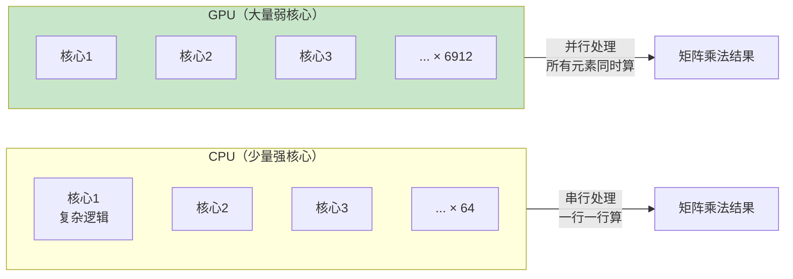
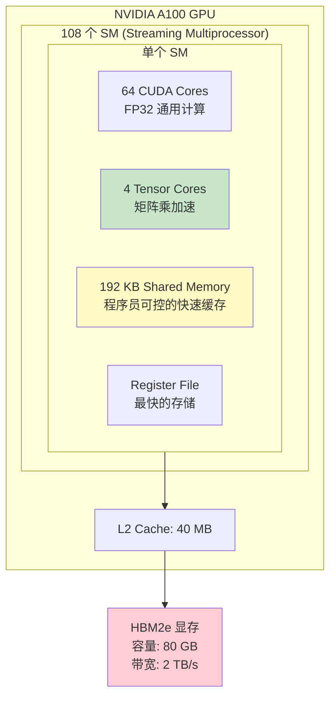
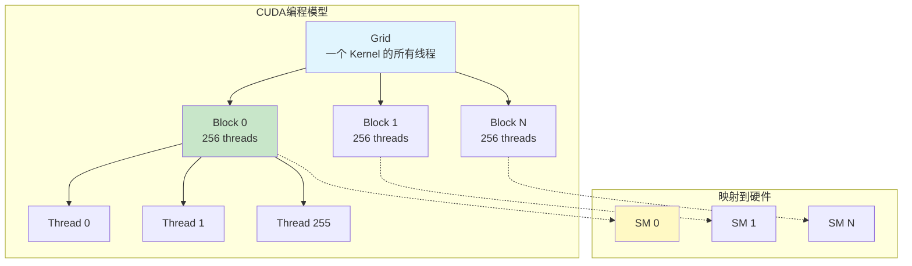
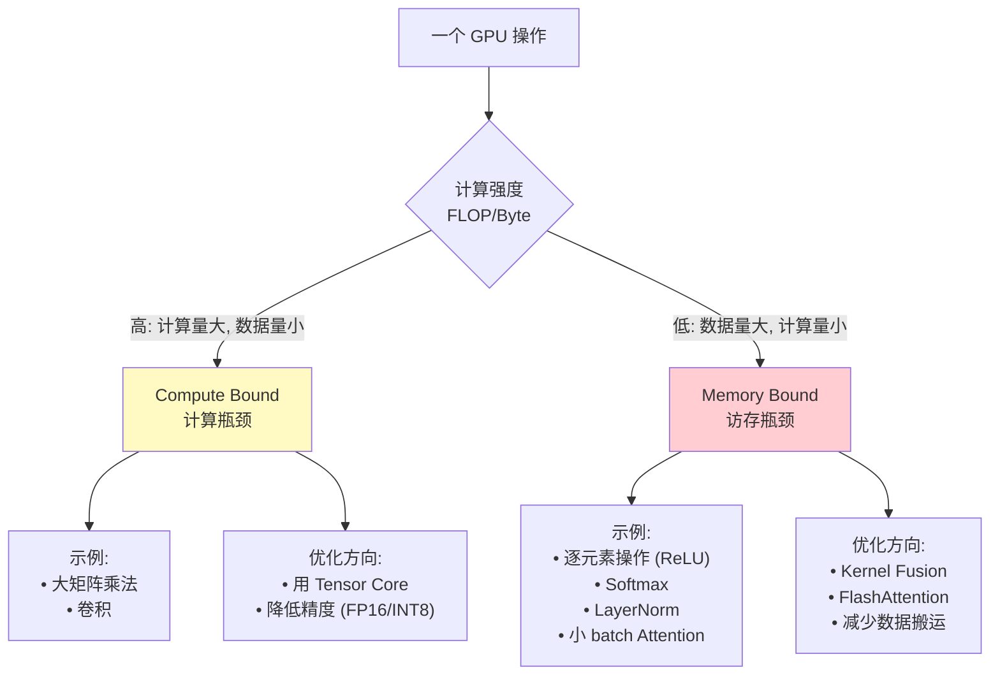
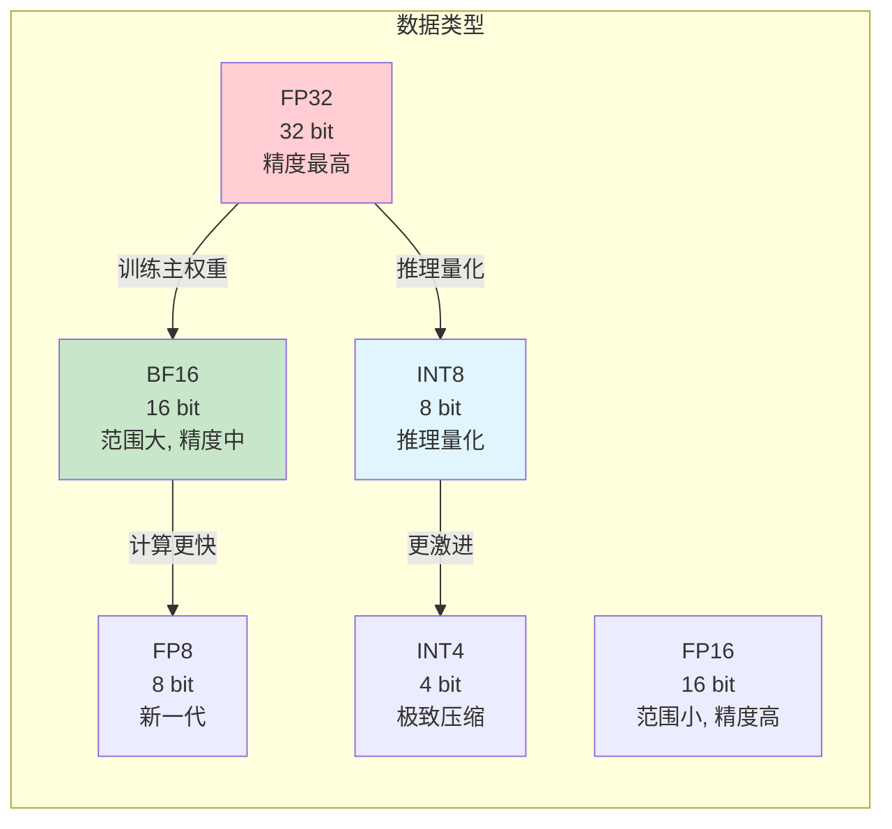

# 模块1：GPU 与计算基础

> 预计时间：3-4 天  
> 目标：理解 GPU 为什么适合深度学习，掌握显存层次和性能分析方法

---

## 1.1 CPU vs GPU：为什么深度学习用 GPU？

### 核心区别

深度学习的计算本质是**大量的矩阵乘法**。GPU 拥有数千个小核心，天生适合并行计算。



### 类比理解

| 场景 | CPU 方式 | GPU 方式 |
|------|---------|---------|
| 搬砖 | 1 个壮汉，一次搬 10 块 | 1000 个小孩，每人搬 1 块 |
| 阅卷 | 1 个老师批 1000 份 | 1000 个助教各批 1 份 |
| 计算 | 64 核做复杂数学 | 6912 核做简单加乘 |

### 什么时候 GPU 不如 CPU？

- 大量 if/else 分支逻辑
- 串行依赖（下一步必须等上一步）
- 数据量小，启动 GPU 的开销大于计算时间

---

## 1.2 GPU 硬件架构

### 以 NVIDIA A100 为例



### 关键组件解释

| 组件 | 作用 | 类比 |
|------|------|------|
| **CUDA Core** | 通用浮点计算单元 | 能做加减乘除的计算器 |
| **Tensor Core** | 矩阵乘法专用加速器，一个周期完成 4×4 矩阵乘 | 专门做矩阵的"外挂" |
| **Shared Memory** | SM 内线程共享的快速缓存（192KB） | 同事间的白板 |
| **L2 Cache** | 全局缓存（40MB） | 办公室书架 |
| **HBM（显存）** | 主存储，容量大但相对慢 | 图书馆（大但要走过去拿） |

### 显存带宽 vs 容量

| GPU | 显存容量 | 显存带宽 | 类比 |
|-----|---------|---------|------|
| A100 | 80 GB | 2.0 TB/s | 80 本书，每秒翻 2000 页 |
| H100 | 80 GB | 3.35 TB/s | 80 本书，每秒翻 3350 页 |
| H200 | 141 GB | 4.8 TB/s | 141 本书，每秒翻 4800 页 |

> **显存带宽**往往比容量更重要！推理时瓶颈通常是"读数据太慢"而不是"放不下"。

---

## 1.3 CUDA 编程模型（概念即可）

你不需要写 CUDA 代码，但理解编程模型有助于理解后续优化。



**核心概念：**

- **Kernel**：在 GPU 上执行的一个函数
- **Grid**：一次 Kernel 调用的所有线程
- **Block**：一组线程，同一 Block 内可共享 Shared Memory
- **Thread**：最小执行单位

**关键认知**：每个 Block 被调度到一个 SM 上执行，Block 内的线程可以协作（共享内存、同步），Block 间完全独立。

---

## 1.4 计算瓶颈分析（Roofline Model）

### 两种瓶颈

每个 GPU 操作都属于以下两种之一：



### 计算强度（Arithmetic Intensity）

```
计算强度 = 计算量(FLOP) / 数据搬运量(Bytes)
```

**判断规则**：
- 计算强度 > GPU 的 算力/带宽 比 → Compute Bound
- 计算强度 < GPU 的 算力/带宽 比 → Memory Bound

**A100 的算力/带宽比**：
```
BF16 Tensor Core: 312 TFLOPS / 2 TB/s = 156 FLOP/Byte
```

这意味着：每从显存读 1 字节数据，GPU 能算 156 次浮点运算。如果你的操作达不到这个比例，你就在等数据。

### 常见操作的瓶颈类型

| 操作 | 计算强度 | 瓶颈类型 | 说明 |
|------|---------|---------|------|
| 大矩阵乘法 `[M,K]×[K,N]` | 高（~K） | Compute | 计算量 O(MKN)，数据量 O(MK+KN) |
| 逐元素操作（ReLU） | 极低（1） | Memory | 每个元素只做 1 次比较 |
| Softmax | 低 | Memory | 需要遍历整行求 max 和 sum |
| LayerNorm | 低 | Memory | 需要两遍遍历（mean, var） |
| 推理 Decode Attention | 低 | Memory | batch=1 时退化为向量×矩阵 |

### 为什么这很重要？

理解瓶颈类型直接决定优化策略：
- **FlashAttention** → 解决 Attention 的访存瓶颈
- **Kernel Fusion** → 把多个 Memory Bound 操作合并，减少中间数据写回 HBM
- **量化（INT8/INT4）** → 减少数据量，同时缓解两种瓶颈

---

## 1.5 混合精度基础

### 数据类型对比



| 类型 | 位数 | 范围 | 用途 |
|------|------|------|------|
| FP32 | 32 | ±3.4×10³⁸ | 优化器状态、主权重 |
| BF16 | 16 | ±3.4×10³⁸ | 训练计算（推荐） |
| FP16 | 16 | ±65504 | 训练计算（需 loss scaling） |
| FP8 | 8 | 较小 | H100+ 训练/推理 |
| INT8 | 8 | -128~127 | 推理量化 |
| INT4 | 4 | -8~7 | 推理极致压缩 |

**为什么用 BF16 而不是 FP16？**
- BF16 范围和 FP32 一样大（不容易溢出），只是精度低一些
- FP16 范围小，大梯度容易溢出，需要额外的 Loss Scaling
- 现代 GPU（A100+）对 BF16 支持很好

---

## 1.6 常见 GPU 对比

| GPU | 架构 | 显存 | BF16 算力 | 带宽 | 适合 |
|-----|------|------|-----------|------|------|
| V100 | Volta | 32GB HBM2 | 125 TFLOPS | 900 GB/s | 老款训练 |
| A100 | Ampere | 80GB HBM2e | 312 TFLOPS | 2.0 TB/s | 主流训练推理 |
| H100 | Hopper | 80GB HBM3 | 989 TFLOPS | 3.35 TB/s | 大规模训练 |
| H200 | Hopper | 141GB HBM3e | 989 TFLOPS | 4.8 TB/s | 长序列推理 |
| L40S | Ada | 48GB GDDR6X | 362 TFLOPS | 864 GB/s | 推理 |
| B200 | Blackwell | 192GB HBM3e | 2250 TFLOPS | 8 TB/s | 下一代 |

**互联方式（卡间通信）**：

| 互联 | 带宽 | 范围 |
|------|------|------|
| NVLink (4th gen) | 900 GB/s | 同机卡间 |
| NVSwitch | 全互联 | 同机 8 卡 |
| InfiniBand NDR | 400 Gb/s | 跨机 |
| RoCE | 100-400 Gb/s | 跨机（以太网） |

---

## 实践练习

### 练习 1：GPU 信息查看

```bash
# 查看 GPU 型号和显存
nvidia-smi

# 查看详细 GPU 属性
nvidia-smi -q | head -50

# 持续监控 GPU 使用
nvidia-smi dmon -s u
```

**任务**：记录你的 GPU 型号、显存大小、当前利用率。

### 练习 2：感受 CPU vs GPU 速度差异

```python
import torch
import time

# 矩阵大小
N = 4096

# CPU 矩阵乘法
a_cpu = torch.randn(N, N)
b_cpu = torch.randn(N, N)

start = time.time()
for _ in range(10):
    c_cpu = a_cpu @ b_cpu
cpu_time = (time.time() - start) / 10
print(f"CPU 矩阵乘法 [{N}×{N}]: {cpu_time*1000:.1f} ms")

# GPU 矩阵乘法
if torch.cuda.is_available():
    a_gpu = a_cpu.cuda()
    b_gpu = b_cpu.cuda()

    # 预热
    for _ in range(5):
        _ = a_gpu @ b_gpu
    torch.cuda.synchronize()

    start = time.time()
    for _ in range(10):
        c_gpu = a_gpu @ b_gpu
    torch.cuda.synchronize()
    gpu_time = (time.time() - start) / 10
    print(f"GPU 矩阵乘法 [{N}×{N}]: {gpu_time*1000:.2f} ms")
    print(f"加速比: {cpu_time/gpu_time:.1f}x")
```

**预期结果**：GPU 比 CPU 快 50-200 倍。

### 练习 3：观察不同精度的性能差异

```python
import torch
import time

N = 4096

def benchmark_matmul(dtype, name):
    a = torch.randn(N, N, device='cuda', dtype=dtype)
    b = torch.randn(N, N, device='cuda', dtype=dtype)

    # 预热
    for _ in range(10):
        _ = a @ b
    torch.cuda.synchronize()

    start = time.time()
    for _ in range(100):
        _ = a @ b
    torch.cuda.synchronize()
    elapsed = (time.time() - start) / 100

    flops = 2 * N**3
    tflops = flops / elapsed / 1e12
    print(f"{name:10s}: {elapsed*1000:.3f} ms | {tflops:.1f} TFLOPS")

benchmark_matmul(torch.float32, "FP32")
benchmark_matmul(torch.float16, "FP16")
benchmark_matmul(torch.bfloat16, "BF16")
```

**预期结果**：FP16/BF16 比 FP32 快 2-4 倍（因为 Tensor Core 加速）。

### 练习 4：理解显存占用

```python
import torch

def print_gpu_memory(msg=""):
    allocated = torch.cuda.memory_allocated() / 1024**3
    reserved = torch.cuda.memory_reserved() / 1024**3
    print(f"{msg:30s} | 已分配: {allocated:.2f} GB | 已保留: {reserved:.2f} GB")

print_gpu_memory("初始状态")

# 分配不同大小的张量
a = torch.randn(1024, 1024, device='cuda')  # 4MB (FP32)
print_gpu_memory("1024×1024 FP32")

b = torch.randn(4096, 4096, device='cuda')  # 64MB
print_gpu_memory("+ 4096×4096 FP32")

c = torch.randn(4096, 4096, device='cuda', dtype=torch.float16)  # 32MB
print_gpu_memory("+ 4096×4096 FP16")

# 模拟一个 7B 模型的参数量
params = torch.randn(7_000_000_000 // 1024, 1024, device='cuda', dtype=torch.float16)
print_gpu_memory("+ 7B 参数 (FP16)")  # 约 14GB

del params
torch.cuda.empty_cache()
print_gpu_memory("释放后")
```

**任务**：
1. 验证 FP16 比 FP32 省一半显存
2. 计算 7B 参数模型在 FP16 下需要多少 GB（答案：约 14GB）
3. 思考：为什么训练时显存远超模型参数大小？

### 练习 5：Compute Bound vs Memory Bound

```python
import torch
import time

def benchmark(fn, name, warmup=10, repeat=100):
    for _ in range(warmup):
        fn()
    torch.cuda.synchronize()
    start = time.time()
    for _ in range(repeat):
        fn()
    torch.cuda.synchronize()
    elapsed = (time.time() - start) / repeat
    print(f"{name:40s}: {elapsed*1000:.3f} ms")

N = 4096

a = torch.randn(N, N, device='cuda', dtype=torch.float16)
b = torch.randn(N, N, device='cuda', dtype=torch.float16)

# Compute Bound: 大矩阵乘法
benchmark(lambda: a @ b, "矩阵乘法 [4096×4096] (Compute Bound)")

# Memory Bound: 逐元素操作
benchmark(lambda: torch.relu(a), "ReLU [4096×4096] (Memory Bound)")
benchmark(lambda: a + b, "逐元素加法 (Memory Bound)")
benchmark(lambda: a * 2.0, "标量乘法 (Memory Bound)")

# 对比: 增大矩阵不影响逐元素时间比例
M = 8192
c = torch.randn(M, M, device='cuda', dtype=torch.float16)
d = torch.randn(M, M, device='cuda', dtype=torch.float16)
benchmark(lambda: c @ d, "矩阵乘法 [8192×8192] (Compute Bound)")
benchmark(lambda: torch.relu(c), "ReLU [8192×8192] (Memory Bound)")
```

**观察**：
- 矩阵乘法：矩阵变大 8 倍（8192² vs 4096²），时间增长更多（因为计算量是 O(N³)）
- ReLU：矩阵变大 4 倍，时间也大约增长 4 倍（线性于数据量，因为只读写一遍）

---

## 自测清单

完成本模块后，你应该能回答：

- [ ] GPU 为什么比 CPU 更适合深度学习？什么情况 CPU 更合适？
- [ ] Tensor Core 和 CUDA Core 的区别是什么？
- [ ] GPU 显存层次有哪些？从快到慢排列
- [ ] 什么是 Compute Bound？什么是 Memory Bound？如何判断？
- [ ] BF16 相比 FP16 的优势是什么？
- [ ] A100 的显存带宽是多少？为什么带宽比容量更重要？
- [ ] 一个 7B 参数模型用 FP16 存储需要多少 GB？

---

## 延伸阅读

- [CUDA Programming Guide（概念部分）](https://docs.nvidia.com/cuda/cuda-c-programming-guide/)
- [Making Deep Learning Go Brrrr From First Principles](https://horace.io/brrr_intro.html)
- [GPU 性能分析入门 - 知乎](https://zhuanlan.zhihu.com/p/...)
- [Roofline Model 解释](https://en.wikipedia.org/wiki/Roofline_model)
