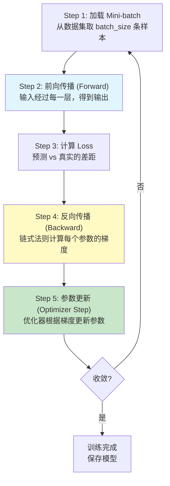
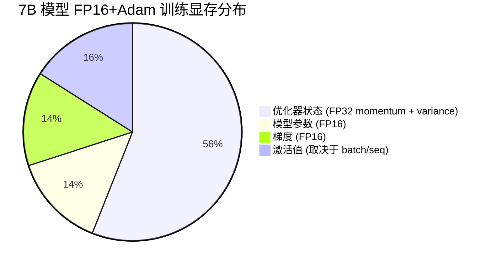
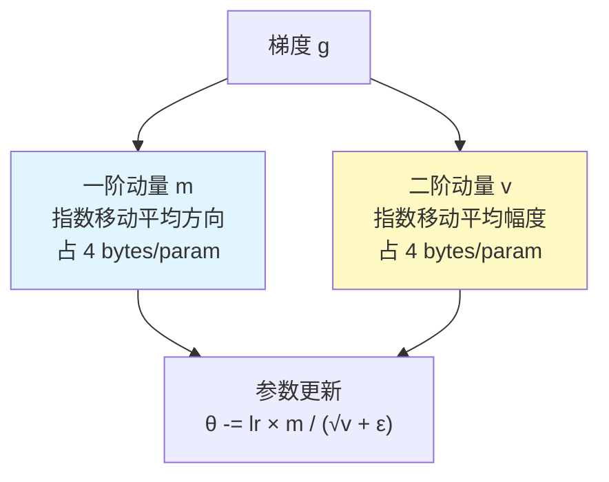
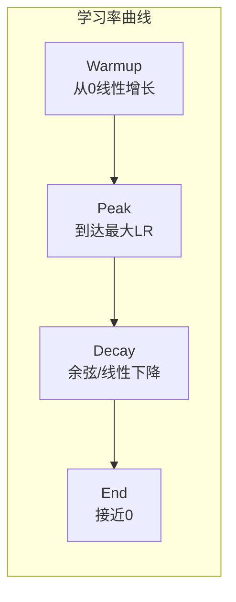
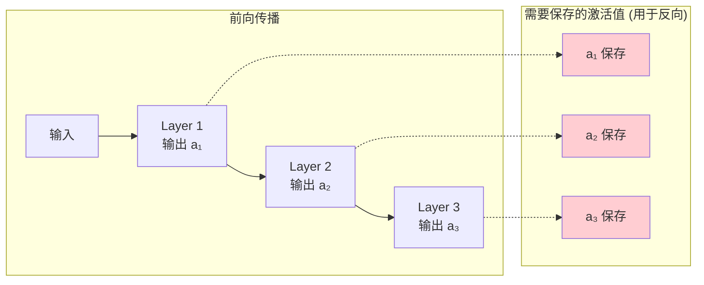
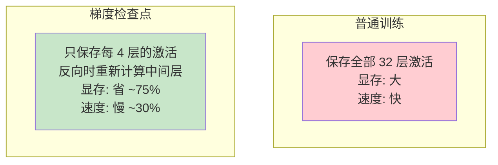

# 模块2：深度学习训练基础

> 预计时间：3-4 天  
> 目标：理解训练循环、显存占用分布、优化器原理，为后续理解分布式训练打基础

---

## 2.1 什么是"训练"？

训练 = 找到一组最优参数，使得模型在数据上表现最好。

```mermaid
graph LR
    DATA[训练数据] --> MODEL[模型<br/>f(x; θ)]
    MODEL --> PRED[预测值 ŷ]
    TRUTH[真实值 y] --> LOSS[损失函数<br/>L(ŷ, y)]
    PRED --> LOSS
    LOSS --> GRAD[反向传播<br/>计算 ∂L/∂θ]
    GRAD --> UPDATE[更新参数<br/>θ = θ - lr × ∇L]
    UPDATE --> MODEL

    style LOSS fill:#ffcdd2
    style GRAD fill:#fff9c4
    style UPDATE fill:#c8e6c9
```

**语言模型的训练目标**：给定前面的 token，预测下一个 token 的概率分布。
```
输入: "我 今天 很"
目标: 预测 "开心" 的概率最高
损失: 交叉熵 = -log(P("开心"))
```

---

## 2.2 训练循环五步详解



### Step 1: Mini-batch

- 不一次用全部数据（太多放不进显存）
- 取一小批（如 batch_size = 8，每条 seq_len = 2048 tokens）
- 每个 batch 计算的梯度是对全部数据梯度的"近似"

### Step 2: 前向传播

```python
# 伪代码
output = model(input_ids)  # 经过所有层
logits = output.logits     # [batch, seq_len, vocab_size]
```

- 输入经过 Embedding → N 层 Transformer → LM Head
- **中间激活值需要保存**（反向传播要用）

### Step 3: 计算损失

```python
# 语言模型的损失：交叉熵
loss = CrossEntropyLoss(logits, labels)
# labels 是右移一位的 input_ids（预测下一个 token）
```

### Step 4: 反向传播

```python
loss.backward()  # PyTorch 自动微分
# 计算每个参数的梯度 param.grad
```

- 从 loss 开始，用链式法则从后往前计算梯度
- 需要前向时保存的激活值
- 计算量约等于 2 倍前向传播

### Step 5: 参数更新

```python
optimizer.step()   # 用梯度更新参数
optimizer.zero_grad()  # 清零梯度，准备下一轮
```

---

## 2.3 训练时显存里有什么？



### 各部分详解

| 组件 | 大小（7B 模型） | 存在时机 | 能否优化 |
|------|---------------|---------|---------|
| 模型参数 | 14 GB (FP16) | 始终 | 模型并行切分 |
| 梯度 | 14 GB (FP16) | backward 到 step 之间 | ZeRO-2 切分 |
| 优化器状态 | 56 GB (FP32) | 始终 | ZeRO-1 切分 |
| 激活值 | 可变（几 GB ~ 几十 GB） | forward 到 backward 之间 | 梯度检查点 |

### 为什么优化器状态这么大？

Adam 优化器对每个参数需要：
```
- 参数本身: FP16 → 2 bytes/param
- 主权重副本 (master weight): FP32 → 4 bytes/param
- 一阶动量 (momentum): FP32 → 4 bytes/param  
- 二阶动量 (variance): FP32 → 4 bytes/param
总计: 14 bytes/param
```

7B 参数 × 14 bytes = **98 GB**（其中优化器状态 56 GB）

> 这就是为什么单卡 80GB 连 7B 模型都训练不了（如果不做任何优化）！

---

## 2.4 优化器详解

### SGD（随机梯度下降）

```
θ = θ - lr × gradient
```

最简单但可能震荡，收敛慢。

### SGD + Momentum

```
v = β × v + gradient        # 积累历史方向
θ = θ - lr × v
```

像滚球下山，有惯性，更稳定。

### Adam（最常用）

```
m = β₁ × m + (1-β₁) × g           # 一阶动量（方向）
v = β₂ × v + (1-β₂) × g²          # 二阶动量（步长自适应）
θ = θ - lr × m / (√v + ε)
```



**AdamW** = Adam + Weight Decay（权重衰减），大模型标配。

---

## 2.5 学习率调度

训练不是用固定学习率的，通常用"先升后降"的策略：



```
典型配置（预训练）：
- Warmup: 2000 steps，LR 从 0 升到 3e-4
- Cosine Decay: LR 从 3e-4 逐渐降到 3e-5
- 总步数: 数十万 ~ 数百万 steps
```

**为什么需要 Warmup？**
- 训练初期参数随机，梯度方向不稳定
- 如果学习率一开始就很大，参数更新太猛，可能导致 loss 爆炸
- 先用小学习率"探路"，稳定后再加速

---

## 2.6 激活值与梯度检查点

### 激活值是什么？

前向传播时，每一层的输出都需要保存，因为反向传播要用：



**激活值大小**（每层，per token）：
```
Attention 输入/输出: hidden_dim × seq_len × batch × dtype
FFN 中间层: intermediate_dim × seq_len × batch × dtype

32 层 × 每层多个激活 × 4096 维 × 2048 seq × 8 batch × 2 bytes(FP16) 
= 数十 GB
```

### 梯度检查点（Gradient Checkpointing）

**核心思想**：不保存所有激活值，反向传播时重新计算。



**权衡**：用 ~30% 的额外计算时间换 ~60-75% 的显存节省。

---

## 2.7 训练中的常见问题

| 现象 | 可能原因 | 解决方法 |
|------|---------|---------|
| Loss = NaN | 梯度爆炸 / 学习率太大 | 降 LR、加梯度裁剪 |
| Loss 不下降 | 学习率太小 / 数据问题 | 检查数据、调大 LR |
| Loss 震荡 | LR 太大 / batch 太小 | 降 LR、增大 batch |
| OOM | 显存不够 | 减 batch、梯度检查点、模型并行 |
| 训练太慢 | GPU 利用率低 | 检查 data loading、增大 batch |

### 梯度裁剪（Gradient Clipping）

防止梯度爆炸的安全阀：

```python
# 如果梯度的总范数超过 max_norm，等比例缩小
torch.nn.utils.clip_grad_norm_(model.parameters(), max_norm=1.0)
```

---

## 2.8 训练相关的 Infra 指标

| 指标 | 含义 | 理想值 |
|------|------|--------|
| GPU 利用率 | GPU 算力使用百分比 | > 60% |
| MFU (Model FLOPS Utilization) | 实际 FLOPS / 理论最大 FLOPS | > 40%（优秀 > 55%） |
| 吞吐量 | tokens/sec 或 samples/sec | 越高越好 |
| 训练 loss 曲线 | 随 step 下降的趋势 | 平滑下降 |

**MFU 是衡量训练效率最重要的指标**：
```
MFU = 实际训练吞吐(tokens/sec) × 每token计算量(FLOP) / GPU理论算力(FLOPS)

例：Llama-2-7B 在 A100 上
- 每 token 前向+反向 FLOP ≈ 6 × 参数量 = 6 × 7B = 42 GFLOP
- 如果吞吐 3000 tokens/sec/GPU
- MFU = 3000 × 42G / 312T = 40.4%
```

---

## 实践练习

### 练习 1：手写一个完整训练循环

```python
import torch
import torch.nn as nn
import torch.optim as optim

# 简单的 2 层 MLP
class SimpleMLP(nn.Module):
    def __init__(self, input_dim=784, hidden_dim=256, output_dim=10):
        super().__init__()
        self.fc1 = nn.Linear(input_dim, hidden_dim)
        self.relu = nn.ReLU()
        self.fc2 = nn.Linear(hidden_dim, output_dim)

    def forward(self, x):
        return self.fc2(self.relu(self.fc1(x)))

# 初始化
model = SimpleMLP().cuda()
optimizer = optim.Adam(model.parameters(), lr=1e-3)
criterion = nn.CrossEntropyLoss()

# 模拟数据
def get_batch(batch_size=64):
    x = torch.randn(batch_size, 784, device='cuda')
    y = torch.randint(0, 10, (batch_size,), device='cuda')
    return x, y

# 训练循环
losses = []
for step in range(1000):
    # Step 1: 获取数据
    x, y = get_batch()

    # Step 2: 前向传播
    logits = model(x)

    # Step 3: 计算 loss
    loss = criterion(logits, y)

    # Step 4: 反向传播
    loss.backward()

    # Step 5: 参数更新
    optimizer.step()
    optimizer.zero_grad()

    losses.append(loss.item())
    if step % 100 == 0:
        print(f"Step {step}: loss = {loss.item():.4f}")

# 画 loss 曲线
import matplotlib.pyplot as plt
plt.plot(losses)
plt.xlabel('Step')
plt.ylabel('Loss')
plt.title('Training Loss')
plt.savefig('training_loss.png')
print("Loss 曲线已保存")
```

**任务**：运行代码，观察 loss 下降曲线。

### 练习 2：观察训练时的显存占用

```python
import torch
import torch.nn as nn

def print_mem(msg):
    alloc = torch.cuda.memory_allocated() / 1024**2
    print(f"{msg:40s} | 显存: {alloc:.1f} MB")

torch.cuda.reset_peak_memory_stats()
print_mem("初始")

# 模拟一个小型 Transformer（约 125M 参数）
config = {
    'vocab_size': 32000,
    'hidden_dim': 768,
    'num_layers': 12,
    'num_heads': 12,
}

class MiniTransformerLayer(nn.Module):
    def __init__(self, d):
        super().__init__()
        self.attn_qkv = nn.Linear(d, 3*d)
        self.attn_out = nn.Linear(d, d)
        self.ffn_up = nn.Linear(d, 4*d)
        self.ffn_down = nn.Linear(4*d, d)
        self.norm1 = nn.LayerNorm(d)
        self.norm2 = nn.LayerNorm(d)

    def forward(self, x):
        # 简化：不做真正的 attention，只是矩阵乘法
        h = self.norm1(x)
        qkv = self.attn_qkv(h)
        h = self.attn_out(qkv[..., :x.shape[-1]])
        x = x + h
        h = self.norm2(x)
        h = torch.relu(self.ffn_up(h))
        h = self.ffn_down(h)
        x = x + h
        return x

class MiniTransformer(nn.Module):
    def __init__(self, cfg):
        super().__init__()
        d = cfg['hidden_dim']
        self.embed = nn.Embedding(cfg['vocab_size'], d)
        self.layers = nn.ModuleList([MiniTransformerLayer(d) for _ in range(cfg['num_layers'])])
        self.head = nn.Linear(d, cfg['vocab_size'])

    def forward(self, input_ids):
        x = self.embed(input_ids)
        for layer in self.layers:
            x = layer(x)
        return self.head(x)

model = MiniTransformer(config).cuda()
print_mem("模型加载后")

# 统计参数量
total_params = sum(p.numel() for p in model.parameters())
print(f"总参数量: {total_params/1e6:.1f}M")
print(f"参数显存(FP32): {total_params * 4 / 1024**2:.1f} MB")

# 创建优化器
optimizer = torch.optim.Adam(model.parameters(), lr=1e-4)
print_mem("创建 Adam 优化器后")

# 前向传播
input_ids = torch.randint(0, 32000, (4, 512), device='cuda')  # batch=4, seq=512
print_mem("数据加载后")

output = model(input_ids)
print_mem("前向传播后 (有激活值)")

# 反向传播
loss = output.sum()
loss.backward()
print_mem("反向传播后 (有梯度)")

# 优化器更新
optimizer.step()
print_mem("优化器 step 后")

optimizer.zero_grad()
print_mem("清零梯度后")

peak = torch.cuda.max_memory_allocated() / 1024**2
print(f"\n峰值显存: {peak:.1f} MB")
```

**任务**：
1. 运行代码，观察每一步显存变化
2. 修改 batch_size 和 seq_len，观察激活值对显存的影响
3. 思考：哪一步显存增长最多？为什么？

### 练习 3：对比不同优化器

```python
import torch
import torch.nn as nn
import matplotlib.pyplot as plt

torch.manual_seed(42)

# 一个需要优化的简单函数: Rosenbrock function
# f(x, y) = (1-x)² + 100(y-x²)²
# 最小值在 (1, 1)

def train_with_optimizer(optimizer_class, lr, name, steps=2000, **kwargs):
    x = torch.tensor([-1.0, -1.0], requires_grad=True, device='cuda')
    optimizer = optimizer_class([x], lr=lr, **kwargs)
    trajectory = [x.detach().cpu().clone()]

    for _ in range(steps):
        optimizer.zero_grad()
        loss = (1 - x[0])**2 + 100 * (x[1] - x[0]**2)**2
        loss.backward()
        optimizer.step()
        trajectory.append(x.detach().cpu().clone())

    return torch.stack(trajectory).numpy()

# 对比不同优化器
results = {
    'SGD (lr=0.001)': train_with_optimizer(torch.optim.SGD, 0.001, 'SGD'),
    'SGD+Momentum (lr=0.001)': train_with_optimizer(torch.optim.SGD, 0.001, 'SGD-M', momentum=0.9),
    'Adam (lr=0.01)': train_with_optimizer(torch.optim.Adam, 0.01, 'Adam'),
    'AdamW (lr=0.01)': train_with_optimizer(torch.optim.AdamW, 0.01, 'AdamW'),
}

# 画轨迹
fig, axes = plt.subplots(2, 2, figsize=(12, 10))
for ax, (name, traj) in zip(axes.flat, results.items()):
    ax.plot(traj[:, 0], traj[:, 1], 'b-', alpha=0.5, linewidth=0.5)
    ax.plot(traj[0, 0], traj[0, 1], 'ro', markersize=8, label='Start')
    ax.plot(1, 1, 'g*', markersize=15, label='Optimal (1,1)')
    ax.plot(traj[-1, 0], traj[-1, 1], 'bs', markersize=8, label='End')
    ax.set_title(name)
    ax.set_xlim(-2, 2)
    ax.set_ylim(-2, 2)
    ax.legend()
    ax.grid(True)

plt.tight_layout()
plt.savefig('optimizer_comparison.png', dpi=100)
print("优化器对比图已保存")
```

**观察**：Adam/AdamW 收敛最快，SGD 需要动量才能有效收敛。

### 练习 4：梯度检查点效果

```python
import torch
import torch.nn as nn
from torch.utils.checkpoint import checkpoint

class HeavyLayer(nn.Module):
    def __init__(self, dim=2048):
        super().__init__()
        self.fc1 = nn.Linear(dim, dim * 4)
        self.fc2 = nn.Linear(dim * 4, dim)

    def forward(self, x):
        return self.fc2(torch.relu(self.fc1(x)))

class DeepModel(nn.Module):
    def __init__(self, num_layers=24, dim=2048, use_checkpoint=False):
        super().__init__()
        self.layers = nn.ModuleList([HeavyLayer(dim) for _ in range(num_layers)])
        self.use_checkpoint = use_checkpoint

    def forward(self, x):
        for layer in self.layers:
            if self.use_checkpoint:
                x = checkpoint(layer, x, use_reentrant=False)
            else:
                x = layer(x)
        return x

def measure_memory(use_checkpoint, batch_size=32, seq_len=512, dim=2048):
    torch.cuda.reset_peak_memory_stats()
    torch.cuda.empty_cache()

    model = DeepModel(num_layers=24, dim=dim, use_checkpoint=use_checkpoint).cuda()
    x = torch.randn(batch_size, seq_len, dim, device='cuda')

    # 前向 + 反向
    out = model(x)
    loss = out.sum()
    loss.backward()

    peak = torch.cuda.max_memory_allocated() / 1024**3
    del model, x, out, loss
    torch.cuda.empty_cache()
    return peak

# 对比
mem_normal = measure_memory(use_checkpoint=False)
mem_ckpt = measure_memory(use_checkpoint=True)

print(f"不使用梯度检查点: 峰值显存 {mem_normal:.2f} GB")
print(f"使用梯度检查点:   峰值显存 {mem_ckpt:.2f} GB")
print(f"节省: {(1 - mem_ckpt/mem_normal)*100:.1f}%")
```

**预期结果**：梯度检查点节省 50-70% 显存。

---

## 自测清单

- [ ] 训练循环的 5 个步骤分别是什么？
- [ ] 训练时显存中有哪 4 大块？各占多少？
- [ ] Adam 优化器为什么需要额外的显存？额外多少？
- [ ] 7B 模型用 Adam FP16 训练，总共需要约多少 GB 显存？（不算激活）
- [ ] 什么是梯度检查点？用什么换什么？
- [ ] MFU 是什么？好的 MFU 大概多少？
- [ ] Learning Rate Warmup 的目的是什么？
- [ ] 梯度裁剪解决什么问题？

---

## 延伸阅读

- [PyTorch 官方训练教程](https://pytorch.org/tutorials/beginner/basics/optimization_tutorial.html)
- [An Overview of Gradient Descent Optimization Algorithms](https://ruder.io/optimizing-gradient-descent/)
- [Mixed Precision Training](https://arxiv.org/abs/1710.03740)
- [Reducing Activation Recomputation in Large Transformer Models](https://arxiv.org/abs/2205.05198)
