# 模块3：Transformer 架构详解

> 📖 **浏览器阅读版**：[03-transformer.html](./03-transformer.html)（论文原图 + Mermaid 图表，推荐用浏览器打开）

> 预计时间：7-10 天  
> 目标：彻底理解 Transformer 的每一步计算，重点搞懂 QKV 和 KV Cache  
> **这是全课程最重要的模块**，后面所有内容都建立在这里的理解之上

---

## 3.1 在开始之前：Transformer 到底在干嘛？

### 一句话

Transformer 是一个**根据前文预测下一个词**的机器。

```
输入: "北京是中国的"
输出: "首都" (概率最高的下一个词)
```

### 生活类比

想象你在做完形填空：

> "今天天气真___"

你的大脑会：
1. 理解每个词的意思（Embedding）
2. 分析词与词之间的关系（"天气" 跟 "真" 后面填什么有关）（Attention）
3. 综合考虑后做出判断（FFN + 输出层）

Transformer 做的事情完全一样，只是用数学来实现。

### 模型的全貌（先记住大框架）

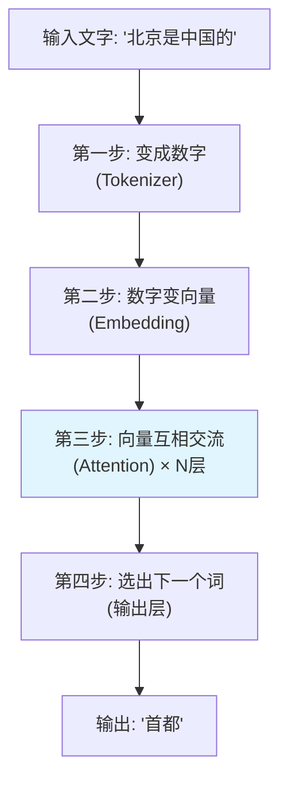

接下来我们一步步详解。

---

## 3.2 第一步：把文字变成数字（Tokenization）

### 为什么要变数字？

计算机不认识中文英文，只认识数字。所以第一步是把文字切成小块（token），每块对应一个数字。

### 具体例子

```
文本: "我喜欢吃苹果"

切分: ["我", "喜欢", "吃", "苹果"]

对应 ID: [158, 4825, 237, 9012]
```

每个模型有一个**词表**（vocabulary），就像一本字典：
```
ID 0    → "<pad>"
ID 1    → "<unk>"
ID 158  → "我"
ID 4825 → "喜欢"
...
ID 31999 → "zzz"
```

Llama 的词表大小 = 32000，意味着它认识 32000 个"词块"。

---

## 3.3 第二步：数字变向量（Embedding）

### 为什么不直接用数字？

数字 158 和 159 虽然相邻，但对应的词可能完全无关。我们需要一种表示方式，让**意思相近的词，表示也相近**。

### 解决：用向量表示

把每个 token ID 变成一个**高维向量**（如 4096 维）：

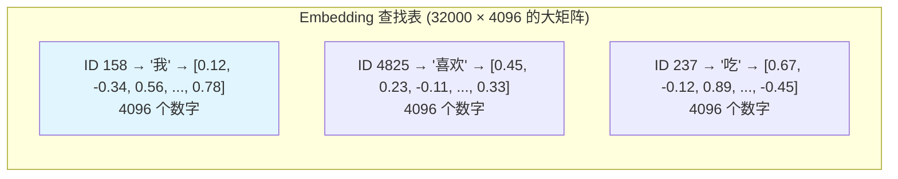

**类比**：把每个词放到一个 4096 维的空间里。意思相近的词会被放在附近的位置。比如"猫"和"狗"的向量比较接近，"猫"和"飞机"的向量很远。

### 代码理解

```python
import torch.nn as nn

# Embedding 层本质就是一个查找表
embedding = nn.Embedding(num_embeddings=32000, embedding_dim=4096)
# 内部就是一个 [32000, 4096] 的权重矩阵

# 给定 token ID，取出对应行
token_ids = torch.tensor([158, 4825, 237, 9012])  # 4 个 token
vectors = embedding(token_ids)  # shape: [4, 4096]
# 就是从矩阵中取出第 158、4825、237、9012 行
```

### 形状变化

```
输入: [batch_size, seq_len] 的整数
    例: [1, 6] — 1 条句子，6 个 token

输出: [batch_size, seq_len, hidden_dim] 的浮点数
    例: [1, 6, 4096] — 每个 token 是 4096 维向量
```

---

## 3.4 位置编码：告诉模型词的顺序

### 问题

Embedding 之后，"我喜欢你" 和 "你喜欢我" 的向量集合是一样的（只是顺序不同）。但 Attention 计算**不区分顺序**！

### 解决：给向量加上位置信息

当前主流方案是 **RoPE**（Rotary Position Embedding），它对 Q 和 K 做旋转操作：
- 位置 0 旋转 0°
- 位置 1 旋转 θ°
- 位置 n 旋转 n×θ°

这样位置不同的 token，它们的 Q·K 内积就会不同，模型就能感知到位置了。

> 暂时理解"位置信息已经编码在向量中"即可，后续用到时再深入。

---

## 3.5 第三步的核心：Self-Attention（自注意力）

> 这是 Transformer 最精妙也最重要的部分。请耐心读完。

### 3.5.1 Attention 要解决什么问题？

考虑句子 "小猫坐在沙发上，因为**它**很累"

人读到"它"时，大脑会自动把"它"和"小猫"联系起来。这就是 **Attention 做的事**：让每个词能"看到"前面的所有词，并决定重点关注哪些词。

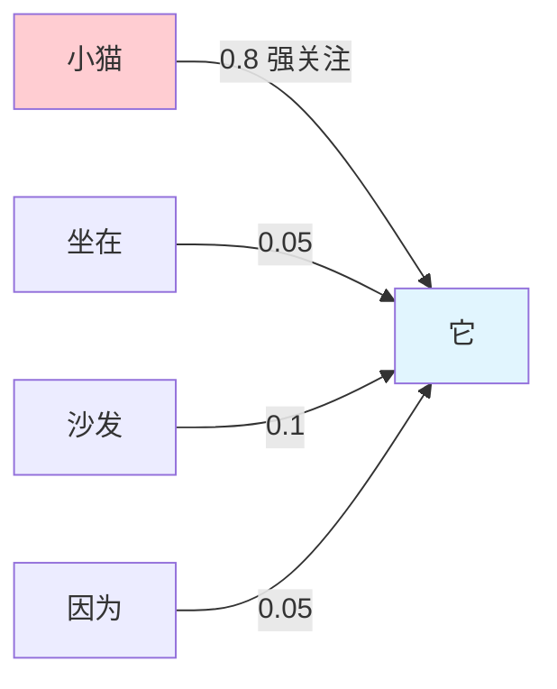

"它"通过 Attention 得到的信息主要来自"小猫"（权重 0.8），少量来自其他词。

---

### 3.5.2 先搞懂"向量"和"点积"（前置知识）

> 如果你已经懂向量和点积，跳过这小节。

**向量**就是一组数字：

```
向量 a = [3, 4]      ← 就是 2 个数字排一起
向量 b = [1, 2, 3]   ← 就是 3 个数字排一起
```

在 Transformer 中，每个 token 被表示为一个 4096 维的向量（4096 个数字）。

**点积**：两个相同长度的向量，对应位置相乘，再加起来：

```
a = [1, 2, 3]
b = [4, 5, 6]

a · b = 1×4 + 2×5 + 3×6 = 4 + 10 + 18 = 32
```

**点积的直觉含义**：衡量两个向量"有多像"。
- 方向相同 → 点积大（正数）
- 方向垂直 → 点积 = 0
- 方向相反 → 点积小（负数）

**矩阵乘法**：就是"批量做点积"。向量 × 矩阵 = 把向量变换成另一个向量：

```
向量 x = [1, 2]

矩阵 W = [[3, 0],
           [1, 4]]

x × W = [1×3 + 2×1,  1×0 + 2×4] = [5, 8]
         对第一列点积   对第二列点积
```

**一句话**：矩阵乘法就是"用一个矩阵把一个向量变换成另一个向量"。

---

### 3.5.3 QKV 是什么？三个类比帮你理解

#### 类比 1：图书馆找书

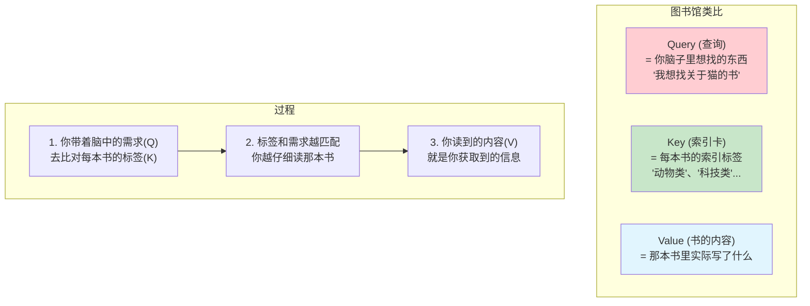

#### 类比 2：课堂提问

| 角色 | 类比 | 在 Transformer 中 |
|------|------|-----------------|
| **Q** | 学生举手提问："谁能告诉我主语是什么？" | 当前 token 想获取什么信息 |
| **K** | 每个同学举的牌子："我知道主语"、"我知道动词"... | 每个 token 能提供什么信息 |
| **V** | 那个匹配的同学站起来回答的内容 | 被选中的 token 实际传递的信息 |

#### 类比 3：搜索引擎

```
你搜索（Q）："如何煮咖啡"

网页 1 的标题（K）："咖啡冲泡指南"  ← 匹配度高！
网页 1 的内容（V）："先把水烧到92度..." ← 你读到了这个

网页 2 的标题（K）："茶叶种类介绍"  ← 匹配度低
网页 2 的内容（V）："绿茶是..." ← 你不太看这个

最终你获取的信息 = 80%×网页1内容 + 15%×网页3内容 + 5%×其他
```

---

### 3.5.4 QKV 是怎么算出来的？（向量 × 矩阵）

每个 token 有一个向量 x。通过**三个不同的权重矩阵**，把同一个 x 变换成三种不同用途的向量：

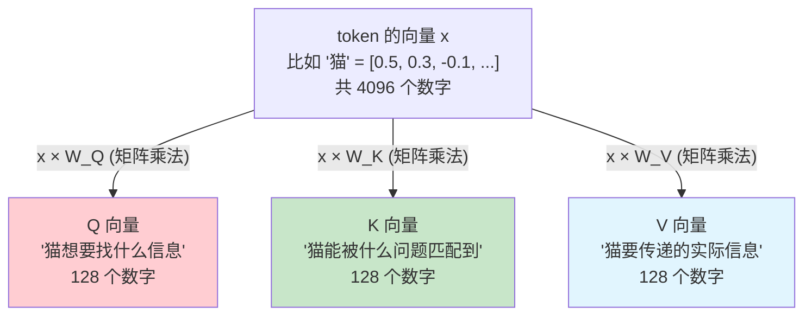

**为什么要三个不同的矩阵？**

同一个词在不同角色下需要不同的表示：
- "猫" 作为**提问者**（Q）：可能在问"我的动作是什么？"
- "猫" 作为**被查找者**（K）：告诉别人"我是个名词/主语"
- "猫" 作为**信息源**（V）：把"猫的语义"传给需要的词

如果 QKV 用同一个矩阵，模型就无法区分这三种角色。

**具体计算**（用极简数字演示）：

```
假设 token "猫" 的向量 x = [2, 1]（简化为 2 维）

W_Q = [[1, 0],      ← 权重矩阵 Q（模型学出来的）
       [0, 1]]

Q = x × W_Q
  = [2, 1] × [[1, 0],
               [0, 1]]
  = [2×1 + 1×0,  2×0 + 1×1]
  = [2, 1]

同理用 W_K, W_V 算出 K 和 V（不同的矩阵会得到不同的结果）
```

> **关键理解**：`x × W` 这个矩阵乘法，就是把向量 x "旋转/变换"到另一个空间。W_Q、W_K、W_V 是三个不同的变换，把同一个 x 变成三种用途的表示。

---

### 3.5.5 点积为什么能衡量"相关性"？

Q 和 K 的点积越大 = 越相关。为什么？

```
Q_猫 = [1, 0, 0]   （猫的 Query：在找"动作类"信息）
K_跑 = [0.9, 0.1, 0]  （跑的 Key：我是一个"动作"）
K_红 = [0, 0, 0.9]    （红的 Key：我是一个"颜色"）

Q_猫 · K_跑 = 1×0.9 + 0×0.1 + 0×0 = 0.9   ← 高分！猫关注"跑"
Q_猫 · K_红 = 1×0 + 0×0 + 0×0.9 = 0        ← 低分！猫不关注"红"
```

直觉：Q 和 K 方向越一致（都指向"动作"方向），点积越大，说明越匹配。

---

### 3.5.6 完整 Attention 计算流程图

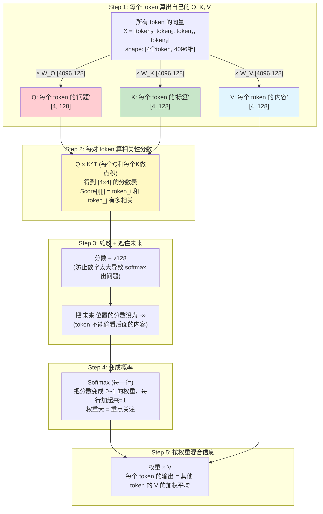

---

### 3.5.7 手算例子（超详细，一步不跳）

**设定**：3 个 token，向量维度 = 2（实际是 4096，这里简化到 2 维方便手算）

```
token 0: "我"   的向量 x₀ = [1, 0]
token 1: "爱"   的向量 x₁ = [0, 1]
token 2: "你"   的向量 x₂ = [1, 1]
```

三个权重矩阵（模型训练学到的，这里随便设一个）：
```
W_Q = [[1, 0],     W_K = [[0, 1],     W_V = [[1, 0],
       [0, 1]]           [1, 0]]           [1, 1]]
```

---

#### Step 1 详解：算 Q、K、V

**算 Q（每个 token 的"问题"向量）**：

```
Q₀ = "我" 的 Q = x₀ × W_Q = [1, 0] × [[1, 0],
                                          [0, 1]]

怎么算？向量的第1个数 × 矩阵第1行，加上 向量的第2个数 × 矩阵第2行：
= 1 × [1, 0] + 0 × [0, 1]
= [1, 0] + [0, 0]
= [1, 0]  ✓

Q₁ = "爱" 的 Q = x₁ × W_Q = [0, 1] × [[1, 0],
                                          [0, 1]]
= 0 × [1, 0] + 1 × [0, 1]
= [0, 0] + [0, 1]
= [0, 1]  ✓

Q₂ = "你" 的 Q = x₂ × W_Q = [1, 1] × [[1, 0],
                                          [0, 1]]
= 1 × [1, 0] + 1 × [0, 1]
= [1, 0] + [0, 1]
= [1, 1]  ✓
```

**算 K（每个 token 的"标签"向量）**：

```
K₀ = x₀ × W_K = [1, 0] × [[0, 1],
                              [1, 0]]
= 1 × [0, 1] + 0 × [1, 0]
= [0, 1] + [0, 0]
= [0, 1]  ✓

K₁ = x₁ × W_K = [0, 1] × [[0, 1],
                              [1, 0]]
= 0 × [0, 1] + 1 × [1, 0]
= [0, 0] + [1, 0]
= [1, 0]  ✓

K₂ = x₂ × W_K = [1, 1] × [[0, 1],
                              [1, 0]]
= 1 × [0, 1] + 1 × [1, 0]
= [0, 1] + [1, 0]
= [1, 1]  ✓
```

**算 V（每个 token 的"内容"向量）**：

```
V₀ = x₀ × W_V = [1, 0] × [[1, 0],
                              [1, 1]]
= 1 × [1, 0] + 0 × [1, 1]
= [1, 0]  ✓

V₁ = x₁ × W_V = [0, 1] × [[1, 0],
                              [1, 1]]
= 0 × [1, 0] + 1 × [1, 1]
= [1, 1]  ✓

V₂ = x₂ × W_V = [1, 1] × [[1, 0],
                              [1, 1]]
= 1 × [1, 0] + 1 × [1, 1]
= [1, 0] + [1, 1]
= [2, 1]  ✓
```

**汇总表格**：

| token | 原始向量 x | Q（问题） | K（标签） | V（内容） |
|-------|-----------|-----------|-----------|-----------|
| "我" (位置0) | [1, 0] | [1, 0] | [0, 1] | [1, 0] |
| "爱" (位置1) | [0, 1] | [0, 1] | [1, 0] | [1, 1] |
| "你" (位置2) | [1, 1] | [1, 1] | [1, 1] | [2, 1] |

---

#### Step 2 详解：算相关性分数（Q 和 K 的点积）

现在每个 token 的 Q 去和每个 token 的 K 做点积，看谁和谁"匹配"：

```
"我"的Q 和 "我"的K 的匹配度:  Q₀·K₀ = [1,0]·[0,1] = 1×0 + 0×1 = 0
"我"的Q 和 "爱"的K 的匹配度:  Q₀·K₁ = [1,0]·[1,0] = 1×1 + 0×0 = 1
"我"的Q 和 "你"的K 的匹配度:  Q₀·K₂ = [1,0]·[1,1] = 1×1 + 0×1 = 1

"爱"的Q 和 "我"的K 的匹配度:  Q₁·K₀ = [0,1]·[0,1] = 0×0 + 1×1 = 1
"爱"的Q 和 "爱"的K 的匹配度:  Q₁·K₁ = [0,1]·[1,0] = 0×1 + 1×0 = 0
"爱"的Q 和 "你"的K 的匹配度:  Q₁·K₂ = [0,1]·[1,1] = 0×1 + 1×1 = 1

"你"的Q 和 "我"的K 的匹配度:  Q₂·K₀ = [1,1]·[0,1] = 1×0 + 1×1 = 1
"你"的Q 和 "爱"的K 的匹配度:  Q₂·K₁ = [1,1]·[1,0] = 1×1 + 1×0 = 1
"你"的Q 和 "你"的K 的匹配度:  Q₂·K₂ = [1,1]·[1,1] = 1×1 + 1×1 = 2  ← 最高!
```

写成分数矩阵（行=Query, 列=Key）：
```
              K_"我"  K_"爱"  K_"你"
Q_"我" →  [   0,      1,      1   ]
Q_"爱" →  [   1,      0,      1   ]
Q_"你" →  [   1,      1,      2   ]    ← "你"对自己匹配度最高
```

**怎么读这个矩阵？** 第 i 行第 j 列 = token_i 对 token_j 的关注程度（越大越关注）。

---

#### Step 3 详解：缩放 + 遮住未来

**缩放**：所有分数除以 √(向量维度) = √2 ≈ 1.41

为什么？因为如果维度很大，点积的值会很大，后面 softmax 会变得极端（一个接近 1，其他接近 0）。除以 √d 让数值温和一些。

```
缩放后:
[0/1.41,    1/1.41,    1/1.41  ]     [ 0,     0.71,  0.71]
[1/1.41,    0/1.41,    1/1.41  ]  =  [ 0.71,  0,     0.71]
[1/1.41,    1/1.41,    2/1.41  ]     [ 0.71,  0.71,  1.41]
```

**遮住未来（Causal Mask）**：

规则：位置 i 的 token **不能看到** 位置 > i 的 token（不能偷看后面的词）。

```
"我"(位置0) 只能看到: 自己
"爱"(位置1) 只能看到: "我" 和 自己
"你"(位置2) 只能看到: "我"、"爱" 和 自己
```

做法：把不能看到的位置设为 -∞（负无穷大）：

```
遮挡后:
[ 0,     -∞,    -∞   ]     ← "我" 只能看位置0（自己）
[ 0.71,   0,    -∞   ]     ← "爱" 能看位置0和1
[ 0.71,  0.71,  1.41 ]     ← "你" 能看所有（0,1,2）
```

---

#### Step 4 详解：Softmax（变成概率）

Softmax 把每一行变成"概率分布"（所有值在 0~1 之间，加起来等于 1）。

**Softmax 公式**：softmax(x_i) = e^(x_i) / 所有 e^(x_j) 的总和

-∞ 经过 e^(-∞) = 0，自动被忽略！

```
第0行: softmax([0, -∞, -∞])
  e^0 = 1,  e^(-∞) = 0,  e^(-∞) = 0
  总和 = 1
  结果: [1/1, 0/1, 0/1] = [1.00, 0.00, 0.00]
  含义: "我" 100% 关注自己（因为只能看自己）

第1行: softmax([0.71, 0, -∞])
  e^0.71 ≈ 2.03,  e^0 = 1.00,  e^(-∞) = 0
  总和 = 2.03 + 1.00 = 3.03
  结果: [2.03/3.03, 1.00/3.03, 0] = [0.67, 0.33, 0.00]
  含义: "爱" 67% 关注 "我"，33% 关注自己

第2行: softmax([0.71, 0.71, 1.41])
  e^0.71 ≈ 2.03,  e^0.71 ≈ 2.03,  e^1.41 ≈ 4.10
  总和 = 2.03 + 2.03 + 4.10 = 8.16
  结果: [2.03/8.16, 2.03/8.16, 4.10/8.16] = [0.25, 0.25, 0.50]
  含义: "你" 25% 关注 "我"，25% 关注 "爱"，50% 关注自己
```

**最终注意力权重矩阵**：

```
Attention = [[1.00, 0.00, 0.00],    ← "我" 全部看自己
             [0.67, 0.33, 0.00],    ← "爱" 主要看 "我"
             [0.25, 0.25, 0.50]]    ← "你" 一半看自己，一半看前面
```

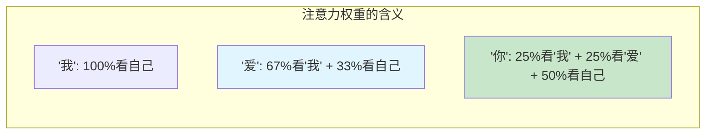

---

#### Step 5 详解：用权重混合 V（加权求和）

现在用上面的权重，对每个 token 的 V 做加权平均：

```
"我"的输出 = 1.00 × V_"我" + 0.00 × V_"爱" + 0.00 × V_"你"
           = 1.00 × [1, 0]
           = [1.00, 0.00]

"爱"的输出 = 0.67 × V_"我" + 0.33 × V_"爱" + 0.00 × V_"你"
           = 0.67 × [1, 0] + 0.33 × [1, 1]
           = [0.67, 0.00] + [0.33, 0.33]
           = [1.00, 0.33]

"你"的输出 = 0.25 × V_"我" + 0.25 × V_"爱" + 0.50 × V_"你"
           = 0.25 × [1, 0] + 0.25 × [1, 1] + 0.50 × [2, 1]
           = [0.25, 0.00] + [0.25, 0.25] + [1.00, 0.50]
           = [1.50, 0.75]
```

**最终结果**：
```
Attention 前:                  Attention 后:
"我" = [1, 0] (只有自己)  →   "我" = [1.00, 0.00] (没变，只看了自己)
"爱" = [1, 1] (只有自己)  →   "爱" = [1.00, 0.33] (融合了"我"的信息)
"你" = [2, 1] (只有自己)  →   "你" = [1.50, 0.75] (融合了所有人的信息)
```

> **核心收获**：经过 Attention 后，每个 token 的表示不再只包含自己的信息，而是融合了它"关注"的其他 token 的信息。这就是 Attention 的本质——**让 token 之间能交流信息**。

---

### 3.5.8 总结：Attention 公式一行搞定

上面 5 步合起来就是一个公式：

```
Attention(Q, K, V) = softmax( Q × K^T / √d + Mask ) × V
```

| 符号 | 含义 | 形状 |
|------|------|------|
| Q | 每个 token 的"问题" | [seq_len, head_dim] |
| K | 每个 token 的"标签" | [seq_len, head_dim] |
| V | 每个 token 的"内容" | [seq_len, head_dim] |
| Q×K^T | 每对 token 的相关性分数 | [seq_len, seq_len] |
| ÷√d | 缩放，防止数值太大 | - |
| Mask | 遮住未来位置（设为-∞） | [seq_len, seq_len] |
| softmax | 把分数变成 0~1 的权重 | [seq_len, seq_len] |
| ×V | 用权重加权混合信息 | [seq_len, head_dim] |

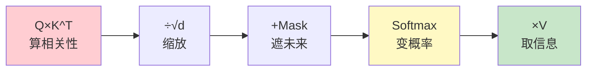

---

### 3.5.9 注意力分数矩阵的直觉

```
         Key →
         "我"  "爱"  "你"
Q  "我" [ 高    ×     ×  ]   ← 只能看自己
↓  "爱" [ 高    中    ×  ]   ← 能看前面
   "你" [ 中    中    高 ]   ← 能看所有

× = -∞ (被 mask 遮住)
```

**每一行**表示一个 token "在关注什么"  
**每一列**表示一个 token "被谁关注"

---

## 3.6 Multi-Head Attention：为什么要多个"头"？

### 问题

一组 QKV 只能学到一种关注模式。但语言理解需要同时关注多个方面：

```
"The cat sat on the mat because it was tired"
 ↑                              ↑
 Head 1: "it" 关注 "cat"（指代关系）
 Head 2: "tired" 关注 "sat"（因果关系）
 Head 3: "on" 关注 "mat"（位置关系）
```

### 解决：把向量切成多份，每份独立做 Attention

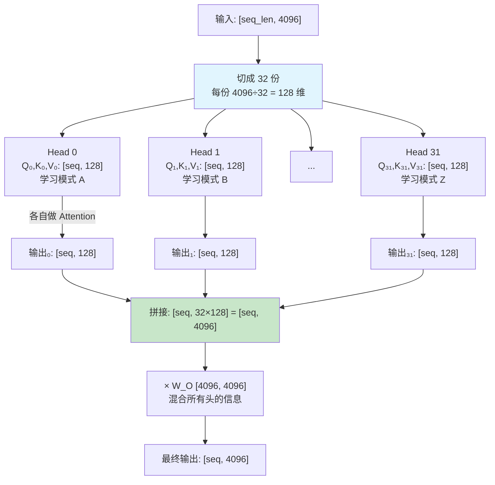

**关键维度公式**：

```
hidden_dim = num_heads × head_dim

Llama-2-7B:  4096 = 32 × 128
Llama-2-70B: 8192 = 64 × 128
```

### 实际实现（reshape 而非切片）

```python
# 不是真的切成 32 份，而是 reshape 改变视角
Q = x @ W_Q                           # [batch, seq, 4096]
Q = Q.reshape(batch, seq, 32, 128)     # [batch, seq, 32头, 128维/头]
Q = Q.transpose(1, 2)                  # [batch, 32头, seq, 128]

# 然后所有头并行做 Attention（一次矩阵运算搞定）
```

---

## 3.7 GQA：减少 KV 的头数

### 问题引入

在推理时，需要缓存每个 token 的 K 和 V（这就是 KV Cache，后面详解）。如果 K 和 V 各有 32 个头，缓存就很大。

### 解决：让多个 Q head 共享一组 KV

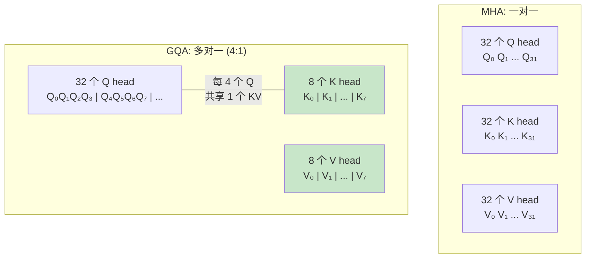

| 方案 | Q heads | KV heads | KV Cache 大小 | 质量 |
|------|---------|----------|-------------|------|
| MHA | 32 | 32 | 基准 (100%) | 最好 |
| **GQA** | 32 | 8 | **25%** | 很好（几乎无损） |
| MQA | 32 | 1 | 3% | 略有损失 |

**Llama-3 全系列都用 GQA（8 个 KV heads）**，这是目前工业界的主流选择。

---

## 3.8 Transformer Block 的完整结构

每个 Transformer Block 由 Attention + FFN 组成：

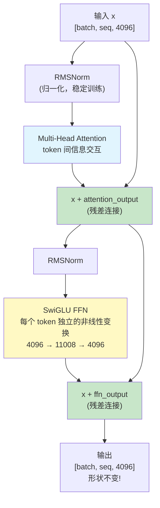

**关键点**：
- **RMSNorm**：让数值稳定，类似于考试前先把分数标准化
- **残差连接（+x）**：保证梯度能流通，不会因为层数太多而消失
- **输入输出形状相同**：所以可以堆叠 32 层

### FFN（前馈网络）

Attention 负责 token 间通信，FFN 负责**每个 token 独立"思考"**。

```
FFN(x) = (SiLU(x × W_gate) ⊙ (x × W_up)) × W_down
```

三个大矩阵：W_gate [4096, 11008], W_up [4096, 11008], W_down [11008, 4096]

**FFN 占模型参数的约 2/3！**

---

## 3.9 完整的 Llama-2-7B 结构

```python
Llama-2-7B:
├── Embedding: [32000, 4096]           # 131M 参数
├── 32 × Transformer Block:
│   ├── RMSNorm
│   ├── Multi-Head Attention:
│   │   ├── W_Q: [4096, 4096]          # 17M
│   │   ├── W_K: [4096, 4096]          # 17M
│   │   ├── W_V: [4096, 4096]          # 17M
│   │   └── W_O: [4096, 4096]          # 17M
│   ├── RMSNorm
│   └── SwiGLU FFN:
│       ├── W_gate: [4096, 11008]       # 45M
│       ├── W_up:   [4096, 11008]       # 45M
│       └── W_down: [11008, 4096]       # 45M
├── Final RMSNorm
└── LM Head: [4096, 32000]             # 131M 参数

总计: ~6.7B 参数 ≈ 7B
FP16 存储: 约 14 GB
```

---

## 3.10 KV Cache 完全详解

> 这一节是理解推理优化的基础，务必搞清楚。

### 3.10.1 先理解推理过程

训练时，所有 token 同时输入，一次算完。但**推理（生成文本）是逐词进行的**：

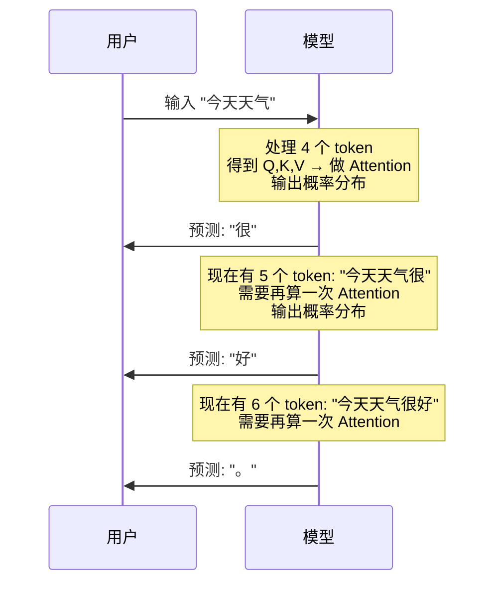

### 3.10.2 没有 KV Cache 的推理（笨方法）

如果不做缓存，每生成一个新 token 都要**重新计算所有 token 的 QKV**：

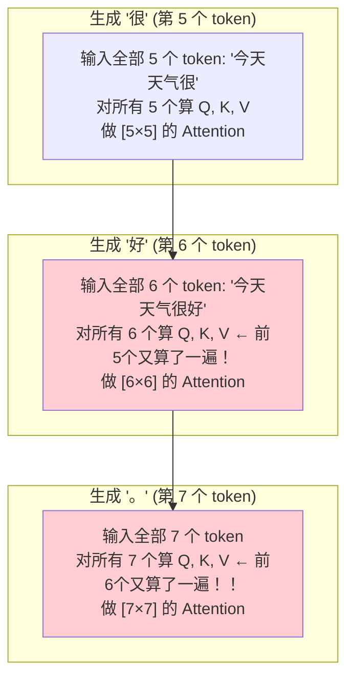

**问题**：前面 token 的 K 和 V 被反复重新计算，极度浪费！

### 3.10.3 关键洞察：为什么 K 和 V 可以缓存？

看 Attention 公式中，对于位置 i 的 token：

```
K_i = x_i × W_K
V_i = x_i × W_V
```

**K_i 和 V_i 只取决于 x_i 本身！** 不管后面来了多少新 token，位置 i 的 K 和 V 永远不变。

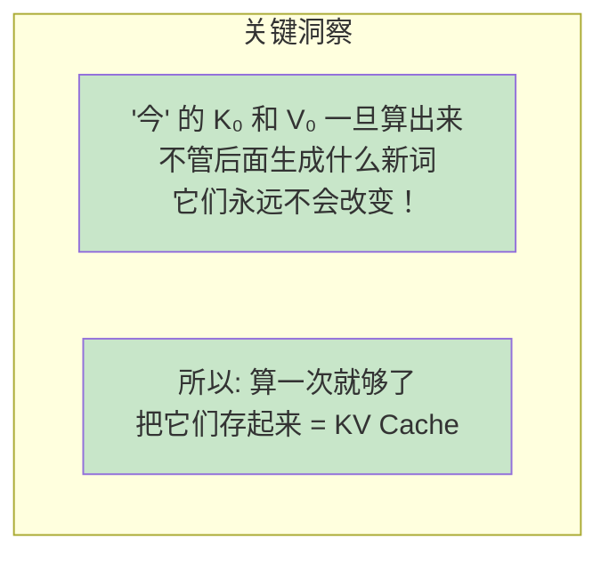

**为什么 Q 不需要缓存？**

因为在生成新 token 时，我们只需要**新 token 的 Q** 去和所有历史的 K 做匹配。历史 token 的 Q 已经没用了（它们的输出已经计算完了）。

### 3.10.4 有 KV Cache 的推理（聪明方法）

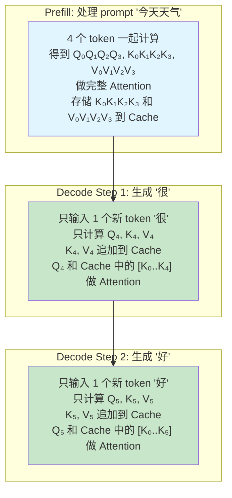

### 3.10.5 对比：一张表说清楚

| | 无 KV Cache | 有 KV Cache |
|--|------------|------------|
| 每步输入 | **所有** token | 只有 **1 个**新 token |
| 每步计算 K, V | 所有 token 的 | 只有新 token 的 |
| Attention 矩阵 | [N × N] 完整矩阵 | [1 × N] 一行 |
| 前面 token 的 K, V | 重新计算 | 从 Cache 读取 |
| 额外显存 | 无 | 需要存 KV Cache |
| 速度 | 极慢（O(N³) 总计） | 快得多（O(N²) 总计） |

### 3.10.6 KV Cache 的形象理解

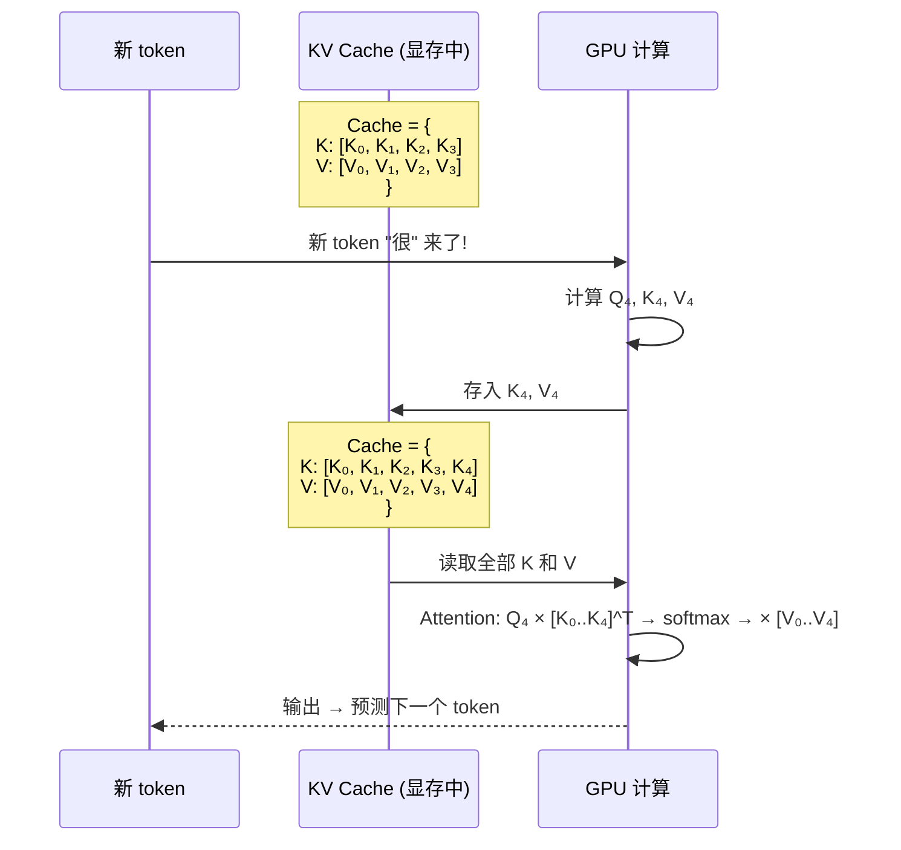

### 3.10.7 KV Cache 有多大？

**公式**：

```
KV Cache = 2 × 层数 × KV头数 × 头维度 × 序列长度 × 数据类型大小
           ^    ^       ^        ^         ^           ^
          K和V  32     32/8     128      当前长度     2字节(FP16)
```

**计算例子**：

```
Llama-2-7B, MHA (32 KV heads), 序列长度 4096, FP16:

KV Cache = 2 × 32层 × 32头 × 128维 × 4096长度 × 2字节
         = 2 × 32 × 32 × 128 × 4096 × 2
         = 2,147,483,648 字节
         = 2 GB

单个请求就要 2 GB！
```

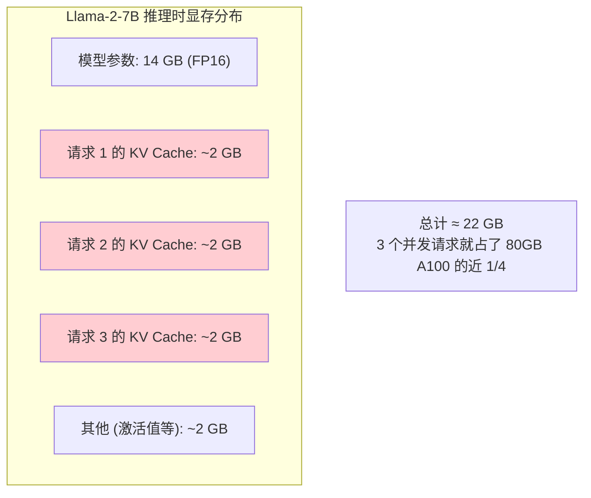

### 3.10.8 各模型 KV Cache 大小对比

| 模型 | 层数 | KV heads | 每 token 的 KV (FP16) | seq=4K | seq=128K |
|------|------|----------|---------------------|--------|----------|
| Llama-2-7B | 32 | 32 | 512 KB/token | **2 GB** | **64 GB** |
| Llama-3-8B (GQA) | 32 | 8 | 128 KB/token | **512 MB** | **16 GB** |
| Llama-2-70B (GQA) | 80 | 8 | 320 KB/token | **1.28 GB** | **40 GB** |

> **GQA 把 KV Cache 砍了 75%！** 这就是它被广泛使用的原因。

### 3.10.9 为什么 KV Cache 是推理的核心瓶颈？

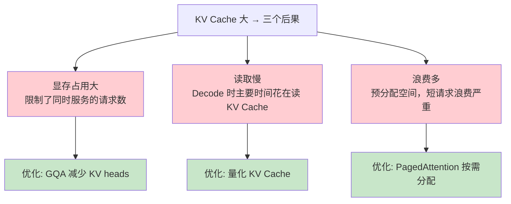

### 3.10.10 Decode 为什么慢？（Memory Bound）

Decode 时，每次只有 1 个新 token：

```
Q_new: [1, 128]（只有 1 行）
K_cache: [N, 128]（N 可能是几千）

Attention = Q_new × K_cache^T = [1, 128] × [128, N] = [1, N]
```

这是一个**向量乘矩阵**——计算量很少，但需要把整个 K_cache 从显存读出来。

```
A100 读取速度: 2 TB/s
KV Cache 大小: 2 GB (Llama-7B, seq=4096)
纯读取时间: 2GB / 2TB/s = 1 ms

模型参数: 14 GB
纯读取时间: 14GB / 2TB/s = 7 ms

总计读取: 约 8 ms → 这就是每个 token 的延迟！

实际计算时间: < 0.1 ms → GPU 算力严重浪费(利用率 < 5%)
```

**结论**：推理 Decode 的瓶颈是"从显存读数据太慢"（Memory Bound），不是"算不过来"。

---

## 3.11 训练 vs 推理中 Attention 的区别（总结）

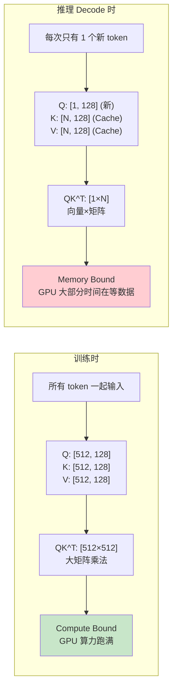

---

## 实践练习

### 练习 1：手写带 KV Cache 的 Attention

```python
import torch
import torch.nn.functional as F

class AttentionWithKVCache:
    """从零实现带 KV Cache 的 Attention，理解每一步"""

    def __init__(self, hidden_dim=64, head_dim=16):
        # 随机初始化权重矩阵
        self.W_q = torch.randn(hidden_dim, head_dim) * 0.1
        self.W_k = torch.randn(hidden_dim, head_dim) * 0.1
        self.W_v = torch.randn(hidden_dim, head_dim) * 0.1

        # KV Cache: 空列表
        self.k_cache = None  # 将存储所有历史 K
        self.v_cache = None  # 将存储所有历史 V

    def clear_cache(self):
        self.k_cache = None
        self.v_cache = None

    def prefill(self, x):
        """
        Prefill: 一次性处理所有 prompt token
        x: [seq_len, hidden_dim]
        返回: [seq_len, head_dim]
        """
        seq_len = x.shape[0]
        print(f"\n=== Prefill: 处理 {seq_len} 个 prompt token ===")

        # 计算所有 token 的 Q, K, V
        Q = x @ self.W_q  # [seq_len, head_dim]
        K = x @ self.W_k  # [seq_len, head_dim]
        V = x @ self.W_v  # [seq_len, head_dim]
        print(f"  Q shape: {Q.shape}")
        print(f"  K shape: {K.shape}")
        print(f"  V shape: {V.shape}")

        # 存入 KV Cache
        self.k_cache = K.clone()
        self.v_cache = V.clone()
        print(f"  KV Cache 初始化: [{self.k_cache.shape[0]} tokens cached]")

        # 完整的 Causal Attention
        head_dim = Q.shape[-1]
        scores = Q @ K.T / (head_dim ** 0.5)  # [seq_len, seq_len]
        mask = torch.triu(torch.ones(seq_len, seq_len), diagonal=1).bool()
        scores.masked_fill_(mask, float('-inf'))
        attn_weights = F.softmax(scores, dim=-1)
        output = attn_weights @ V  # [seq_len, head_dim]

        print(f"  Attention 矩阵大小: [{seq_len} × {seq_len}]")
        print(f"  输出 shape: {output.shape}")
        return output

    def decode_one_token(self, x_new):
        """
        Decode: 处理 1 个新 token
        x_new: [1, hidden_dim] 新 token 的 embedding
        返回: [1, head_dim]
        """
        current_len = self.k_cache.shape[0]
        print(f"\n--- Decode: 第 {current_len + 1} 个 token ---")

        # 只计算新 token 的 Q, K, V
        q_new = x_new @ self.W_q  # [1, head_dim]
        k_new = x_new @ self.W_k  # [1, head_dim]
        v_new = x_new @ self.W_v  # [1, head_dim]
        print(f"  新 token 的 Q: {q_new.shape}")

        # 把新 K, V 追加到 Cache
        self.k_cache = torch.cat([self.k_cache, k_new], dim=0)
        self.v_cache = torch.cat([self.v_cache, v_new], dim=0)
        new_len = self.k_cache.shape[0]
        print(f"  KV Cache 更新: {current_len} → {new_len} tokens")

        # Attention: 新 Q 和全部缓存的 K 做匹配
        head_dim = q_new.shape[-1]
        scores = q_new @ self.k_cache.T / (head_dim ** 0.5)  # [1, new_len]
        attn_weights = F.softmax(scores, dim=-1)  # [1, new_len] 不需要mask(新token是最后一个)
        output = attn_weights @ self.v_cache  # [1, head_dim]

        print(f"  Attention: Q[1,{head_dim}] × K_cache[{new_len},{head_dim}]^T = scores[1,{new_len}]")
        print(f"  注意力权重: {attn_weights.squeeze().detach().numpy().round(3)}")
        return output


# ========== 完整演示 ==========
torch.manual_seed(42)
hidden_dim, head_dim = 16, 4

attn = AttentionWithKVCache(hidden_dim, head_dim)

# 模拟 prompt: 3 个 token (假装是 "今天天气")
prompt = torch.randn(3, hidden_dim)
print("=" * 50)
print("Prompt: 3 个 token")
print("=" * 50)
prefill_out = attn.prefill(prompt)

# 逐个生成新 token
print("\n" + "=" * 50)
print("Decode: 逐个生成")
print("=" * 50)

for i in range(4):
    new_token_embedding = torch.randn(1, hidden_dim)
    decode_out = attn.decode_one_token(new_token_embedding)

print(f"\n最终 KV Cache 包含 {attn.k_cache.shape[0]} 个 token 的 K 和 V")
print(f"KV Cache 大小: K={attn.k_cache.shape}, V={attn.v_cache.shape}")
```

**运行后观察**：
- Prefill 阶段一次处理多个 token，KV Cache 初始化
- 每次 Decode 只计算 1 个新 token 的 QKV
- KV Cache 每步增长 1 行
- Attention 的 scores 维度是 [1, 当前总长度]

### 练习 2：体验有无 KV Cache 的速度差异

```python
import torch
import torch.nn.functional as F
import time

class NaiveAttention:
    """无 KV Cache: 每次重新计算所有 token"""

    def __init__(self, dim=64, head_dim=16):
        self.W_q = torch.randn(dim, head_dim, device='cpu') * 0.1
        self.W_k = torch.randn(dim, head_dim, device='cpu') * 0.1
        self.W_v = torch.randn(dim, head_dim, device='cpu') * 0.1

    def generate_step(self, all_tokens):
        """
        重新计算所有 token 的 QKV
        all_tokens: [current_len, dim]
        """
        seq_len = all_tokens.shape[0]
        Q = all_tokens @ self.W_q
        K = all_tokens @ self.W_k
        V = all_tokens @ self.W_v

        scores = Q @ K.T / (Q.shape[-1] ** 0.5)
        mask = torch.triu(torch.ones(seq_len, seq_len), diagonal=1).bool()
        scores.masked_fill_(mask, float('-inf'))
        weights = F.softmax(scores, dim=-1)
        output = weights @ V
        return output[-1:]  # 只要最后一个位置的输出

class CachedAttention:
    """有 KV Cache: 只算新 token"""

    def __init__(self, dim=64, head_dim=16):
        self.W_q = torch.randn(dim, head_dim, device='cpu') * 0.1
        self.W_k = torch.randn(dim, head_dim, device='cpu') * 0.1
        self.W_v = torch.randn(dim, head_dim, device='cpu') * 0.1
        self.k_cache = None
        self.v_cache = None

    def prefill(self, tokens):
        K = tokens @ self.W_k
        V = tokens @ self.W_v
        self.k_cache = K
        self.v_cache = V

    def generate_step(self, new_token):
        """只计算 1 个新 token"""
        q = new_token @ self.W_q
        k = new_token @ self.W_k
        v = new_token @ self.W_v

        self.k_cache = torch.cat([self.k_cache, k], dim=0)
        self.v_cache = torch.cat([self.v_cache, v], dim=0)

        scores = q @ self.k_cache.T / (q.shape[-1] ** 0.5)
        weights = F.softmax(scores, dim=-1)
        output = weights @ self.v_cache
        return output

# 性能对比
dim = 512
head_dim = 64
prompt_len = 100
generate_len = 200

prompt = torch.randn(prompt_len, dim)

# 方法 1: 无缓存
naive = NaiveAttention(dim, head_dim)
all_tokens = prompt.clone()

start = time.time()
for step in range(generate_len):
    new_token = torch.randn(1, dim)
    all_tokens = torch.cat([all_tokens, new_token], dim=0)
    _ = naive.generate_step(all_tokens)
naive_time = time.time() - start

# 方法 2: 有缓存
cached = CachedAttention(dim, head_dim)
cached.W_q = naive.W_q
cached.W_k = naive.W_k
cached.W_v = naive.W_v
cached.prefill(prompt)

start = time.time()
for step in range(generate_len):
    new_token = torch.randn(1, dim)
    _ = cached.generate_step(new_token)
cached_time = time.time() - start

print(f"生成 {generate_len} 个 token (prompt={prompt_len}):")
print(f"  无 KV Cache: {naive_time*1000:.1f} ms")
print(f"  有 KV Cache: {cached_time*1000:.1f} ms")
print(f"  加速比: {naive_time/cached_time:.1f}x")
print(f"\n原因: 无缓存版本每步重新计算前面所有 token 的 K,V")
print(f"      有缓存版本每步只算 1 个新 token 的 K,V")
```

### 练习 3：KV Cache 大小计算器

```python
def kv_cache_calculator():
    """交互式 KV Cache 大小计算"""

    configs = {
        "Llama-2-7B (MHA)":   {"layers": 32, "kv_heads": 32, "head_dim": 128},
        "Llama-3-8B (GQA)":   {"layers": 32, "kv_heads": 8,  "head_dim": 128},
        "Llama-2-70B (GQA)":  {"layers": 80, "kv_heads": 8,  "head_dim": 128},
        "Llama-3-70B (GQA)":  {"layers": 80, "kv_heads": 8,  "head_dim": 128},
        "GPT-4 级别 (推测)":   {"layers": 120, "kv_heads": 16, "head_dim": 128},
    }

    print("=" * 70)
    print("KV Cache 大小计算器")
    print("=" * 70)
    print(f"\n公式: KV_Cache = 2 × layers × kv_heads × head_dim × seq_len × 2bytes")
    print(f"       (2 是因为 K 和 V 各一份, 2bytes 是 FP16)")

    seq_lengths = [1024, 4096, 8192, 32768, 131072]

    # 表头
    header = f"{'模型':<22}"
    for seq in seq_lengths:
        if seq >= 1024:
            header += f"{'seq='+str(seq//1024)+'K':>10}"
        else:
            header += f"{'seq='+str(seq):>10}"
    print(f"\n{header}")
    print("-" * (22 + 10 * len(seq_lengths)))

    for name, cfg in configs.items():
        row = f"{name:<22}"
        for seq_len in seq_lengths:
            size_bytes = 2 * cfg['layers'] * cfg['kv_heads'] * cfg['head_dim'] * seq_len * 2
            size_gb = size_bytes / 1024**3
            if size_gb >= 1:
                row += f"{size_gb:>8.1f}GB"
            else:
                row += f"{size_gb*1024:>7.0f}MB "
        print(row)

    # Batch 影响
    print(f"\n\n{'='*70}")
    print("并发请求数的影响 (Llama-3-8B, seq=4096)")
    print("=" * 70)
    cfg = configs["Llama-3-8B (GQA)"]
    model_size = 16  # GB, FP16
    for batch in [1, 8, 16, 32, 64, 128]:
        kv_size = 2 * cfg['layers'] * cfg['kv_heads'] * cfg['head_dim'] * 4096 * 2 * batch
        kv_gb = kv_size / 1024**3
        total = model_size + kv_gb
        status = "✓ 放得下" if total < 80 else "✗ OOM (>80GB)"
        print(f"  batch={batch:3d}: KV Cache = {kv_gb:5.1f} GB, "
              f"总需 = {total:5.1f} GB  {status}")

kv_cache_calculator()
```

### 练习 4：手写完整的 Multi-Head Attention

```python
import torch
import torch.nn as nn
import torch.nn.functional as F

class MyMultiHeadAttention(nn.Module):
    """手写多头注意力，带详细注释"""

    def __init__(self, hidden_dim=256, num_heads=8):
        super().__init__()
        self.num_heads = num_heads
        self.head_dim = hidden_dim // num_heads  # 256/8 = 32
        self.hidden_dim = hidden_dim

        # QKV 的投影矩阵
        self.W_q = nn.Linear(hidden_dim, hidden_dim, bias=False)
        self.W_k = nn.Linear(hidden_dim, hidden_dim, bias=False)
        self.W_v = nn.Linear(hidden_dim, hidden_dim, bias=False)
        self.W_o = nn.Linear(hidden_dim, hidden_dim, bias=False)

    def forward(self, x):
        """
        x: [batch, seq_len, hidden_dim]
        """
        batch, seq_len, _ = x.shape

        # === Step 1: 投影 ===
        Q = self.W_q(x)  # [batch, seq, hidden_dim]
        K = self.W_k(x)
        V = self.W_v(x)

        # === Step 2: reshape 成多头 ===
        # [batch, seq, hidden_dim] → [batch, seq, num_heads, head_dim] → [batch, num_heads, seq, head_dim]
        Q = Q.reshape(batch, seq_len, self.num_heads, self.head_dim).transpose(1, 2)
        K = K.reshape(batch, seq_len, self.num_heads, self.head_dim).transpose(1, 2)
        V = V.reshape(batch, seq_len, self.num_heads, self.head_dim).transpose(1, 2)
        # 现在: [batch, num_heads, seq_len, head_dim]

        # === Step 3: 计算注意力分数 ===
        scores = Q @ K.transpose(-2, -1) / (self.head_dim ** 0.5)
        # scores: [batch, num_heads, seq_len, seq_len]

        # === Step 4: Causal Mask ===
        mask = torch.triu(torch.ones(seq_len, seq_len, device=x.device), diagonal=1).bool()
        scores.masked_fill_(mask, float('-inf'))

        # === Step 5: Softmax ===
        attn_weights = F.softmax(scores, dim=-1)
        # attn_weights: [batch, num_heads, seq_len, seq_len]

        # === Step 6: 加权求和 ===
        output = attn_weights @ V
        # output: [batch, num_heads, seq_len, head_dim]

        # === Step 7: 合并多头 ===
        output = output.transpose(1, 2).reshape(batch, seq_len, self.hidden_dim)
        # output: [batch, seq_len, hidden_dim]

        # === Step 8: 输出投影 ===
        output = self.W_o(output)

        return output, attn_weights

# 测试
mha = MyMultiHeadAttention(hidden_dim=256, num_heads=8)
x = torch.randn(1, 10, 256)  # 1 条句子，10 个 token
output, weights = mha(x)

print(f"输入 shape: {x.shape}")
print(f"输出 shape: {output.shape}")
print(f"注意力权重 shape: {weights.shape}")
print(f"  = [batch={1}, heads={8}, seq={10}, seq={10}]")
print(f"\n验证: 每行权重和为 1: {weights[0, 0, 5].sum().item():.6f}")
print(f"验证: 未来位置权重为 0: {weights[0, 0, 3, 5].item():.6f}")  # pos 3 看不到 pos 5
print(f"\n✓ 实现正确!")
```

### 练习 5：手写完整 Mini Transformer + 生成

```python
import torch
import torch.nn as nn
import torch.nn.functional as F

class RMSNorm(nn.Module):
    def __init__(self, dim, eps=1e-6):
        super().__init__()
        self.weight = nn.Parameter(torch.ones(dim))
        self.eps = eps

    def forward(self, x):
        rms = torch.sqrt(x.pow(2).mean(-1, keepdim=True) + self.eps)
        return x / rms * self.weight

class MiniLLM(nn.Module):
    """一个完整的迷你语言模型，可以做文本生成"""

    def __init__(self, vocab_size=100, hidden_dim=128, num_heads=4, num_layers=4):
        super().__init__()
        self.embedding = nn.Embedding(vocab_size, hidden_dim)
        self.layers = nn.ModuleList()
        for _ in range(num_layers):
            self.layers.append(nn.ModuleDict({
                'norm1': RMSNorm(hidden_dim),
                'attn_qkv': nn.Linear(hidden_dim, 3 * hidden_dim, bias=False),
                'attn_out': nn.Linear(hidden_dim, hidden_dim, bias=False),
                'norm2': RMSNorm(hidden_dim),
                'ffn_gate': nn.Linear(hidden_dim, hidden_dim * 4, bias=False),
                'ffn_up': nn.Linear(hidden_dim, hidden_dim * 4, bias=False),
                'ffn_down': nn.Linear(hidden_dim * 4, hidden_dim, bias=False),
            }))
        self.final_norm = RMSNorm(hidden_dim)
        self.lm_head = nn.Linear(hidden_dim, vocab_size, bias=False)
        self.num_heads = num_heads
        self.head_dim = hidden_dim // num_heads

    def attention(self, x, layer):
        """带 Causal Mask 的多头注意力"""
        batch, seq_len, _ = x.shape
        qkv = layer['attn_qkv'](x)
        q, k, v = qkv.chunk(3, dim=-1)

        q = q.reshape(batch, seq_len, self.num_heads, self.head_dim).transpose(1, 2)
        k = k.reshape(batch, seq_len, self.num_heads, self.head_dim).transpose(1, 2)
        v = v.reshape(batch, seq_len, self.num_heads, self.head_dim).transpose(1, 2)

        scores = q @ k.transpose(-2, -1) / (self.head_dim ** 0.5)
        mask = torch.triu(torch.ones(seq_len, seq_len, device=x.device), diagonal=1).bool()
        scores.masked_fill_(mask, float('-inf'))
        attn = F.softmax(scores, dim=-1)
        out = (attn @ v).transpose(1, 2).reshape(batch, seq_len, -1)
        return layer['attn_out'](out)

    def ffn(self, x, layer):
        """SwiGLU FFN"""
        gate = F.silu(layer['ffn_gate'](x))
        up = layer['ffn_up'](x)
        return layer['ffn_down'](gate * up)

    def forward(self, input_ids):
        x = self.embedding(input_ids)
        for layer in self.layers:
            x = x + self.attention(layer['norm1'](x), layer)
            x = x + self.ffn(layer['norm2'](x), layer)
        x = self.final_norm(x)
        logits = self.lm_head(x)
        return logits

    @torch.no_grad()
    def generate(self, input_ids, max_new_tokens=20, temperature=1.0):
        """自回归生成（无 KV Cache 版本，便于理解）"""
        for _ in range(max_new_tokens):
            logits = self.forward(input_ids)  # [batch, seq, vocab]
            next_token_logits = logits[:, -1, :] / temperature
            probs = F.softmax(next_token_logits, dim=-1)
            next_token = torch.multinomial(probs, 1)
            input_ids = torch.cat([input_ids, next_token], dim=1)
        return input_ids

# 训练一个迷你语言模型
torch.manual_seed(42)
model = MiniLLM(vocab_size=50, hidden_dim=64, num_heads=4, num_layers=2)

# 模拟一些训练数据 (随机序列，仅做演示)
optimizer = torch.optim.Adam(model.parameters(), lr=1e-3)

print("训练 Mini LLM...")
for step in range(200):
    data = torch.randint(0, 50, (4, 32))  # batch=4, seq=32
    logits = model(data[:, :-1])  # 输入前 31 个
    targets = data[:, 1:]  # 目标是后 31 个
    loss = F.cross_entropy(logits.reshape(-1, 50), targets.reshape(-1))
    optimizer.zero_grad()
    loss.backward()
    optimizer.step()
    if step % 50 == 0:
        print(f"  Step {step}: loss = {loss.item():.3f}")

# 生成
print("\n生成文本 (随机 token，因为训练数据是随机的):")
prompt = torch.randint(0, 50, (1, 5))
print(f"  Prompt IDs: {prompt[0].tolist()}")
generated = model.generate(prompt, max_new_tokens=10)
print(f"  Generated IDs: {generated[0].tolist()}")
print(f"\n模型参数量: {sum(p.numel() for p in model.parameters())/1e3:.1f}K")
print("✓ 完整的 Mini LLM 训练和生成成功!")
```

### 练习 6：可视化注意力权重

```python
import torch
import matplotlib.pyplot as plt
import numpy as np

def visualize_attention():
    """可视化不同层、不同头的注意力模式"""

    # 模拟一个 4 头的 attention 权重
    seq_len = 8
    tokens = ["The", "cat", "sat", "on", "the", "mat", "because", "it"]
    num_heads = 4

    # 模拟不同头学到的模式
    weights = torch.zeros(num_heads, seq_len, seq_len)

    # Head 0: 主要关注前一个词（位置关系）
    for i in range(seq_len):
        if i > 0:
            weights[0, i, i-1] = 0.6
        weights[0, i, i] = 0.4 if i > 0 else 1.0

    # Head 1: 主要关注名词
    noun_positions = [1, 5]  # "cat", "mat"
    for i in range(seq_len):
        total = 0
        for np_pos in noun_positions:
            if np_pos <= i:
                weights[1, i, np_pos] = 0.3
                total += 0.3
        weights[1, i, i] = 1.0 - total if total < 1 else 0.1

    # Head 2: 均匀关注所有可见 token
    for i in range(seq_len):
        for j in range(i+1):
            weights[2, i, j] = 1.0 / (i+1)

    # Head 3: "it" 强烈关注 "cat"（指代）
    for i in range(seq_len):
        weights[3, i, i] = 0.5
        if i > 0:
            weights[3, i, 0:i] = 0.5 / i
    weights[3, 7, 1] = 0.8  # "it" → "cat"
    weights[3, 7, 7] = 0.1
    weights[3, 7, 0] = 0.05
    weights[3, 7, 2:7] = 0.05 / 5

    # 画图
    fig, axes = plt.subplots(2, 2, figsize=(14, 12))
    head_names = ["Head 0: 关注前一个词", "Head 1: 关注名词",
                  "Head 2: 均匀分布", "Head 3: 指代关系"]

    for idx, (ax, name) in enumerate(zip(axes.flat, head_names)):
        w = weights[idx].numpy()
        # 应用 causal mask
        mask = np.triu(np.ones((seq_len, seq_len)), k=1)
        w = w * (1 - mask)
        # 重新归一化
        row_sums = w.sum(axis=1, keepdims=True)
        row_sums[row_sums == 0] = 1
        w = w / row_sums

        im = ax.imshow(w, cmap='Blues', vmin=0, vmax=1)
        ax.set_xticks(range(seq_len))
        ax.set_yticks(range(seq_len))
        ax.set_xticklabels(tokens, rotation=45, ha='right')
        ax.set_yticklabels(tokens)
        ax.set_xlabel('Key (被关注)')
        ax.set_ylabel('Query (在关注)')
        ax.set_title(name)
        plt.colorbar(im, ax=ax, fraction=0.046)

    plt.tight_layout()
    plt.savefig('multi_head_attention_patterns.png', dpi=100, bbox_inches='tight')
    print("注意力模式图已保存: multi_head_attention_patterns.png")
    print("\n观察:")
    print("- 不同的头学到了完全不同的关注模式")
    print("- Head 0 像一个'前看'模式")
    print("- Head 1 专注于名词")
    print("- Head 3 学会了指代消解 (it → cat)")

visualize_attention()
```

---

## 自测清单

### QKV 相关
- [ ] 能用自己的话解释 Q、K、V 分别是什么（用图书馆/搜索引擎类比）
- [ ] 知道 QKV 是怎么从输入向量 x 算出来的（三个权重矩阵）
- [ ] 能手算一个 3×3 的 Attention（给定 QKV 和权重矩阵）
- [ ] 理解 Q×K^T 为什么能衡量"相关性"（点积 = 方向相似度）
- [ ] 知道为什么要除以 √d（防止 softmax 饱和）
- [ ] 理解 Causal Mask 的作用（不能看未来）

### Multi-Head 相关
- [ ] 知道为什么要多头（一个头只能学一种模式）
- [ ] 理解 hidden_dim = num_heads × head_dim 的维度关系
- [ ] 知道 Multi-Head 是用 reshape 实现的，不是真的切成多份

### KV Cache 相关
- [ ] 能解释为什么 K 和 V 可以缓存（它们不会随后续 token 改变）
- [ ] 能解释为什么 Q 不需要缓存（只需要新 token 的 Q）
- [ ] 知道 Prefill 和 Decode 的区别
- [ ] 能手算 KV Cache 大小（给定模型配置和序列长度）
- [ ] 理解 GQA 如何减少 KV Cache（减少 KV heads 数量）
- [ ] 知道 Decode 为什么是 Memory Bound（向量×矩阵，大部分时间在读数据）

### 其他
- [ ] 知道 FFN 的作用和大致结构（SwiGLU）
- [ ] 知道残差连接为什么重要（梯度直通）
- [ ] 能画出完整 Transformer Block 的结构

---

## 延伸阅读

| 资源 | 类型 | 推荐度 | 说明 |
|------|------|--------|------|
| [The Illustrated Transformer](https://jalammar.github.io/illustrated-transformer/) | 博客 | ⭐⭐⭐⭐⭐ | 最好的图解入门 |
| [3Blue1Brown: Attention](https://www.youtube.com/watch?v=eMlx5fFNoYc) | 视频 | ⭐⭐⭐⭐⭐ | 动画直觉 |
| [Andrej Karpathy: Let's build GPT](https://www.youtube.com/watch?v=kCc8FmEb1nY) | 视频 | ⭐⭐⭐⭐⭐ | 2 小时从零实现 |
| [The KV Cache Explained](https://kipp.ly/transformer-inference-arithmetic/) | 博客 | ⭐⭐⭐⭐ | 推理算术详解 |
| [Attention Is All You Need](https://arxiv.org/abs/1706.03762) | 论文 | ⭐⭐⭐ | 原始论文（进阶再看） |
| [Llama 2 Technical Report](https://arxiv.org/abs/2307.09288) | 论文 | ⭐⭐⭐⭐ | 对照架构细节 |
| [nanoGPT](https://github.com/karpathy/nanoGPT) | 代码 | ⭐⭐⭐⭐⭐ | 最简 GPT 实现 |
