# 模块4：分布式训练

> 预计时间：5-7 天  
> 目标：理解数据并行、模型并行、ZeRO 的原理，能用 PyTorch DDP 和 DeepSpeed 跑分布式训练  
> 前置要求：完成模块 2（训练基础）和模块 3（Transformer）

---

## 4.1 为什么需要分布式训练？

### 单卡的极限

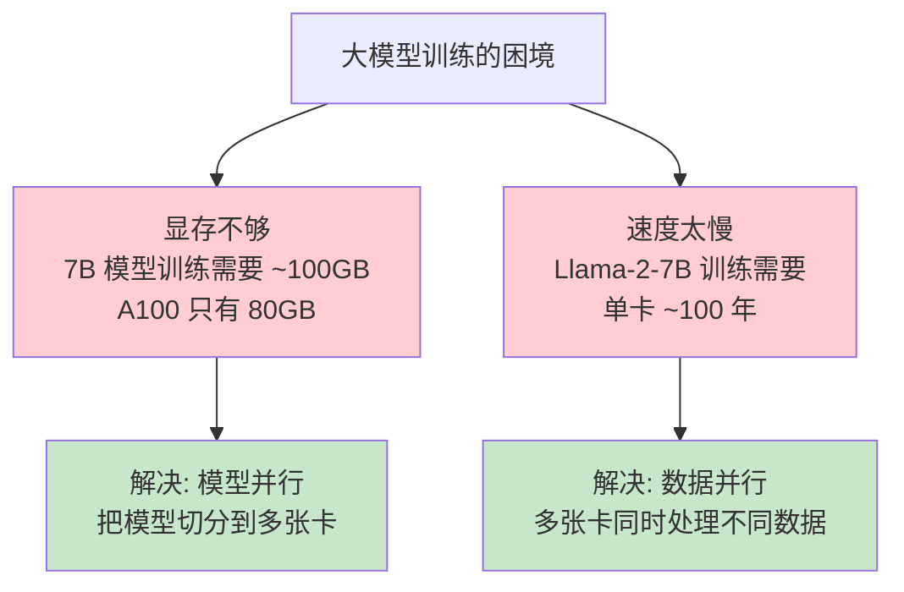

### 训练大模型需要多少资源？

| 模型 | 参数量 | 训练 tokens | 所需 GPU 时间 | 实际配置 |
|------|--------|------------|-------------|---------|
| Llama-2-7B | 7B | 2T | ~180K A100-hours | 2048× A100, 数天 |
| Llama-2-70B | 70B | 2T | ~1.7M A100-hours | 2048× A100, 数周 |
| GPT-4 (推测) | >1T | >10T | 数千万 GPU-hours | 数万张卡 |

---

## 4.2 数据并行（Data Parallelism）

### 核心思想

每张卡持有完整模型副本，数据切分到不同卡。

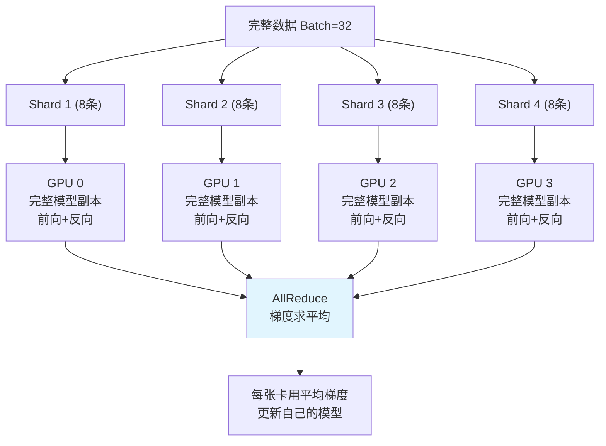

### 流程

1. 每张卡加载完整模型（参数相同）
2. 每张卡拿到不同的数据
3. 各自独立做前向传播 + 反向传播
4. **AllReduce**：所有卡交换梯度，取平均
5. 每张卡用相同的平均梯度更新参数（保证参数同步）

### 优缺点

| 优点 | 缺点 |
|------|------|
| 实现简单 | 每张卡需要放下完整模型 |
| 线性加速（理想情况） | 通信开销随卡数增加 |
| PyTorch 原生支持 | 7B 以上模型单卡放不下 |

---

## 4.3 集合通信原语

分布式训练的基础是卡间通信。理解这些原语是理解所有并行策略的前提。

### AllReduce

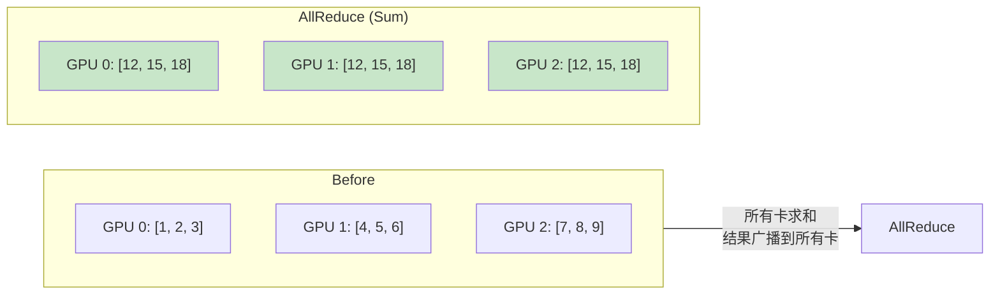

**用途**：数据并行中同步梯度。

### AllGather

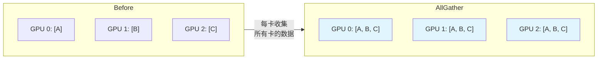

**用途**：ZeRO-3 中计算前收集完整参数。

### ReduceScatter

```mermaid
graph LR
    subgraph Before
        G0B["GPU 0: [1,2,3]"]
        G1B["GPU 1: [4,5,6]"]
        G2B["GPU 2: [7,8,9]"]
    end

    subgraph "ReduceScatter (Sum)"
        G0A["GPU 0: [12]"]
        G1A["GPU 1: [15]"]
        G2A["GPU 2: [18]"]
    end

    Before --> |"先 Reduce(Sum)<br/>结果切片分到各卡"| ReduceScatter

    style G0A fill:#fff9c4
    style G1A fill:#fff9c4
    style G2A fill:#fff9c4
```

**用途**：ZeRO-2 中梯度聚合后各卡只保留自己负责的那一部分。

### 通信量分析

| 操作 | 每卡发送量 | 每卡接收量 | 总通信量(近似) |
|------|-----------|-----------|--------------|
| AllReduce | 数据大小 | 数据大小 | 2 × 数据大小 |
| AllGather | 1/N 数据 | 完整数据 | (N-1)/N × 数据 |
| ReduceScatter | 完整数据 | 1/N 数据 | (N-1)/N × 数据 |

---

## 4.4 模型并行

当模型太大单卡放不下时，需要切分模型。

### 4.4.1 张量并行（Tensor Parallelism，TP）

**核心思想**：把一层内的矩阵切分到多张卡。

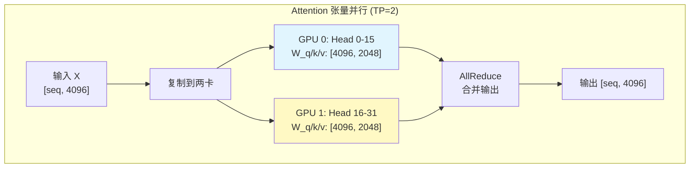

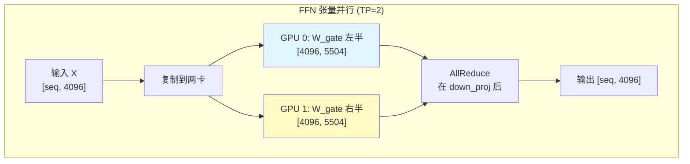

**特点**：
- 通信频繁（每层 2 次 AllReduce）
- 适合同机高带宽互联（NVLink）
- 通常 TP = 2/4/8（一台机器内）

### 4.4.2 流水线并行（Pipeline Parallelism，PP）

**核心思想**：不同层放在不同卡上，像流水线一样传递。

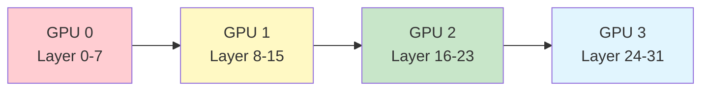

**问题：流水线气泡**

```mermaid
gantt
    title 朴素流水线并行 — 大量空闲（气泡）
    dateFormat X
    axisFormat %s

    section GPU 0 (L0-7)
    Forward MB1 :f1, 0, 2
    Idle :crit, i1, 2, 8
    Backward MB1 :b1, 8, 10

    section GPU 1 (L8-15)
    Idle :crit, i2, 0, 2
    Forward MB1 :f2, 2, 4
    Idle :crit, i3, 4, 8
    Backward MB1 :b2, 8, 10

    section GPU 2 (L16-23)
    Idle :crit, i4, 0, 4
    Forward MB1 :f3, 4, 6
    Idle :crit, i5, 6, 8
    Backward MB1 :b3, 8, 10

    section GPU 3 (L24-31)
    Idle :crit, i6, 0, 6
    Forward MB1 :f4, 6, 8
    Backward MB1 :b4, 8, 10
```

**解决**：把 batch 拆成 micro-batches，交替执行（1F1B schedule）。

**特点**：
- 通信少（只传激活值/梯度，层间）
- 有气泡（部分 GPU 闲置）
- 适合跨机（通信量少，对带宽要求低）

### 4.4.3 3D 并行

大规模训练组合三种并行：

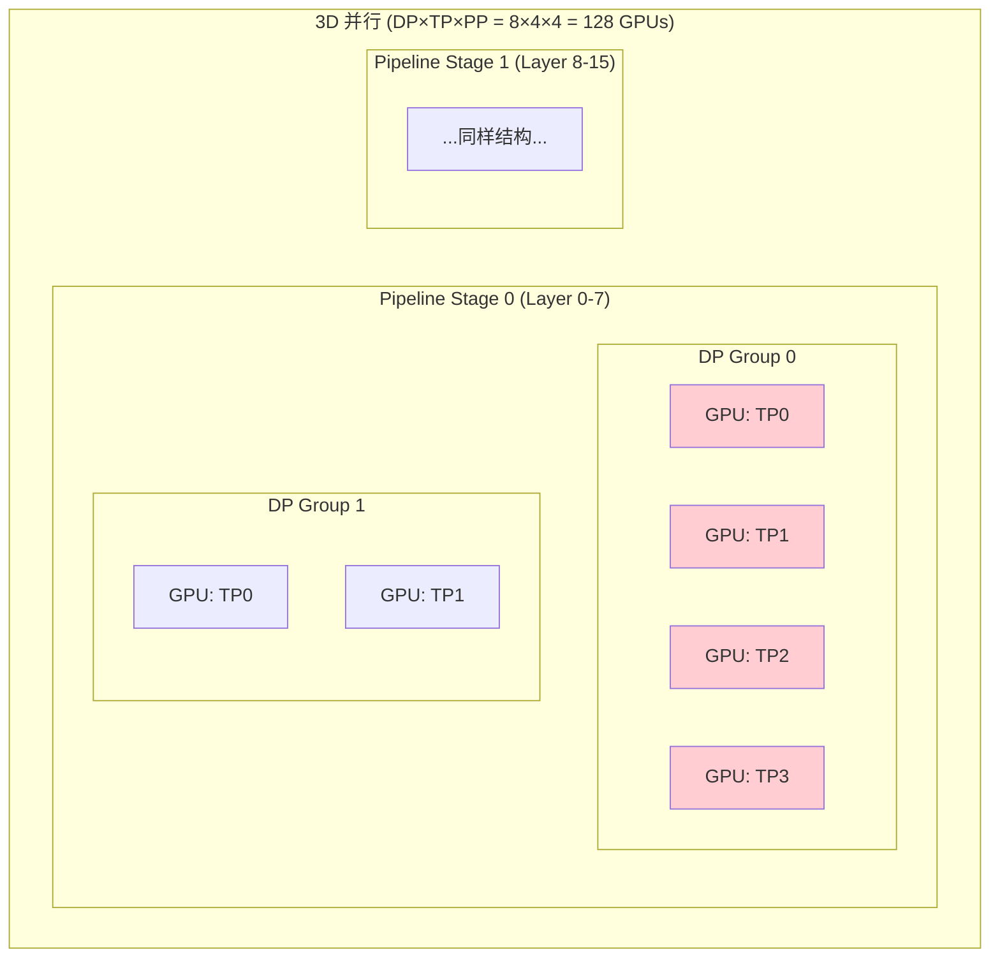

典型配置（Llama-2-70B）：
```
- TP = 8 (一台机器 8 卡, NVLink 互联)
- PP = 4 (4 个 pipeline stage, 跨机)
- DP = 64 (64 个数据并行组)
- 总计: 8 × 4 × 64 = 2048 GPUs
```

---

## 4.5 ZeRO（Zero Redundancy Optimizer）

### 核心洞察

数据并行中每张卡都存了完整的参数、梯度、优化器状态——大量冗余！

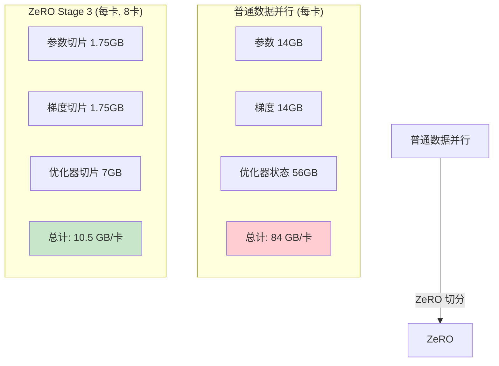

### 三个 Stage

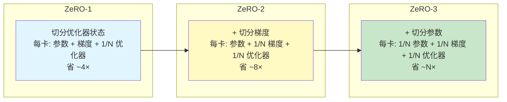

### ZeRO-3 工作原理

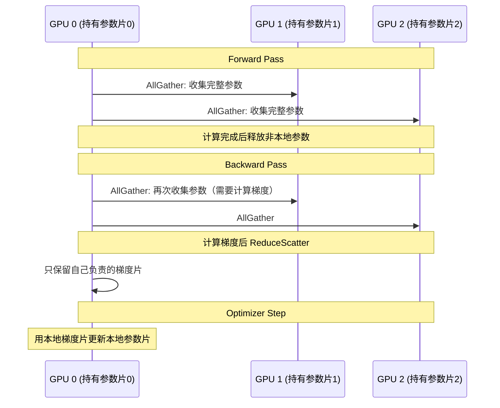

### ZeRO 代价

| Stage | 显存节省 | 额外通信 |
|-------|---------|---------|
| ZeRO-1 | 4× | 无额外通信 |
| ZeRO-2 | 8× | 少量额外 |
| ZeRO-3 | N× | 每层 forward/backward 都要 AllGather |

**ZeRO-3 的通信量是普通 DP 的 1.5×**（AllGather × 2 + ReduceScatter vs AllReduce × 1）

---

## 4.6 FSDP（Fully Sharded Data Parallel）

PyTorch 原生的 ZeRO-3 实现。

```python
# FSDP 核心 API
from torch.distributed.fsdp import FullyShardedDataParallel as FSDP

model = FSDP(
    model,
    sharding_strategy=ShardingStrategy.FULL_SHARD,  # 等同 ZeRO-3
    # SHARD_GRAD_OP 等同 ZeRO-2
)
```

---

## 4.7 通信硬件与拓扑

### 通信层次

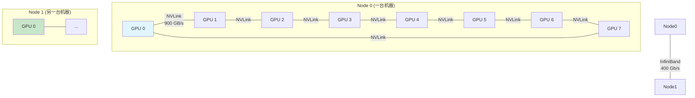

**关键认知**：
- 机内通信（NVLink）比机间通信（IB）快 ~20×
- 所以 TP 放机内（通信密集），PP/DP 放机间（通信少）

---

## 实践练习

### 练习 1：PyTorch DDP 多卡训练

创建文件 `train_ddp.py`:

```python
import os
import torch
import torch.nn as nn
import torch.distributed as dist
from torch.nn.parallel import DistributedDataParallel as DDP
from torch.utils.data import DataLoader, TensorDataset
from torch.utils.data.distributed import DistributedSampler

def setup(rank, world_size):
    os.environ['MASTER_ADDR'] = 'localhost'
    os.environ['MASTER_PORT'] = '12355'
    dist.init_process_group("nccl", rank=rank, world_size=world_size)
    torch.cuda.set_device(rank)

def cleanup():
    dist.destroy_process_group()

def train(rank, world_size):
    setup(rank, world_size)

    # 模型
    model = nn.Sequential(
        nn.Linear(784, 512),
        nn.ReLU(),
        nn.Linear(512, 256),
        nn.ReLU(),
        nn.Linear(256, 10)
    ).cuda(rank)
    model = DDP(model, device_ids=[rank])

    # 数据
    dataset = TensorDataset(
        torch.randn(10000, 784),
        torch.randint(0, 10, (10000,))
    )
    sampler = DistributedSampler(dataset, num_replicas=world_size, rank=rank)
    dataloader = DataLoader(dataset, batch_size=64, sampler=sampler)

    # 训练
    optimizer = torch.optim.Adam(model.parameters(), lr=1e-3)
    criterion = nn.CrossEntropyLoss()

    for epoch in range(5):
        sampler.set_epoch(epoch)
        total_loss = 0
        for x, y in dataloader:
            x, y = x.cuda(rank), y.cuda(rank)
            optimizer.zero_grad()
            loss = criterion(model(x), y)
            loss.backward()
            optimizer.step()
            total_loss += loss.item()

        if rank == 0:
            print(f"Epoch {epoch}, Loss: {total_loss/len(dataloader):.4f}")

    cleanup()

if __name__ == "__main__":
    world_size = torch.cuda.device_count()
    torch.multiprocessing.spawn(train, args=(world_size,), nprocs=world_size)
```

**运行**：
```bash
# 方式 1: 使用 spawn（上面代码）
python train_ddp.py

# 方式 2: 使用 torchrun（推荐）
torchrun --nproc_per_node=2 train_ddp_torchrun.py
```

### 练习 2：观察 AllReduce 通信

```python
import torch
import torch.distributed as dist
import os
import time

def demo_collective(rank, world_size):
    os.environ['MASTER_ADDR'] = 'localhost'
    os.environ['MASTER_PORT'] = '12356'
    dist.init_process_group("nccl", rank=rank, world_size=world_size)
    torch.cuda.set_device(rank)

    # AllReduce 示例
    tensor = torch.ones(1000000, device=f'cuda:{rank}') * (rank + 1)
    print(f"[Rank {rank}] Before AllReduce: sum = {tensor.sum().item():.0f}")

    dist.all_reduce(tensor, op=dist.ReduceOp.SUM)
    print(f"[Rank {rank}] After AllReduce: sum = {tensor.sum().item():.0f}")

    # AllReduce 性能测试
    sizes = [1_000_000, 10_000_000, 100_000_000]  # 4MB, 40MB, 400MB
    for size in sizes:
        data = torch.randn(size, device=f'cuda:{rank}')
        torch.cuda.synchronize()

        # 预热
        for _ in range(5):
            dist.all_reduce(data)
        torch.cuda.synchronize()

        start = time.time()
        for _ in range(20):
            dist.all_reduce(data)
        torch.cuda.synchronize()
        elapsed = (time.time() - start) / 20

        data_mb = size * 4 / 1024**2
        bw = data_mb * 2 / elapsed / 1024  # GB/s (AllReduce = 2×数据量)
        if rank == 0:
            print(f"  Size: {data_mb:.0f} MB, Time: {elapsed*1000:.2f} ms, BW: {bw:.1f} GB/s")

    dist.destroy_process_group()

if __name__ == "__main__":
    world_size = torch.cuda.device_count()
    torch.multiprocessing.spawn(demo_collective, args=(world_size,), nprocs=world_size)
```

### 练习 3：DeepSpeed ZeRO 训练

创建 `ds_config.json`:
```json
{
    "train_batch_size": 32,
    "gradient_accumulation_steps": 4,
    "fp16": {
        "enabled": true
    },
    "zero_optimization": {
        "stage": 2,
        "offload_optimizer": {
            "device": "none"
        },
        "allgather_partitions": true,
        "reduce_scatter": true
    },
    "optimizer": {
        "type": "AdamW",
        "params": {
            "lr": 3e-4,
            "betas": [0.9, 0.999],
            "eps": 1e-8,
            "weight_decay": 0.01
        }
    }
}
```

创建 `train_deepspeed.py`:
```python
import torch
import torch.nn as nn
import deepspeed
import argparse

class SimpleModel(nn.Module):
    def __init__(self, hidden=1024, layers=12):
        super().__init__()
        self.layers = nn.ModuleList([
            nn.Sequential(
                nn.Linear(hidden, hidden * 4),
                nn.ReLU(),
                nn.Linear(hidden * 4, hidden)
            ) for _ in range(layers)
        ])
        self.head = nn.Linear(hidden, 10)

    def forward(self, x):
        for layer in self.layers:
            x = x + layer(x)
        return self.head(x.mean(dim=1))

# 命令行参数
parser = argparse.ArgumentParser()
parser.add_argument('--local_rank', type=int, default=-1)
parser = deepspeed.add_config_arguments(parser)
args = parser.parse_args()

# 模型和数据
model = SimpleModel()
dataset = torch.utils.data.TensorDataset(
    torch.randn(10000, 64, 1024),
    torch.randint(0, 10, (10000,))
)

# DeepSpeed 初始化
model_engine, optimizer, dataloader, _ = deepspeed.initialize(
    args=args,
    model=model,
    training_data=dataset,
    config="ds_config.json"
)

# 训练循环
criterion = nn.CrossEntropyLoss()
for step, (x, y) in enumerate(dataloader):
    x = x.to(model_engine.device)
    y = y.to(model_engine.device)

    outputs = model_engine(x)
    loss = criterion(outputs, y)

    model_engine.backward(loss)
    model_engine.step()

    if step % 10 == 0 and model_engine.local_rank == 0:
        print(f"Step {step}: loss = {loss.item():.4f}")

    if step >= 100:
        break
```

**运行**：
```bash
deepspeed --num_gpus=2 train_deepspeed.py --deepspeed_config ds_config.json
```

**实验**：修改 `ds_config.json` 中的 `stage` 为 1, 2, 3，观察显存变化。

### 练习 4：对比不同 ZeRO Stage 的显存

```python
import torch
import torch.nn as nn

def measure_model_memory(num_params_m, zero_stage, num_gpus):
    """估算不同 ZeRO stage 下每卡显存占用"""
    params_bytes = num_params_m * 1e6 * 2  # FP16 参数
    grad_bytes = num_params_m * 1e6 * 2    # FP16 梯度
    opt_bytes = num_params_m * 1e6 * 12    # Adam: master(4) + m(4) + v(4)

    if zero_stage == 0:  # 普通 DDP
        per_gpu = params_bytes + grad_bytes + opt_bytes
    elif zero_stage == 1:  # 切分优化器
        per_gpu = params_bytes + grad_bytes + opt_bytes / num_gpus
    elif zero_stage == 2:  # 切分优化器 + 梯度
        per_gpu = params_bytes + grad_bytes / num_gpus + opt_bytes / num_gpus
    elif zero_stage == 3:  # 全切分
        per_gpu = (params_bytes + grad_bytes + opt_bytes) / num_gpus

    return per_gpu / 1024**3  # GB

# 对比
models = [("7B", 7000), ("13B", 13000), ("70B", 70000)]
gpus = 8

print(f"{'模型':<8} {'DDP':<10} {'ZeRO-1':<10} {'ZeRO-2':<10} {'ZeRO-3':<10}")
print("-" * 50)
for name, params in models:
    ddp = measure_model_memory(params, 0, gpus)
    z1 = measure_model_memory(params, 1, gpus)
    z2 = measure_model_memory(params, 2, gpus)
    z3 = measure_model_memory(params, 3, gpus)
    print(f"{name:<8} {ddp:<10.1f} {z1:<10.1f} {z2:<10.1f} {z3:<10.1f} GB")

print(f"\nA100 显存: 80 GB")
print("(以上未计入激活值，实际需要更多)")
```

---

## 自测清单

- [ ] 数据并行的核心步骤是什么？为什么要 AllReduce？
- [ ] AllReduce、AllGather、ReduceScatter 分别做什么？
- [ ] 张量并行和流水线并行的区别？各自适合什么场景？
- [ ] ZeRO-1/2/3 分别切分了什么？通信开销如何？
- [ ] 为什么 TP 放在机内，PP/DP 放在机间？
- [ ] 3D 并行是什么？如何确定 TP/PP/DP 的大小？
- [ ] PyTorch DDP 的使用流程是什么？
- [ ] DeepSpeed 和 FSDP 的区别是什么？

---

## 延伸阅读

- [PyTorch DDP 官方教程](https://pytorch.org/tutorials/intermediate/ddp_tutorial.html)
- [DeepSpeed ZeRO 论文](https://arxiv.org/abs/1910.02054)
- [Megatron-LM 论文](https://arxiv.org/abs/1909.08053)
- [Efficient Large-Scale Language Model Training on GPU Clusters](https://arxiv.org/abs/2104.04473)
- [FSDP 官方文档](https://pytorch.org/docs/stable/fsdp.html)
