# 模块5：推理原理与 KV Cache

> 预计时间：4-5 天  
> 目标：彻底理解 LLM 推理过程、KV Cache 的必要性和实现原理，这是理解所有推理优化的基础  
> 前置要求：完成模块 3（Transformer 架构）

---

## 5.1 推理 vs 训练的根本区别

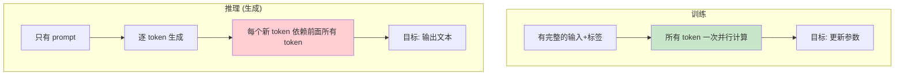

| | 训练 | 推理 |
|--|------|------|
| 输入 | 完整序列 + 标签 | 只有 prompt |
| 计算方式 | 所有 token 并行 | 逐个 token 生成（自回归） |
| 瓶颈 | 计算密集（大矩阵乘法） | 访存密集（读取参数 + KV Cache） |
| 关注指标 | 吞吐量、MFU | 延迟（TTFT）、TPS |

---

## 5.2 自回归生成过程

LLM 生成文本的方式是**自回归**（Auto-Regressive）：每次用前面所有 token 预测下一个。

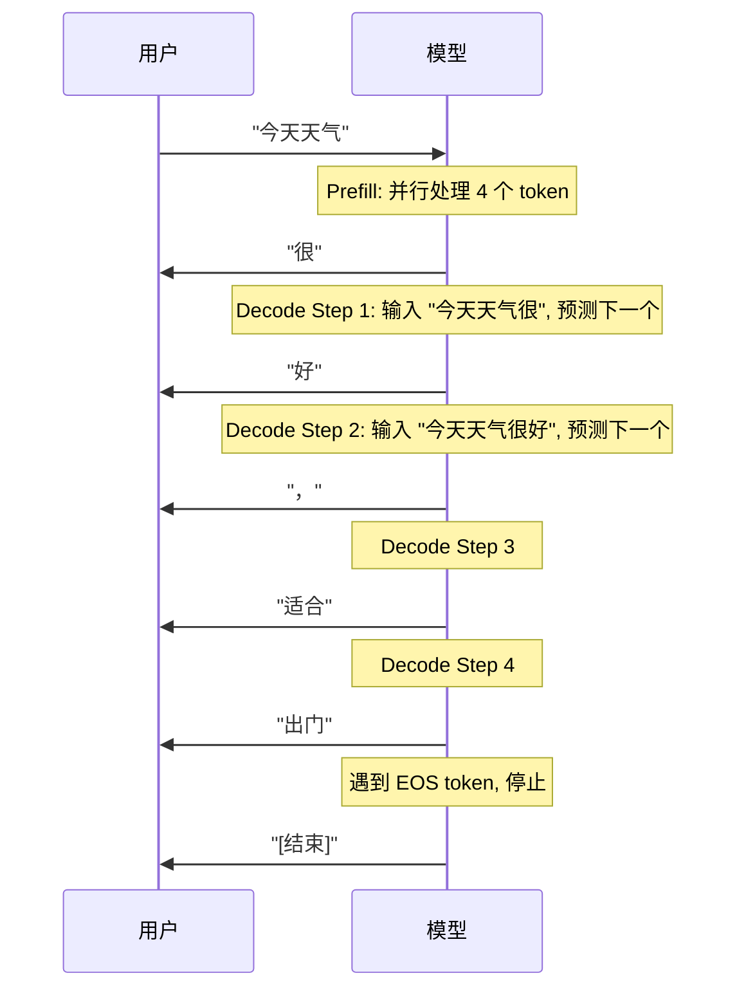

### 两个阶段

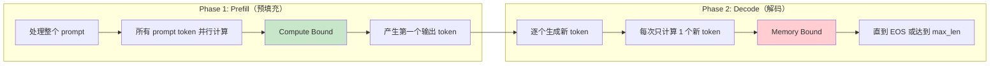

---

## 5.3 没有 KV Cache 的推理（理解问题）

如果**不做任何缓存**，每生成一个新 token 都需要用前面所有 token 重新计算一遍：

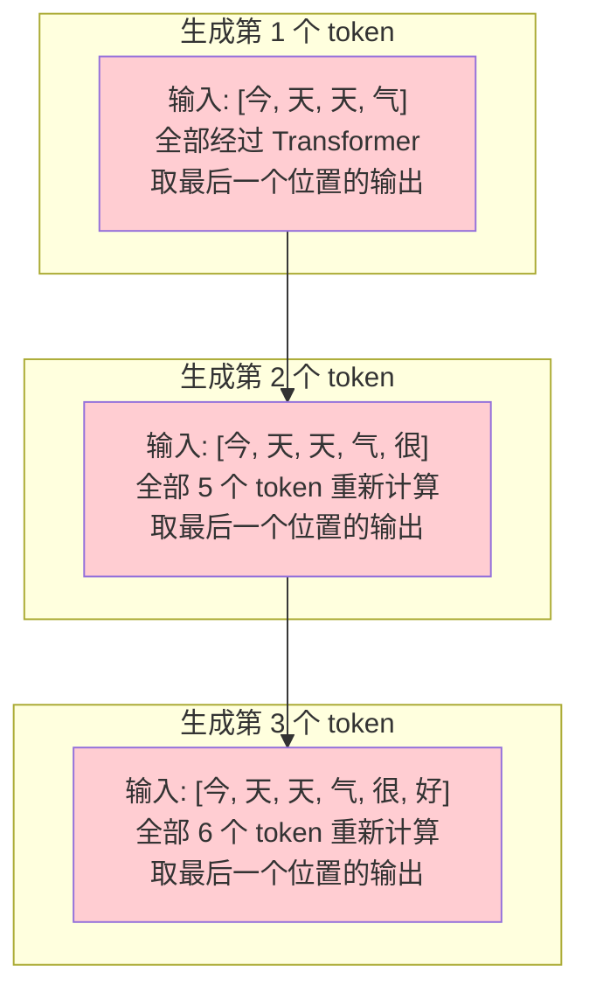

**问题**：
- 第 N 步需要对 N 个 token 全部做 Attention → 计算量 O(N²)
- 总生成 T 个 token 的计算量：O(T × N²) → O(T³) 对于 N≈T
- 前面的 token 被反复重新计算，极其浪费

---

## 5.4 KV Cache：核心原理

### 关键洞察

在 Causal Attention 中，token_i 的 K 和 V **只取决于 token_i 自身和它之前的 token**。一旦计算过，就不会改变。

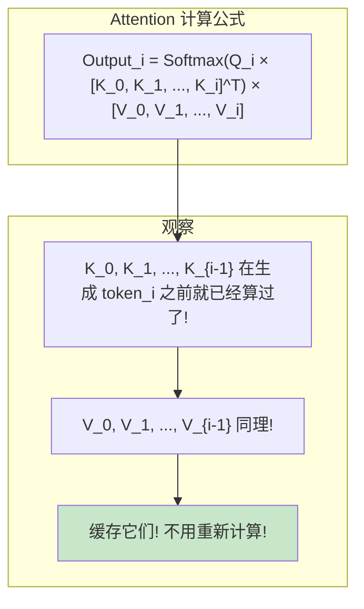

### 有 KV Cache 的推理

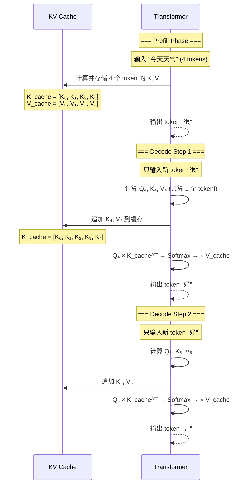

### 对比：有无 KV Cache

| | 无 KV Cache | 有 KV Cache |
|--|------------|------------|
| 每步输入 | 所有历史 token | 只有 1 个新 token |
| 每步计算 Q | 所有 token 的 Q | 只有新 token 的 Q |
| 每步计算 K, V | 所有 token 的 K, V | 只有新 token 的 K, V |
| Attention 计算 | [N, N] 矩阵乘法 | [1, N] 向量乘矩阵 |
| 每步复杂度 | O(N² × d) | O(N × d) |
| 生成 T 个 token | O(T³ × d) | O(T² × d) |
| 额外显存 | 无 | KV Cache（可能很大） |

> **KV Cache 用空间换时间**：缓存已计算的 K、V，避免重复计算。

---

## 5.5 KV Cache 大小计算

### 公式

```
KV Cache Size = 2 × num_layers × num_kv_heads × head_dim × seq_len × batch_size × dtype_bytes
                ^       ^              ^            ^          ^         ^           ^
                K和V   层数      KV头数(GQA)    头维度     序列长度    并发请求数   数据类型
```

### 实际计算示例

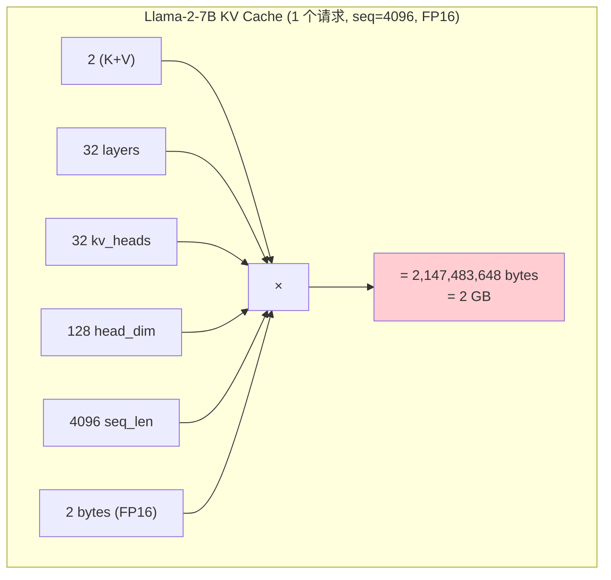

### 各模型 KV Cache 对比

| 模型 | 层数 | KV heads | head_dim | 每 token KV (FP16) | seq=4096 |
|------|------|----------|----------|-------------------|----------|
| Llama-2-7B | 32 | 32 | 128 | 512 KB | **2 GB** |
| Llama-2-13B | 40 | 40 | 128 | 800 KB | **3.2 GB** |
| Llama-2-70B (GQA) | 80 | 8 | 128 | 320 KB | **1.28 GB** |
| Llama-3-8B (GQA) | 32 | 8 | 128 | 128 KB | **512 MB** |
| Llama-3-70B (GQA) | 80 | 8 | 128 | 320 KB | **1.28 GB** |

> 注意 Llama-2-70B 用了 GQA（8 个 KV heads 而不是 64），KV Cache 反而比 13B 小。

### Batch 影响

```
10 个并发请求，每个 seq=4096:
Llama-2-7B: 2 GB × 10 = 20 GB  (仅 KV Cache!)
加上模型本身 14 GB → 总共 34 GB

这就是为什么一张 80GB A100 可能只能同时服务很少请求。
```

---

## 5.6 Prefill 与 Decode 的性能特征

### Prefill 阶段

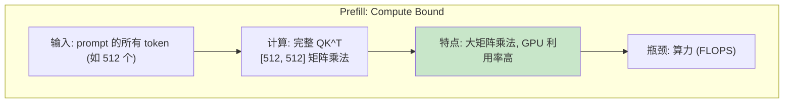

### Decode 阶段

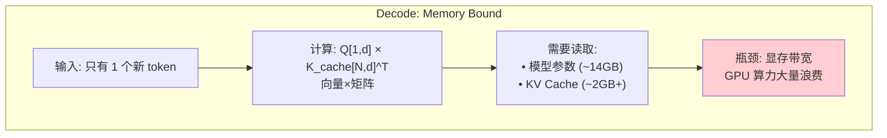

### 为什么 Decode 是 Memory Bound？

```
Decode 一个 token 需要:
- 读取全部模型参数: 14 GB
- 读取 KV Cache: 2+ GB
- 总计读取: ~16 GB

实际计算量: 很少 (向量×矩阵, 不是矩阵×矩阵)

A100 带宽: 2 TB/s
纯读取时间: 16 GB / 2 TB/s = 8 ms

A100 算力: 312 TFLOPS
理论计算时间: ~0.1 ms

→ 99% 的时间在等数据从显存搬到计算单元!
```

### 性能指标

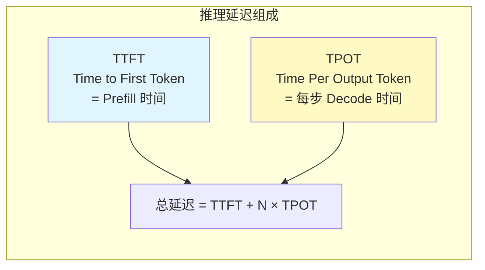

---

## 5.7 Batching 的作用

### 为什么 Batching 能提升吞吐？

Decode 是 Memory Bound → GPU 算力浪费。如果同时处理多个请求，**读一次参数，算多个请求**：

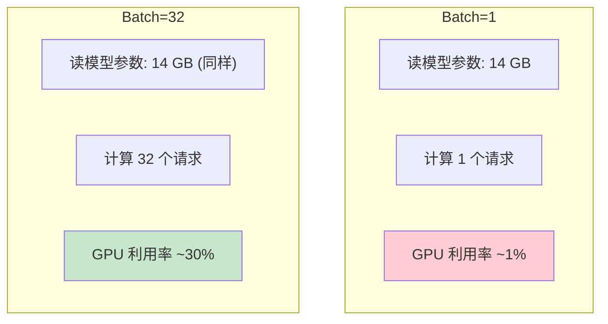

**关键认知**：Batch 增大不增加参数读取量，只增加 KV Cache 读取量和少量计算。

### Batching 的限制

```
Batch 增大 → KV Cache 增大 → 显存不够!

假设 Llama-2-7B:
- 模型: 14 GB
- Batch=1, seq=4096: KV Cache = 2 GB → 总 16 GB ✓
- Batch=16, seq=4096: KV Cache = 32 GB → 总 46 GB ✓
- Batch=32, seq=4096: KV Cache = 64 GB → 总 78 GB → 刚好塞满 80GB A100
- Batch=64: KV Cache = 128 GB → OOM! ✗
```

> 这就是为什么 KV Cache 管理（PagedAttention）如此重要 → 模块 6 详解。

---

## 5.8 KV Cache 的实现细节

### 数据结构

```python
# KV Cache 的基本结构（简化）
class KVCache:
    def __init__(self, num_layers, num_heads, head_dim, max_seq_len, dtype):
        # 预分配连续显存
        self.k_cache = torch.zeros(
            num_layers, max_seq_len, num_heads, head_dim, dtype=dtype, device='cuda'
        )
        self.v_cache = torch.zeros(
            num_layers, max_seq_len, num_heads, head_dim, dtype=dtype, device='cuda'
        )
        self.seq_len = 0  # 当前已填充的长度

    def append(self, layer_idx, new_k, new_v):
        """追加新 token 的 K, V"""
        self.k_cache[layer_idx, self.seq_len] = new_k
        self.v_cache[layer_idx, self.seq_len] = new_v
        self.seq_len += 1

    def get(self, layer_idx):
        """获取当前层的完整 KV"""
        return (
            self.k_cache[layer_idx, :self.seq_len],
            self.v_cache[layer_idx, :self.seq_len]
        )
```

### 预分配 vs 动态分配

| 方式 | 优点 | 缺点 |
|------|------|------|
| 预分配 max_seq_len | 简单，无碎片 | 浪费显存（大部分请求用不满） |
| 动态分配 | 不浪费 | 碎片化严重，性能差 |
| PagedAttention | 按需分配，无碎片 | 实现复杂 → 模块 6 |

---

## 5.9 完整推理流程

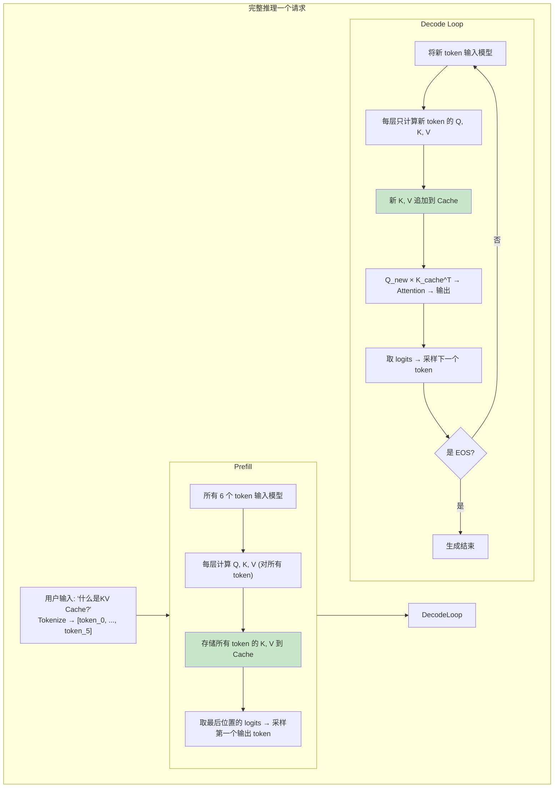

---

## 实践练习

### 练习 1：手写带 KV Cache 的推理

```python
import torch
import torch.nn.functional as F

class SimpleAttentionWithKVCache:
    """手写一个带 KV Cache 的单层单头 Attention"""

    def __init__(self, hidden_dim, head_dim):
        self.W_q = torch.randn(hidden_dim, head_dim) * 0.02
        self.W_k = torch.randn(hidden_dim, head_dim) * 0.02
        self.W_v = torch.randn(hidden_dim, head_dim) * 0.02

        # KV Cache
        self.k_cache = []  # 列表存储每个位置的 K
        self.v_cache = []

    def reset_cache(self):
        self.k_cache = []
        self.v_cache = []

    def forward_prefill(self, x):
        """
        Prefill: 一次性处理所有 prompt token
        x: [seq_len, hidden_dim]
        """
        Q = x @ self.W_q  # [seq_len, head_dim]
        K = x @ self.W_k
        V = x @ self.W_v

        # 存入 cache
        self.k_cache = [K[i] for i in range(K.shape[0])]
        self.v_cache = [V[i] for i in range(V.shape[0])]

        # 计算 causal attention
        seq_len = Q.shape[0]
        head_dim = Q.shape[1]
        scores = Q @ K.T / (head_dim ** 0.5)
        mask = torch.triu(torch.ones(seq_len, seq_len), diagonal=1).bool()
        scores.masked_fill_(mask, float('-inf'))
        attn = F.softmax(scores, dim=-1)
        output = attn @ V  # [seq_len, head_dim]

        return output

    def forward_decode(self, x_new):
        """
        Decode: 每次只处理 1 个新 token
        x_new: [1, hidden_dim] — 只有一个新 token
        """
        # 只计算新 token 的 Q, K, V
        q_new = x_new @ self.W_q  # [1, head_dim]
        k_new = x_new @ self.W_k  # [1, head_dim]
        v_new = x_new @ self.W_v  # [1, head_dim]

        # 追加到 cache
        self.k_cache.append(k_new.squeeze(0))
        self.v_cache.append(v_new.squeeze(0))

        # 用缓存的 K, V 计算 attention
        K_full = torch.stack(self.k_cache)  # [current_len, head_dim]
        V_full = torch.stack(self.v_cache)  # [current_len, head_dim]

        head_dim = q_new.shape[1]
        scores = q_new @ K_full.T / (head_dim ** 0.5)  # [1, current_len]
        attn = F.softmax(scores, dim=-1)
        output = attn @ V_full  # [1, head_dim]

        return output


# 测试
torch.manual_seed(42)
hidden_dim, head_dim = 64, 16

attn = SimpleAttentionWithKVCache(hidden_dim, head_dim)

# 模拟 prompt: 4 个 token
prompt = torch.randn(4, hidden_dim)

# Prefill
print("=== Prefill ===")
prefill_out = attn.forward_prefill(prompt)
print(f"Prefill 输出 shape: {prefill_out.shape}")  # [4, 16]
print(f"KV Cache 长度: {len(attn.k_cache)}")  # 4

# Decode: 逐个生成 3 个 token
print("\n=== Decode ===")
for i in range(3):
    new_token = torch.randn(1, hidden_dim)  # 模拟新 token 的 embedding
    decode_out = attn.forward_decode(new_token)
    print(f"Decode step {i+1}: output shape = {decode_out.shape}, cache len = {len(attn.k_cache)}")

print(f"\n最终 KV Cache 长度: {len(attn.k_cache)}")  # 4 + 3 = 7
```

### 练习 2：对比有无 KV Cache 的性能

```python
import torch
import torch.nn.functional as F
import time

def attention_no_cache(X, W_q, W_k, W_v):
    """无缓存: 每次重新计算所有 token 的 KV"""
    Q = X @ W_q
    K = X @ W_k
    V = X @ W_v
    seq_len = Q.shape[0]
    scores = Q @ K.T / (Q.shape[-1] ** 0.5)
    mask = torch.triu(torch.ones(seq_len, seq_len, device=X.device), diagonal=1).bool()
    scores.masked_fill_(mask, float('-inf'))
    return F.softmax(scores, dim=-1) @ V

def attention_with_cache(x_new, k_cache, v_cache, W_q, W_k, W_v):
    """有缓存: 只计算新 token, 用缓存的 KV"""
    q = x_new @ W_q  # [1, head_dim]
    k = x_new @ W_k
    v = x_new @ W_v
    k_cache = torch.cat([k_cache, k], dim=0)
    v_cache = torch.cat([v_cache, v], dim=0)
    scores = q @ k_cache.T / (q.shape[-1] ** 0.5)
    attn = F.softmax(scores, dim=-1)
    output = attn @ v_cache
    return output, k_cache, v_cache

# 性能对比
device = 'cuda' if torch.cuda.is_available() else 'cpu'
hidden_dim, head_dim = 4096, 128
seq_len = 512

W_q = torch.randn(hidden_dim, head_dim, device=device) * 0.02
W_k = torch.randn(hidden_dim, head_dim, device=device) * 0.02
W_v = torch.randn(hidden_dim, head_dim, device=device) * 0.02

# 方法 1: 无 KV Cache — 每步重新计算
print("=== 无 KV Cache ===")
X = torch.randn(seq_len, hidden_dim, device=device)

if device == 'cuda':
    torch.cuda.synchronize()
start = time.time()
for step in range(32):
    new_token = torch.randn(1, hidden_dim, device=device)
    X = torch.cat([X, new_token], dim=0)
    out = attention_no_cache(X, W_q, W_k, W_v)
if device == 'cuda':
    torch.cuda.synchronize()
no_cache_time = time.time() - start
print(f"32 步总时间: {no_cache_time*1000:.1f} ms")

# 方法 2: 有 KV Cache
print("\n=== 有 KV Cache ===")
X = torch.randn(seq_len, hidden_dim, device=device)
# 初始化 cache (模拟 prefill)
k_cache = X @ W_k
v_cache = X @ W_v

if device == 'cuda':
    torch.cuda.synchronize()
start = time.time()
for step in range(32):
    new_token = torch.randn(1, hidden_dim, device=device)
    out, k_cache, v_cache = attention_with_cache(new_token, k_cache, v_cache, W_q, W_k, W_v)
if device == 'cuda':
    torch.cuda.synchronize()
cache_time = time.time() - start
print(f"32 步总时间: {cache_time*1000:.1f} ms")

print(f"\n加速比: {no_cache_time/cache_time:.1f}x")
```

**预期结果**：有 KV Cache 比无 Cache 快 5-20 倍（seq_len 越长差距越大）。

### 练习 3：KV Cache 大小计算器

```python
def kv_cache_size(
    num_layers: int,
    num_kv_heads: int,
    head_dim: int,
    seq_len: int,
    batch_size: int = 1,
    dtype_bytes: int = 2,  # FP16
) -> dict:
    """计算 KV Cache 大小"""
    per_token_per_layer = 2 * num_kv_heads * head_dim * dtype_bytes
    per_token_all_layers = per_token_per_layer * num_layers
    total = per_token_all_layers * seq_len * batch_size

    return {
        "per_token_per_layer": per_token_per_layer,
        "per_token_all_layers": per_token_all_layers,
        "total_bytes": total,
        "total_mb": total / 1024**2,
        "total_gb": total / 1024**3,
    }

# 各模型对比
models = {
    "Llama-2-7B (MHA)":   {"num_layers": 32, "num_kv_heads": 32, "head_dim": 128},
    "Llama-2-13B (MHA)":  {"num_layers": 40, "num_kv_heads": 40, "head_dim": 128},
    "Llama-2-70B (GQA)":  {"num_layers": 80, "num_kv_heads": 8,  "head_dim": 128},
    "Llama-3-8B (GQA)":   {"num_layers": 32, "num_kv_heads": 8,  "head_dim": 128},
    "Llama-3-70B (GQA)":  {"num_layers": 80, "num_kv_heads": 8,  "head_dim": 128},
    "Llama-3-405B (GQA)": {"num_layers": 126, "num_kv_heads": 8, "head_dim": 128},
}

print(f"{'模型':<22} {'每token':>10} {'seq=2K':>10} {'seq=8K':>10} {'seq=32K':>10} {'seq=128K':>10}")
print("-" * 75)
for name, cfg in models.items():
    pt = kv_cache_size(**cfg, seq_len=1)['per_token_all_layers']
    s2k = kv_cache_size(**cfg, seq_len=2048)['total_mb']
    s8k = kv_cache_size(**cfg, seq_len=8192)['total_mb']
    s32k = kv_cache_size(**cfg, seq_len=32768)['total_gb']
    s128k = kv_cache_size(**cfg, seq_len=131072)['total_gb']
    print(f"{name:<22} {pt:>8} B {s2k:>8.0f} MB {s8k:>8.0f} MB {s32k:>8.1f} GB {s128k:>8.1f} GB")

# Batch 影响
print(f"\n\n=== Llama-2-7B, seq=4096, 不同 batch_size ===")
for batch in [1, 4, 8, 16, 32, 64]:
    info = kv_cache_size(32, 32, 128, 4096, batch)
    model_size = 14  # GB, FP16
    total = model_size + info['total_gb']
    fits = "✓" if total < 80 else "✗ OOM"
    print(f"  batch={batch:3d}: KV Cache = {info['total_gb']:.1f} GB, "
          f"总显存 = {total:.1f} GB  {fits}")
```

### 练习 4：用 Hugging Face 实际观察 KV Cache

```python
from transformers import AutoModelForCausalLM, AutoTokenizer
import torch

# 用小模型演示 (GPT-2 或其他小模型)
model_name = "gpt2"  # 124M 参数，可在 CPU 运行
tokenizer = AutoTokenizer.from_pretrained(model_name)
model = AutoModelForCausalLM.from_pretrained(model_name)
model.eval()

prompt = "The meaning of life is"
inputs = tokenizer(prompt, return_tensors="pt")

# 不用 KV Cache 生成
print("=== 不使用 KV Cache ===")
with torch.no_grad():
    outputs_no_cache = model.generate(
        **inputs,
        max_new_tokens=20,
        use_cache=False,
        do_sample=False,
    )
print(tokenizer.decode(outputs_no_cache[0]))

# 使用 KV Cache 生成
print("\n=== 使用 KV Cache ===")
with torch.no_grad():
    outputs_cache = model.generate(
        **inputs,
        max_new_tokens=20,
        use_cache=True,
        do_sample=False,
    )
print(tokenizer.decode(outputs_cache[0]))

# 观察 KV Cache 结构
print("\n=== KV Cache 结构观察 ===")
with torch.no_grad():
    outputs = model(**inputs, use_cache=True)
    past_kv = outputs.past_key_values

print(f"层数: {len(past_kv)}")
print(f"每层 KV 元组长度: {len(past_kv[0])}")  # 2 (K, V)
print(f"K shape: {past_kv[0][0].shape}")  # [batch, num_heads, seq_len, head_dim]
print(f"V shape: {past_kv[0][1].shape}")

# 计算 KV Cache 总大小
total_cache_bytes = sum(
    k.numel() * k.element_size() + v.numel() * v.element_size()
    for k, v in past_kv
)
print(f"\nKV Cache 总大小: {total_cache_bytes / 1024:.1f} KB")
print(f"每 token 每层: {total_cache_bytes / len(past_kv) / past_kv[0][0].shape[2]:.0f} bytes")
```

### 练习 5：计时 Prefill vs Decode

```python
import torch
import time
from transformers import AutoModelForCausalLM, AutoTokenizer

# 如果有 GPU，用更大的模型
device = "cuda" if torch.cuda.is_available() else "cpu"
model_name = "gpt2"  # CPU 可用; GPU 可换成更大模型

tokenizer = AutoTokenizer.from_pretrained(model_name)
model = AutoModelForCausalLM.from_pretrained(model_name).to(device)
model.eval()

# 不同长度的 prompt
prompt_lengths = [32, 64, 128, 256, 512]
num_decode_steps = 20

print(f"{'Prompt 长度':<12} {'Prefill 时间':>12} {'Decode/token':>14} {'Prefill token/s':>16}")
print("-" * 60)

for prompt_len in prompt_lengths:
    # 生成指定长度的 prompt
    prompt_ids = torch.randint(0, 50257, (1, prompt_len), device=device)

    # 计时 Prefill
    if device == 'cuda':
        torch.cuda.synchronize()
    start = time.time()
    with torch.no_grad():
        outputs = model(prompt_ids, use_cache=True)
        past_kv = outputs.past_key_values
    if device == 'cuda':
        torch.cuda.synchronize()
    prefill_time = time.time() - start

    # 计时 Decode
    next_token = outputs.logits[:, -1, :].argmax(dim=-1, keepdim=True)
    if device == 'cuda':
        torch.cuda.synchronize()
    start = time.time()
    for _ in range(num_decode_steps):
        with torch.no_grad():
            outputs = model(next_token, past_key_values=past_kv, use_cache=True)
            past_kv = outputs.past_key_values
            next_token = outputs.logits[:, -1, :].argmax(dim=-1, keepdim=True)
    if device == 'cuda':
        torch.cuda.synchronize()
    decode_time = time.time() - start
    decode_per_token = decode_time / num_decode_steps

    prefill_tps = prompt_len / prefill_time

    print(f"{prompt_len:<12} {prefill_time*1000:>10.1f} ms {decode_per_token*1000:>12.2f} ms {prefill_tps:>14.0f}")

print("\n观察: Prefill 的 token/s 远高于 Decode (因为并行 vs 串行)")
```

---

## 自测清单

- [ ] 推理的 Prefill 和 Decode 阶段有什么区别？
- [ ] 为什么 Decode 是 Memory Bound 的？
- [ ] KV Cache 缓存了什么？为什么可以缓存？
- [ ] 不用 KV Cache 的推理复杂度是多少？用了之后呢？
- [ ] 给定一个模型配置，能手算 KV Cache 大小
- [ ] GQA 如何减少 KV Cache 大小？
- [ ] 为什么 Batching 能提升推理吞吐？上限是什么？
- [ ] TTFT 和 TPOT 分别对应哪个阶段？

---

## 延伸阅读

- [Efficient Inference on a Single GPU - HuggingFace](https://huggingface.co/docs/transformers/perf_infer_gpu_one)
- [The KV Cache: Memory Usage in Transformers](https://kipp.ly/transformer-inference-arithmetic/)
- [LLM Inference Performance Engineering](https://www.databricks.com/blog/llm-inference-performance-engineering-best-practices)
- [How to generate text: using different decoding methods](https://huggingface.co/blog/how-to-generate)
