# 模块6：推理优化技术

> 预计时间：5-7 天  
> 目标：掌握 PagedAttention、Continuous Batching、量化、FlashAttention 等核心推理优化技术  
> 前置要求：完成模块 5（KV Cache）

---

## 6.1 推理优化全景

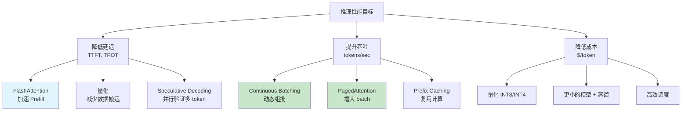

---

## 6.2 PagedAttention（vLLM 核心）

### 问题：KV Cache 的显存碎片

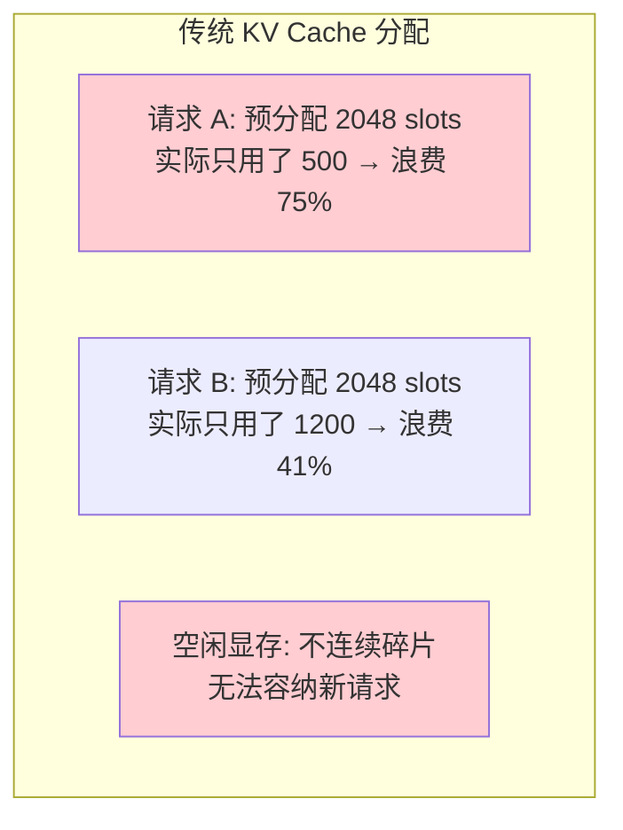

传统方式必须为每个请求预分配 max_seq_len 大小的连续显存，导致：
- 短请求大量浪费
- 碎片化严重
- 无法支持大 batch

### 解决方案：类比操作系统虚拟内存

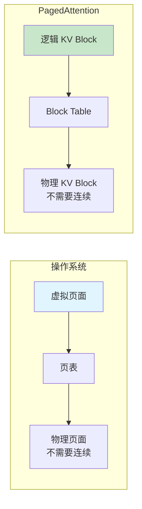

### 工作原理

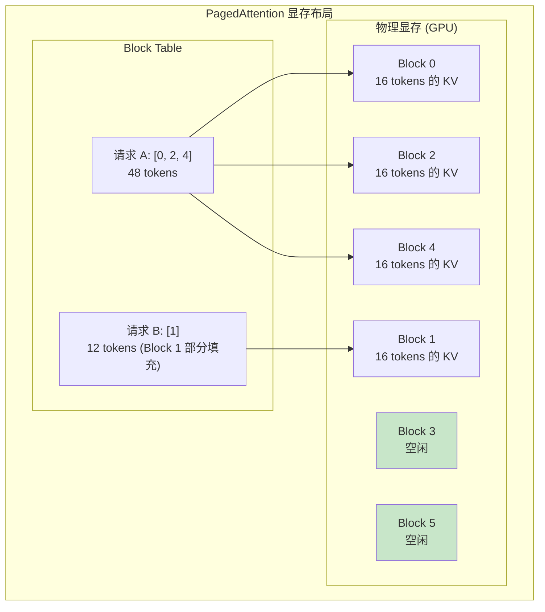

**核心机制**：
1. 将 KV Cache 切分为固定大小的 Block（如 16 tokens/block）
2. 每个请求维护一个 Block Table（逻辑块→物理块的映射）
3. 新 token 产生时，按需分配新 Block
4. 请求结束时释放 Block

### 优势

| 特性 | 传统方式 | PagedAttention |
|------|---------|---------------|
| 显存利用率 | ~50%（平均浪费） | ~96%+ |
| 最大 batch | 受限于碎片 | 显著增大 |
| 显存碎片 | 严重 | 几乎消除 |
| Copy-on-Write | 不支持 | 支持（共享前缀） |

---

## 6.3 Continuous Batching

### 问题：Static Batching 的浪费

```mermaid
gantt
    title Static Batching: 短请求等长请求
    dateFormat X
    axisFormat %s

    section 请求 A (短)
    生成 10 tokens    :a1, 0, 3
    等待（浪费GPU）    :crit, a2, 3, 10

    section 请求 B (长)
    生成 50 tokens    :b1, 0, 10

    section 请求 C (等待中)
    排队等待           :crit, c1, 0, 10
```

Static Batching：整个 batch 必须等最长的请求结束，短请求早就完成了还占着位置。

### 解决方案：Continuous Batching

```mermaid
gantt
    title Continuous Batching: 动态插入/移除
    dateFormat X
    axisFormat %s

    section 请求 A (短)
    生成 10 tokens    :a1, 0, 3

    section 请求 B (长)
    生成 50 tokens    :b1, 0, 10

    section 请求 C
    等待    :crit, c1, 0, 3
    生成 20 tokens :c2, 3, 7

    section 请求 D
    等待    :crit, d1, 0, 7
    生成 15 tokens :d2, 7, 10
```

**核心思想**：每一步 decode 都可以：
- 移除已完成的请求
- 插入新的请求（做 prefill 后加入 decode batch）

### 吞吐提升

Continuous Batching 相比 Static Batching 通常提升 **2-4×** 吞吐。

---

## 6.4 FlashAttention

### 问题：标准 Attention 的显存瓶颈

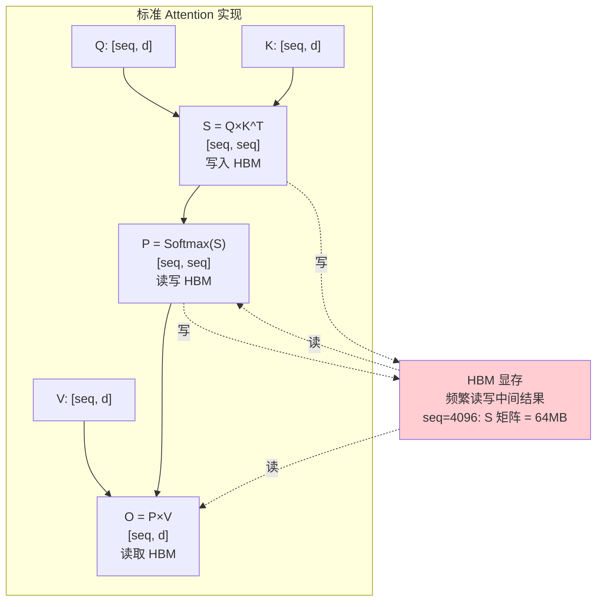

seq=4096 时，S 矩阵 = 4096² × 2 bytes = 32 MB，频繁读写 HBM 是瓶颈。

### FlashAttention 的解决方案

**核心思想**：分块计算，避免将完整的 [seq, seq] 矩阵写入 HBM。

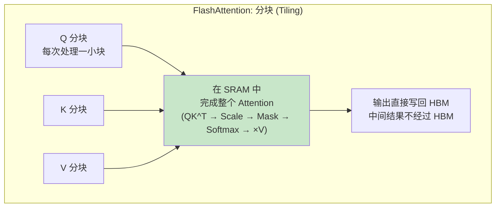

**效果**：
- 不需要存储 [seq, seq] 中间矩阵
- 显存从 O(N²) 降到 O(N)
- 速度提升 2-4×（减少 HBM 访问）

### FlashAttention 性能对比

| 实现 | 显存 | 速度 | 适用 |
|------|------|------|------|
| PyTorch 标准 | O(N²) | 基准 | 短序列 |
| FlashAttention-2 | O(N) | 2-3× 提升 | Prefill |
| FlashAttention-3 | O(N) | 1.5-2× on H100 | H100 优化 |

---

## 6.5 量化（Quantization）

### 什么是量化？

将模型参数从高精度（FP16）压缩为低精度（INT8/INT4），减少显存和带宽需求。

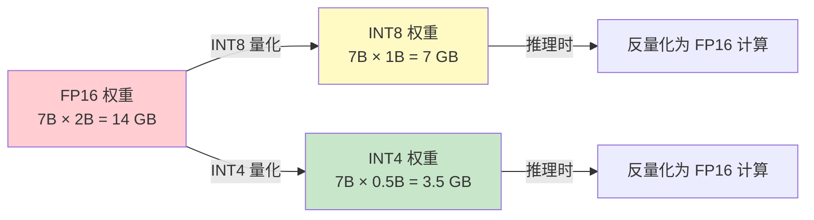

### 量化方式

| 方法 | 精度 | 速度 | 质量损失 | 代表 |
|------|------|------|---------|------|
| W8A8 | 权重 INT8, 激活 INT8 | 最快 | 小 | SmoothQuant |
| W8A16 | 权重 INT8, 激活 FP16 | 快 | 很小 | LLM.int8() |
| W4A16 | 权重 INT4, 激活 FP16 | 中等 | 中等 | GPTQ, AWQ |
| W4A4 | 全 4 bit | 快（特殊硬件） | 较大 | 研究中 |

### 为什么量化能加速推理？

```
Decode 是 Memory Bound:
- 主要时间花在从显存读取模型权重
- INT4 量化: 数据量减少 4×, 读取速度快 4×
- 理论 Decode 加速接近 4× (实际 2-3× 因为反量化开销)
```

### 常见量化工具

| 工具 | 方法 | 特点 |
|------|------|------|
| GPTQ | 逐层贪心量化 | INT4, 质量好，需要校准数据 |
| AWQ | 激活感知量化 | INT4, 保护重要通道 |
| bitsandbytes | 动态量化 | 即装即用，NF4 格式 |
| SmoothQuant | 激活平滑 + W8A8 | INT8，适合 batch 推理 |

---

## 6.6 Speculative Decoding（投机解码）

### 问题

Decode 每步只生成 1 个 token，但 GPU 算力大量闲置。

### 核心思想

用一个小模型（draft model）快速猜测多个 token，再用大模型一次性验证。

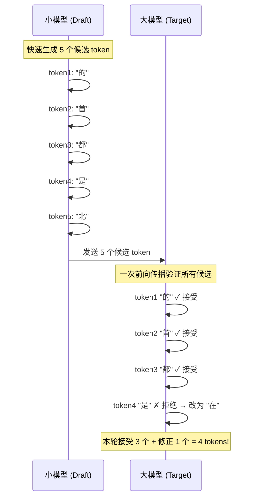

**效果**：
- 一次大模型前向传播产出多个 token
- 加速比取决于小模型的"猜中率"
- 通常加速 1.5-3×（不损失质量）

### 关键要求
- Draft model 必须远小于 target model（否则没有加速意义）
- Draft model 的接受率要高（通常 60-80%）
- 数学上保证输出分布与大模型完全一致

---

## 6.7 Prefix Caching

### 问题

许多请求共享相同的前缀（如 system prompt）：

```
请求 1: [system prompt] + "今天天气怎样?"
请求 2: [system prompt] + "帮我写代码"
请求 3: [system prompt] + "翻译这段话"
```

每个请求都重新计算 system prompt 的 KV 是浪费。

### 解决方案

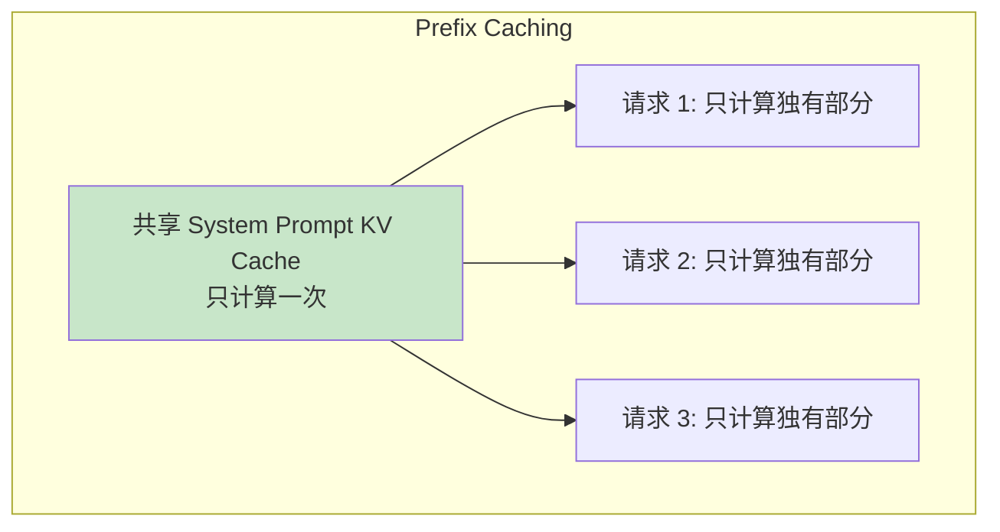

**效果**：
- System prompt 长度 2000 tokens → TTFT 大幅降低
- vLLM 的 Automatic Prefix Caching 自动检测共享前缀

---

## 6.8 Chunked Prefill

### 问题

长 prompt 的 Prefill 会阻塞 Decode，导致正在生成的请求延迟抖动。

### 解决方案

将 Prefill 拆分为多个 chunk，和 Decode 交替执行：

```mermaid
gantt
    title Chunked Prefill: Prefill 和 Decode 交替
    dateFormat X
    axisFormat %s

    section 新请求 Prefill
    Chunk 1 (512 tokens) :p1, 0, 2
    Chunk 2 (512 tokens) :p2, 3, 5
    Chunk 3 (512 tokens) :p3, 6, 8

    section 现有请求 Decode
    Decode batch :d1, 2, 3
    Decode batch :d2, 5, 6
    Decode batch :d3, 8, 9
```

**效果**：Decode 延迟更平稳，不会被长 Prefill 中断。

---

## 6.9 Disaggregated Serving（分离式推理）

### 思想

Prefill（Compute Bound）和 Decode（Memory Bound）对硬件的需求不同，分别部署。

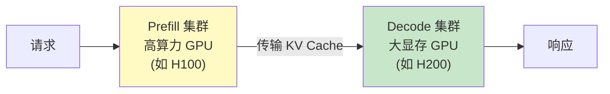

**优势**：
- Prefill GPU 算力可以充分利用
- Decode GPU 可以用更多显存放更大 batch
- 独立扩缩容

---

## 实践练习

### 练习 1：模拟 PagedAttention 的 Block 分配

```python
class PagedKVCacheSimulator:
    """模拟 PagedAttention 的 Block 分配"""

    def __init__(self, num_blocks: int, block_size: int = 16):
        self.block_size = block_size
        self.num_blocks = num_blocks
        self.free_blocks = list(range(num_blocks))
        self.block_tables = {}  # request_id -> list of block indices

    def allocate_request(self, request_id: str, num_tokens: int):
        """为新请求分配 blocks"""
        num_blocks_needed = (num_tokens + self.block_size - 1) // self.block_size
        if num_blocks_needed > len(self.free_blocks):
            return False  # OOM
        allocated = [self.free_blocks.pop(0) for _ in range(num_blocks_needed)]
        self.block_tables[request_id] = allocated
        return True

    def append_token(self, request_id: str):
        """添加一个新 token, 如果当前 block 满了就分配新 block"""
        blocks = self.block_tables[request_id]
        current_tokens = len(blocks) * self.block_size  # 简化: 假设已满
        # 实际中需要追踪每个 block 内的填充位置
        if len(self.free_blocks) == 0:
            return False
        # 如果需要新 block
        # (简化实现, 实际中检查最后一个 block 是否满)
        return True

    def free_request(self, request_id: str):
        """释放请求的所有 blocks"""
        if request_id in self.block_tables:
            blocks = self.block_tables.pop(request_id)
            self.free_blocks.extend(blocks)
            self.free_blocks.sort()

    def status(self):
        used = self.num_blocks - len(self.free_blocks)
        util = used / self.num_blocks * 100
        print(f"Block 使用: {used}/{self.num_blocks} ({util:.0f}%)")
        for req, blocks in self.block_tables.items():
            print(f"  {req}: blocks = {blocks}")

# 模拟
cache = PagedKVCacheSimulator(num_blocks=32, block_size=16)

print("=== 初始状态 ===")
cache.status()

print("\n=== 分配请求 ===")
cache.allocate_request("req_A", num_tokens=50)   # 需要 4 blocks
cache.allocate_request("req_B", num_tokens=120)  # 需要 8 blocks
cache.allocate_request("req_C", num_tokens=30)   # 需要 2 blocks
cache.status()

print("\n=== 释放请求 B ===")
cache.free_request("req_B")
cache.status()

print("\n=== 新请求 D (利用回收的 blocks) ===")
cache.allocate_request("req_D", num_tokens=100)  # 需要 7 blocks
cache.status()

# 碎片率分析
print(f"\n空闲 blocks: {cache.free_blocks}")
print("观察: blocks 不需要连续, 避免了碎片问题!")
```

### 练习 2：Continuous Batching 模拟

```python
import random

class ContinuousBatchingSimulator:
    """模拟 Continuous Batching 调度器"""

    def __init__(self, max_batch_size: int = 8):
        self.max_batch_size = max_batch_size
        self.active_requests = {}  # id -> remaining_tokens
        self.waiting_queue = []
        self.completed = []
        self.step = 0
        self.total_tokens_generated = 0

    def add_request(self, request_id: str, output_len: int):
        self.waiting_queue.append((request_id, output_len))

    def run_step(self):
        """执行一步 decode"""
        self.step += 1

        # 移除已完成的请求
        finished = [rid for rid, rem in self.active_requests.items() if rem <= 0]
        for rid in finished:
            self.active_requests.pop(rid)
            self.completed.append(rid)

        # 从等待队列填充到 batch
        while len(self.active_requests) < self.max_batch_size and self.waiting_queue:
            req_id, output_len = self.waiting_queue.pop(0)
            self.active_requests[req_id] = output_len

        # 所有活跃请求生成一个 token
        for rid in self.active_requests:
            self.active_requests[rid] -= 1
            self.total_tokens_generated += 1

    def is_done(self):
        return not self.active_requests and not self.waiting_queue

    def run(self):
        while not self.is_done():
            self.run_step()
            if self.step % 5 == 0 or self.is_done():
                active = len(self.active_requests)
                waiting = len(self.waiting_queue)
                done = len(self.completed)
                print(f"Step {self.step:3d}: active={active}, waiting={waiting}, "
                      f"completed={done}, GPU util={active/self.max_batch_size*100:.0f}%")

        print(f"\n=== 完成 ===")
        print(f"总步数: {self.step}")
        print(f"总 tokens: {self.total_tokens_generated}")
        print(f"平均吞吐: {self.total_tokens_generated/self.step:.1f} tokens/step")

# 对比 Static Batching vs Continuous Batching
print("=" * 60)
print("Continuous Batching")
print("=" * 60)
cb = ContinuousBatchingSimulator(max_batch_size=4)
# 模拟不同长度的请求
random.seed(42)
for i in range(12):
    cb.add_request(f"req_{i}", random.randint(5, 50))
cb.run()

print("\n" + "=" * 60)
print("Static Batching (模拟: 等最长完成才能换下一批)")
print("=" * 60)
# Static: batch=4, 等最长的完成
requests = [(f"req_{i}", random.randint(5, 50)) for i in range(12)]
random.seed(42)
requests = [(f"req_{i}", random.randint(5, 50)) for i in range(12)]
total_steps = 0
total_tokens = 0
for batch_start in range(0, 12, 4):
    batch = requests[batch_start:batch_start+4]
    max_len = max(length for _, length in batch)
    total_steps += max_len
    total_tokens += sum(length for _, length in batch)

print(f"总步数: {total_steps}")
print(f"总 tokens: {total_tokens}")
print(f"平均吞吐: {total_tokens/total_steps:.1f} tokens/step")
```

### 练习 3：量化效果体验

```python
import torch
import time

def measure_inference_speed(model, input_ids, num_steps=50):
    """测量推理速度"""
    model.eval()
    device = next(model.parameters()).device

    with torch.no_grad():
        # 预热
        outputs = model(input_ids, use_cache=True)
        past_kv = outputs.past_key_values
        next_token = outputs.logits[:, -1:].argmax(dim=-1)

        # 计时
        if device.type == 'cuda':
            torch.cuda.synchronize()
        start = time.time()
        for _ in range(num_steps):
            outputs = model(next_token, past_key_values=past_kv, use_cache=True)
            past_kv = outputs.past_key_values
            next_token = outputs.logits[:, -1:].argmax(dim=-1)
        if device.type == 'cuda':
            torch.cuda.synchronize()
        elapsed = time.time() - start

    tokens_per_sec = num_steps / elapsed
    return tokens_per_sec, elapsed

# 如果有 GPU，对比 FP16 vs INT8
if torch.cuda.is_available():
    from transformers import AutoModelForCausalLM, AutoTokenizer, BitsAndBytesConfig

    model_name = "facebook/opt-1.3b"  # 1.3B 模型，A100 可以跑

    # FP16
    print("加载 FP16 模型...")
    model_fp16 = AutoModelForCausalLM.from_pretrained(
        model_name, torch_dtype=torch.float16, device_map="cuda"
    )
    mem_fp16 = torch.cuda.memory_allocated() / 1024**3

    tokenizer = AutoTokenizer.from_pretrained(model_name)
    input_ids = tokenizer("Hello, my name is", return_tensors="pt").input_ids.cuda()

    tps_fp16, _ = measure_inference_speed(model_fp16, input_ids)
    print(f"FP16: {tps_fp16:.1f} tokens/s, 显存: {mem_fp16:.2f} GB")

    del model_fp16
    torch.cuda.empty_cache()

    # INT8
    print("\n加载 INT8 模型...")
    quantization_config = BitsAndBytesConfig(load_in_8bit=True)
    model_int8 = AutoModelForCausalLM.from_pretrained(
        model_name, quantization_config=quantization_config, device_map="cuda"
    )
    mem_int8 = torch.cuda.memory_allocated() / 1024**3

    tps_int8, _ = measure_inference_speed(model_int8, input_ids)
    print(f"INT8: {tps_int8:.1f} tokens/s, 显存: {mem_int8:.2f} GB")

    print(f"\n=== 对比 ===")
    print(f"显存节省: {(1-mem_int8/mem_fp16)*100:.0f}%")
    print(f"速度变化: {tps_int8/tps_fp16:.2f}x")
else:
    print("需要 GPU 来运行量化实验")
    print("你可以在 Colab 免费 GPU 上运行此代码")
```

### 练习 4：FlashAttention vs 标准 Attention 性能对比

```python
import torch
import time

def standard_attention(Q, K, V):
    """标准 Attention 实现"""
    d_k = Q.shape[-1]
    scores = torch.matmul(Q, K.transpose(-2, -1)) / (d_k ** 0.5)
    seq_len = Q.shape[-2]
    mask = torch.triu(torch.ones(seq_len, seq_len, device=Q.device), diagonal=1).bool()
    scores.masked_fill_(mask, float('-inf'))
    attn_weights = torch.softmax(scores, dim=-1)
    return torch.matmul(attn_weights, V)

def flash_attention(Q, K, V):
    """PyTorch 2.0 内置的 FlashAttention (SDPA)"""
    return torch.nn.functional.scaled_dot_product_attention(
        Q, K, V, is_causal=True
    )

if torch.cuda.is_available():
    device = 'cuda'
    batch, heads, head_dim = 2, 32, 128

    print(f"{'seq_len':<10} {'Standard':>12} {'Flash':>12} {'Speedup':>10} {'Mem Std':>10} {'Mem Flash':>10}")
    print("-" * 65)

    for seq_len in [512, 1024, 2048, 4096, 8192]:
        Q = torch.randn(batch, heads, seq_len, head_dim, device=device, dtype=torch.float16)
        K = torch.randn(batch, heads, seq_len, head_dim, device=device, dtype=torch.float16)
        V = torch.randn(batch, heads, seq_len, head_dim, device=device, dtype=torch.float16)

        # Standard
        torch.cuda.reset_peak_memory_stats()
        torch.cuda.synchronize()
        start = time.time()
        for _ in range(10):
            _ = standard_attention(Q, K, V)
        torch.cuda.synchronize()
        std_time = (time.time() - start) / 10
        std_mem = torch.cuda.max_memory_allocated() / 1024**2

        # Flash
        torch.cuda.reset_peak_memory_stats()
        torch.cuda.synchronize()
        start = time.time()
        for _ in range(10):
            _ = flash_attention(Q, K, V)
        torch.cuda.synchronize()
        flash_time = (time.time() - start) / 10
        flash_mem = torch.cuda.max_memory_allocated() / 1024**2

        speedup = std_time / flash_time
        print(f"{seq_len:<10} {std_time*1000:>10.2f}ms {flash_time*1000:>10.2f}ms "
              f"{speedup:>8.2f}x {std_mem:>8.0f}MB {flash_mem:>8.0f}MB")
else:
    print("需要 GPU 运行此实验")
```

**预期结果**：FlashAttention 越长序列加速越多（2-4×），显存节省非常显著。

---

## 自测清单

- [ ] PagedAttention 解决了什么问题？类比操作系统什么概念？
- [ ] Continuous Batching 比 Static Batching 好在哪里？
- [ ] FlashAttention 的核心思想是什么？它优化了什么瓶颈？
- [ ] INT4 量化为什么能加速推理？加速上限是多少？
- [ ] Speculative Decoding 的基本流程是什么？
- [ ] Prefix Caching 适用于什么场景？
- [ ] Chunked Prefill 解决什么问题？
- [ ] Disaggregated Serving 为什么要分离 Prefill 和 Decode？

---

## 延伸阅读

- [vLLM: PagedAttention 论文](https://arxiv.org/abs/2309.06180)
- [FlashAttention 论文](https://arxiv.org/abs/2205.14135)
- [FlashAttention-2 论文](https://arxiv.org/abs/2307.08691)
- [Speculative Decoding 论文](https://arxiv.org/abs/2211.17192)
- [AWQ: Activation-aware Weight Quantization](https://arxiv.org/abs/2306.00978)
- [Continuous Batching - Anyscale Blog](https://www.anyscale.com/blog/continuous-batching-llm-inference)
