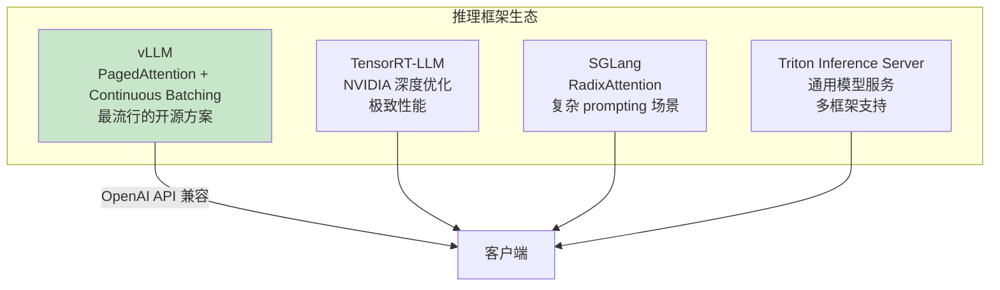
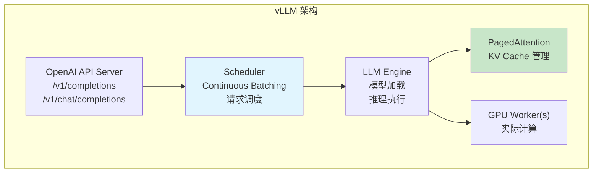
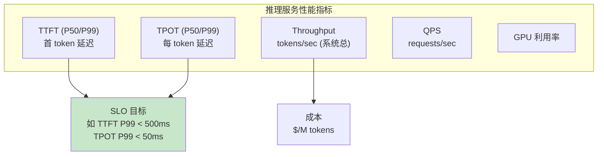

# 模块7：推理框架实战

> 预计时间：3-4 天  
> 目标：掌握 vLLM 的部署和使用，了解其他推理框架的特点与选型  
> 前置要求：完成模块 5-6（推理原理和优化）

---

## 7.1 推理框架概览



### 选型对比

| 框架 | 优势 | 劣势 | 适合场景 |
|------|------|------|---------|
| **vLLM** | 易用、社区活跃、功能全面 | 性能不是绝对最优 | 通用 LLM 服务（推荐入门） |
| **TensorRT-LLM** | NVIDIA 深度优化、低延迟 | 部署复杂、NVIDIA 锁定 | 生产环境极致性能 |
| **SGLang** | 结构化生成快、Prefix Caching 强 | 相对较新 | 复杂 prompt/agent 场景 |
| **Triton Server** | 多模型、多框架统一管理 | LLM 特有优化少 | 企业级多模型平台 |

---

## 7.2 vLLM 深入

### 架构



### 核心特性

- **PagedAttention**：高效 KV Cache 管理
- **Continuous Batching**：动态批处理
- **Tensor Parallelism**：多卡推理
- **Prefix Caching**：自动共享前缀
- **Chunked Prefill**：平滑延迟
- **Speculative Decoding**：加速生成
- **量化支持**：GPTQ、AWQ、FP8
- **OpenAI 兼容 API**：无缝替换

---

## 7.3 vLLM 基础使用

### 安装

```bash
pip install vllm
```

### 离线推理（Offline Inference）

```python
from vllm import LLM, SamplingParams

# 加载模型
llm = LLM(
    model="meta-llama/Llama-2-7b-chat-hf",
    dtype="float16",           # 或 "auto"
    gpu_memory_utilization=0.9, # 显存利用率
)

# 采样参数
sampling_params = SamplingParams(
    temperature=0.7,
    top_p=0.9,
    max_tokens=256,
)

# 批量推理
prompts = [
    "What is machine learning?",
    "Explain KV cache in simple terms.",
    "Write a Python hello world.",
]

outputs = llm.generate(prompts, sampling_params)

for output in outputs:
    print(f"Prompt: {output.prompt[:50]}...")
    print(f"Output: {output.outputs[0].text[:100]}...")
    print(f"Tokens: {len(output.outputs[0].token_ids)}")
    print()
```

### 在线服务（Online Serving）

```bash
# 启动 OpenAI 兼容的 API 服务
vllm serve meta-llama/Llama-2-7b-chat-hf \
    --port 8000 \
    --dtype float16 \
    --gpu-memory-utilization 0.9

# 测试请求
curl http://localhost:8000/v1/completions \
    -H "Content-Type: application/json" \
    -d '{
        "model": "meta-llama/Llama-2-7b-chat-hf",
        "prompt": "Hello, how are you?",
        "max_tokens": 100,
        "temperature": 0.7
    }'
```

### Python 客户端

```python
from openai import OpenAI

client = OpenAI(
    base_url="http://localhost:8000/v1",
    api_key="not-needed",
)

response = client.chat.completions.create(
    model="meta-llama/Llama-2-7b-chat-hf",
    messages=[
        {"role": "system", "content": "You are a helpful assistant."},
        {"role": "user", "content": "What is KV cache?"},
    ],
    max_tokens=200,
    temperature=0.7,
)
print(response.choices[0].message.content)
```

---

## 7.4 vLLM 高级配置

### 多卡推理（Tensor Parallelism）

```bash
# 2 卡张量并行
vllm serve meta-llama/Llama-2-70b-chat-hf \
    --tensor-parallel-size 2 \
    --dtype float16

# 4 卡
vllm serve meta-llama/Llama-2-70b-chat-hf \
    --tensor-parallel-size 4
```

### 量化模型

```bash
# AWQ 量化模型
vllm serve TheBloke/Llama-2-7B-Chat-AWQ \
    --quantization awq \
    --dtype float16

# GPTQ 量化模型
vllm serve TheBloke/Llama-2-7B-Chat-GPTQ \
    --quantization gptq
```

### 性能调优参数

```bash
vllm serve meta-llama/Llama-2-7b-chat-hf \
    --gpu-memory-utilization 0.95 \        # 显存利用率
    --max-model-len 4096 \                 # 最大序列长度
    --max-num-seqs 128 \                   # 最大并发请求数
    --enable-prefix-caching \              # 启用前缀缓存
    --enable-chunked-prefill \             # 启用分块预填充
    --speculative-model tiny-llama \       # 投机解码
    --num-speculative-tokens 5
```

### 关键配置解释

| 参数 | 作用 | 建议值 |
|------|------|--------|
| `gpu-memory-utilization` | KV Cache 可用显存比例 | 0.9-0.95 |
| `max-model-len` | 支持的最大序列长度 | 按需设置 |
| `max-num-seqs` | 最大同时处理的请求数 | 越大吞吐越高，受限于显存 |
| `enforce-eager` | 禁用 CUDA Graph | 调试用，生产关闭 |
| `enable-prefix-caching` | 共享前缀复用 | 有 system prompt 时开启 |

---

## 7.5 性能基准测试

### 使用 vLLM benchmark 工具

```bash
# 安装 benchmark 工具
pip install vllm[benchmark]

# 吞吐测试
python -m vllm.entrypoints.openai.api_server \
    --model meta-llama/Llama-2-7b-chat-hf &

# 跑 benchmark
python -m vllm.benchmark_serving \
    --backend vllm \
    --model meta-llama/Llama-2-7b-chat-hf \
    --num-prompts 100 \
    --request-rate 10
```

### 关键性能指标



---

## 7.6 TensorRT-LLM 简介

### 核心优势

- NVIDIA 深度优化的 kernel
- 支持 FP8（H100 专属加速）
- In-flight Batching（等同 Continuous Batching）
- Paged KV Cache

### 基本使用

```bash
# 安装
pip install tensorrt-llm

# 转换模型
python convert_checkpoint.py \
    --model_dir ./llama-2-7b \
    --output_dir ./llama-2-7b-trt \
    --dtype float16

# 构建引擎
trtllm-build \
    --checkpoint_dir ./llama-2-7b-trt \
    --output_dir ./engine \
    --gemm_plugin float16 \
    --max_batch_size 32 \
    --max_input_len 2048 \
    --max_output_len 1024

# 运行
python run.py --engine_dir ./engine --tokenizer_dir ./llama-2-7b
```

### 与 vLLM 对比

| 维度 | vLLM | TensorRT-LLM |
|------|------|-------------|
| 易用性 | ⭐⭐⭐⭐⭐ | ⭐⭐⭐ |
| 性能 | ⭐⭐⭐⭐ | ⭐⭐⭐⭐⭐ |
| 模型支持 | 广泛 | 主流模型 |
| 社区 | 活跃开源 | NVIDIA 主导 |
| 部署复杂度 | 低 | 中高 |

---

## 7.7 SGLang 简介

### 核心特性

- **RadixAttention**：基于 Radix Tree 的高效 Prefix Caching
- **结构化生成加速**：JSON Schema、正则约束
- **编程式接口**：用 Python 编排复杂 prompting

```python
# SGLang 编程式推理
import sglang as sgl

@sgl.function
def multi_turn_chat(s, question1, question2):
    s += sgl.system("You are a helpful assistant.")
    s += sgl.user(question1)
    s += sgl.assistant(sgl.gen("answer1", max_tokens=100))
    s += sgl.user(question2)
    s += sgl.assistant(sgl.gen("answer2", max_tokens=100))

# RadixAttention 自动复用共享前缀
result = multi_turn_chat.run(
    question1="What is AI?",
    question2="Can you explain more?"
)
```

---

## 实践练习

### 练习 1：部署 vLLM 并测试

```bash
# 如果没有大 GPU，可以用小模型
# Option A: 有 GPU (>= 16GB)
vllm serve facebook/opt-1.3b --port 8000 --dtype float16

# Option B: 使用量化小模型
vllm serve TheBloke/Llama-2-7B-Chat-AWQ --quantization awq --port 8000
```

```python
# 测试脚本 test_vllm.py
import requests
import time

BASE_URL = "http://localhost:8000/v1"

def test_single_request():
    """单请求测试"""
    start = time.time()
    response = requests.post(f"{BASE_URL}/completions", json={
        "model": "facebook/opt-1.3b",
        "prompt": "The future of AI is",
        "max_tokens": 50,
        "temperature": 0.7,
    })
    elapsed = time.time() - start
    result = response.json()
    text = result['choices'][0]['text']
    tokens = result['usage']['completion_tokens']
    print(f"延迟: {elapsed*1000:.0f}ms, Tokens: {tokens}, TPS: {tokens/elapsed:.1f}")
    print(f"输出: {text[:100]}")

def test_concurrent(num_requests=10):
    """并发测试"""
    import concurrent.futures

    prompts = [f"Tell me about topic {i}" for i in range(num_requests)]

    start = time.time()
    with concurrent.futures.ThreadPoolExecutor(max_workers=num_requests) as executor:
        futures = []
        for prompt in prompts:
            future = executor.submit(requests.post, f"{BASE_URL}/completions", json={
                "model": "facebook/opt-1.3b",
                "prompt": prompt,
                "max_tokens": 50,
            })
            futures.append(future)
        results = [f.result() for f in futures]
    elapsed = time.time() - start

    total_tokens = sum(r.json()['usage']['completion_tokens'] for r in results)
    print(f"\n并发 {num_requests} 请求:")
    print(f"  总时间: {elapsed*1000:.0f} ms")
    print(f"  总 tokens: {total_tokens}")
    print(f"  系统吞吐: {total_tokens/elapsed:.1f} tokens/sec")

if __name__ == "__main__":
    print("=== 单请求 ===")
    test_single_request()
    print("\n=== 并发测试 ===")
    test_concurrent(10)
```

### 练习 2：对比不同配置的性能

```python
"""
对比实验:
1. 不同 gpu-memory-utilization 的影响
2. 开启/关闭 prefix-caching 的影响
3. 不同 max-num-seqs 的影响

需要分别启动 vLLM 服务并测试
"""
import subprocess
import requests
import time
import json

def benchmark(base_url, num_requests=50, max_tokens=100):
    """简单的 benchmark 函数"""
    prompts = [
        "Explain the concept of machine learning in detail. "
        "Include examples and applications."
    ] * num_requests  # 相同 prompt 测试 prefix caching

    start = time.time()
    total_tokens = 0
    latencies = []

    for prompt in prompts:
        req_start = time.time()
        resp = requests.post(f"{base_url}/v1/completions", json={
            "model": "facebook/opt-1.3b",
            "prompt": prompt,
            "max_tokens": max_tokens,
        })
        req_time = time.time() - req_start
        latencies.append(req_time)
        total_tokens += resp.json()['usage']['completion_tokens']

    elapsed = time.time() - start
    latencies.sort()

    print(f"  Throughput: {total_tokens/elapsed:.1f} tokens/sec")
    print(f"  Avg latency: {sum(latencies)/len(latencies)*1000:.0f} ms")
    print(f"  P50 latency: {latencies[len(latencies)//2]*1000:.0f} ms")
    print(f"  P99 latency: {latencies[int(len(latencies)*0.99)]*1000:.0f} ms")

# 运行 benchmark（需要先启动 vLLM）
print("请先启动 vLLM 服务，然后运行此脚本")
print("benchmark('http://localhost:8000')")
```

### 练习 3：监控推理服务

```python
"""监控 vLLM 服务的运行状态"""
import requests
import time

def monitor_vllm(url="http://localhost:8000", interval=2):
    """持续监控 vLLM metrics"""
    print(f"监控 {url}/metrics ...")
    print(f"{'时间':<10} {'Running':>10} {'Waiting':>10} {'GPU KV%':>10} {'Throughput':>12}")
    print("-" * 55)

    while True:
        try:
            resp = requests.get(f"{url}/metrics")
            lines = resp.text.split('\n')

            metrics = {}
            for line in lines:
                if line.startswith('#'):
                    continue
                if 'vllm:num_requests_running' in line:
                    metrics['running'] = float(line.split()[-1])
                elif 'vllm:num_requests_waiting' in line:
                    metrics['waiting'] = float(line.split()[-1])
                elif 'vllm:gpu_cache_usage_perc' in line:
                    metrics['gpu_cache'] = float(line.split()[-1])
                elif 'vllm:generation_tokens_total' in line:
                    metrics['total_tokens'] = float(line.split()[-1])

            print(f"{time.strftime('%H:%M:%S'):<10} "
                  f"{metrics.get('running', 0):>10.0f} "
                  f"{metrics.get('waiting', 0):>10.0f} "
                  f"{metrics.get('gpu_cache', 0)*100:>9.1f}% "
                  f"{metrics.get('total_tokens', 0):>12.0f}")

        except Exception as e:
            print(f"Error: {e}")

        time.sleep(interval)

# 在另一个终端运行: python monitor.py
# 同时用 benchmark 脚本发送请求观察变化
```

---

## 自测清单

- [ ] vLLM 的核心架构组件有哪些？
- [ ] 如何启动一个 vLLM API 服务？
- [ ] 如何配置多卡推理（Tensor Parallelism）？
- [ ] 知道 vLLM 的关键性能调优参数
- [ ] 能说出 vLLM、TensorRT-LLM、SGLang 的各自优势
- [ ] 知道如何测量推理服务的 TTFT、TPS、吞吐
- [ ] 了解量化模型在 vLLM 中的使用方法

---

## 延伸阅读

- [vLLM 官方文档](https://docs.vllm.ai/)
- [vLLM GitHub](https://github.com/vllm-project/vllm)
- [TensorRT-LLM 文档](https://nvidia.github.io/TensorRT-LLM/)
- [SGLang 文档](https://sgl-project.github.io/)
- [LLM Inference Benchmark](https://github.com/bentoml/llm-bench)
