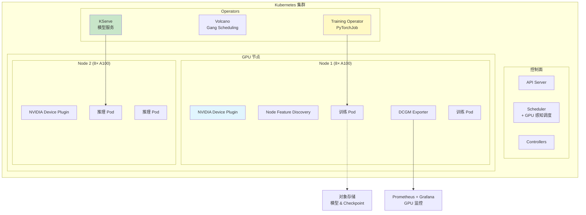
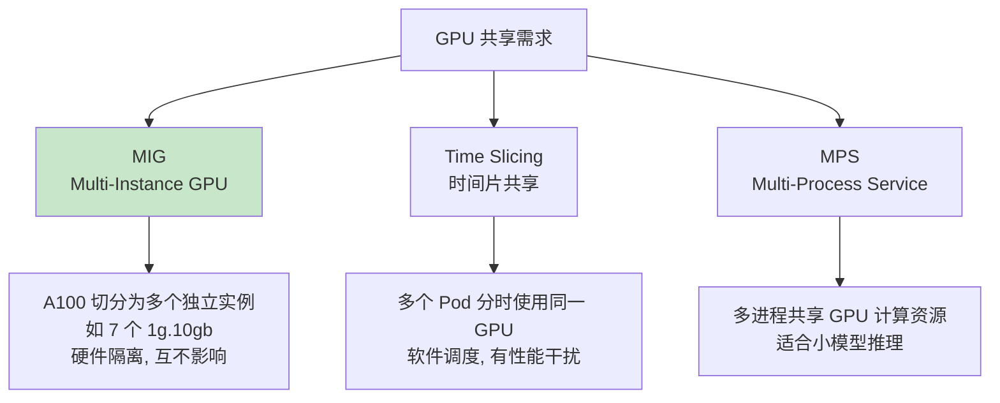
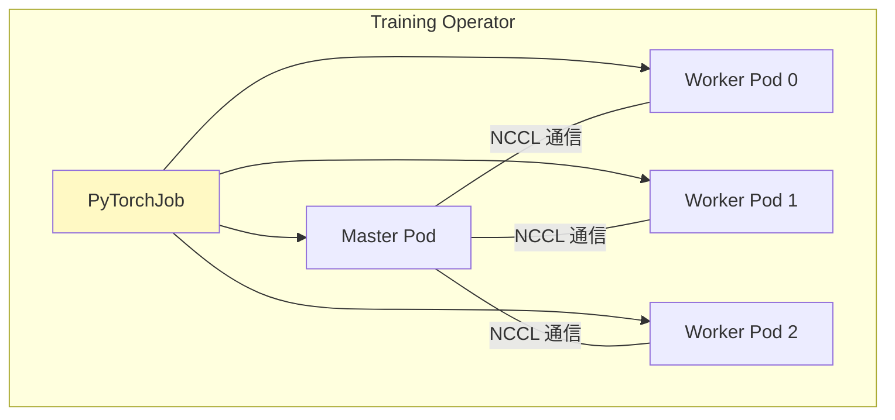
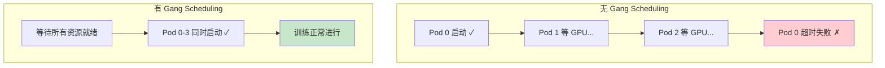
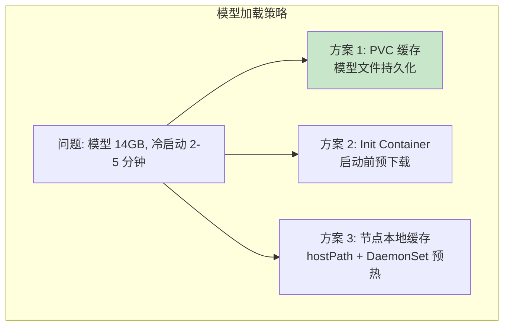
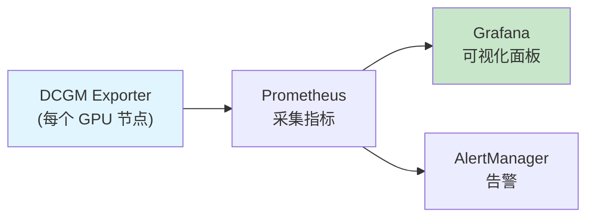
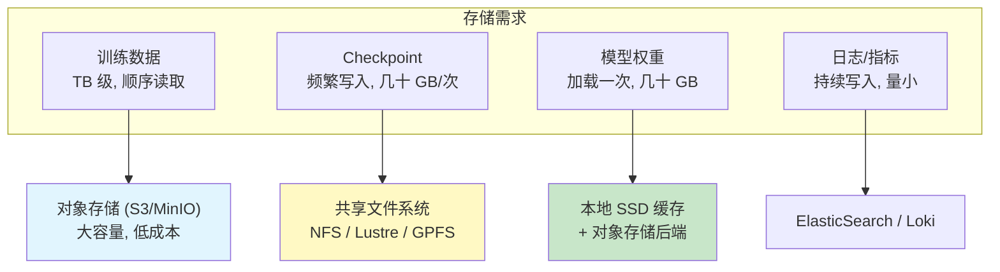

# 模块8：K8s 与 AI Infra

> 预计时间：4-5 天  
> 目标：在 Kubernetes 上部署和管理 GPU 训练任务与推理服务  
> 前置要求：K8s 基础（Pod、Deployment、Service）+ 前面所有模块

---

## 8.1 K8s + GPU 的整体架构



---

## 8.2 GPU 设备管理

### NVIDIA Device Plugin

让 K8s 识别和管理 GPU 资源：

```yaml
# 自动部署 (DaemonSet)
apiVersion: apps/v1
kind: DaemonSet
metadata:
  name: nvidia-device-plugin-daemonset
  namespace: kube-system
spec:
  selector:
    matchLabels:
      name: nvidia-device-plugin-ds
  template:
    spec:
      tolerations:
      - key: nvidia.com/gpu
        operator: Exists
        effect: NoSchedule
      containers:
      - name: nvidia-device-plugin-ctr
        image: nvcr.io/nvidia/k8s-device-plugin:v0.14.1
        securityContext:
          allowPrivilegeEscalation: false
          capabilities:
            drop: ["ALL"]
        volumeMounts:
        - name: device-plugin
          mountPath: /var/lib/kubelet/device-plugins
      volumes:
      - name: device-plugin
        hostPath:
          path: /var/lib/kubelet/device-plugins
```

### 请求 GPU 资源

```yaml
apiVersion: v1
kind: Pod
metadata:
  name: gpu-pod
spec:
  containers:
  - name: cuda-container
    image: nvcr.io/nvidia/cuda:12.0-runtime
    resources:
      limits:
        nvidia.com/gpu: 2  # 请求 2 张 GPU
```

### GPU 共享方案



### MIG 配置示例

```yaml
# GPU 节点 label
metadata:
  labels:
    nvidia.com/mig.strategy: "mixed"

# Pod 请求 MIG 实例
resources:
  limits:
    nvidia.com/mig-1g.10gb: 1  # 请求一个 1/7 的 A100
```

---

## 8.3 训练任务编排

### Kubeflow Training Operator



### PyTorchJob 完整示例

```yaml
apiVersion: kubeflow.org/v1
kind: PyTorchJob
metadata:
  name: llama-finetune
spec:
  elasticPolicy:
    rdzvBackend: c10d
    minReplicas: 1
    maxReplicas: 4
  pytorchReplicaSpecs:
    Worker:
      replicas: 4
      restartPolicy: OnFailure
      template:
        spec:
          containers:
          - name: pytorch
            image: my-registry/llm-training:latest
            command:
            - torchrun
            - --nnodes=4
            - --nproc_per_node=8
            - --rdzv_backend=c10d
            - --rdzv_endpoint=$(MASTER_ADDR):$(MASTER_PORT)
            - train.py
            - --model_name=meta-llama/Llama-2-7b
            - --deepspeed_config=ds_config.json
            resources:
              limits:
                nvidia.com/gpu: 8
                memory: "512Gi"
                cpu: "64"
              requests:
                nvidia.com/gpu: 8
                memory: "256Gi"
                cpu: "32"
            volumeMounts:
            - name: shared-data
              mountPath: /data
            - name: checkpoints
              mountPath: /checkpoints
          volumes:
          - name: shared-data
            persistentVolumeClaim:
              claimName: training-data-pvc
          - name: checkpoints
            persistentVolumeClaim:
              claimName: checkpoint-pvc
```

### Gang Scheduling（Volcano）

**问题**：分布式训练需要所有 Pod 同时就绪，否则先启动的 Pod 白白等待（甚至超时失败）。

```yaml
# Volcano PodGroup: 确保同时调度
apiVersion: scheduling.volcano.sh/v1beta1
kind: PodGroup
metadata:
  name: llama-training-group
spec:
  minMember: 4           # 至少 4 个 Pod 同时启动
  minResources:
    nvidia.com/gpu: 32   # 总共需要 32 GPU
  queue: default
```



---

## 8.4 推理服务部署

### 方案对比

| 方案 | 特点 | 适合 |
|------|------|------|
| 直接部署 vLLM (Deployment) | 简单直接 | 小规模、快速验证 |
| KServe | 自动扩缩容、A/B 测试 | 生产环境 |
| Seldon Core | 多模型管道 | 复杂 ML 管道 |
| 自建 (Deployment + HPA) | 灵活可控 | 定制需求 |

### 方案一：直接部署 vLLM

```yaml
apiVersion: apps/v1
kind: Deployment
metadata:
  name: vllm-llama
spec:
  replicas: 2
  selector:
    matchLabels:
      app: vllm-llama
  template:
    metadata:
      labels:
        app: vllm-llama
    spec:
      containers:
      - name: vllm
        image: vllm/vllm-openai:latest
        command: ["vllm", "serve"]
        args:
        - "meta-llama/Llama-2-7b-chat-hf"
        - "--port=8000"
        - "--gpu-memory-utilization=0.9"
        - "--max-model-len=4096"
        - "--enable-prefix-caching"
        ports:
        - containerPort: 8000
        resources:
          limits:
            nvidia.com/gpu: 1
            memory: "64Gi"
          requests:
            nvidia.com/gpu: 1
            memory: "32Gi"
        readinessProbe:
          httpGet:
            path: /health
            port: 8000
          initialDelaySeconds: 120  # 模型加载需要时间
          periodSeconds: 10
        livenessProbe:
          httpGet:
            path: /health
            port: 8000
          initialDelaySeconds: 180
          periodSeconds: 30
        volumeMounts:
        - name: model-cache
          mountPath: /root/.cache/huggingface
      volumes:
      - name: model-cache
        persistentVolumeClaim:
          claimName: model-cache-pvc
---
apiVersion: v1
kind: Service
metadata:
  name: vllm-llama-svc
spec:
  selector:
    app: vllm-llama
  ports:
  - port: 80
    targetPort: 8000
  type: ClusterIP
```

### 自动扩缩容

```yaml
apiVersion: autoscaling/v2
kind: HorizontalPodAutoscaler
metadata:
  name: vllm-hpa
spec:
  scaleTargetRef:
    apiVersion: apps/v1
    kind: Deployment
    name: vllm-llama
  minReplicas: 1
  maxReplicas: 8
  metrics:
  - type: Pods
    pods:
      metric:
        name: vllm_num_requests_waiting
      target:
        type: AverageValue
        averageValue: "5"  # 等待队列 > 5 时扩容
```

### 模型加载优化



```yaml
# Init Container 预下载模型
initContainers:
- name: model-downloader
  image: python:3.10
  command:
  - python
  - -c
  - |
    from huggingface_hub import snapshot_download
    snapshot_download("meta-llama/Llama-2-7b-chat-hf",
                     local_dir="/models/llama-2-7b")
  volumeMounts:
  - name: model-cache
    mountPath: /models
```

---

## 8.5 GPU 监控

### DCGM Exporter + Prometheus + Grafana



### 关键监控指标

| 指标 | 含义 | 告警阈值 |
|------|------|---------|
| `DCGM_FI_DEV_GPU_UTIL` | GPU 计算利用率 | < 30% (浪费) |
| `DCGM_FI_DEV_MEM_COPY_UTIL` | 显存带宽利用率 | - |
| `DCGM_FI_DEV_FB_USED` | 已用显存 | > 95% |
| `DCGM_FI_DEV_GPU_TEMP` | GPU 温度 | > 85°C |
| `DCGM_FI_DEV_POWER_USAGE` | 功耗 | > TDP |
| `DCGM_FI_DEV_XID_ERRORS` | GPU 错误 | > 0 (故障) |

### 部署 DCGM Exporter

```yaml
apiVersion: apps/v1
kind: DaemonSet
metadata:
  name: dcgm-exporter
  namespace: monitoring
spec:
  selector:
    matchLabels:
      app: dcgm-exporter
  template:
    spec:
      containers:
      - name: dcgm-exporter
        image: nvcr.io/nvidia/k8s/dcgm-exporter:3.2.5-3.1.8-ubuntu22.04
        ports:
        - containerPort: 9400
        securityContext:
          runAsNonRoot: false
          runAsUser: 0
        volumeMounts:
        - name: device-plugin
          mountPath: /var/lib/kubelet/pod-resources
      volumes:
      - name: device-plugin
        hostPath:
          path: /var/lib/kubelet/pod-resources
```

---

## 8.6 存储方案

### 训练数据与模型的存储需求



### Checkpoint 策略

```python
# 训练代码中的 checkpoint 保存
if step % save_interval == 0:
    checkpoint = {
        'model_state_dict': model.state_dict(),
        'optimizer_state_dict': optimizer.state_dict(),
        'step': step,
        'loss': loss.item(),
    }
    # 保存到共享存储
    torch.save(checkpoint, f'/checkpoints/step_{step}.pt')

    # 只保留最近 N 个 checkpoint
    cleanup_old_checkpoints(keep_last=3)
```

---

## 8.7 故障处理与弹性训练

### 常见故障

| 故障 | 频率 | 影响 | 处理 |
|------|------|------|------|
| GPU 掉卡 | 每周 | 训练中断 | 弹性训练 + 自动恢复 |
| 节点宕机 | 每月 | 任务失败 | Checkpoint 恢复 |
| 网络抖动 | 频繁 | 通信超时 | 重试 + 超时配置 |
| OOM | 偶发 | Pod 被杀 | 减少 batch / 梯度检查点 |

### 弹性训练

```yaml
# PyTorchJob 弹性配置
spec:
  elasticPolicy:
    rdzvBackend: c10d
    minReplicas: 2    # 最少 2 个 worker 可以继续训练
    maxReplicas: 8    # 最多 8 个
    metrics:
    - type: Resource
      resource:
        name: nvidia.com/gpu
        target:
          type: Utilization
          averageUtilization: 80
```

---

## 实践练习

### 练习 1：创建 GPU Pod 并验证

```yaml
# gpu-test-pod.yaml
apiVersion: v1
kind: Pod
metadata:
  name: gpu-test
spec:
  restartPolicy: Never
  containers:
  - name: cuda-test
    image: nvcr.io/nvidia/cuda:12.0-runtime-ubuntu22.04
    command: ["nvidia-smi"]
    resources:
      limits:
        nvidia.com/gpu: 1
```

```bash
# 部署并查看结果
kubectl apply -f gpu-test-pod.yaml
kubectl logs gpu-test
# 应该看到 nvidia-smi 的输出
```

### 练习 2：部署 vLLM 推理服务

```bash
# 创建 namespace
kubectl create namespace inference

# 部署 vLLM (使用小模型)
cat <<EOF | kubectl apply -n inference -f -
apiVersion: apps/v1
kind: Deployment
metadata:
  name: vllm-opt
spec:
  replicas: 1
  selector:
    matchLabels:
      app: vllm-opt
  template:
    metadata:
      labels:
        app: vllm-opt
    spec:
      containers:
      - name: vllm
        image: vllm/vllm-openai:latest
        command: ["vllm", "serve", "facebook/opt-1.3b", "--port=8000"]
        ports:
        - containerPort: 8000
        resources:
          limits:
            nvidia.com/gpu: 1
---
apiVersion: v1
kind: Service
metadata:
  name: vllm-svc
spec:
  selector:
    app: vllm-opt
  ports:
  - port: 80
    targetPort: 8000
EOF

# 等待 Pod 就绪
kubectl -n inference get pods -w

# 端口转发测试
kubectl -n inference port-forward svc/vllm-svc 8000:80 &

# 测试
curl http://localhost:8000/v1/completions \
  -H "Content-Type: application/json" \
  -d '{"model": "facebook/opt-1.3b", "prompt": "Hello", "max_tokens": 20}'
```

### 练习 3：设置 GPU 监控

```bash
# 部署 DCGM Exporter (假设已有 Prometheus)
kubectl apply -f https://raw.githubusercontent.com/NVIDIA/dcgm-exporter/main/deployment/dcgm-exporter.yaml

# 查看 GPU 指标
kubectl port-forward svc/dcgm-exporter 9400:9400 &
curl localhost:9400/metrics | grep DCGM_FI_DEV_GPU_UTIL
```

### 练习 4：模拟训练任务

```bash
# 安装 Training Operator
kubectl apply -k "github.com/kubeflow/training-operator/manifests/overlays/standalone"

# 创建 PyTorchJob
cat <<EOF | kubectl apply -f -
apiVersion: kubeflow.org/v1
kind: PyTorchJob
metadata:
  name: pytorch-simple
spec:
  pytorchReplicaSpecs:
    Master:
      replicas: 1
      template:
        spec:
          containers:
          - name: pytorch
            image: pytorch/pytorch:2.0.0-cuda11.7-cudnn8-runtime
            command:
            - python
            - -c
            - |
              import torch
              import torch.distributed as dist
              dist.init_process_group(backend='nccl')
              rank = dist.get_rank()
              print(f"Rank {rank}: GPU available = {torch.cuda.is_available()}")
              if torch.cuda.is_available():
                  x = torch.randn(1000, 1000, device='cuda')
                  y = x @ x.T
                  print(f"Rank {rank}: Matmul done, shape = {y.shape}")
              dist.destroy_process_group()
            resources:
              limits:
                nvidia.com/gpu: 1
    Worker:
      replicas: 1
      template:
        spec:
          containers:
          - name: pytorch
            image: pytorch/pytorch:2.0.0-cuda11.7-cudnn8-runtime
            command:
            - python
            - -c
            - |
              import torch
              import torch.distributed as dist
              dist.init_process_group(backend='nccl')
              rank = dist.get_rank()
              print(f"Rank {rank}: GPU available = {torch.cuda.is_available()}")
              dist.destroy_process_group()
            resources:
              limits:
                nvidia.com/gpu: 1
EOF

# 查看状态
kubectl get pytorchjobs
kubectl logs pytorch-simple-master-0
```

---

## 自测清单

- [ ] NVIDIA Device Plugin 的作用是什么？
- [ ] 如何在 Pod 中请求 GPU 资源？
- [ ] MIG 和时间片共享的区别？
- [ ] PyTorchJob 的基本结构是什么？
- [ ] Gang Scheduling 解决什么问题？
- [ ] 如何在 K8s 上部署 vLLM？
- [ ] 推理服务的 HPA 应该基于什么指标？
- [ ] 模型加载慢怎么优化？
- [ ] DCGM Exporter 监控哪些 GPU 指标？
- [ ] Checkpoint 应该存在什么存储上？

---

## 延伸阅读

- [NVIDIA GPU Operator](https://docs.nvidia.com/datacenter/cloud-native/gpu-operator/)
- [Kubeflow Training Operator](https://www.kubeflow.org/docs/components/training/)
- [Volcano Scheduler](https://volcano.sh/en/)
- [KServe 文档](https://kserve.github.io/website/)
- [DCGM Exporter](https://github.com/NVIDIA/dcgm-exporter)
- [Kubernetes GPU 最佳实践 - NVIDIA](https://docs.nvidia.com/datacenter/cloud-native/kubernetes/best-practices.html)
