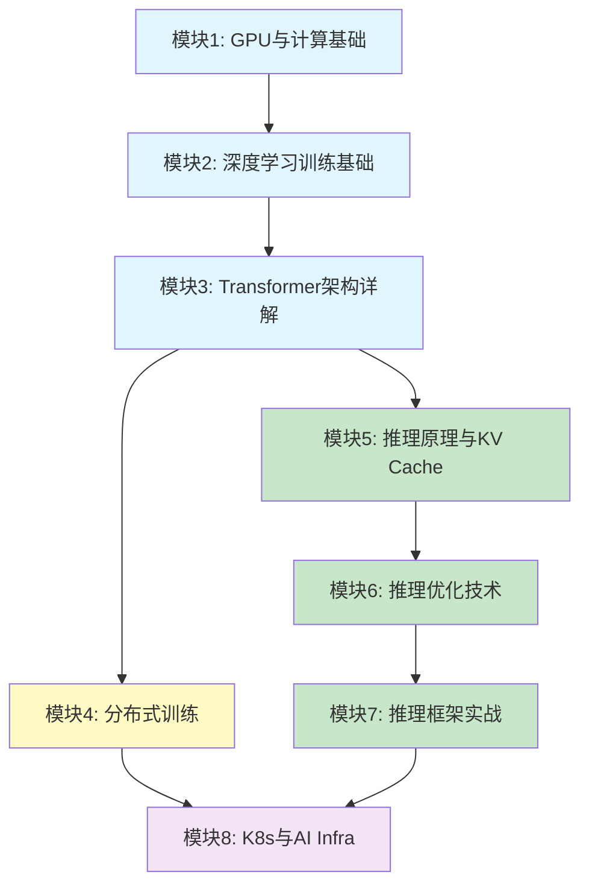

# AI Infra 实战课程

> 从零开始掌握 AI 基础设施：训练与推理

## 课程目标

学完本课程，你将能够：
- 理解 GPU 硬件架构与性能分析
- 从零实现 Transformer 并理解每一步计算
- 掌握分布式训练的核心原理与实操
- 深入理解 KV Cache、PagedAttention 等推理优化
- 使用 vLLM 等框架部署大模型服务
- 在 K8s 上管理 GPU 训练与推理任务

## 前置要求

- Python 基础（能写循环、函数、类）
- 基本线性代数（矩阵乘法、向量点积）
- 一点 K8s 基础（知道 Pod、Deployment、Service）
- 有 GPU 机器可用（推荐至少 1 张 A100/H100，无 GPU 也可完成部分实验）

## 课程结构



## 模块目录

| 模块 | 文件 | 时间 | 难度 |
|------|------|------|------|
| 模块1 | [GPU与计算基础](./01-gpu-fundamentals.md) | 3-4天 | ⭐ |
| 模块2 | [深度学习训练基础](./02-training-basics.md) | 3-4天 | ⭐ |
| 模块3 | [Transformer架构详解](./03-transformer.md) | 5-7天 | ⭐⭐ |
| 模块4 | [分布式训练](./04-distributed-training.md) | 5-7天 | ⭐⭐⭐ |
| 模块5 | [推理原理与KV Cache](./05-inference-kv-cache.md) | 4-5天 | ⭐⭐ |
| 模块6 | [推理优化技术](./06-inference-optimization.md) | 5-7天 | ⭐⭐⭐ |
| 模块7 | [推理框架实战](./07-inference-frameworks.md) | 3-4天 | ⭐⭐ |
| 模块8 | [K8s与AI Infra](./08-k8s-ai-infra.md) | 4-5天 | ⭐⭐ |

**总计：约 5-7 周**

## 每个模块的结构

每个模块包含：
1. **概念讲解** — 带 Mermaid 图的原理说明
2. **数值示例** — 手算帮助理解
3. **实践练习** — 动手写代码验证
4. **自测清单** — 确认掌握程度

## 学习建议

1. **按顺序学习**：模块间有依赖关系
2. **一定要做实践**：看懂不等于会，写代码验证很重要
3. **偏训练 / 面试**：优先 M1→M2→M3→M4→M8，并精读学习路径 **阶段五（对齐）/ 七（vLLM·PD）/ 八（全景补齐）**，再结合推理模块 M5→M6→M7（详见 [`docs/ai-infra-learning-path.md`](../docs/ai-infra-learning-path.md)）
4. **只想先跑通服务**：可先走 M1→M2→M3→M5→M6→M7，重点看学习路径阶段七，再回头补训练、对齐与阶段八平台域
5. **遇到不懂的先标记**，往后学可能会自然理解

## 环境准备

```bash
# 创建 Python 环境
conda create -n aiinfra python=3.10
conda activate aiinfra

# 安装基础包
pip install torch torchvision
pip install transformers accelerate
pip install numpy matplotlib

# 推理框架（模块7需要）
pip install vllm

# 分布式训练（模块4需要）
pip install deepspeed
```
