# AI Infra 学习路径（全景：数据 → 训练 → 对齐 → 推理 → 平台）

> 适合：会一点 K8s、不懂 KV Cache、想系统学 AI Infra，并准备面试的同学。  
> 配套课程：[`course/`](../course/README.md)  
> 说明：阶段一～七打主干；**阶段八补齐此前未展开的全景域**（数据、Slurm/Ray、MLOps、RAG、编译器、FinOps 等）。

---

## 学习路线总览

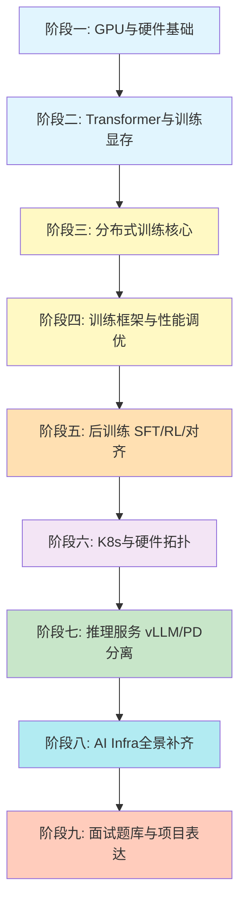

**学习原则：**

1. **主干 + 全景**：先吃透训练/对齐/推理/K8s，再扫阶段八的“平台周边”，避免只会单点。
2. **预训练 ≠ 对齐 ≠ 服务**：规模、偏好、SLO/成本是三套问题。
3. **硬件 → 软件 → 调度 → 产品化**：从 GPU 到网关/评测/FinOps。
4. **面试导向**：能口述 + 能画图 + 能量级估算。

| 阶段 | 主题 | 时间 | 难度 |
|------|------|------|------|
| 一 | GPU / 互联 / 显存算术 | 1-2 周 | ⭐ |
| 二 | Transformer + 训练显存账本 | 1-2 周 | ⭐⭐ |
| 三 | DP / TP / PP / ZeRO / 通信 | 2-3 周 | ⭐⭐⭐ |
| 四 | 训练框架全家桶 + 性能调优 | 3-4 周 | ⭐⭐⭐ |
| 五 | SFT / RLHF / DPO / GRPO 等后训练 | 2-3 周 | ⭐⭐⭐ |
| 六 | K8s GPU 调度 + 硬件拓扑 | 2-3 周 | ⭐⭐⭐ |
| 七 | 推理：KV Cache / vLLM / PD 分离 / 服务化 | 2-3 周 | ⭐⭐⭐ |
| 八 | 全景补齐：数据/Slurm/Ray/MLOps/RAG/编译/FinOps… | 3-4 周 | ⭐⭐⭐ |
| 九 | 面试题与项目叙事 | 持续 | - |

---

## 阶段一：GPU 与硬件基础（1-2 周）

### 1.1 为什么训练离不开 GPU

| 对比 | CPU | GPU |
|------|-----|-----|
| 核心 | 少而强 | 多而弱（数千 CUDA Core） |
| 擅长 | 分支、串行逻辑 | 矩阵乘、大规模并行 |
| 训练含义 | 数据预处理、调度 | 前向 / 反向 / 通信 |

**面试一句话**：训练核心是大量 GEMM；GPU 用高并行 + Tensor Core 把矩阵乘跑满。

### 1.2 必须掌握的硬件名词

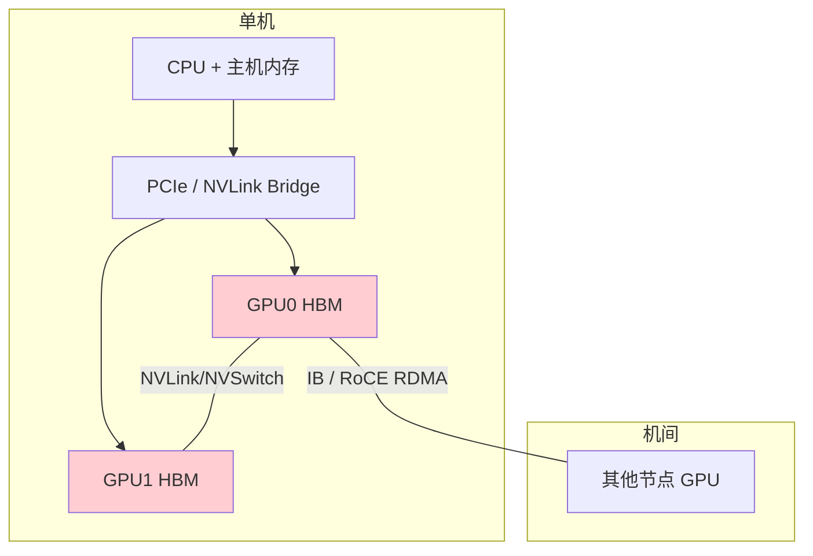

| 概念 | 你要能说清什么 |
|------|----------------|
| HBM | 显存容量与带宽；训练经常 Memory Bound |
| Tensor Core | 低精度矩阵乘加速器；BF16/FP8 的关键 |
| NVLink / NVSwitch | 机内 GPU 高速互联；决定 TP 规模 |
| PCIe | GPU↔CPU、部分跨卡路径；比 NVLink 慢很多 |
| InfiniBand / RoCE | 机间 RDMA；决定跨节点 DP/PP 效率 |
| NCCL | GPU 集合通信库；AllReduce 等原语实现 |

### 1.3 训练侧性能直觉：Roofline

```
计算强度 = FLOP / Byte
强度高 → Compute Bound（算不过来）
强度低 → Memory Bound（搬不过来）
```

| 场景 | 常见瓶颈 |
|------|---------|
| 大矩阵乘（训练前向/反向） | Compute Bound |
| LayerNorm / Softmax / 小算子 | Memory Bound |
| 跨机 AllReduce | 网络 Bound |
| Checkpoint 写盘 | 存储 Bound |

### 1.4 面试热门点（阶段一）

- [ ] A100 / H100 / H200 显存、带宽、互联差异大概知道
- [ ] 为什么 BF16 比 FP16 更适合训练
- [ ] NVLink 和 IB 分别服务哪一类并行
- [ ] 什么叫 MFU，为什么训练团队天天盯它

**对照课程**：[course/01-gpu-fundamentals.md](../course/01-gpu-fundamentals.md)

---

## 阶段二：Transformer + 训练显存账本（1-2 周）

> 训练面试高频：不是背公式，而是“7B 为什么单卡训不动”。

### 2.1 Transformer 训练相关最小集

必须会：

1. Q / K / V 是什么，Attention 五步怎么走
2. Causal Mask 为什么存在
3. FFN 为什么占参数大头
4. GQA 如何影响 KV heads（训练/推理都相关）

详细入门见：[course/03-transformer.md](../course/03-transformer.md)

### 2.2 训练时显存里到底有什么（必会）

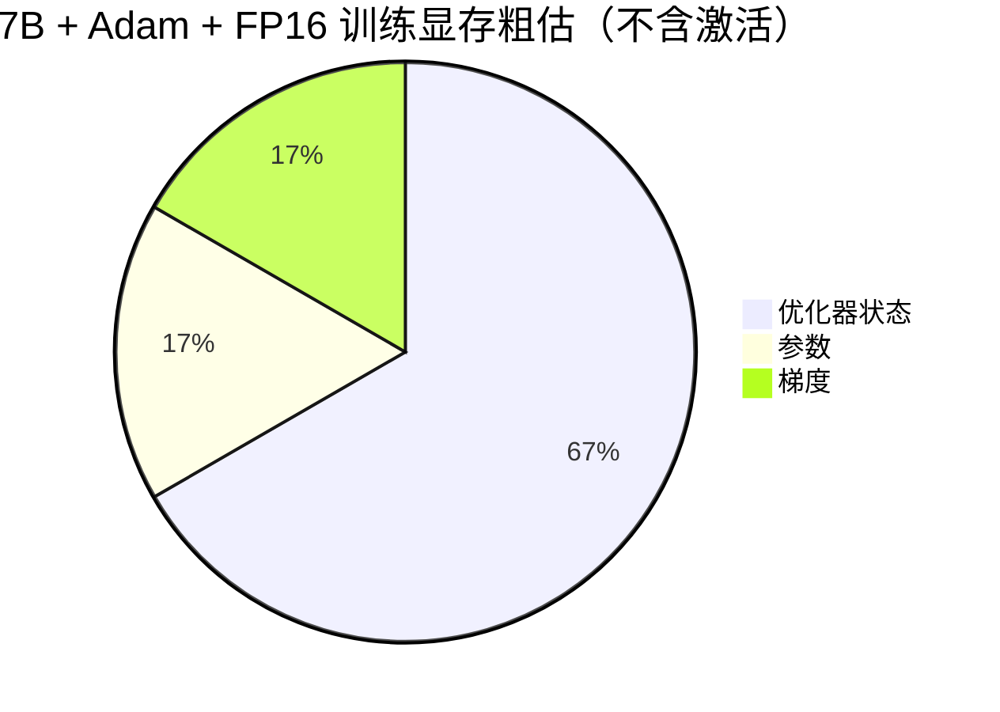

| 组件 | 粗算（7B, FP16 参数） | 面试说法 |
|------|----------------------|---------|
| 参数 | ~14 GB | 模型本身 |
| 梯度 | ~14 GB | backward 产生 |
| Adam 状态 | ~56 GB（master+m+v） | 往往最大头 |
| 激活 | 随 batch / seq / layer 变 | 长序列杀手 |

**口算公式（面试常用）：**

```
参数显存 ≈ params × dtype_bytes
梯度显存 ≈ params × dtype_bytes
Adam 状态 ≈ params × 12 bytes  （FP32 master + m + v）
总静态显存 ≈ params × (2+2+12) = params × 16 bytes   # 常见粗估
```

### 2.3 显存优化手段（训练面试高频）

| 技术 | 换什么 | 面试怎么讲 |
|------|--------|-----------|
| 混合精度 AMP | 算力↑ / 显存↓ | 计算 BF16，关键累加 FP32 |
| Gradient Checkpointing | 时间换空间 | 不存激活，反向重算 |
| 梯度累积 | 显存换等效大 batch | micro-batch 累加后再 step |
| Offload | GPU↔CPU | 优化器/参数放到 CPU/NVMe |
| ZeRO | 冗余换通信 | 切分优化器/梯度/参数 |

### 2.4 面试热门点（阶段二）

- [ ] 口述 7B Adam 训练为什么远超 14GB
- [ ] Checkpointing 节省多少、慢多少（量级即可）
- [ ] BF16 vs FP16：范围、loss scaling
- [ ] 激活显存和 `batch × seq × hidden × layers` 的关系

**对照课程**：[course/02-training-basics.md](../course/02-training-basics.md)

---

## 阶段三：分布式训练核心（2-3 周，最重要）

### 3.1 先回答两个问题

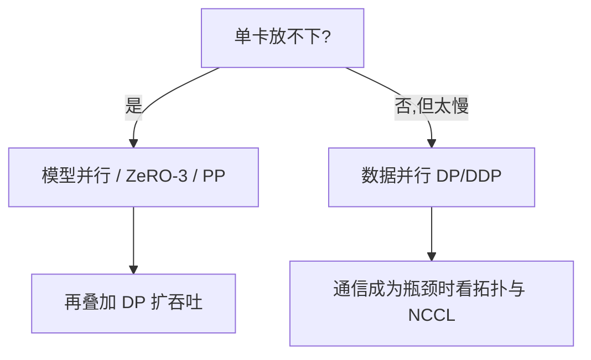

### 3.2 四种并行（面试必画图）

#### 数据并行 DP / DDP

- 每卡一份完整模型
- 数据切开
- 反向后 **AllReduce 梯度**

**考点**：DDP 和“先本地算再手动平均”的区别；bucket 通信与计算重叠。

#### 张量并行 TP（Megatron 风格）

- 把一层内的矩阵切到多卡
- 通信频繁（常 AllReduce）
- **必须放在 NVLink 域内**（通常单机 8 卡）

#### 流水线并行 PP

- 按层切到不同卡/节点
- 通信是激活/梯度传递
- 有 **bubble（气泡）**；用 micro-batch + 1F1B 缓解

#### ZeRO（DeepSpeed）/ FSDP

| Stage | 切什么 | 显存 | 通信 |
|-------|--------|------|------|
| ZeRO-1 | 优化器状态 | ~4× | 接近 DDP |
| ZeRO-2 | +梯度 | ~8× | 略增 |
| ZeRO-3 / FSDP | +参数 | ~N× | 每层 AllGather，更重 |

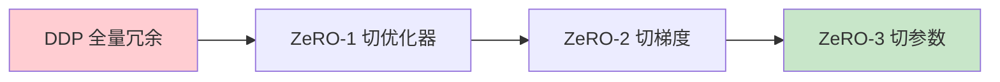

### 3.3 3D 并行怎么组合（面试高频）

**经验法则：**

| 并行 | 放哪里 | 原因 |
|------|--------|------|
| TP | 机内 NVLink | 通信最密 |
| PP | 跨机也可 | 通信量相对小 |
| DP | 最外层扩展 | 扩吞吐 |

示例口述：

> 70B 常见：TP=8（单机），PP=4 或 8（跨机），剩余卡数给 DP。

### 3.4 集合通信（必会）

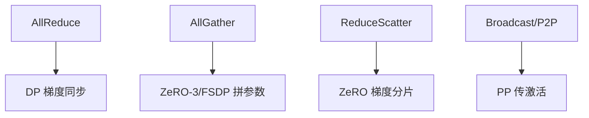

**面试题套路：**

1. AllReduce 能否拆成 ReduceScatter + AllGather？→ 能，且是 Ring/Tree 实现基础。
2. 参数量 7B，FP16，8 卡 AllReduce 大概搬多少数据？→ 约 `2 × 14GB × (N-1)/N` 量级思维。

### 3.5 面试热门点（阶段三）

- [ ] DP / TP / PP / ZeRO 各自解决什么问题
- [ ] 为什么 TP 不适合跨 IB 乱切
- [ ] PP bubble 是什么，怎么减
- [ ] ZeRO-3 和 TP 的区别（切冗余 vs 切一层内计算）
- [ ] DDP、FSDP、DeepSpeed 选型

**对照课程**：[course/04-distributed-training.md](../course/04-distributed-training.md)

---

## 阶段四：训练框架全家桶（3-4 周，面试重灾区）

> 目标：不只记住名字，要能说清 **每个框架解决什么、核心模块有哪些、配置长什么样、和谁组合**。

### 4.0 框架分层：先建立坐标

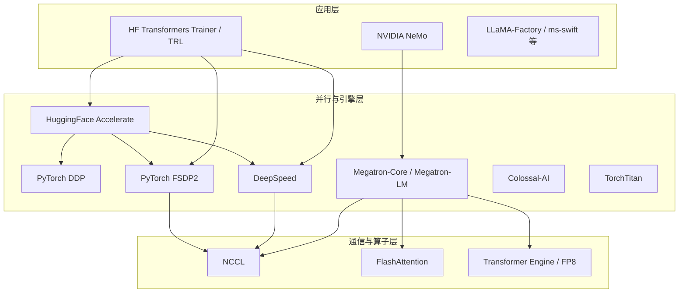

**一句话定位：**

| 层级 | 代表 | 你在学什么 |
|------|------|-----------|
| 启动与进程 | `torchrun` / `deepspeed` launcher | 多进程、环境变量、rank |
| 数据并行 | DDP | 梯度 AllReduce |
| 分片数据并行 | FSDP / ZeRO | 切参数/梯度/优化器 |
| 模型并行引擎 | Megatron-Core | TP/PP/SP/CP + 高效实现 |
| 易用封装 | Accelerate / Trainer | 一套代码切换后端 |
| 领域套件 | NeMo / Megatron-LM 完整仓 | 预训练配方、数据、评测 |

---

### 4.1 PyTorch DDP（DistributedDataParallel）——一切的地基

**解决什么**：模型单卡放得下，但想多卡加速。

**你必须掌握的内容：**

| 主题 | 要点 |
|------|------|
| 启动 | `torchrun --nproc_per_node=8 --nnodes=2 --rdzv_backend=c10d` |
| 进程组 | `init_process_group(backend="nccl")`；`RANK/WORLD_SIZE/LOCAL_RANK` |
| 包装 | `DDP(model, device_ids=[local_rank])` |
| 通信 | 反向时按 bucket 做梯度 AllReduce，与计算重叠 |
| 采样 | `DistributedSampler`，每 epoch `set_epoch` |
| 同步 | 参数广播、梯度平均后各卡更新一致 |

**典型代码骨架：**

```python
# 伪代码：面试能口述即可
dist.init_process_group("nccl")
model = MyModel().cuda()
model = DDP(model, device_ids=[local_rank])
loader = DataLoader(..., sampler=DistributedSampler(...))
for x, y in loader:
    loss = model(x, y)
    loss.backward()   # 内部触发 AllReduce
    optimizer.step()
```

**能力边界：**

- ✅ 中小模型、LoRA/全参微调（单卡能放下）
- ❌ 单卡放不下完整参数/优化器 → 转向 FSDP / DeepSpeed / Megatron

**面试热词**：gradient bucketing、find_unused_parameters、静态图 vs 动态图、DDP vs DP（DataParallel 基本淘汰）。

---

### 4.2 PyTorch FSDP / FSDP2——原生 ZeRO-3

**解决什么**：PyTorch 官方的参数分片，少引入第三方。

**核心概念：**

| 概念 | 含义 |
|------|------|
| FULL_SHARD | 等同 ZeRO-3：参数/梯度/优化器都切 |
| SHARD_GRAD_OP | 更像 ZeRO-2：算子期间有完整参数 |
| HYBRID_SHARD | 机内切分 + 机间复制（常更均衡） |
| auto_wrap_policy | 按 transformer block 包装，控制通信粒度 |
| prefetch / mixed precision | 通信与计算重叠、BF16 参数 |

**工作流（口述）：**

```
forward 前: AllGather 拼出当前层参数
forward 后: 丢掉非本地分片
backward: 再 AllGather → 算梯度 → ReduceScatter 梯度
optimizer: 只更新本地分片
```

**和 DeepSpeed ZeRO-3 对比（面试常问）：**

| 维度 | FSDP | DeepSpeed ZeRO-3 |
|------|------|------------------|
| 生态 | PyTorch 原生 | 功能更全（Offload、NVMe） |
| 配置 | Python API / 策略枚举 | JSON `ds_config` |
| Offload | 有，但 DeepSpeed 更成熟 | CPU/NVMe Offload 强 |
| 模型并行 | 弱，靠组合 | 弱，靠组合 Megatron |
| 适用 | HF/PyTorch 原生栈 | 工业大模型常用 |

**FSDP2 趋势**：更干净的分片张量 API、更好组合 TP；新项目优先了解 FSDP2。

---

### 4.3 DeepSpeed——ZeRO 与工程套件

**解决什么**：显存冗余、Offload、大规模训练工程化。

#### 4.3.1 必会模块清单

| 模块 | 内容 | 面试频率 |
|------|------|---------|
| ZeRO-1/2/3 | 切优化器 / +梯度 / +参数 | ⭐⭐⭐⭐⭐ |
| ZeRO-Offload | 优化器/参数放到 CPU | ⭐⭐⭐⭐ |
| ZeRO-Infinity | 进一步 NVMe Offload | ⭐⭐⭐ |
| Activation Checkpointing | 激活重计算 | ⭐⭐⭐⭐ |
| BF16/FP16 | 混合精度 | ⭐⭐⭐⭐ |
| Gradient Accumulation | 等效大 batch | ⭐⭐⭐ |
| Curriculum / 数据相关 | 部分场景 | ⭐⭐ |
| MoE 支持 | DeepSpeed MoE | ⭐⭐⭐ |
| Inference 引擎 | 推理侧能力（了解即可） | ⭐⭐ |

#### 4.3.2 `ds_config.json` 你要认得的字段

```json
{
  "train_batch_size": 256,
  "train_micro_batch_size_per_gpu": 2,
  "gradient_accumulation_steps": 16,
  "bf16": { "enabled": true },
  "zero_optimization": {
    "stage": 2,
    "offload_optimizer": { "device": "cpu", "pin_memory": true },
    "overlap_comm": true,
    "contiguous_gradients": true,
    "reduce_bucket_size": 5e8,
    "allgather_bucket_size": 5e8
  },
  "gradient_clipping": 1.0,
  "wall_clock_breakdown": true
}
```

**必须能解释的关系：**

```
train_batch_size
  ≈ micro_batch × gas × data_parallel_world_size
```

#### 4.3.3 ZeRO Stage 选型口诀

| 场景 | 建议 |
|------|------|
| 刚好有点紧 | ZeRO-1/2 |
| 单卡明显放不下优化器 | ZeRO-2 + offload_optimizer |
| 参数本身也放不下 | ZeRO-3（接受更多通信） |
| GPU 显存极紧、可牺牲速度 | Offload / Infinity |
| 还要 TP/PP | DeepSpeed + Megatron 组合，而不是只靠 ZeRO |

#### 4.3.4 与 HF 的集成方式

- `Trainer(args=..., deepspeed=ds_config.json)`
- 或 `accelerate launch --config_file ...` 里指定 deepspeed

---

### 4.4 Megatron-LM / Megatron-Core——大规模预训练引擎

**解决什么**：超大模型需要的 **张量并行 / 流水线并行 / 序列并行** 与高性能实现。

#### 4.4.1 必会并行维度

| 缩写 | 全称 | 切什么 | 通信特征 |
|------|------|--------|---------|
| TP | Tensor Parallel | 层内矩阵列/行 | 频繁 AllReduce，需 NVLink |
| PP | Pipeline Parallel | 层间 | P2P 传激活，有 bubble |
| DP | Data Parallel | 数据 | AllReduce/ReduceScatter |
| SP | Sequence Parallel | 序列维激活 | 配合 TP 省激活 |
| CP | Context Parallel | 长上下文切序列 | 长序列训练热门 |
| EP | Expert Parallel | MoE 专家 | AllToAll |

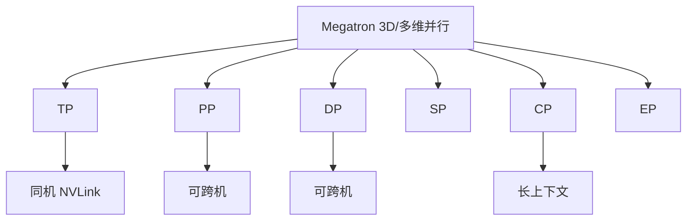

#### 4.4.2 Megatron 里你还要知道的工程点

| 主题 | 内容 |
|------|------|
| Vocab Parallel Embedding | Embedding/LM Head 按词表切 |
| Selective / Full Recomputation | 激活重计算策略 |
| Distributed Optimizer | 优化器状态分片（类似 ZeRO-1） |
| FlashAttention / TE | 融合算子、FP8（H100） |
| 数据格式 | indexed dataset、blend 多语料配比 |
| Checkpoint | 按 TP/PP 分片保存与转换 |
| 启动参数 | `--tensor-model-parallel-size` `--pipeline-model-parallel-size` 等 |

#### 4.4.3 Megatron-LM vs Megatron-Core vs NeMo

| 项目 | 定位 |
|------|------|
| Megatron-LM | 经典完整训练仓（脚本、模型、数据） |
| Megatron-Core | 可组合的核心库（并行、层、调度） |
| NVIDIA NeMo | 产品化套件：ASR/TTS/LLM、配方、云原生 |

**面试说法**：预训练底座常看 Megatron-Core；落地配方与企业功能常看 NeMo。

---

### 4.5 组合拳：Megatron + DeepSpeed / 其他拼装

工业界很少“只用一个缩写”：

| 组合 | 典型用途 |
|------|---------|
| Megatron TP/PP + DeepSpeed ZeRO | 3D 并行 + 优化器分片 |
| Megatron + Transformer Engine | H100 FP8 训练 |
| HF Trainer + DeepSpeed ZeRO-2/3 | 微调最快落地 |
| HF + FSDP | 纯 PyTorch 栈微调 |
| Accelerate 切换 DDP/FSDP/DS | 一份代码多后端 |

**选型直觉：**

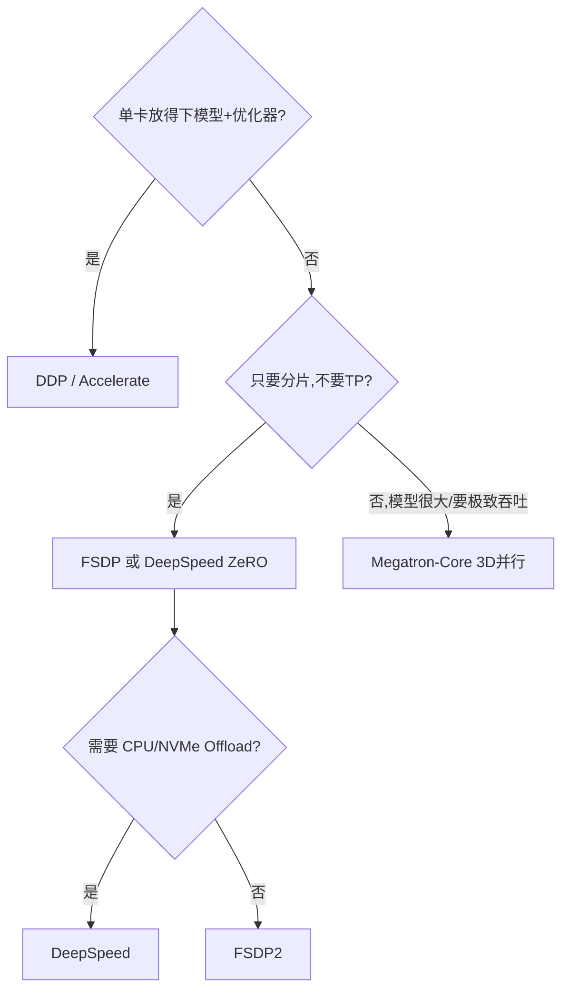

---

### 4.6 Hugging Face 生态（微调面试必问）

#### 4.6.1 Transformers + Trainer

| 能力 | 说明 |
|------|------|
| `TrainingArguments` | lr、epoch、bf16、grad accum、logging |
| `Trainer` | 训练循环、保存、评估 |
| deepspeed / fsdp 字段 | 直接挂后端 |
| PEFT / LoRA | 参数高效微调 |
| TRL | SFT / DPO / RLHF 训练环 |

#### 4.6.2 Accelerate

**解决什么**：不手写一堆 DDP/FSDP 样板代码。

你要会：

- `accelerate config` 生成配置
- `Accelerator.prepare(model, optimizer, dataloader)`
- 同一脚本在单卡、DDP、FSDP、DeepSpeed 间切换

#### 4.6.3 微调入口（详情见阶段五）

| 路径 | 框架组合 | 详见 |
|------|---------|------|
| LoRA/QLoRA / 全参 SFT | PEFT + Trainer / TRL SFTTrainer | 阶段五 |
| 偏好对齐 DPO/ORPO | TRL | 阶段五 |
| RLHF PPO / GRPO | TRL / OpenRLHF / verl | 阶段五 |
| 继续预训练 CPT | Megatron / NeMo | 阶段四+五 |

---

### 4.7 其他常见训练框架 / 项目（知道定位即可）

| 名称 | 核心内容 | 什么时候提到 |
|------|---------|-------------|
| **Colossal-AI** | Gemini 等多维并行、易用 API | 国产/多并行方案对比 |
| **TorchTitan** | PyTorch 官方大模型预训练参考 | FSDP2 + TP 新方向 |
| **FairScale** | 早期 FSDP 来源之一 | 历史背景 |
| **Horovod** | 老一代 AllReduce 框架 | 遗留系统 |
| **DeepSpeed-Chat / Megatron-LM GPT** | 对齐/预训练示例仓 | 学习配方 |
| **LLaMA-Factory / ms-swift / Firefly** | 一站式微调工具 | 业务快速微调 |
| **Axolotl** | YAML 驱动微调 | 开源微调 |
| **Composer (MosaicML)** | 训练配方与速度优化 | 效率向 |
| **PaddleFleet / MindSpore** | 其他厂商栈 | 特定公司栈 |
| **veScale / InternEvo 等** | 大厂自研并行 | 了解存在即可 |

---

### 4.8 各框架“内容对照表”（背这张表）

| 能力 | DDP | FSDP | DeepSpeed | Megatron-Core | Accelerate | HF Trainer | NeMo |
|------|-----|------|-----------|---------------|------------|------------|------|
| 数据并行 | ✅ | ✅ | ✅ | ✅ | ✅ | ✅ | ✅ |
| ZeRO 分片 | ❌ | ✅(原生) | ✅(全家桶) | 部分(DistOpt) | 经后端 | 经后端 | ✅ |
| Tensor Parallel | ❌ | 有限/组合 | 有限 | ✅强 | 弱 | 弱 | ✅ |
| Pipeline Parallel | ❌ | ❌ | 有 | ✅强 | 弱 | 弱 | ✅ |
| CPU/NVMe Offload | ❌ | 弱 | ✅强 | 视集成 | 经 DS | 经 DS | 有 |
| MoE / EP | 弱 | 弱 | ✅ | ✅ | 弱 | 弱 | ✅ |
| FP8 / TE | 视实现 | 视实现 | 有 | ✅ | 视后端 | 视后端 | ✅ |
| 上手难度 | 低 | 中 | 中 | 高 | 低 | 低 | 中高 |
| 典型场景 | 小训/微调 | 中大微调 | 微调~中大训 | 预训练 | 胶水层 | 微调 | 预训练产品化 |

---

### 4.9 你要会读的“配置 / 启动”清单

| 框架 | 必会命令或文件 |
|------|----------------|
| DDP | `torchrun ... train.py` |
| FSDP | `fully_shard` / `FullyShardedDataParallel` 包装策略 |
| DeepSpeed | `ds_config.json` + `deepspeed --num_gpus` |
| Megatron | `pretrain_gpt.py` + TP/PP/DP 参数 |
| Accelerate | `accelerate config` + `accelerate launch` |
| HF Trainer | `TrainingArguments(deepspeed=..., fsdp=...)` |
| NeMo | recipe / yaml / NeMo-Run |

---

### 4.10 训练性能指标（框架之上）

| 指标 | 含义 | 面试价值 |
|------|------|---------|
| tokens/sec/GPU | 吞吐 | 横向对比配置 |
| MFU | 实际算力 / 理论算力 | 训练效率核心 |
| Step time | 单步耗时 | 拆分 compute/comm/IO |
| 通信占比 | AllReduce/PP 时间 | 判断是否该改并行/框架 |
| 重计算占比 | Checkpointing 代价 | 显存与速度权衡 |

**MFU 口述模板：**

```
每 token 训练 FLOPs ≈ 6 × 参数量（常见粗估）
MFU = tokens/s/GPU × 6 × params / GPU峰值FLOPS
好的大模型预训练常见目标：40%~60%+（视模型与集群）
```

---

### 4.11 稳定性、数据与 Checkpoint

| 问题 | 可能原因 | Infra / 框架侧手段 |
|------|---------|-------------------|
| Loss NaN | LR 过大、溢出、数据脏 | BF16、grad clip、数据校验 |
| 偶发卡住 | NCCL 超时、网络抖动 | 超时参数、拓扑检查 |
| OOM | 激活/并行不合理 | 降 micro-batch、checkpoint、升 ZeRO/TP |
| 重启丢进度 | CKPT 不完整 | 框架原生 checkpoint + 自动 resume |

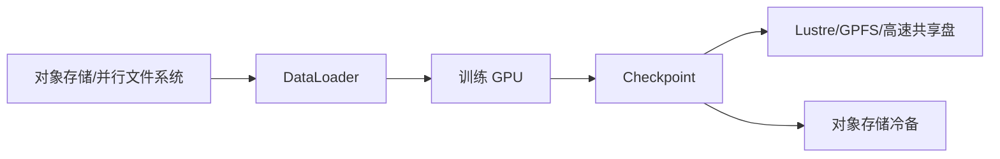

**框架差异点（加分）：**

- DDP/FSDP：常见 `torch.save` / distributed checkpoint
- DeepSpeed：`model_engine.save_checkpoint`
- Megatron：按 TP/PP rank 分片，转换工具链要会说

---

### 4.12 面试热门点（阶段四 · 框架向）

**概念题**

- [ ] DDP、FSDP、DeepSpeed ZeRO、Megatron TP 各自解决什么
- [ ] 为什么微调常用 DeepSpeed/FSDP，预训练常用 Megatron
- [ ] ZeRO-3 和 Tensor Parallel 都能“切开参数”，差异是什么
- [ ] Accelerate 在架构里处于哪一层
- [ ] NeMo 和 Megatron-Core 是什么关系

**配置题**

- [ ] 解释 `train_batch_size / micro_batch / gas / dp_size` 关系
- [ ] ZeRO stage 2 和 3 怎么选
- [ ] FSDP 的 `auto_wrap` 为什么重要
- [ ] Megatron 的 TP=8 PP=4 DP=? 怎么根据集群算

**排查题**

- [ ] DeepSpeed Offload 后更慢，可能原因
- [ ] Megatron TP 跨节点会怎样
- [ ] HF Trainer 挂 DeepSpeed 后 rank0 才保存的坑
- [ ] 如何从日志判断慢在通信还是计算

**对照课程**：[course/04-distributed-training.md](../course/04-distributed-training.md)

---

## 阶段五：后训练 —— SFT / RL / 对齐（2-3 周，面试极热）

> 大模型落地岗位高频：不是只问预训练并行，更常问 **SFT 怎么做、RLHF/DPO 差在哪、显存为什么暴涨、用什么框架**。

### 5.0 先建立全链路坐标

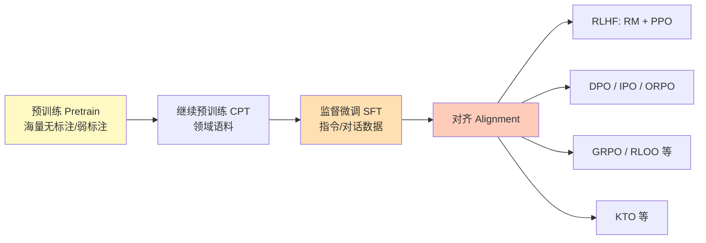

| 阶段 | 目标 | 数据 | Infra 特征 |
|------|------|------|-----------|
| Pretrain | 学语言与知识 | 万亿 token 网页/书/代码 | Megatron、极致吞吐 |
| CPT | 灌领域知识 | 领域语料 | 类似预训练，规模较小 |
| SFT | 听指令、会格式 | 指令-回答对 | HF/TRL + ZeRO/FSDP/LoRA |
| Alignment | 更有用/安全/符合偏好 | 偏好对、奖励信号 | 多模型同时驻留，显存压力大 |

---

### 5.1 SFT（Supervised Fine-Tuning）

#### 5.1.1 在做什么

给定 `(prompt, response)`，用标准 **因果语言建模损失**（只在 response token 上算 loss，prompt 常 mask 掉）：

```
maximize log P(response | prompt)
```

**面试一句话**：SFT = 用高质量示范，把基座模型调成“会按指令说话”的聊天模型。

#### 5.1.2 你必须掌握的内容

| 主题 | 要点 |
|------|------|
| 数据格式 | Alpaca / ShareGPT / messages（system/user/assistant） |
| Chat Template | tokenizer.apply_chat_template；不同模型模板不同 |
| Loss Mask | 只训练回答部分，不训练 prompt（`labels=-100`） |
| Packing | 多短样本拼成长序列，提高 GPU 利用率 |
| 全参 vs PEFT | Full SFT vs LoRA / QLoRA / DoRA |
| 过拟合信号 | 训练集 loss 很低但评测掉点、幻觉增加 |
| 评测 | 指令遵循、IFEval、人工抽检、业务集 |

#### 5.1.3 LoRA / QLoRA（SFT Infra 必问）

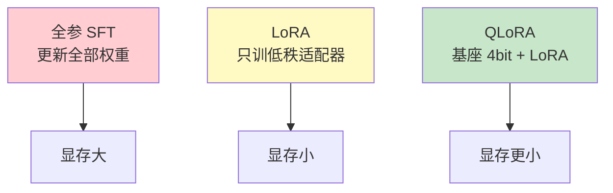

| 方法 | 做法 | 适用 |
|------|------|------|
| Full SFT | 更新全部参数 | 数据多、要极致效果、卡够 |
| LoRA | 冻结基座，训 A/B 低秩矩阵 | 大多数业务微调 |
| QLoRA | 4bit 加载基座 + LoRA | 单卡/少卡场景 |
| DoRA / LoRA+ | LoRA 变体 | 效果微调优化 |

**Infra 要点：**

- LoRA 可合并回基座（merge），部署时可不留适配器开销
- 多 LoRA 服务（推理侧）与训练侧多任务适配器要分开谈
- 全参 SFT 常用 DeepSpeed ZeRO-2/3 或 FSDP；LoRA 往往 DDP 就够

#### 5.1.4 SFT 常用框架

| 框架 | 角色 |
|------|------|
| **TRL `SFTTrainer`** | 官方对齐库里的 SFT 入口 |
| HF `Trainer` | 通用 SFT |
| **LLaMA-Factory** | YAML 一站式 SFT/LoRA |
| **ms-swift** | 阿里系多模型微调 |
| **Axolotl** | 配置驱动 SFT |
| NeMo / Megatron | 大规模 SFT（偏工业） |

---

### 5.2 偏好数据与奖励模型（对齐的数据基础）

对齐前先懂数据长什么样：

| 数据形态 | 形式 | 用于 |
|---------|------|------|
| 指令数据 | `(x, y)` | SFT |
| 偏好对 | `(x, y_w, y_l)` 赢/输回答 | DPO、RM 训练 |
| 标量奖励 | `(x, y) → r` | RM、部分在线 RL |
| 人类/AI 反馈 | 排序、打分、宪法原则 | RLHF / RLAIF |

**Reward Model（RM）粗解：**

- 输入：prompt + response
- 输出：标量分数
- 训练：让 `r(y_w) > r(y_l)`（Bradley-Terry 等）
- 用途：给 PPO 等算法当奖励函数

---

### 5.3 RLHF（经典：SFT → RM → PPO）

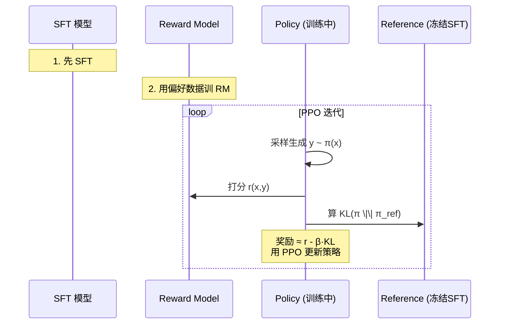

#### 5.3.1 为什么要 Reference + KL

防止模型为了刷高 RM 分数而 **reward hacking**（胡言乱语但分数高）。  
KL 惩罚让策略不要离 SFT 模型太远。

#### 5.3.2 PPO 在 LLM 里要驻留哪些模型（显存暴涨点）

| 模型 | 是否训练 | 作用 |
|------|---------|------|
| Policy（Actor） | ✅ | 当前要优化的模型 |
| Reference | ❌ 冻结 | 算 KL |
| Critic（Value） | ✅ | PPO value 头 |
| Reward Model | ❌ 冻结 | 打分 |

**面试高频**：PPO 为什么贵？→ 最多相当于 **4 份模型** 相关计算/驻留（实现可共享骨干、LoRA 化，但仍远贵于 SFT）。

#### 5.3.3 RLHF Infra 关注点

- 生成阶段（rollout）是推理负载：可用 vLLM/SGLang 加速采样
- 训练阶段回到反向传播
- 样本效率低、不稳定、超参多（`β`、clip、lr）
- 管道长：数据 → SFT → RM → PPO → 评测

---

### 5.4 DPO 及“不用显式 RM”的偏好方法

#### 5.4.1 DPO（Direct Preference Optimization）

**核心思想**：在一定假设下，直接用偏好对优化策略，**不必单独训 RM + PPO**。

```
给定 (x, y_w, y_l)
拉高 π(y_w|x)/π_ref(y_w|x)
压低 π(y_l|x)/π_ref(y_l|x)
```

| 对比 | RLHF(PPO) | DPO |
|------|-----------|-----|
| 是否需要 RM | 需要 | 不需要 |
| 是否在线采样 | 需要大量 generate | 离线偏好对即可 |
| 工程复杂度 | 高 | 相对低 |
| 显存 | 很高 | 中（policy + ref，约 2 份） |
| 效果/稳定性 | 上限可能更高但难调 | 工业微调很常用 |

#### 5.4.2 同族方法（面试知道差异即可）

| 方法 | 一句话 |
|------|--------|
| **IPO** | 对 DPO 目标正则化更稳 |
| **ORPO** | 把 SFT 与偏好优化合并，常可不单独要 ref |
| **KTO** | 用“好/坏”二元信号，不必成对偏好 |
| **SimPO** | 简化参考模型依赖的偏好优化 |
| **Contrastive / 其他** | 持续有新变体，抓住“偏好优化”共性 |

---

### 5.5 在线 RL：GRPO / RLOO 等（近年热点）

> DeepSeek 等技术报告后，**GRPO** 成为面试热词。

#### 5.5.1 为什么还要在线 RL？

- DPO 依赖静态偏好数据，可能 **分布外**（模型变强后旧偏好不够）
- 数学/代码等可用 **可验证奖励**（对错、编译通过、单测）做 RL，不必人类两两对比

#### 5.5.2 GRPO（Group Relative Policy Optimization）直觉

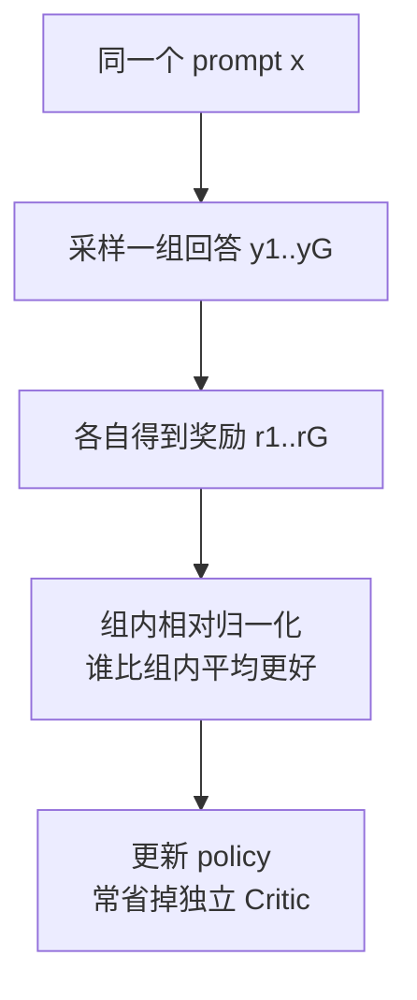

**和 PPO 比，你要能说的点：**

- 用同 prompt 的一组样本做相对优势，降低对 Value Model 的依赖
- 仍需要 rollout（在线生成）+ 奖励
- 奖励可以是 RM，也可以是规则/编译器/数学 checker（RLVR）

#### 5.5.3 相关名词

| 名词 | 含义 |
|------|------|
| RLOO | REINFORCE Leave-One-Out，用组内基线减方差 |
| RLVR | Reinforcement Learning with Verifiable Rewards |
| Process Reward | 过程奖励（逐步打分）vs Outcome Reward（最终对错） |
| Rejection Sampling | 生成多条，用 RM 挑最好再 SFT（简单强基线） |

---

### 5.6 后训练框架地图（必须会选型）

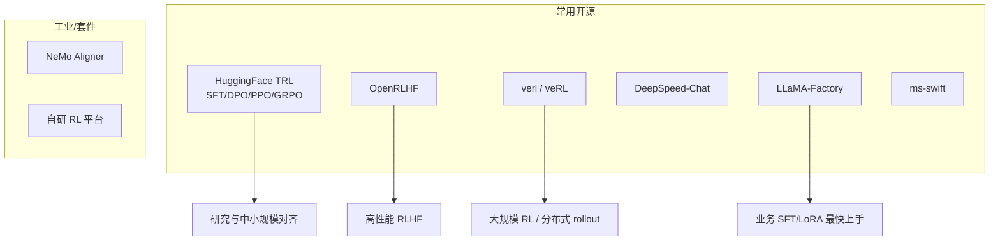

| 框架 | 覆盖能力 | 什么时候提 |
|------|---------|-----------|
| **TRL** | `SFTTrainer` / `DPOTrainer` / `PPOTrainer` / GRPO 等 | 默认开源对齐库 |
| **OpenRLHF** | 高性能 RLHF，常接 vLLM rollout | PPO/Ray 分布式 |
| **verl** | 大规模 RL 训练系统（卷 rollout/训练分离） | 面试“RL Infra”加分 |
| **DeepSpeed-Chat** | 三件套示例（SFT/RM/PPO） | 学习经典 RLHF 流程 |
| **LLaMA-Factory / ms-swift** | SFT/DPO/KTO 等一站式 | 业务交付 |
| **NeMo Aligner** | NVIDIA 对齐配方 | 企业 NVIDIA 栈 |
| **Axolotl** | SFT/DPO 配置化 | 开源微调 |

---

### 5.7 显存与系统差异（Infra 视角）

| 阶段 | 大约驻留 | 主要瓶颈 |
|------|---------|---------|
| LoRA SFT | 1×基座(可量化) + 小适配器 | 数据与吞吐 |
| Full SFT | 1×模型训练态（ZeRO/FSDP） | 显存与通信 |
| DPO | Policy + Ref（约 2×） | 显存、配对数据质量 |
| PPO RLHF | Policy+Ref+Critic+RM（最多约 4×） | 显存、采样速度、稳定性 |
| GRPO | Policy(+Ref) + 组采样 | **rollout 吞吐**、奖励服务 |

**系统优化点（加分）：**

1. Rollout 与训练分离：生成用推理引擎，训练用 DeepSpeed/FSDP
2. 奖励模型独立服务化（HTTP/gRPC），避免和训练抢同卡
3. 样本缓存、异步 PPO、混合精度
4. LoRA 做 policy，显著降对齐成本

---

### 5.8 数据与评测（后训练成败关键）

| 主题 | 你要会说什么 |
|------|-------------|
| SFT 数据质量 | 杂数据不如少而精；格式统一；拒答/安全样本 |
| 偏好数据噪声 | 标注不一致会直接伤 DPO/RM |
| 配比 | 通用:数学:代码:安全 如何混合 |
| 评测 | MT-Bench、Arena、IFEval、MMLU、业务人工评 |
| 回归 | 对齐后通用能力掉点（alignment tax） |

---

### 5.9 推荐学习/落地顺序

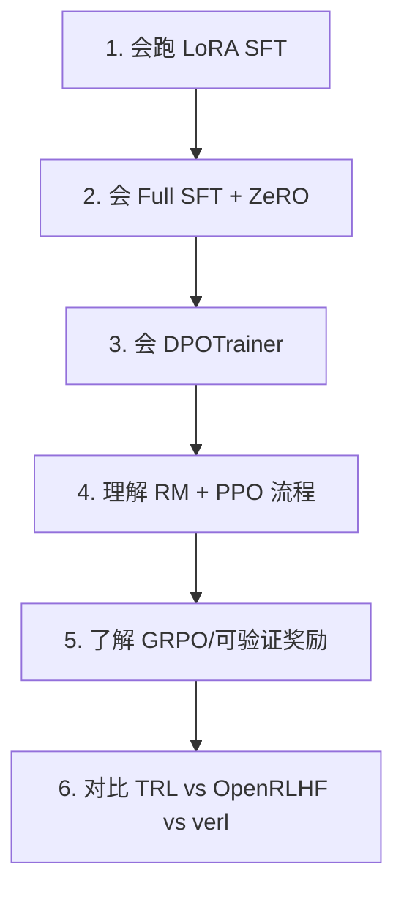

**最小动手清单：**

1. 用 TRL/LLaMA-Factory 跑通一个 LoRA SFT
2. 准备偏好数据，跑通 DPO
3. 读一遍 PPO RLHF 管线（哪怕只跑 toy）
4. 能画图解释 GRPO 相对 PPO 省了什么

---

### 5.10 面试热门点（阶段五）

- [ ] Pretrain / CPT / SFT / Alignment 各自目标与数据
- [ ] SFT 为什么要 mask prompt loss
- [ ] LoRA 和 QLoRA 区别；何时必须全参
- [ ] RLHF 三阶段；PPO 里四个模型各自干什么
- [ ] 为什么要 KL / reference model
- [ ] DPO 相对 PPO 的工程优势与局限
- [ ] ORPO / KTO / IPO 各自解决什么痛点（一句话级）
- [ ] GRPO 是什么；为何适合数学/代码 RL
- [ ] 对齐阶段显存为什么比 SFT 大
- [ ] TRL、OpenRLHF、verl、LLaMA-Factory 怎么选
- [ ] 什么是 reward hacking / alignment tax

---

## 阶段六：K8s + 硬件关系（2-3 周，重点加强）

> 目标：不只会写 YAML，还能说清“K8s 如何看见 GPU，如何按拓扑调度，如何服务训练作业”。

### 6.1 一张图看懂：硬件 → K8s → 训练作业

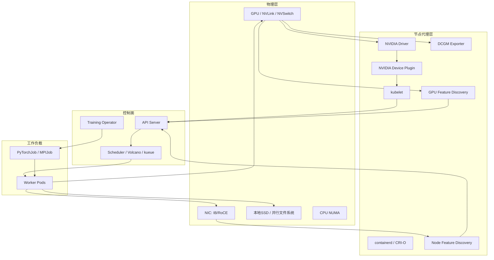

### 6.2 K8s 与 GPU 硬件如何“接上”

| 组件 | 作用 | 面试怎么讲 |
|------|------|-----------|
| NVIDIA Driver | 内核级驱动 | 容器要用 GPU 的前提 |
| NVIDIA Container Toolkit | 把 GPU 设备注入容器 | 解决容器里看不见 GPU |
| Device Plugin | 向 kubelet 汇报 `nvidia.com/gpu` | K8s 扩展资源模型 |
| NFD / GFD | 打标签：型号、MIG、驱动版本 | 调度亲和的基础 |
| GPU Operator | 一键装驱动/插件/监控 | 生产集群常见装法 |

**Pod 申请 GPU：**

```yaml
resources:
  limits:
    nvidia.com/gpu: 8
```

注意：

- GPU 通常是 **整数扩展资源**，默认不能像 CPU 一样小数切（除非 MIG/时间片方案）。
- `requests`/`limits` 对 GPU 一般相同；分配是独占语义（非 MIG 时）。

### 6.3 硬件拓扑为什么影响调度

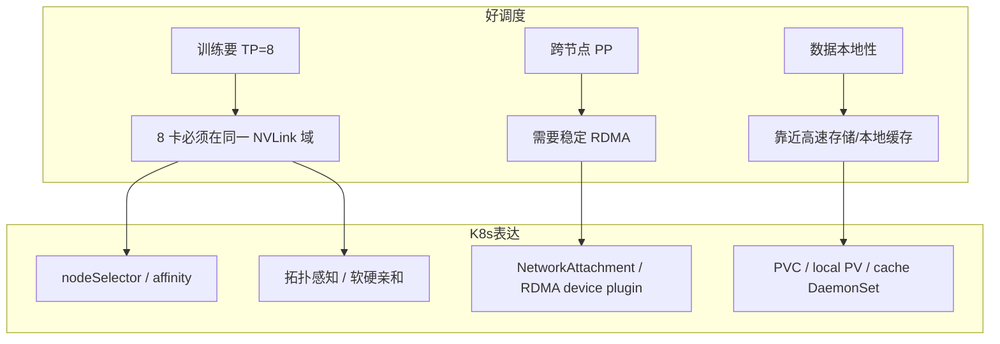

**面试高频结论：**

1. **不是所有“8 张 GPU”都等价**：跨 PCIe root complex / 跨 NUMA 可能让 NCCL 变慢。
2. 训练调度要尽量 **整机装箱**（同一节点吃满 8 卡），减少碎片。
3. 推理可以 MIG/共享；训练多卡作业几乎总是 **独占整卡**。

### 6.4 GPU 共享与切分（K8s 视角）

| 技术 | 硬件含义 | K8s 表现 | 适不适合训练 |
|------|---------|---------|-------------|
| 整卡独占 | 一张卡给一个 Pod | `nvidia.com/gpu: 1` | 训练默认 |
| MIG | A100/H100 硬件切分实例 | `nvidia.com/mig-1g.10gb` 等 | 小推理可以，大训少用 |
| Time-slicing | 软件分时 | 扩展资源超售 | 不适合强隔离训练 |
| MPS | 多进程共享上下文 | 需额外配置 | 多为推理 |

### 6.5 训练作业在 K8s 上的关键能力

#### Gang Scheduling（必须懂）

分布式训练需要 **所有 worker 同时就绪**。普通 Scheduler 可能先启动部分 Pod，占着 GPU 等其余资源 → 死锁/饿死。

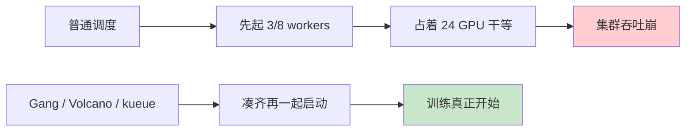

#### Training Operator

- `PyTorchJob` / `MPIJob` / `TFJob`
- 负责多副本、环境变量（`MASTER_ADDR`、`WORLD_SIZE`）、失败重启策略

#### 队列与配额

- Volcano Queue / kueue / 二级调度
- 目的：多团队抢 GPU 时保证公平与优先级（训练 vs 推理 vs 开发）

### 6.6 网络、存储与 K8s 的关系（训练特供）

| 硬件/系统 | 训练用途 | K8s 侧常见做法 |
|----------|---------|----------------|
| IB/RoCE NIC | NCCL 跨节点 | RDMA device plugin、hostNetwork 或 SR-IOV |
| NVLink 域 | TP | 按节点型号亲和，整机调度 |
| 本地 NVMe | shuffle / cache | local PV、DaemonSet 预热 |
| Lustre/GPFS | 数据与 CKPT | CSI / hostPath / 专用存储类 |
| 对象存储 | 数据集、产物 | initContainer 拉取或 Fuse |

**坑点（面试加分）：**

- 容器网络叠加层可能毁掉 RDMA 性能 → 训练常要 **高速网直通**。
- Checkpoint 打满共享存储会拖垮整集群 → 需要限流与分层存储。
- 镜像过大（含 CUDA+框架）导致冷启动慢 → 镜像分层、节点缓存、按机型打镜像。

### 6.7 监控：从硬件错误到作业失败

| 信号 | 来源 | 动作 |
|------|------|------|
| GPU Util / SM Active | DCGM | 判断是否空转 |
| ECC / Xid | DCGM | 隔离坏卡/坏节点 |
| 显存占用 | DCGM / 框架 | OOM 复盘 |
| NCCL 超时 | 训练日志 | 查网络/拓扑/防火墙 |
| Pod Pending | K8s 事件 | 资源碎片、亲和过严 |

### 6.8 最小可行训练 YAML 思维模型

你要能解释每个字段“对应哪层硬件/系统”：

```yaml
apiVersion: kubeflow.org/v1
kind: PyTorchJob
metadata:
  name: llm-pretrain
spec:
  pytorchReplicaSpecs:
    Worker:
      replicas: 4          # 对应 4 机
      template:
        spec:
          nodeSelector:
            gpu.product: "NVIDIA-H100-80GB"   # 硬件型号
          containers:
          - name: pytorch
            resources:
              limits:
                nvidia.com/gpu: 8             # 每机 8 卡 = TP/本地通信域
            volumeMounts:
            - name: data
              mountPath: /data               # 并行文件系统
            - name: ckpt
              mountPath: /ckpt
          volumes:
          - name: data
            persistentVolumeClaim:
              claimName: train-data
          - name: ckpt
            persistentVolumeClaim:
              claimName: train-ckpt
```

### 6.9 面试热门点（阶段六）

- [ ] Device Plugin 解决什么问题？没有它会怎样？
- [ ] 为什么训练要 Gang Scheduling？
- [ ] 如何保证 TP=8 落在同一 NVLink 域？
- [ ] MIG 和整卡独占如何选？
- [ ] RDMA 在 K8s 里如何暴露给 NCCL？
- [ ] 训练队列里优先级、抢占、配额怎么设计？
- [ ] 节点 GPU 故障时，作业如何自动重调度并 resume？

**对照课程**：[course/08-k8s-ai-infra.md](../course/08-k8s-ai-infra.md)

---

## 阶段七：推理服务化 —— KV Cache / vLLM / PD 分离（2-3 周）

> 目标：能讲清推理两阶段瓶颈，会用 vLLM，能画 **PD 分离** 架构，知道和训练并行/显存概念如何对应。

### 7.0 推理全景

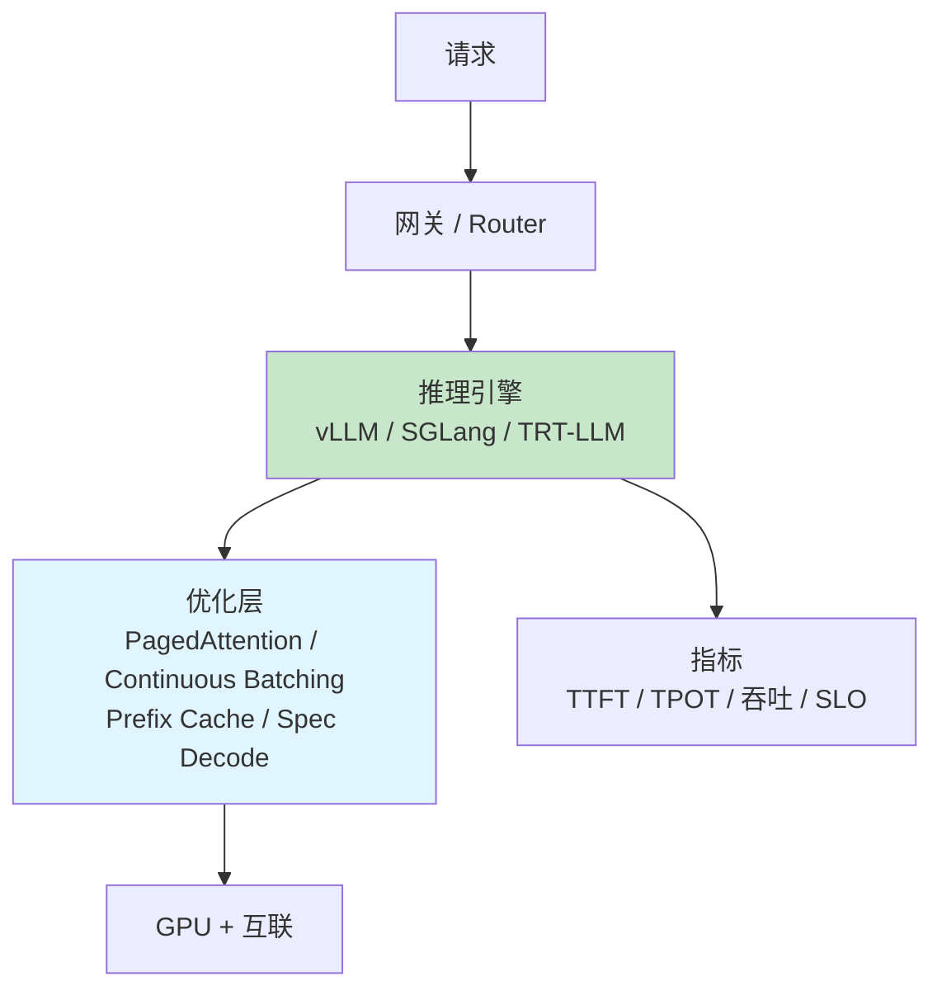

| 层级 | 你要掌握什么 |
|------|-------------|
| 原理 | Prefill/Decode、KV Cache、Memory Bound |
| 引擎 | vLLM 必会；SGLang / TRT-LLM / TGI / LMDeploy 会对比 |
| 架构 | 单机服务 → 多副本 → **PD 分离** → 多级缓存 |
| 优化 | 量化、投机解码、前缀缓存、Chunked Prefill |
| 运维 | K8s 部署、扩缩容、SLO、成本 $/M tokens |

---

### 7.1 Prefill vs Decode（一切推理优化的起点）

```mermaid
sequenceDiagram
    participant U as 用户
    participant E as 引擎

    U->>E: prompt
    Note over E: Prefill: 并行吃完 prompt<br/>算并写入 KV Cache<br/>通常 Compute Bound
    E-->>U: 首 token (影响 TTFT)
    loop Decode
        Note over E: 每次 1 个新 token<br/>读 KV Cache<br/>通常 Memory Bound
        E-->>U: 下一个 token (影响 TPOT)
    end
```

| 阶段 | 计算形态 | 瓶颈 | 优化方向 |
|------|---------|------|---------|
| Prefill | 大矩阵乘，序列并行度高 | Compute Bound | FlashAttention、更大 batch、专用 Prefill 池 |
| Decode | 向量×矩阵，反复读权重+KV | Memory Bound | 更大 batch、量化、GQA、PD 分离到大显存卡 |

**面试一句话**：同一套权重，Prefill 像“算力活”，Decode 像“带宽活”；混在一张卡上会互相抢资源。

---

### 7.2 KV Cache（必会算）

```
KV ≈ 2 × layers × kv_heads × head_dim × seq_len × batch × dtype_bytes
```

| 考点 | 你要能答 |
|------|---------|
| 为什么能 cache | Causal 下历史 K/V 不再变 |
| 为什么 Q 不 cache | Decode 只要新 token 的 Q |
| GQA/MQA | 减少 kv_heads → Cache 变小 |
| 长上下文 | seq 线性涨，Cache 成主矛盾 |
| 碎片 | 预分配 max_len 浪费 → PagedAttention |

详见课程：[course/05-inference-kv-cache.md](../course/05-inference-kv-cache.md)

---

### 7.3 核心优化技术清单

```mermaid
graph TD
    A[推理优化] --> B[显存管理]
    A --> C[调度批处理]
    A --> D[计算/算法]
    A --> E[系统架构]

    B --> B1[PagedAttention]
    B --> B2[KV 量化]
    B --> B3[GQA/MQA]

    C --> C1[Continuous Batching]
    C --> C2[Chunked Prefill]
    C --> C3[优先级调度]

    D --> D1[FlashAttention]
    D --> D2[投机解码 Speculative]
    D --> D3[权重量化 AWQ/GPTQ/FP8]

    E --> E1[Prefix / Radix Cache]
    E --> E2[PD 分离 Disaggregation]
    E --> E3[多 LoRA / 多模型]

    style B1 fill:#c8e6c9
    style C1 fill:#c8e6c9
    style E2 fill:#fff9c4
```

#### 7.3.1 PagedAttention

类比 OS 虚拟内存：KV 按 block 按需分配，消除碎片，提高并发。

| OS | PagedAttention |
|----|----------------|
| Page | KV Block |
| Page Table | Block Table |
| 物理内存 | GPU 显存 |

#### 7.3.2 Continuous Batching（In-flight Batching）

- Static：等最长请求结束 → GPU 空转
- Continuous：每步可插入新请求、移除完成请求 → 吞吐常见 **2–4×**

#### 7.3.3 Chunked Prefill

长 prompt 的 Prefill 切块，与 Decode 交替，避免 TTFT/TPOT 被长预填充“卡住”。

#### 7.3.4 Prefix / Radix Caching

共享 system prompt、多轮对话前缀 → 复用 KV，降 TTFT。  
SGLang 的 RadixAttention 是树状前缀复用的代表。

#### 7.3.5 Speculative Decoding

小模型草拟多 token，大模型一次验证 → 降 Decode 延迟（质量可对齐）。

#### 7.3.6 量化

| 路线 | 典型 | 作用 |
|------|------|------|
| W8A16 / W4A16 | GPTQ、AWQ | 减权重带宽与显存 |
| FP8 | Hopper | 训练/推理新精度 |
| KV Cache 量化 | INT8/FP8 KV | 直接放大并发 |

---

### 7.4 vLLM（推理面试默认题库）

#### 7.4.1 定位与架构

```mermaid
graph TD
    API[OpenAI Compatible API] --> SCH[Scheduler<br/>Continuous Batching]
    SCH --> ENG[LLM Engine]
    ENG --> PA[PagedAttention KV Manager]
    ENG --> EX[Executor / Worker]
    EX --> TP[Tensor Parallel Workers]
    EX --> GPU[GPU Kernels / CUDA Graph]

    style SCH fill:#e1f5fe
    style PA fill:#c8e6c9
```

**vLLM 你要会说的能力清单：**

| 能力 | 说明 |
|------|------|
| PagedAttention | 业务名片 |
| Continuous Batching | 吞吐核心 |
| OpenAI API | `/v1/chat/completions` 兼容 |
| Tensor Parallel | `--tensor-parallel-size` |
| Pipeline Parallel | 超大模型补充 |
| Prefix Caching | 自动前缀复用 |
| Chunked Prefill | 平滑长 prompt |
| Speculative Decoding | 草稿模型加速 |
| 量化 | AWQ/GPTQ/FP8/压缩等 |
| Multi-LoRA | 多适配器同时服务 |
| Structured Outputs | 结构化生成（版本演进中） |
| Disaggregated serving | 新版本/生态向 PD 分离演进（需跟版本） |

#### 7.4.2 必会启动与调参

```bash
vllm serve <model> \
  --tensor-parallel-size 2 \
  --gpu-memory-utilization 0.92 \
  --max-model-len 8192 \
  --max-num-seqs 256 \
  --enable-prefix-caching \
  --enable-chunked-prefill
```

| 参数 | 影响 |
|------|------|
| `gpu-memory-utilization` | KV Cache 池大小 ↔ 并发上限 |
| `max-model-len` | 最长上下文，过大直接吃掉并发 |
| `max-num-seqs` | 最大并发序列数 |
| `tensor-parallel-size` | 大模型切卡；通信走 NVLink 最佳 |
| prefix / chunked | TTFT 与长 prompt 体验 |

#### 7.4.3 观测指标（vLLM metrics）

- `num_requests_running` / `waiting`
- `gpu_cache_usage_perc`
- TTFT / TPOT 分位（P50/P99）
- 系统吞吐 tokens/s

**面试排查套路**：Waiting 高 → 并发/KV 不够；Cache 打满 → 降 max-len 或扩卡；TTFT 高 → Prefill 过重或排队。

---

### 7.5 其他推理框架对比（会选型）

| 框架 | 核心卖点 | 典型场景 |
|------|---------|---------|
| **vLLM** | PagedAttention + 生态全 | 通用 LLM 服务默认选项 |
| **SGLang** | RadixAttention、结构化生成快 | Agent / 复杂 prompt / 前缀复用强 |
| **TensorRT-LLM** | NVIDIA 极致 kernel、FP8 | 固定模型追延迟极限 |
| **TGI** | HF 官方推理服务 | HF 生态集成 |
| **LMDeploy** | TurboMind、量化部署 | 国内常见、端到端工具链 |
| **TensorRT / Triton** | 通用推理服务平台 | 多模型统一 serving |
| **llama.cpp / Ollama** | CPU/消费卡友好 | 本地/边缘，非机房主力 |
| **LightLLM / MindIE 等** | 各厂自研引擎 | 特定栈 |

**选型一句话：**

- 要通用、好招人、好运维 → **vLLM**
- 要极致前缀复用/结构化 → **SGLang**
- 要 NVIDIA 吃满、模型稳定 → **TRT-LLM**
- 要企业多框架统一入口 → **Triton** 挂后端引擎

---

### 7.6 PD 分离（Prefill–Decode Disaggregation）——架构热点

#### 7.6.1 为什么要分离？

同机混部时的矛盾：

| 现象 | 原因 |
|------|------|
| 长 Prefill 卡住 Decode | 抢算力，TPOT 抖动 |
| Decode 吃不满算力 | Memory Bound，GPU 算力浪费 |
| 资源画像不同 | Prefill 要高算力；Decode 要大显存高带宽 |
| 扩缩容耦合 | 流量涨时不知道该加“预填充能力”还是“解码能力” |

```mermaid
graph LR
    REQ[请求] --> P[Prefill Pool<br/>算力型 GPU<br/>如 H100]
    P -->|传输 KV Cache| D[Decode Pool<br/>显存/带宽型<br/>如 H200 / 更多并发卡]
    D --> OUT[流式输出]

    style P fill:#fff9c4
    style D fill:#c8e6c9
```

#### 7.6.2 PD 分离你要掌握的关键点

| 主题 | 内容 |
|------|------|
| KV 传递 | Prefill 算完的 KV 送到 Decode 实例（RDMA / 专用传输） |
| 调度 | Router 按负载把新请求派到 Prefill，再绑定 Decode |
| 亲和与拓扑 | 传输延迟敏感，尽量同机柜/同 IB 域 |
| 弹性 | Prefill 副本数、Decode 副本数 **独立扩缩** |
| 失败 | Prefill 成功但 Decode 挂了如何重算/迁移 |
| 与 Continuous Batching | Decode 池内仍做 continuous batching |

#### 7.6.3 相关系统 / 论文名词（面试加分）

| 名称 | 你要知道什么 |
|------|-------------|
| DistServe | 较早系统化论证 PD 分离收益 |
| Mooncake / 类似 KV 中心架构 | 以 KV 为中心的存储与调度思路 |
| Splitwise | 云上 PD 分离与异构实例 |
| vLLM / SGLang 生态演进 | 引擎侧逐步原生支持 disagg |
| Inference Gateway | 统一路由、限流、模型灰度 |

#### 7.6.4 什么时候上 PD 分离？

| 适合 | 不急着上 |
|------|---------|
| 长 prompt + 长生成，SLO 严 | 小流量、短上下文 |
| Prefill/Decode 互相干扰明显 | 单卡/单机就能满足 SLO |
| 集群规模大，要独立扩缩 | 团队还不会先把 vLLM 单池调顺 |
| 有高速网络传 KV | 网络很差，KV 传输比重算还贵 |

**面试表述模板：**

> Prefill 与 Decode 瓶颈不同。PD 分离把两者放到不同资源池，用高速网络搬运 KV，换取更稳的 TPOT 和更高的集群利用率；代价是系统复杂度和 KV 传输开销。

---

### 7.7 推理并行与部署形态

| 形态 | 含义 | 何时用 |
|------|------|--------|
| 单卡单副本 | 一卡一模型 | 7B/8B 量化 |
| TP 单副本 | 模型横切多卡 | 70B 级 |
| 多副本 DP 服务 | 多实例负载均衡 | 提 QPS |
| Expert Parallel | MoE 专家并行 | Mixtral 等 |
| PD 分离 | P 池 + D 池 | 大规模生产 |
| Prefill 缓存层 | 全局 prefix/KV pool | 多租户同前缀 |

---

### 7.8 服务化指标与 SLO

| 指标 | 含义 | 典型关注 |
|------|------|---------|
| TTFT | 首 token 延迟 | 交互体验 |
| TPOT / ITL | 每输出 token 间隔 | 阅读流畅度 |
| E2E latency | 整段生成时间 | 批处理任务 |
| Throughput | 集群 tokens/s | 成本 |
| Goodput | 满足 SLO 的有效吞吐 | 比裸吞吐更重要 |
| 并发 / 队列长度 | 是否该扩容 | HPA 信号 |

**成本口径**：`$ / 1M tokens`，要能说到利用率、量化、PD、批处理如何压成本。

---

### 7.9 K8s 上的推理（和阶段六衔接）

```mermaid
graph TD
    ING[Ingress / Gateway] --> SVC[Service]
    SVC --> DPLOY[vLLM Deployment]
    DPLOY --> HPA[HPA/KEDA<br/>按队列/GPU/QPS]
    DPLOY --> PVC[模型缓存 PVC]
    DPLOY --> GPU[nvidia.com/gpu]
```

要点：

- 模型加载慢 → 本地缓存 / 镜像预热 / PVC
- HPA 不要只盯 CPU，要盯 **waiting requests / KV 使用率**
- 推理可 MIG/共享；大模型 TP 仍要整机拓扑
- PD 分离时：两套 Deployment + Router + 高速网

---

### 7.10 和训练的概念对照（加分）

| 训练 | 推理 |
|------|------|
| 激活显存 | KV Cache |
| TP | 推理 TP |
| PP | 偶用于超大推理 |
| GQA | 减 KV |
| MFU | 更常看 TTFT/吞吐/Goodput |
| NCCL AllReduce | 推理 TP 的集合通信（规模通常更小） |
| Checkpoint | 模型权重发布 / LoRA 热更新 |

---

### 7.11 动手最小集

1. `vllm serve` 拉起模型，打 OpenAI API
2. 压测：变化 `max-num-seqs` / `max-model-len`，观察 Cache% 与吞吐
3. 打开 prefix caching，对比重复 system prompt 的 TTFT
4. 画一张 PD 分离架构图（Router / P 池 / D 池 / KV 传输）
5. （进阶）读 DistServe 或引擎文档里 disaggregation 章节

**对照课程**：

- [course/05-inference-kv-cache.md](../course/05-inference-kv-cache.md)
- [course/06-inference-optimization.md](../course/06-inference-optimization.md)
- [course/07-inference-frameworks.md](../course/07-inference-frameworks.md)

---

### 7.12 面试热门点（阶段七）

- [ ] Prefill/Decode 瓶颈分别是什么？为何混部会抖动？
- [ ] KV Cache 公式；GQA 如何减 Cache
- [ ] PagedAttention 解决什么？类比 OS 哪块
- [ ] Continuous Batching vs Static Batching
- [ ] Chunked Prefill、Prefix Cache 各解决什么
- [ ] vLLM 关键参数与 metrics 怎么用于排障
- [ ] vLLM vs SGLang vs TRT-LLM 怎么选
- [ ] **PD 分离**：动机、KV 传输、独立扩缩、适用条件
- [ ] TTFT / TPOT / Goodput / SLO 关系
- [ ] 投机解码基本流程
- [ ] 多 LoRA 服务要注意什么
- [ ] K8s 上推理 HPA 该盯哪些信号

---

## 阶段八：AI Infra 全景补齐（此前未展开的关键域）

> 阶段一～七覆盖了「训 / 齐 / 推 / K8s」主干。本阶段把 **数据、调度器、MLOps、评测、RAG/Agent、编译器、异构算力、FinOps、安全、SRE** 等补齐，形成完整版图。

```mermaid
mindmap
  root((AI Infra 全景))
    数据工程
      采集清洗去重
      Tokenize与配比
      版本与血缘
    集群调度
      Slurm
      K8s
      Ray
    MLOps
      实验跟踪
      模型注册
      CI/CD
    评测与发布
      Offline Eval
      Online A/B
      灰度回滚
    应用侧Infra
      网关
      RAG/向量库
      Agent运行时
    性能栈
      编译与Kernel
      存储网络深挖
      弹性容错
    平台治理
      多租户
      FinOps
      安全合规
      可观测与Oncall
    扩展形态
      多模态
      MoE
      异构加速器
      批推理与边缘
```

---

### 8.1 数据基础设施（Data Infra）——训练的上游

大模型质量经常卡在数据，而不是又加了两张卡。

| 环节 | 你要掌握什么 | 常见工具/系统 |
|------|-------------|----------------|
| 采集 | Common Crawl、书籍、代码、对话、领域私有数据 | 爬虫、合作数据、开源集 |
| 清洗 | 语言识别、质量分、毒性/PII 过滤 | 规则 + 小模型打分 |
| 去重 | 精确/模糊/MinHash/语义去重 | datasketch、自研 pipeline |
| Tokenize | 词表训练、吞吐、多语支持 | SentencePiece、HuggingFace tokenizers |
| 配比/课程 | 各域比例、质量分层、curriculum | 数据配方 YAML |
| 格式与装载 | webdataset、indexed dataset、mmap | Megatron indexed、HF datasets |
| 版本与血缘 | 哪版数据训出哪版模型 | DVC、LakeFS、内部数据目录 |
| 合成数据 | 蒸馏、self-instruct、verifier 过滤 | 生成管线 + 质检 |

```mermaid
graph LR
    RAW[原始语料] --> CLEAN[清洗/过滤]
    CLEAN --> DEDUP[去重]
    DEDUP --> TOK[Tokenize]
    TOK --> MIX[配比/打包]
    MIX --> STORE[对象存储/并行FS]
    STORE --> TRAIN[训练 DataLoader]
```

**面试热词**：data recipe、decontamination（防评测集泄漏）、tokenizer fertility、packing efficiency。

---

### 8.2 集群调度：不止 K8s —— Slurm 与 Ray

| 系统 | 定位 | 典型用法 |
|------|------|---------|
| **Slurm** | HPC 作业调度，训练集群主流 | `sbatch` 提交多节点 GPU 作业、抢占、qos |
| **K8s + Volcano/kueue** | 云原生、推理+训练混部 | PyTorchJob、弹性服务 |
| **Ray** | 分布式计算运行时 | 数据预处理、RLHF rollout、批推理、分布式评测 |
| **MPI/SSH 手工** | 遗留/研究集群 | 了解即可 |

**Slurm 必会概念：**

- Partition / Account / QOS / Priority
- `#SBATCH --gpus-per-node`、`--nodes`、`--ntasks-per-node`
- 与 `torchrun`/`srun` 的结合
- 和 K8s 对比：Slurm 偏批作业与独占；K8s 偏服务与混部

**Ray 必会概念：**

- Task / Actor / Object Store
- Ray Train / Ray Serve / Ray Data
- 在 OpenRLHF、批评测、离线推理中的角色

---

### 8.3 工作流编排与 MLOps

| 能力 | 做什么 | 代表工具 |
|------|--------|---------|
| 实验跟踪 | loss、配置、指标、产物 | W&B、MLflow、TensorBoard、SwanLab |
| 模型注册 | 版本、阶段（Staging/Prod）、血缘 | MLflow Registry、内部 Model Hub |
| 流水线 | 数据→训→评→发布编排 | Airflow、Argo Workflows、Kubeflow Pipelines、Metaflow |
| Feature/Artifact | 中间产物管理 | 对象存储 + 清单文件 |
| 环境复现 | 镜像、CUDA、依赖锁定 | Docker、conda-lock、bazel（大厂） |

**最低要求**：一次训练能追溯「代码 commit + 数据版本 + 超参 + checkpoint」。

---

### 8.4 评测、发布与在线实验

| 类型 | 内容 |
|------|------|
| Offline 自动评测 | MMLU、GSM8K、HumanEval、IFEval、业务集 |
| LLM-as-Judge | 用强模型打分（有偏差，需校准） |
| 人工评测 | 盲评、对比评、安全红队 |
| Online | A/B、金丝雀、影子流量、互评 Arena |
| 回归门禁 | 对齐后防 alignment tax；发布卡点 |
| 评测 Infra | 分布式跑题、结果仓、看板、成本控制 |

**发布动作**：灰度百分比 → 盯 TTFT/错误率/人工抽检 → 全量或回滚。

---

### 8.5 LLM 网关与流量治理

```mermaid
graph LR
    APP[业务应用] --> GW[AI Gateway]
    GW --> R1[限流/鉴权/审计]
    GW --> R2[路由: 模型/LoRA/区域]
    GW --> R3[降级/缓存/重试]
    GW --> VLLM[vLLM 集群]
    GW --> EXT[第三方 API]
```

| 能力 | 说明 |
|------|------|
| 统一 API | OpenAI 兼容、多后端（LiteLLM、自研网关） |
| 限流配额 | 按租户/API Key 的 RPM/TPM |
| 路由 | 按模型名、成本、延迟、区域 |
| 可观测 | 请求日志（脱敏）、token 计量、链路追踪 |
| 安全 | Prompt 注入防护、输出过滤、PII 脱敏 |
| 缓存 | 语义缓存 / 精确缓存（慎用） |

---

### 8.6 RAG / 向量检索 / Embedding Infra

LLM 应用很大一块在检索增强，Infra 要会搭：

| 组件 | 职责 |
|------|------|
| 文档解析 | PDF/HTML/表格切片 |
| Embedding 服务 | 批量/在线向量化（可 GPU 批推理） |
| 向量库 | Milvus、Faiss、pgvector、Elastic、云检索 |
| 索引与更新 | 增量入库、版本、多租户隔离 |
| 检索链路 | 召回 → 重排 → 拼 prompt → 生成 |
| 评测 | Recall@K、答案正确率、延迟拆解 |

**和纯 LLM 推理的差异**：瓶颈常在 **检索与拼上下文长度**，不只在 Decode。

---

### 8.7 Agent Infra（工具调用运行时）

| 主题 | 内容 |
|------|------|
| 工具协议 | Function Calling、MCP、OpenAPI 工具注册 |
| 编排 | 多步规划、状态机、图工作流（LangGraph 等）
| 运行时 | 沙箱执行代码、浏览器、权限最小化 |
| 记忆 | 短记忆（对话）/ 长记忆（向量库） |
| 可观测 | 每步 trace、工具失败重试、成本按步计 |
| 与推理引擎 | 结构化输出、并行工具调用、前缀缓存友好 |

---

### 8.8 编译器、Kernel 与图优化

| 技术 | 作用 |
|------|------|
| `torch.compile` / Dynamo | 图捕获与编译加速 |
| Triton | 写高性能自定义 kernel |
| CUDA Graphs | 减 CPU launch 开销（推理常用） |
| FlashAttention / TE | 注意力与 FP8 融合 |
| Kernel Fusion | 少访存 |
| 导出 | ONNX / TensorRT 引擎构建 |
| 性能剖析 | Nsight、PyTorch Profiler、Perfetto |

**面试点**：什么时候该上 compile/CUDA Graph；动态 shape 的坑。

---

### 8.9 存储与网络深挖（平台侧）

#### 存储

| 系统 | 场景 |
|------|------|
| 对象存储 S3/OSS/MinIO | 数据集、产物、冷 CKPT |
| Lustre / GPFS / BeeGFS | 训练高吞吐并行读、热 CKPT |
| Alluxio / JuiceFS / Fluid | 缓存加速、云上数据就近 |
| 本地 NVMe | shuffle、节点缓存、临时 CKPT |
| 分布式 Checkpoint | PyTorch DCP、异步落盘、打满存储的限流 |

#### 网络（补充阶段三）

- NCCL Ring / Tree / NVLSTree
- 拓扑发现：`nvidia-smi topo -m`
- 拥塞、ECMP、PFC（RoCE）常见故障
- 训练 vs 推理对网络的不同敏感度

---

### 8.10 弹性训练、容错与 Checkpoint 工程

| 主题 | 要点 |
|------|------|
| 故障类型 | 软错误、Xid、节点丢、NCCL 超时 |
| 检测 | 心跳、watchdog、DCGM |
| 恢复 | 自动 resume、从最近 CKPT 拉起 |
| 弹性 | 节点数变化（Elastic/torchelastic） |
| 异步 CKPT | 减少 step 停顿 |
| 一致性 | 分片 CKPT 完整性校验 |
| 演练 | 定期故障注入 |

---

### 8.11 FinOps、容量规划与 Spot

| 主题 | 内容 |
|------|------|
| 成本口径 | GPU 时、$/M tokens、闲置率、碎片率 |
| 利用率 | SM Active、MFU、推理 Goodput |
| Spot/抢占 | 训练检查点密度、推理慎用 |
| 混部 | 训练低峰跑批推理/评测 |
| 右 sizing | 7B 不必上 8×H100；量化/小规格 |
| 容量规划 | 按 SLO 反推副本与 KV 池 |
| 配额 | 团队 GPU 配额、排队优先级 |

---

### 8.12 多租户、隔离与安全合规

| 维度 | 要点 |
|------|------|
| 租户隔离 | 命名空间、队列、网络策略、模型权重 ACL |
| 显存隔离 | 整卡独占 vs MIG；防吵闹邻居 |
| 密钥 | 模型 license、HF token、数据集凭据 |
| 数据合规 | PII、跨境、审计日志、保留策略 |
| 模型安全 | 越狱防护多在应用/网关；Infra 负责链路与落盘安全 |
| 供应链 | 镜像签名、依赖扫描、数据集来源 |

---

### 8.13 可观测性与 SRE（AI 集群 Oncall）

| 信号层 | 例子 |
|--------|------|
| 硬件 | 温度、掉卡、Xid、IB 错包 |
| 作业 | Pending 原因、步时抖动、OOM |
| 推理 | TTFT/TPOT、队列、KV%、错误码 |
| 应用 | 网关 5xx、工具调用失败率 |
| 链路 | TraceId 贯穿 gateway→engine |

**Oncall 手册要素**：告警分级、值班、故障复盘（RCARA）、容量周报。

---

### 8.14 模型压缩与效率（训练后/部署前）

| 技术 | 目的 |
|------|------|
| 量化 | 降显存与带宽（阶段七已覆盖） |
| 蒸馏 Distillation | 小模型学大模型 |
| 剪枝 Pruning | 稀疏/结构性减参 |
| Speculative | 推理加速（阶段七） |
| Medusa / EAGLE 等 | 多头草稿类加速 |
| 权重合并 | LoRA merge、模型汤 |

---

### 8.15 MoE Infra（训练 + 推理特供）

| 主题 | 内容 |
|------|------|
| 训练 | Expert Parallel、AllToAll、负载均衡、辅助损失 |
| 推理 | 专家权重驻留/卸载、EP+TP 组合、通信成为瓶颈 |
| 调度 | 热专家、容量因子 |
| 显存 | 总参数大但激活稀疏，和 dense 模型账本不同 |

---

### 8.16 多模态 Infra

| 模态 | Infra 差异 |
|------|-----------|
| 视觉语言模型 | ViT/编码器 + LLM；图像预处理流水线 |
| 语音 | 流式特征、实时性 |
| 视频 | 吞吐与存储压力极大 |
| 生成（扩散/DiT） | 与自回归 LLM 调度模型不同（逐步去噪） |
| 统一服务 | 多编码器缓存、不同 batching 策略 |

---

### 8.17 批推理、离线推理与异构算力

| 场景 | 要点 |
|------|------|
| Offline batch | 非 SLA 敏感；追求吞吐与成本；可用 Ray/Spark+GPU |
| Embedding 批跑 | 大批量向量化建库 |
| 异构加速器 | NVIDIA GPU、AMD、TPU、Trainium/Inferentia、昇腾 NPU |
| 软件栈差异 | CUDA vs ROCm vs 厂商 Runtime |
| 选型 | 生态成熟度、算子覆盖、集群运维成本 |

---

### 8.18 边缘 / 端侧（了解边界）

- llama.cpp、ONNX Runtime、CoreML、骁龙/苹果 NPU
- 与机房 AI Infra 目标不同：功耗、包体积、隐私
- 面试只需能划分边界，不必深挖除非岗位相关

---

### 8.19 CI/CD for AI

```mermaid
graph LR
    CODE[代码/配置] --> CI[CI: 单测/小规模过拟合]
    CI --> TRAIN[训练/微调 Job]
    TRAIN --> EVAL[自动评测门禁]
    EVAL --> REG[模型注册]
    REG --> STAGE[预发/影子]
    STAGE --> PROD[生产灰度]
    PROD --> MON[监控回滚]
```

要点：训练配置即代码；评测不过不能晋级；推理配置（TP、量化、max-len）也要版本化。

---

### 8.20 一张「端到端 AI 平台」总图

```mermaid
graph TB
    subgraph 数据平面
        D1[采集清洗] --> D2[特征/语料仓]
    end

    subgraph 训练平面
        T1[Slurm/K8s 训练] --> T2[CKPT/注册中心]
        T2 --> T3[SFT/RL 对齐]
    end

    subgraph 推理平面
        I1[网关] --> I2[vLLM/PD池]
        I1 --> I3[RAG/Agent]
    end

    subgraph 控制平面
        C1[调度配额]
        C2[观测告警]
        C3[FinOps]
        C4[安全合规]
    end

    D2 --> T1
    T3 --> I2
    D2 --> I3
    C1 --> T1
    C1 --> I2
    C2 --> T1
    C2 --> I2
```

---

### 8.21 阶段八学习优先级（别一次吞完）

| 优先级 | 域 | 原因 |
|--------|-----|------|
| P0 | 数据 Infra 基础、Slurm vs K8s、实验跟踪、评测门禁 | 几乎所有训练岗都会问 |
| P0 | 网关/计量、可观测、FinOps 常识 | 推理/平台岗高频 |
| P1 | Ray、RAG 向量链路、弹性 CKPT、存储缓存 | 很加分 |
| P1 | 编译/Kernel、MoE、多模态差异 | 视岗位 |
| P2 | 边缘、小众加速器深挖 | 按需 |

---

### 8.22 面试热门点（阶段八）

- [ ] 预训练数据管道有哪些关键步骤？如何防评测污染？
- [ ] Slurm 和 K8s 分别适合什么负载？
- [ ] Ray 在 RLHF/批推理里扮演什么角色？
- [ ] 如何保证一次训练可复现、可追溯？
- [ ] 模型发布的评测门禁与灰度怎么设计？
- [ ] AI 网关要解决哪些问题？
- [ ] RAG 链路瓶颈可能在哪？
- [ ] torch.compile / CUDA Graph 的收益与限制？
- [ ] 并行文件系统 vs 对象存储如何选型？
- [ ] Spot 训练要注意什么？
- [ ] 多租户 GPU 集群如何做隔离与配额？
- [ ] MoE 训练/推理相对 dense 的 Infra 差异？
- [ ] 批推理和在线推理的系统目标有何不同？

---

## 阶段九：面试热门题库（按主题）

### 9.1 训练并行与显存

1. 7B/13B/70B 训练显存怎么估？激活怎么估？
2. DP、TP、PP、ZeRO 区别与组合原则？
3. 为什么 TP 通常 ≤ 单机 GPU 数？
4. ZeRO-3 和 Tensor Parallel 都能“切参数”，本质差异？
5. Gradient Checkpointing 原理与代价？
6. 如何提高 MFU？列出 5 个手段。
7. AllReduce 的 ring 算法复杂度？
8. 出现 NCCL timeout，你的排查路径？

### 9.2 框架与工程

1. DDP 如何保证各卡参数一致？bucket 是什么？
2. FSDP FULL_SHARD / HYBRID_SHARD 区别？all-gather 何时发生？
3. DeepSpeed ZeRO-1/2/3 + Offload 分别何时用？为什么 Offload 可能更慢？
4. Megatron TP/PP/SP/CP/EP 各切什么？TP 为何绑 NVLink？
5. 为什么说“微调 DeepSpeed/FSDP，预训练 Megatron/NeMo”？
6. Accelerate、HF Trainer、DeepSpeed、FSDP 的调用关系？
7. 全局 batch、micro-batch、gas、dp_size 如何换算？
8. Megatron checkpoint 为什么是分片的？如何转成 HF 权重？
9. NeMo 和 Megatron-Core 分工？
10. Colossal-AI / TorchTitan 大概处在生态什么位置？

### 9.3 SFT / RL / 对齐（必问）

1. Pretrain、CPT、SFT、Alignment 的目标与数据分别是什么？
2. SFT 为什么常对 prompt 做 loss mask？
3. LoRA / QLoRA / 全参 SFT 怎么选？
4. RLHF 三阶段怎么走？PPO 里 Policy/Ref/Critic/RM 各干什么？
5. 为什么需要 reference model 和 KL 惩罚？什么是 reward hacking？
6. DPO 和 PPO 的核心差异（数据、显存、工程复杂度）？
7. ORPO、KTO、IPO 各用一句话说清？
8. GRPO 相对 PPO 改了什么？为什么适合数学/代码？
9. 什么是可验证奖励（RLVR）？和人类偏好奖励的区别？
10. TRL、OpenRLHF、verl、LLaMA-Factory 分别适合什么场景？
11. 对齐阶段显存为什么往往比 SFT 大？如何优化 rollout？
12. 什么是 alignment tax？如何做回归评测？

### 9.4 K8s 与硬件

1. K8s 怎么发现并分配 GPU？
2. Device Plugin 与 Extended Resource？
3. Gang Scheduling 解决什么？
4. 如何避免 GPU 碎片导致大作业永远 pending？
5. 训练作业的网络方案：hostNetwork / RDMA / 普通 CNI 对比？
6. 拓扑感知调度对 NCCL 性能的影响？
7. 坏卡（Xid）如何从监控打到自动封禁节点？

### 9.5 推理 / vLLM / PD 分离（必问）

1. Prefill 与 Decode 的瓶颈差异？为什么混部会导致 TPOT 抖动？
2. KV Cache 公式；长上下文下主矛盾是什么？
3. PagedAttention 解决什么？和 OS 虚拟内存如何类比？
4. Continuous Batching 比 Static 强在哪？
5. Chunked Prefill、Prefix Cache 分别优化什么指标？
6. vLLM 的 Scheduler / PagedAttention / TP 如何协作？
7. `gpu-memory-utilization`、`max-model-len`、`max-num-seqs` 如何影响并发？
8. vLLM vs SGLang vs TensorRT-LLM 怎么选？
9. **PD 分离**解决什么问题？KV 如何传递？P/D 池如何独立扩缩？
10. 什么时候不该上 PD 分离？
11. TTFT、TPOT、Goodput、SLO 如何用于容量规划？
12. 投机解码流程？量化（AWQ/GPTQ/FP8/KV量化）各降什么成本？
13. 多 LoRA 服务的显存与调度注意点？
14. K8s 上推理 HPA 该看哪些指标？

### 9.6 平台 / 数据 / MLOps / 应用 Infra（阶段八）

1. 预训练数据管道关键步骤？如何做去污染（decontamination）？
2. Slurm 与 K8s 的适用边界？
3. Ray 适合哪些 AI 工作负载？
4. 实验跟踪与模型注册要记录哪些字段才能复现？
5. 评测门禁和灰度发布如何设计？
6. AI 网关的核心能力有哪些？
7. RAG 系统的 Infra 组件与常见瓶颈？
8. Agent 运行时要解决沙箱、工具、追踪哪些问题？
9. torch.compile / Triton / CUDA Graph 各解决什么？
10. Lustre/对象存储/本地盘如何搭配？
11. 弹性训练与异步 Checkpoint 的价值？
12. GPU FinOps 看哪些指标？Spot 怎么用？
13. 多租户隔离手段有哪些？
14. MoE 与多模态相对 dense LLM 的 Infra 差异？
15. 批推理和在线推理系统目标有何不同？

### 9.7 推荐回答结构（STAR + 原理）

```
# 训练向
场景：我负责/复现过 XX 训练作业
目标：把 70B 在 64×H100 上跑稳并提升 MFU
方案：并行策略（TP/PP/DP）+ ZeRO/ckpt + 存储网络
结果：step time / MFU / 失败恢复时间
踩坑：NCCL、碎片调度、CKPT 打爆存储……

# 推理向
场景：我负责 XX 模型在线推理
目标：P99 TTFT/TPOT 达标，降低 $/M tokens
方案：vLLM + Continuous Batching +（可选）PD 分离 / 量化
结果：吞吐、SLO 达成率、成本变化
踩坑：KV 打满、长 Prefill 抖动、扩缩容信号选错……

# 平台向
场景：我参与 GPU 平台 / 数据 / 发布链路
目标：可复现、可观测、可计量、多租户不互踩
方案：调度配额 + 注册评测门禁 + 网关计量 + 告警 Oncall
结果：闲置率下降、故障恢复时间、发布回滚次数
```

---

## 推荐 16 周冲刺计划（主干 + 全景）

| 周 | 目标 | 产出 |
|----|------|------|
| W1 | GPU/互联/Roofline | 能讲 A100/H100 差异 |
| W2 | Transformer + 显存账本 | 手算 7B 训练显存 |
| W3 | DDP + NCCL | 跑通多卡 |
| W4 | DeepSpeed / FSDP / Accelerate | 会切换后端 |
| W5 | Megatron 并行维度 | 讲清 TP/PP/SP/CP |
| W6 | SFT + LoRA/QLoRA | 跑通微调 |
| W7 | DPO / RLHF / GRPO | 画对齐全链路 |
| W8 | K8s GPU + Gang + PyTorchJob | 提交多机作业 |
| W9 | KV Cache + PagedAttention | 手算 Cache |
| W10 | vLLM 压测调参 | metrics 排障 |
| W11 | PD 分离 + 框架对比 | 架构图 |
| W12 | 数据管道 + Slurm vs K8s + 实验跟踪 | 复现清单 |
| W13 | 评测门禁 + 网关 + FinOps | 发布/成本方案 |
| W14 | RAG/向量库 或 Ray 批推理（选一深挖） | 小项目 |
| W15 | 编译器/存储网络/弹性 CKPT/MoE（选二） | 笔记+口述 |
| W16 | 面试复盘 | 训练/推理/平台各 1 个深挖项目 |

---

## 必读资源（全景）

| 类型 | 资源 | 用途 |
|------|------|------|
| 博客 | The Illustrated Transformer | 架构入门 |
| 论文 | Megatron-LM / ZeRO / FlashAttention | 训练与算子 |
| 论文 | InstructGPT / DPO / GRPO 相关 | 对齐 |
| 论文 | vLLM PagedAttention / DistServe | 推理与 PD |
| 文档 | DeepSpeed / FSDP / Megatron-Core / NeMo | 训练栈 |
| 文档 | TRL / PEFT | 后训练 |
| 文档 | vLLM / SGLang / TensorRT-LLM | 推理引擎 |
| 文档 | Slurm Quick Start | HPC 调度 |
| 文档 | Ray Train/Serve/Data | 分布式运行时 |
| 文档 | MLflow / W&B | 实验与注册 |
| 项目 | Milvus / Faiss / pgvector | 向量检索 |
| 项目 | LiteLLM 等网关 | 多后端路由 |
| 文档 | NVIDIA GPU Operator / Training Operator | K8s |
| 项目 | Volcano / kueue | Gang 与队列 |
| 监控 | DCGM Exporter + Prometheus/Grafana | 可观测 |
| 工具 | Nsight / PyTorch Profiler | 性能剖析 |

---

## 与 course 模块对照

| 学习路径阶段 | 建议精读 |
|-------------|---------|
| 阶段一 | [01-gpu-fundamentals.md](../course/01-gpu-fundamentals.md) |
| 阶段二 | [02-training-basics.md](../course/02-training-basics.md), [03-transformer.md](../course/03-transformer.md) |
| 阶段三/四 | [04-distributed-training.md](../course/04-distributed-training.md) |
| 阶段五 | 本文后训练专章 |
| 阶段六 | [08-k8s-ai-infra.md](../course/08-k8s-ai-infra.md) |
| 阶段七 | 本文推理专章 + [05](../course/05-inference-kv-cache.md)–[07](../course/07-inference-frameworks.md) |
| 阶段八 | 本文全景补齐专章（数据/Slurm/Ray/MLOps/RAG/…） |
| 阶段九 | 本文面试题库 |

---

## 术语表（全景）

| 缩写 | 含义 |
|------|------|
| CPT | 继续预训练 |
| SFT | 监督微调 |
| PEFT / LoRA / QLoRA | 参数高效微调 |
| RM / RLHF / PPO | 奖励模型 / 人类反馈强化学习 / 近端策略优化 |
| DPO / GRPO / RLVR | 直接偏好优化 / 组相对策略优化 / 可验证奖励 RL |
| Prefill / Decode / KV Cache | 预填充 / 解码 / 键值缓存 |
| PagedAttention / PD 分离 | 分页 KV / Prefill-Decode 分离 |
| TTFT / TPOT / Goodput | 首 token 延迟 / 每 token 耗时 / 有效吞吐 |
| DP/TP/PP/SP/CP/EP | 数据/张量/流水线/序列/上下文/专家并行 |
| ZeRO / FSDP / DDP | 分片与数据并行训练 |
| Slurm | HPC 作业调度系统 |
| Ray | 分布式计算运行时 |
| MLflow / W&B | 实验跟踪与模型注册 |
| RAG | 检索增强生成 |
| AI Gateway | LLM 统一网关（限流/路由/计量） |
| DCP | Distributed Checkpoint 分布式检查点 |
| MFU / GAS | 算力利用率 / 梯度累积步数 |
| Device Plugin / Gang / MIG / DCGM | K8s GPU 插件 / 共调度 / 硬件切分 / GPU 监控 |
| NCCL / NVLink / RDMA | 集合通信 / 机内互联 / 远程内存访问 |
| TE / CUDA Graph / Triton | Transformer Engine / 图捕获执行 / 内核语言 |
