# 阶段一：基础概念（详细课程）

> 预计学习时间：2-3 周  
> 前置要求：基本的线性代数知识（矩阵乘法）、Python 基础

---

## 1.1 GPU 与计算基础

### 1.1.1 为什么深度学习用 GPU？

深度学习的核心运算是**大量的矩阵乘法**。一次前向传播就是一连串的矩阵乘法 + 非线性变换。

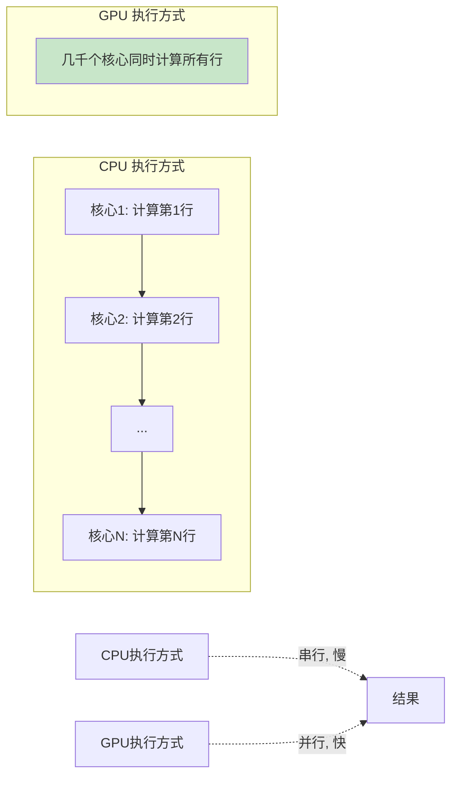

**核心区别：**

| | CPU | GPU |
|--|-----|-----|
| 核心数量 | 几十个（如 64 核） | 数千个（如 A100 有 6912 CUDA Cores） |
| 单核能力 | 强，复杂逻辑 | 弱，简单计算 |
| 适合任务 | if/else 多的逻辑、串行依赖 | 大量相同计算、矩阵运算 |
| 类比 | 一个博士做数学题 | 一万个小学生同时做加法 |

### 1.1.2 GPU 硬件架构（以 NVIDIA A100 为例）

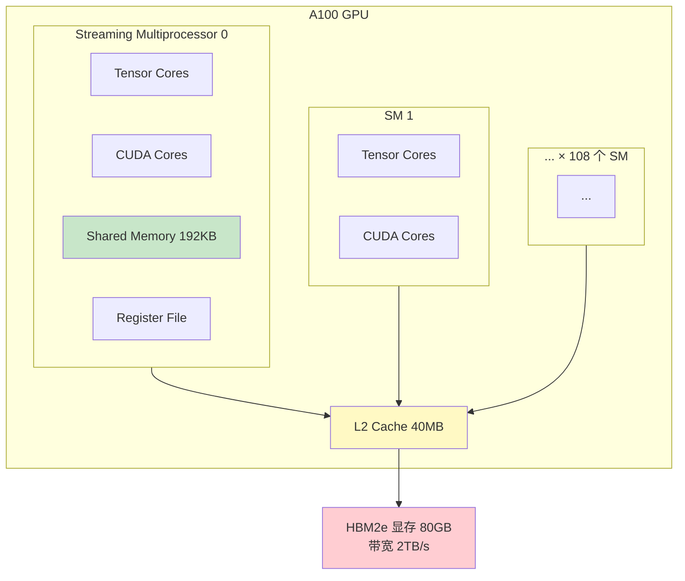

**关键概念：**

| 组件 | 作用 | 特点 |
|------|------|------|
| CUDA Core | 通用浮点计算 | 数量多，做 FP32/FP64 运算 |
| Tensor Core | 矩阵乘法专用 | 一个周期完成 4×4 矩阵乘，速度极快 |
| Shared Memory | SM 内共享的快速缓存 | 192KB/SM，延迟低 |
| HBM（显存） | 主存储 | 80GB，带宽 2TB/s，但延迟高 |
| L2 Cache | 全局缓存 | 40MB，比 HBM 快 |

### 1.1.3 计算瓶颈分析

每个 GPU 运算都可以归类为两种瓶颈之一：

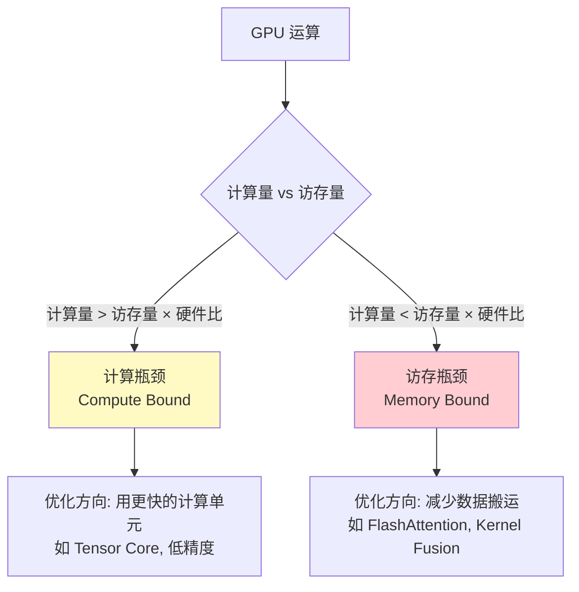

**计算强度（Arithmetic Intensity）= FLOP / Byte**

- 矩阵乘法（大矩阵）：计算密集 → Compute Bound
- 逐元素运算（如 ReLU、LayerNorm）：访存密集 → Memory Bound
- Attention（Softmax + MatMul）：混合，但通常 Memory Bound

**为什么这很重要？** 后面学到的很多优化（FlashAttention、Kernel Fusion）都是在解决访存瓶颈。

### 1.1.4 常见 GPU 型号对比

| GPU | 显存 | 算力(BF16) | 适合 |
|-----|------|-----------|------|
| A100 | 80GB HBM2e | 312 TFLOPS | 训练 & 推理 |
| H100 | 80GB HBM3 | 989 TFLOPS | 大规模训练 |
| H200 | 141GB HBM3e | 989 TFLOPS | 长序列推理 |
| L40S | 48GB GDDR6X | 362 TFLOPS | 推理 |
| B200 | 192GB HBM3e | 2250 TFLOPS | 下一代训练 |

### 1.1.5 练习

1. 计算一个 `[4096, 4096] × [4096, 4096]` 矩阵乘法的 FLOPS（答案：2 × 4096³ ≈ 137 GFLOP）
2. 如果 A100 的 Tensor Core 算力是 312 TFLOPS，这个矩阵乘法需要多久？
3. 从 HBM 读取两个 FP16 矩阵需要多少时间？（提示：数据量 = 2 × 4096² × 2 bytes）

---

## 1.2 深度学习训练基础

### 1.2.1 神经网络是什么？

一句话：**一个由大量参数定义的函数**，通过调整参数来拟合数据中的规律。


**参数（Parameters）**：W₁, b₁, W₂, b₂... 就是网络要学习的东西。GPT-3 有 1750 亿个参数。

### 1.2.2 训练循环详解

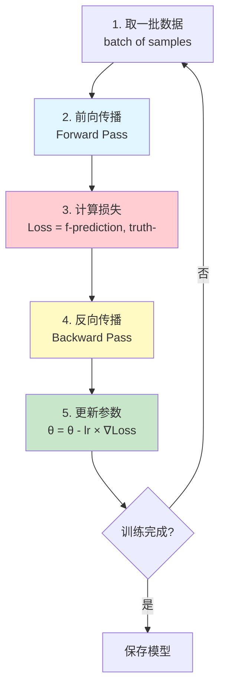

**各步骤详解：**

**Step 1: 取一批数据（Mini-batch）**
- 不是一次用全部数据，而是取一小批（如 32/64/128 条）
- Batch Size 越大，梯度估计越准，但显存占用越大

**Step 2: 前向传播（Forward Pass）**
- 输入经过每一层计算，得到最终输出
- 中间结果（激活值）需要保存，反向传播要用

**Step 3: 计算损失（Loss）**
- 衡量预测值和真实值的差距
- 语言模型：交叉熵（Cross Entropy）—— 预测下一个 token 的概率分布 vs 实际 token

**Step 4: 反向传播（Backward Pass）**
- 用链式法则从后往前计算每个参数的梯度
- 这一步是训练中最耗时的部分之一

**Step 5: 参数更新**
- 用优化器根据梯度更新参数
- `θ_new = θ_old - learning_rate × gradient`

### 1.2.3 显存中存了什么？

训练时 GPU 显存的占用分布（以一个 7B 模型 FP16 训练为例）：

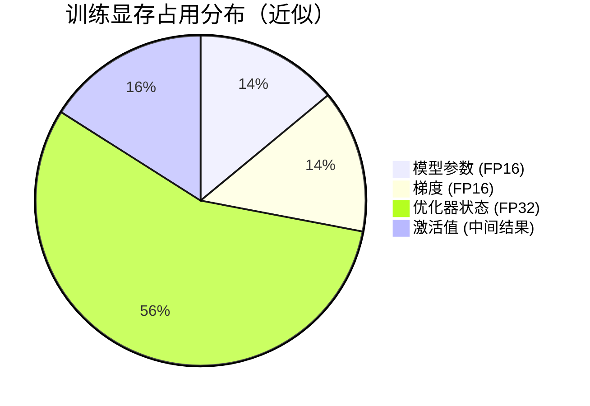

| 组件 | 大小估算（7B 模型） | 说明 |
|------|-------------------|------|
| 模型参数 | ~14 GB (FP16) | 7B × 2 bytes |
| 梯度 | ~14 GB (FP16) | 和参数一样大 |
| 优化器状态 | ~56 GB (FP32) | Adam 需要 momentum + variance，每个参数 8 bytes |
| 激活值 | 取决于 batch/seq_len | 中间结果，反向传播需要 |

> 这就是为什么 7B 模型训练需要远超 14GB 显存的原因！

### 1.2.4 优化器

| 优化器 | 公式简化 | 特点 |
|--------|---------|------|
| SGD | θ -= lr × g | 最简单，可能震荡 |
| SGD + Momentum | v = βv + g; θ -= lr × v | 加了惯性，更稳定 |
| Adam | 结合动量 + 自适应学习率 | 最常用，但多占 2× 参数的显存 |
| AdamW | Adam + Weight Decay | 大模型标配 |

### 1.2.5 关键超参数

| 超参数 | 影响 | 典型值 |
|--------|------|--------|
| Learning Rate | 太大发散，太小收敛慢 | 1e-4 ~ 3e-4 |
| Batch Size | 越大越稳定，但有上限 | 数百万 tokens |
| Warmup Steps | 开始时 LR 从 0 渐增 | 总步数的 1-5% |
| Weight Decay | 防止过拟合的正则化 | 0.01 ~ 0.1 |

### 1.2.6 练习

1. 一个 13B 参数的模型，用 Adam 优化器 FP16 训练，至少需要多少显存？（不算激活值）
2. 为什么 Batch Size 不能无限大？（提示：显存 + 泛化能力）
3. 如果 Learning Rate 设太大会怎样？

---

## 1.3 Transformer 架构（重点）

> 这是理解一切 AI Infra 的核心。无论是训练的并行切分，还是推理的 KV Cache，都基于对 Transformer 内部计算流程的理解。

### 1.3.1 Transformer 在做什么？

以语言模型（如 GPT）为例：

**输入**：一段文本 "我 今天 很"  
**输出**：预测下一个 token 的概率分布 → "开心" (概率 0.3), "累" (0.2), ...

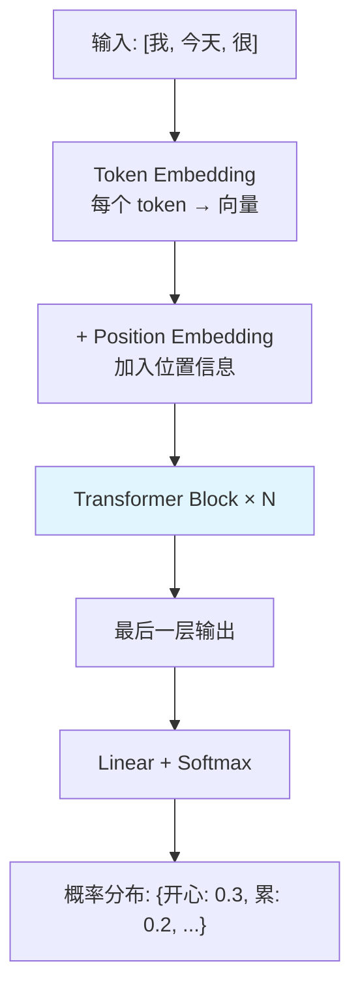

### 1.3.2 Token 与 Embedding

**Tokenization**：把文本切成小片段（token）

```
"我今天很开心" → ["我", "今天", "很", "开心"]  （示意，实际更细）
```

**Embedding**：把每个 token 映射为一个向量（如 4096 维）

```
"我"   → [0.12, -0.34, 0.56, ..., 0.78]  (4096 维向量)
"今天" → [0.45, 0.23, -0.11, ..., 0.33]  (4096 维向量)
```

**Embedding 矩阵**：大小为 `vocab_size × hidden_dim`（如 32000 × 4096），是一个可学习的查找表。

### 1.3.3 位置编码（Positional Encoding）

Attention 机制本身**不区分顺序**（"猫吃鱼" 和 "鱼吃猫" 对它一样）。需要注入位置信息。

**RoPE（Rotary Position Embedding）**—— 当前主流方案：
- 对 Q 和 K 向量施加旋转变换
- 旋转角度取决于 token 位置
- 好处：能编码相对距离，支持长度外推

### 1.3.4 Transformer Block 结构

一个完整的 Transformer Block：

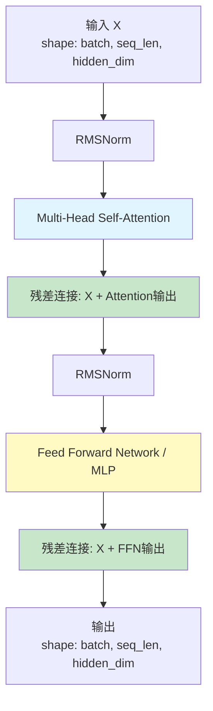

**一个模型有多少 Block？**

| 模型 | 层数 (N) | 隐藏维度 | 注意力头数 |
|------|---------|---------|-----------|
| Llama-2-7B | 32 | 4096 | 32 |
| Llama-2-13B | 40 | 5120 | 40 |
| Llama-2-70B | 80 | 8192 | 64 |
| GPT-3 175B | 96 | 12288 | 96 |

### 1.3.5 Self-Attention 详解（核心中的核心）

#### 直觉

Self-Attention 让每个 token 能"看到"序列中其他所有 token，并决定关注哪些。

```
"The cat sat on the mat because it was tired"
                                    ↑
                           "it" 关注 → "cat"（而不是 "mat"）
```

#### 计算步骤

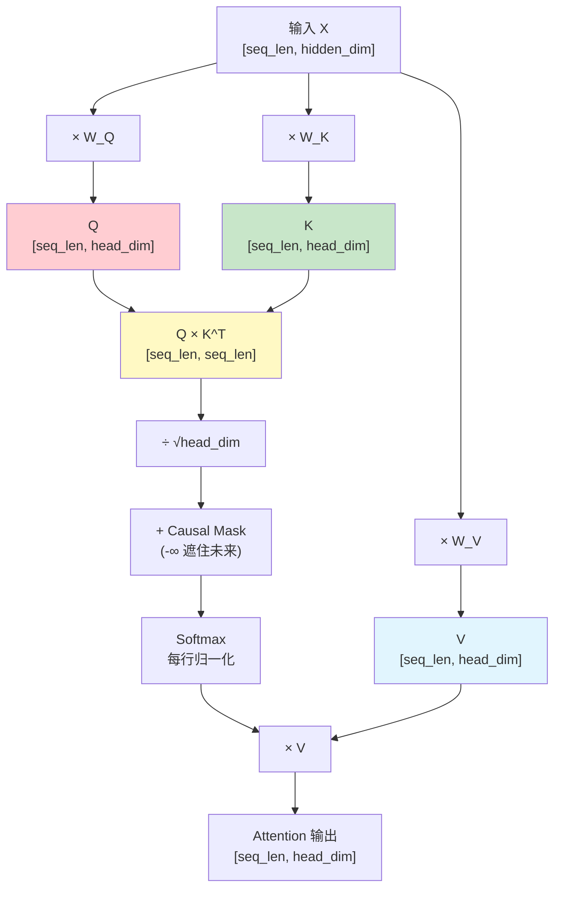

**Step by Step：**

1. **线性投影**：X 通过三个权重矩阵变成 Q、K、V
   ```
   Q = X × W_Q    (Query: 我要查什么)
   K = X × W_K    (Key: 我有什么可以被查)
   V = X × W_V    (Value: 我实际的内容)
   ```

2. **计算注意力分数**：Q 和 K 的点积（相似度）
   ```
   Scores = Q × K^T / √d_k
   ```
   - `Q × K^T` 得到 `[seq_len, seq_len]` 的矩阵
   - 每个元素 `[i,j]` 表示 token_i 对 token_j 的关注程度
   - `÷ √d_k` 是缩放，防止点积值太大导致 softmax 饱和

3. **Causal Mask（因果掩码）**：
   ```
   对于语言模型，token 不能看到未来的 token
   位置 i 只能关注位置 0, 1, ..., i
   未来位置设为 -∞，softmax 后变成 0
   ```

   ```
   Mask 矩阵:
   [0,    -∞,  -∞,  -∞]
   [0,    0,   -∞,  -∞]
   [0,    0,   0,   -∞]
   [0,    0,   0,   0  ]
   ```

4. **Softmax**：将分数归一化为概率分布
   ```
   Attention_weights = softmax(Scores + Mask)
   每一行加起来 = 1
   ```

5. **加权求和**：用注意力权重对 V 加权
   ```
   Output = Attention_weights × V
   ```

#### 数值示例

假设序列 "我 很 好"，hidden_dim=4，一个头：

```
X = [[0.1, 0.2, 0.3, 0.4],   # "我"
     [0.5, 0.6, 0.7, 0.8],   # "很"
     [0.2, 0.3, 0.4, 0.5]]   # "好"

Q = X × W_Q → [[q1], [q2], [q3]]  (每个 token 的 query)
K = X × W_K → [[k1], [k2], [k3]]  (每个 token 的 key)
V = X × W_V → [[v1], [v2], [v3]]  (每个 token 的 value)

Scores = Q × K^T =
  [[q1·k1, q1·k2, q1·k3],
   [q2·k1, q2·k2, q2·k3],
   [q3·k1, q3·k2, q3·k3]]

After Causal Mask:
  [[q1·k1, -∞,    -∞   ],   # "我" 只看自己
   [q2·k1, q2·k2, -∞   ],   # "很" 看 "我" 和自己
   [q3·k1, q3·k2, q3·k3]]   # "好" 看所有

After Softmax (每行和=1):
  [[1.0,  0.0,  0.0 ],
   [0.4,  0.6,  0.0 ],
   [0.2,  0.3,  0.5 ]]

Output = Attention_weights × V:
  "我" 的输出 = 1.0×v1
  "很" 的输出 = 0.4×v1 + 0.6×v2
  "好" 的输出 = 0.2×v1 + 0.3×v2 + 0.5×v3
```

### 1.3.6 Multi-Head Attention

不用一个大的 Attention，而是用多个小的"头"（head），每个头学习不同的关注模式。

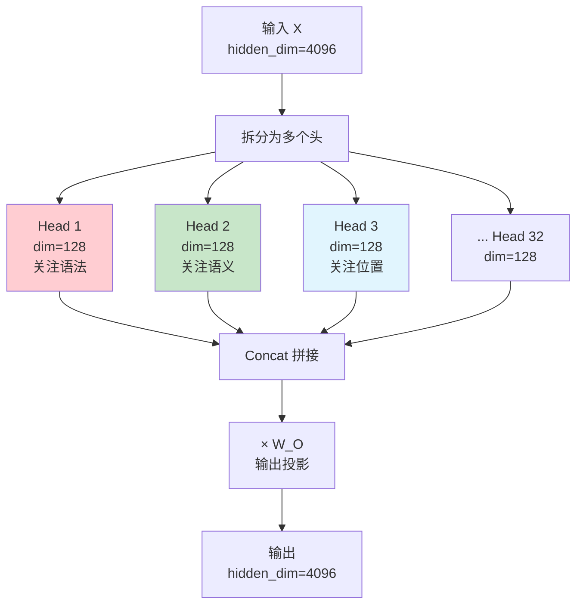

**维度关系：**
```
hidden_dim = num_heads × head_dim
4096 = 32 × 128  (Llama-2-7B)
```

每个头独立做 Attention（Q、K、V 维度是 head_dim），最后拼起来。

### 1.3.7 GQA 与 MQA（影响 KV Cache 大小）

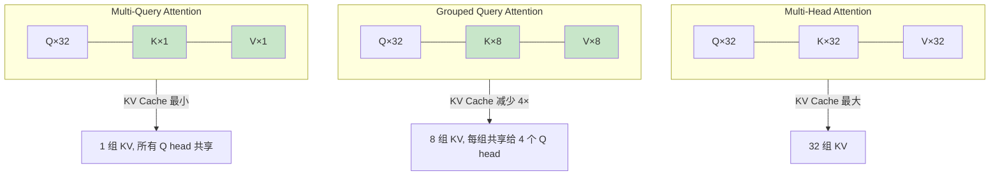

| 方案 | Q heads | KV heads | KV Cache 大小 | 模型示例 |
|------|---------|----------|-------------|---------|
| MHA | 32 | 32 | 基准 | GPT-3 |
| GQA | 32 | 8 | 1/4 | Llama-2-70B, Llama-3 |
| MQA | 32 | 1 | 1/32 | PaLM, Falcon |

> GQA 是当前主流选择，在推理效率和模型质量间取得平衡。

### 1.3.8 Feed Forward Network (FFN / MLP)

Attention 之后，每个 token 独立经过一个 FFN：

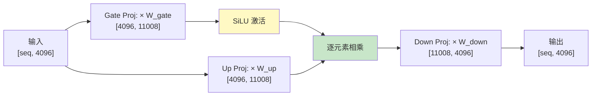

**SwiGLU FFN（Llama 系列使用）：**
```
FFN(x) = (SiLU(x × W_gate) ⊙ (x × W_up)) × W_down
```

**FFN 的参数量非常大**：`W_gate`, `W_up` 各 `[4096, 11008]`，`W_down` 是 `[11008, 4096]`。三个矩阵合计约占总参数的 2/3。

### 1.3.9 归一化（RMSNorm）

在 Attention 和 FFN 之前做归一化，稳定训练：

```
RMSNorm(x) = x / RMS(x) × γ
RMS(x) = √(mean(x²))
```

- 比 LayerNorm 更简单（去掉了 mean 的减法）
- 当前大模型标配（Llama、Mistral 等都用 RMSNorm）
- Pre-Norm：归一化放在 Attention/FFN 之前（而不是之后）

### 1.3.10 残差连接（Residual Connection）

```
output = x + SubLayer(Norm(x))
```

**为什么需要？**
- 深层网络（80+ 层）梯度容易消失
- 残差连接让梯度可以"直通"，不经过中间层
- 类比：高速公路的直通道 vs 城市道路

### 1.3.11 完整前向传播流程

把一个完整的 Transformer 模型（如 Llama-2-7B）前向传播画出来：

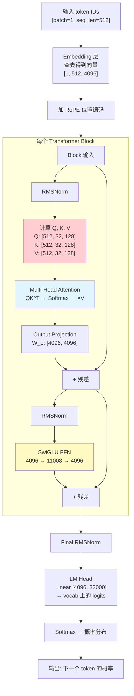

### 1.3.12 计算量与参数量分析

**Llama-2-7B 各部分参数量：**

| 组件 | 计算公式 | 参数量 |
|------|---------|--------|
| Embedding | vocab × hidden = 32000 × 4096 | 131M |
| 每层 QKV 投影 | 3 × hidden² = 3 × 4096² | 50M |
| 每层 Output 投影 | hidden² = 4096² | 17M |
| 每层 FFN (gate+up+down) | 3 × hidden × ffn_dim = 3 × 4096 × 11008 | 135M |
| 每层 RMSNorm | 2 × hidden = 2 × 4096 | 忽略不计 |
| **每层总计** | | ~202M |
| **32 层总计** | 32 × 202M | ~6.5B |
| LM Head | hidden × vocab = 4096 × 32000 | 131M |
| **模型总计** | | **~6.7B** |

> FFN 占了模型参数的大部分（~2/3），这决定了模型并行时的切分策略。

### 1.3.13 Transformer 推理 vs 训练的计算差异

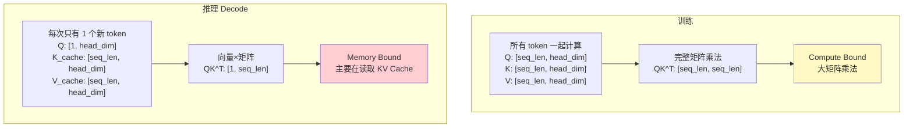

**关键认知：**
- 训练时：所有 token 一起做大矩阵乘法，GPU 利用率高
- 推理 Decode：每次只有 1 个新 token，退化为向量乘矩阵，GPU 算力严重浪费
- 这就是为什么推理优化（batching、投机解码等）如此重要

### 1.3.14 与 KV Cache 的联系（预习）

理解了 Attention 计算后，KV Cache 就很自然了：

```
在 Decode 阶段：
- 新 token 只需要计算自己的 Q、K、V（一行）
- K 和 V 需要包含之前所有 token 的信息 → 缓存起来！
- 每生成一个新 token，往 Cache 追加一行 K 和 V

KV Cache 大小 = 2(KV) × layers × kv_heads × head_dim × seq_len × dtype_bytes
```

> 这个话题在阶段三（推理基础设施）会详细展开。

### 1.3.15 课后练习

**概念题：**
1. 为什么 Attention 的计算复杂度是 O(n²)？（n = 序列长度）
2. Causal Mask 的作用是什么？如果去掉会怎样？
3. 为什么需要多头（Multi-Head）而不是一个大头？
4. GQA 相比 MHA 节省了什么？损失了什么？

**计算题：**
1. Llama-2-7B，序列长度 4096，计算一次 Self-Attention 的 QK^T 需要多少 FLOPS？
   - 提示：矩阵乘法 `[4096, 128] × [128, 4096]`，32 个头
2. 同样的模型，KV Cache 占多少显存？（FP16）
   - 提示：2 × 32层 × 32头 × 128维 × 4096序列长度 × 2字节

**动手题：**
1. 用 PyTorch 手写一个单头 Causal Self-Attention
2. 用 Hugging Face 加载 Llama-2-7B，打印每层的权重 shape

```python
# 参考框架
import torch
import torch.nn.functional as F

def causal_self_attention(x, W_q, W_k, W_v):
    """
    x: [seq_len, hidden_dim]
    W_q, W_k, W_v: [hidden_dim, head_dim]
    """
    Q = x @ W_q  # [seq_len, head_dim]
    K = x @ W_k  # [seq_len, head_dim]
    V = x @ W_v  # [seq_len, head_dim]

    d_k = K.shape[-1]
    scores = Q @ K.T / (d_k ** 0.5)  # [seq_len, seq_len]

    # Causal mask
    seq_len = x.shape[0]
    mask = torch.triu(torch.ones(seq_len, seq_len), diagonal=1).bool()
    scores.masked_fill_(mask, float('-inf'))

    attn_weights = F.softmax(scores, dim=-1)  # [seq_len, seq_len]
    output = attn_weights @ V  # [seq_len, head_dim]
    return output
```

---

## 学完阶段一后你应该能回答

- [ ] GPU 为什么适合深度学习？Tensor Core 是什么？
- [ ] 训练循环的 5 个步骤是什么？显存里存了哪些东西？
- [ ] Transformer 的输入输出是什么？
- [ ] Self-Attention 的 QKV 分别代表什么？完整计算流程是什么？
- [ ] 什么是 Causal Mask？为什么需要？
- [ ] Multi-Head Attention 为什么要拆成多头？
- [ ] GQA 和 MQA 是什么？对推理有什么帮助？
- [ ] FFN/MLP 在 Transformer 中占多大参数比例？
- [ ] 为什么推理（Decode）是 Memory Bound 的？

---

## 推荐资源

| 资源 | 类型 | 备注 |
|------|------|------|
| [The Illustrated Transformer](https://jalammar.github.io/illustrated-transformer/) | 博客 | 最佳入门图解 |
| [3Blue1Brown: Attention in Transformers](https://www.youtube.com/watch?v=eMlx5fFNoYc) | 视频 | 直观动画 |
| [Andrej Karpathy: Let's build GPT](https://www.youtube.com/watch?v=kCc8FmEb1nY) | 视频 | 从零实现 GPT |
| [李宏毅: Self-Attention](https://www.youtube.com/watch?v=hYdO9CscNes) | 视频 | 中文讲解 |
| [Llama 2 论文](https://arxiv.org/abs/2307.09288) | 论文 | 对照阅读架构细节 |
| [nanoGPT](https://github.com/karpathy/nanoGPT) | 代码 | 最简 GPT 实现 |
