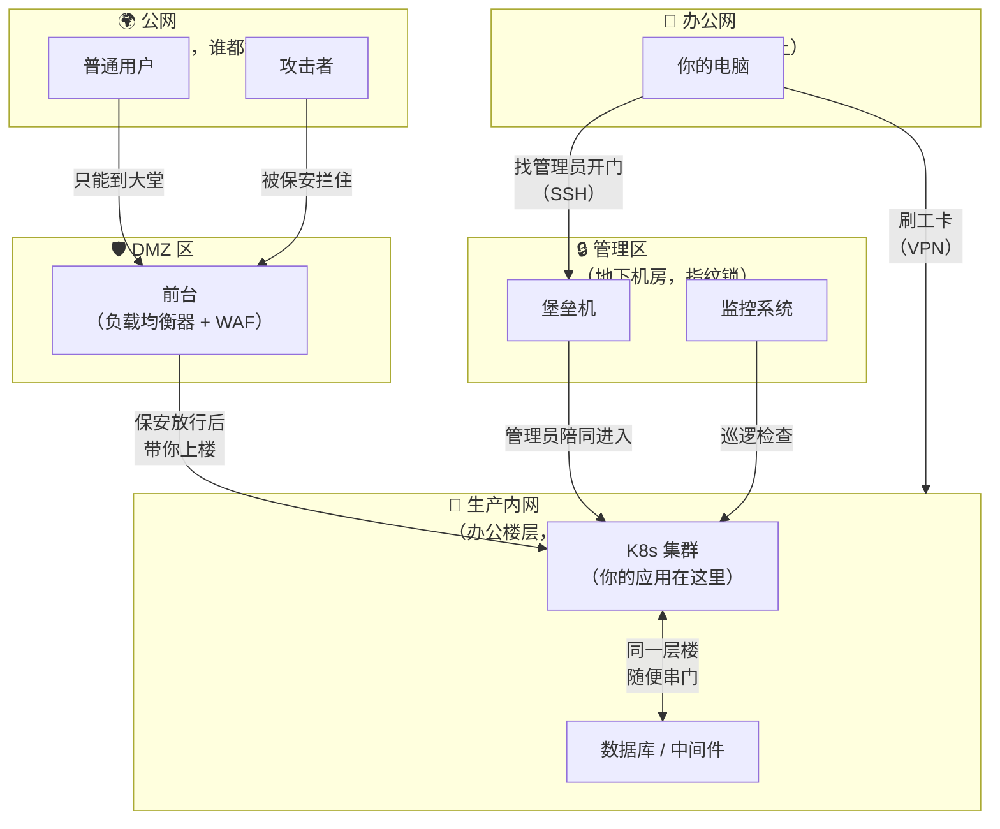
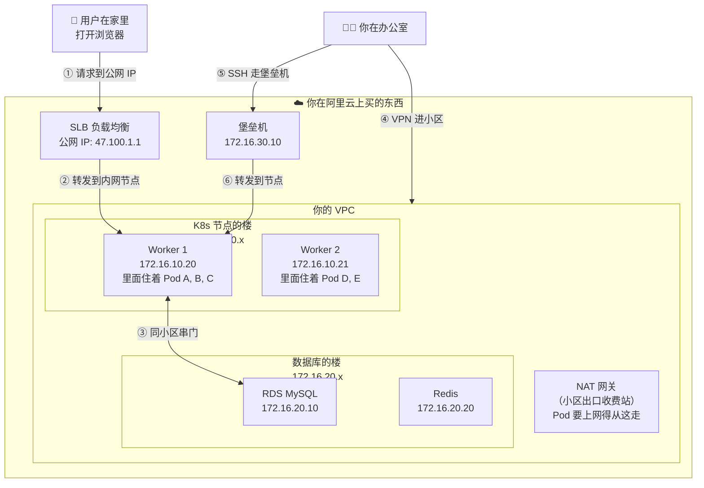
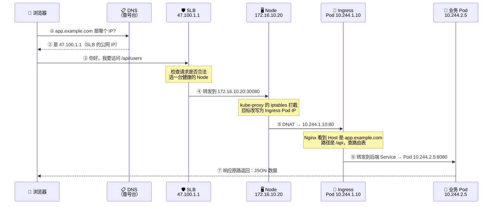

# 🏗️ 企业网络架构全景

## 从一栋写字楼说起

你有没有想过，一栋写字楼的安保系统是怎么设计的？

- **一楼大堂**有前台，外来访客必须登记才能进入（→ 这就是 **DMZ / 负载均衡器**）
- **每一层**有门禁卡才能进（→ 这就是 **VPC 内网 / 安全组**）
- **服务器机房**在地下二层，只有特定运维人员刷指纹才能进（→ 这就是 **堡垒机 / 管理网络**）
- **员工**每天刷工卡坐电梯直达自己楼层（→ 这就是 **VPN / 办公网络**）
- **外卖小哥**只能送到一楼前台，前台帮你转交（→ 这就是 **CDN + WAF + 反向代理**）

一家公司的网络架构，本质上就是这样一套"分区 + 门禁"系统。

## 企业网络的五个区域



用大白话解释每个区域：

| 你熟悉的类比 | 对应的网络区域 | 里面有什么 | 谁能进来 |
|-------------|--------------|-----------|---------|
| 马路上 | **公网** | 用户的浏览器、攻击者 | 所有人 |
| 一楼大堂 | **DMZ** | 负载均衡器、WAF、API 网关 | 从公网来的合法请求 |
| 办公楼层 | **生产内网（VPC）** | K8s 集群、数据库、Redis | 只有 DMZ 转发的请求、VPN 用户 |
| 你的工位 | **办公网** | 你的电脑、测试环境 | 公司员工 |
| 地下机房 | **管理区** | 堡垒机、监控 | 运维人员（需审批） |

**核心原则**：越往里走，安全级别越高，能进来的人越少。

## 一个真实的网络长什么样

### 如果你的集群在云上（阿里云 / AWS / 腾讯云）



### 三段 IP 地址，一定不能搞混

K8s 环境中有三种不同的 IP，它们各管各的，不能重叠：

```text
想象你的小区有三套编号系统：

🏠 楼号（Node IP）     → 172.16.10.20, 172.16.10.21
   就是每台服务器的真实 IP，你在云控制台能看到的那个

🚪 房间号（Pod IP）    → 10.244.1.2, 10.244.1.3, 10.244.2.5
   每个 Pod 的 IP，Pod 重建后会变
   由 CNI 插件分配（Calico/Flannel）

📞 总机号（Service IP） → 10.96.0.100, 10.96.0.200
   Service 的 ClusterIP，是个虚拟号码
   打这个号会自动转接到某个 Pod
   这个 IP 是"假的"——没有任何网卡绑定它
```

```bash
# 看楼号（Node IP）
kubectl get nodes -o wide
# NAME     INTERNAL-IP     ...
# node-1   172.16.10.20    ...
# node-2   172.16.10.21    ...

# 看房间号（Pod IP）
kubectl get pods -o wide
# NAME      IP            NODE
# app-xxx   10.244.1.2    node-1
# app-yyy   10.244.2.5    node-2

# 看总机号（Service ClusterIP）
kubectl get svc
# NAME       CLUSTER-IP     PORT(S)
# my-app     10.96.0.100    80/TCP
```

**一个常见误区**：很多新手以为 ClusterIP 是一个真实的 IP 地址，想去 ping 它。但它只是 iptables/IPVS 规则里的一个"暗号"，当数据包到达节点时，kube-proxy 会拦截这个暗号并替换成真实的 Pod IP。

## 一个请求的完整旅程（带具体 IP）

小明的同事在家里打开浏览器，访问 `https://app.example.com/api/users`。这个请求经历了什么？



**每一步发生了什么**：

| 步骤 | 发生了什么 | 大白话解释 |
|------|-----------|-----------|
| ① DNS 查询 | 浏览器问 DNS "app.example.com 是谁？" | 就像打 114 查号 |
| ② 返回 IP | DNS 告诉浏览器 SLB 的公网 IP | 114 告诉你电话号码 |
| ③ 到达 SLB | 请求到了负载均衡器 | 你打到了公司前台 |
| ④ 转到 Node | SLB 选一台 Worker 节点转发 | 前台帮你转接到某个部门 |
| ⑤ iptables 改写 | kube-proxy 把目标 IP 从 NodePort 改成 Ingress Pod IP | 部门总机把你转给具体的人 |
| ⑥ Ingress 路由 | Nginx 根据域名和路径找到对应的后端 Pod | 那个人再帮你找到具体负责人 |
| ⑦ 响应返回 | 响应沿原路返回 | 回复从负责人 → 部门 → 前台 → 你 |

## 谁能访问谁？一张表说清楚

```text
                     能不能到达？
               公网    DMZ    集群    数据库   办公网
外面的用户      —      ✅     ❌      ❌      ❌
               只能到大堂    进不了办公区

SLB/WAF        ✅      —      ✅      ❌      ❌
               能回源       能转发到集群

K8s Pod        经NAT   ❌      ✅      ✅      ❌
               出公网       集群内互通  同个VPC

你的电脑        ✅     ✅     经VPN    ❌      —
               直接上网            VPN进内网

堡垒机          ❌     ❌      ✅      ✅      ❌
                             SSH管理   监控采集
```

**一句话记住**：从外到内，越来越难进；反过来，从内到外也不是随便出去——Pod 出公网需要走 NAT 网关。

## 下一步

现在你知道了公司网络长什么样，也知道了你的 K8s 集群在里面的位置。接下来我们**进入集群内部**，看看 Pod、Service、Node 之间到底是怎么通信的。

→ [集群内部网络深度解析](./02-cluster-internal-network.md)
