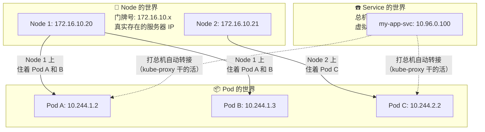
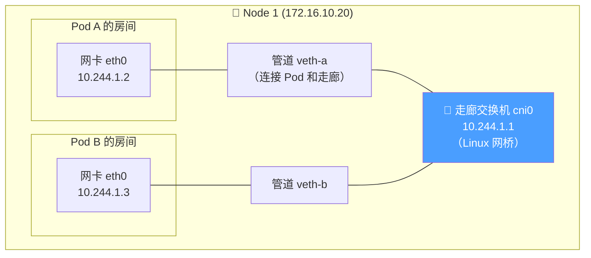
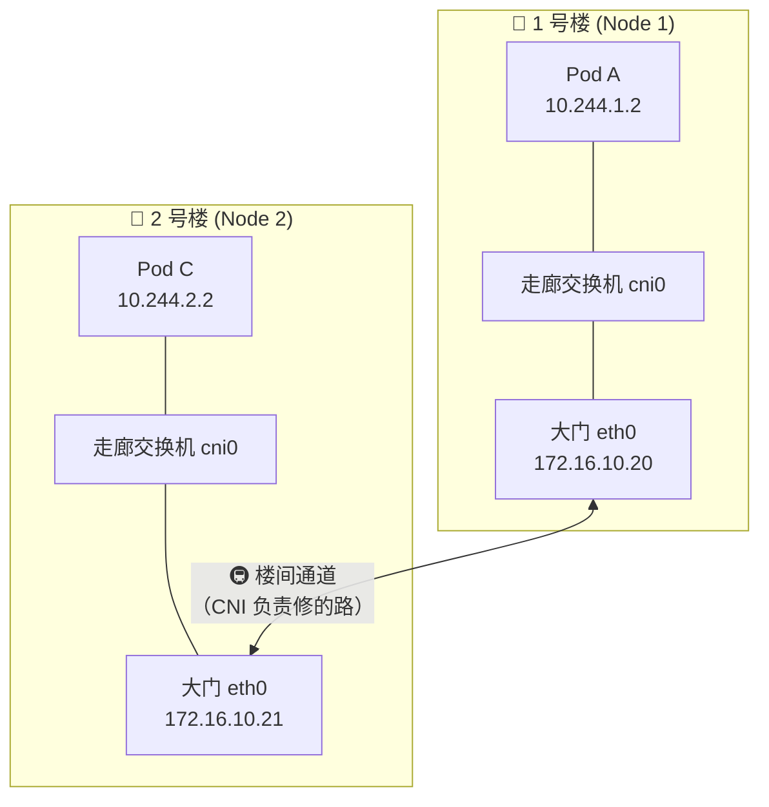
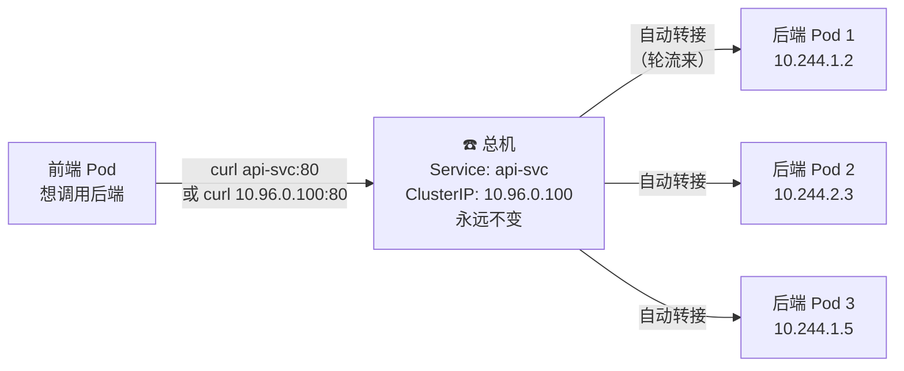
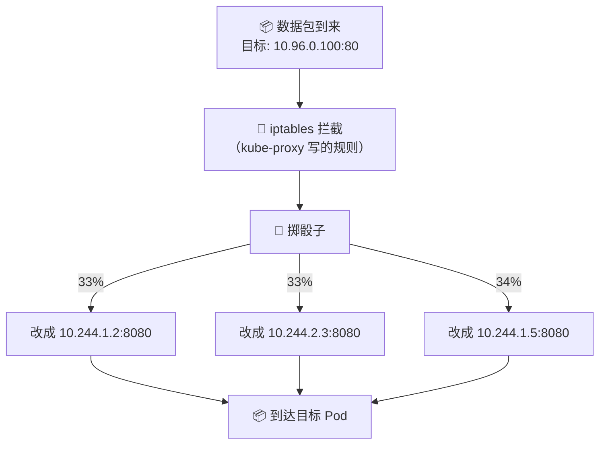
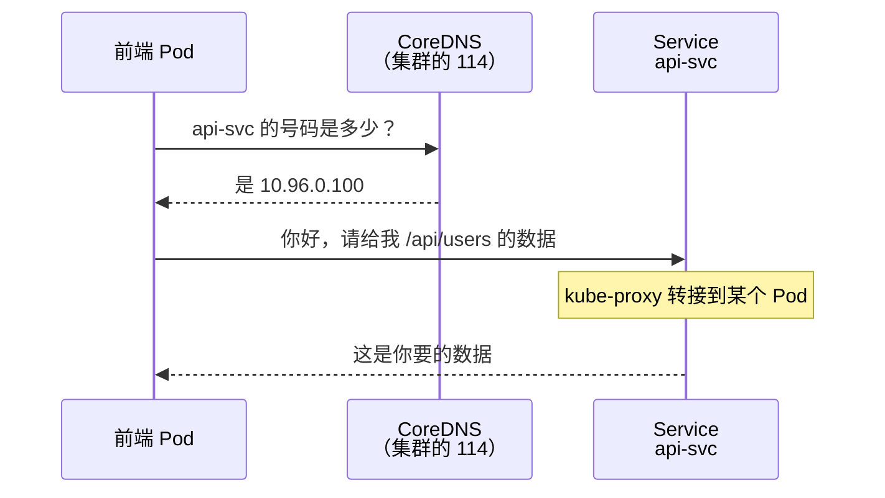

# ☸️ 集群内部网络深度解析

## 先搞清楚集群里有三个"世界"

很多人刚学 K8s 网络时最大的困惑就是：**为什么有这么多 IP？它们之间是什么关系？**

我们用一个快递公司的类比来理解。想象 K8s 集群是一个快递站点：

```text
🏢 快递站（Node）有自己的门牌号          → Node IP: 172.16.10.20
📦 站里每个包裹架（Pod）有自己的编号     → Pod IP:  10.244.1.2
☎️ 客户打的客服电话是个总机号            → Service ClusterIP: 10.96.0.100
   总机会自动转接到某个包裹架上
```

这三个"世界"各有各的 IP 段，各管各的事：



## 同一台机器上的 Pod 怎么通信？

**场景**：Pod A（10.244.1.2）想和 Pod B（10.244.1.3）说话，它们住在同一个 Node 上。

这就像同一栋楼里两个房间通话——走内线就行，不用出楼：



**发生了什么**：

```text
1. Pod A 说："我要找 10.244.1.3"
2. 数据从 Pod A 的 eth0 出来
3. 通过管道（veth pair）到达走廊的交换机（cni0 网桥）
4. 交换机发现 "10.244.1.3 也在我这层楼啊"
5. 直接通过另一根管道送到 Pod B

就像同层楼的两个房间打内线电话，信号不需要出楼。
```

## 不同机器上的 Pod 怎么通信？

**场景**：Pod A（10.244.1.2，在 Node 1 上）想和 Pod C（10.244.2.2，在 Node 2 上）说话。

这就像不同楼的两个人要通话——得走楼外的通道：



**关键问题来了**：楼间通道是谁修的？怎么修的？

这就是 **CNI 插件**的工作。不同的 CNI 用不同的方式修路：

### Flannel：给信封套个外壳

```text
Pod A 寄信给 Pod C：

原始信封：
  ┌──────────────────────┐
  │ 寄: 10.244.1.2       │
  │ 收: 10.244.2.2       │
  │ 内容: "你好 Pod C"    │
  └──────────────────────┘

但这个地址出了 Node 1 就没人认识了！
所以 Flannel 在外面再套一层信封：

外层信封（UDP 包裹）：
  ┌────────────────────────────────────┐
  │ 寄: 172.16.10.20 （Node 1 的真实 IP） │
  │ 收: 172.16.10.21 （Node 2 的真实 IP） │
  │                                        │
  │  里面装着：                            │
  │  ┌──────────────────────┐             │
  │  │ 寄: 10.244.1.2       │             │
  │  │ 收: 10.244.2.2       │             │
  │  │ 内容: "你好 Pod C"    │             │
  │  └──────────────────────┘             │
  └────────────────────────────────────┘

到了 Node 2，Flannel 拆掉外层信封，把原始信件交给 Pod C。
```

这种"套信封"的方式叫 **VXLAN 隧道/封装**。好处是简单，坏处是多了一层封装，性能有损耗。

### Calico BGP：直接修路

```text
Calico 不套信封，而是直接在路由器上刻路标：

Node 1 的路由表：
  "要去 10.244.2.0/24 → 走 172.16.10.21"

Node 2 的路由表：
  "要去 10.244.1.0/24 → 走 172.16.10.20"

每个 Node 上的路由代理（BIRD）会互相通报：
  "我这里有 10.244.1.0/24 的 Pod，要找它们来我这"

数据包直接按路标走，不需要套信封。更快，但要求所有 Node 在同一个二层网络。
```

### 怎么选？

| 你的情况 | 推荐 | 原因 |
|---------|------|------|
| 学习/开发环境 | **Flannel** | 最简单，装上就能用 |
| 生产环境，节点在同一网段 | **Calico BGP** | 性能最好，无封装开销 |
| 生产环境，节点跨网段 | **Calico IPIP** | 兼顾性能和跨子网能力 |
| 追求极致性能+可观测 | **Cilium** | 基于 eBPF，最先进 |

```bash
# 查看你的集群用了什么 CNI
ls /etc/cni/net.d/

# 查看 CNI Pod 状态
kubectl get pods -n kube-system | grep -E 'calico|flannel|cilium'
```

## Service：打总机，自动转接

**场景**：你的前端 Pod 想调用后端 API。后端有 3 个 Pod 副本，IP 分别是 10.244.1.2、10.244.2.3、10.244.1.5。

问题来了：**前端应该访问哪个 IP？** 如果某个 Pod 挂了重建，IP 就变了怎么办？

答案就是 Service——一个永远不变的"总机号"。



### 但是 ClusterIP 是"假的"，谁在背后接线？

答案是 **kube-proxy**。它在每个 Node 上偷偷写了一堆 iptables 规则：

```text
kube-proxy 写的规则（翻译成人话）：

"如果有人要访问 10.96.0.100:80，那么：
  - 33% 的概率改成 → 10.244.1.2:8080
  - 33% 的概率改成 → 10.244.2.3:8080
  - 34% 的概率改成 → 10.244.1.5:8080"

这个操作叫 DNAT（目标地址转换）。
数据包到达 Node 时，目标 IP 就被悄悄替换了。
```



```bash
# 亲手验证：看 kube-proxy 写了什么规则
sudo iptables -t nat -L KUBE-SERVICES -n | head -20

# 看某个 Service 具体转发到哪些 Pod
kubectl get endpoints my-service
# NAME         ENDPOINTS
# my-service   10.244.1.2:8080,10.244.2.3:8080,10.244.1.5:8080
```

## DNS：不用记号码，直接叫名字

你不需要记住 Service 的 ClusterIP（10.96.0.100），直接用名字就行：

```bash
# 在 Pod 里面
curl http://api-svc                           # 同 namespace
curl http://api-svc.production                # 跨 namespace
curl http://api-svc.production.svc.cluster.local  # 完整域名

# 这三个都能找到 Service，因为集群里有 CoreDNS
```

CoreDNS 就像集群内部的 114 查号台：



```bash
# 验证 DNS 是否正常
kubectl exec -it <pod-name> -- nslookup api-svc
# 应该返回 Service 的 ClusterIP

# 看 Pod 的 DNS 配置
kubectl exec -it <pod-name> -- cat /etc/resolv.conf
# nameserver 10.96.0.10        ← CoreDNS 的地址
# search default.svc.cluster.local svc.cluster.local cluster.local
```

## 完整的集群内通信流程

把上面所有内容串起来，看一个完整的请求在集群内部经历了什么：

```text
前端 Pod 访问 "http://api-svc/users" 的完整过程：

① 前端 Pod 问 CoreDNS："api-svc 是谁？"
   CoreDNS 回答："10.96.0.100"

② 前端 Pod 发送数据包：
   src: 10.244.1.10 (前端 Pod)
   dst: 10.96.0.100:80 (Service ClusterIP)

③ 数据包到达 Node 的网络栈，iptables 拦截：
   "10.96.0.100? 我认识！改成 10.244.2.3:8080"
   数据包变成：
   src: 10.244.1.10
   dst: 10.244.2.3:8080 (后端 Pod)

④ 如果后端 Pod 在同一个 Node → 走网桥直达
   如果后端 Pod 在别的 Node → 走 CNI 隧道/路由跨节点

⑤ 到达后端 Pod，处理请求，返回响应

⑥ 响应原路返回：
   conntrack 记住了来时的路，响应包自动做反向转换
```

## 动手实验

如果你有一个集群（哪怕是 minikube），试试这些命令：

```bash
# 1. 创建一个 Deployment + Service
kubectl create deployment hello --image=nginx --replicas=3
kubectl expose deployment hello --port=80

# 2. 查看三层 IP
kubectl get nodes -o wide      # Node IP
kubectl get pods -o wide       # Pod IP
kubectl get svc hello          # Service IP

# 3. 启动一个调试 Pod，验证连通性
kubectl run debug --image=busybox -it --rm -- sh

# 在调试 Pod 里面：
nslookup hello              # DNS 能不能解析？
wget -qO- http://hello      # Service 能不能访问？
wget -qO- http://<pod-ip>   # 直接访问 Pod 行不行？

# 4. 多次请求，观察负载均衡
for i in $(seq 1 10); do wget -qO- http://hello 2>/dev/null | head -1; done
```

## 下一步

集群内部的通信搞清楚了。但你的 Pod 经常需要访问集群外面的东西——数据库、Redis、消息队列。它们住在同一个 VPC 内网里，但不在 K8s 集群中。它们之间是怎么互通的？

→ [内网与 VPC 网络](./03-vpc-and-intranet.md)
