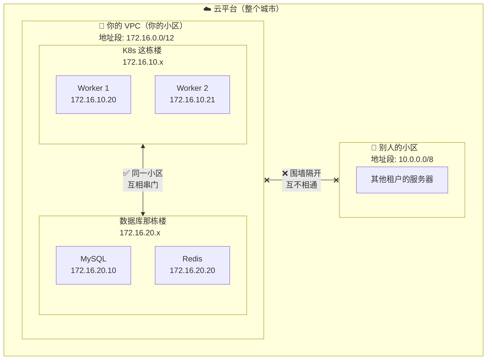
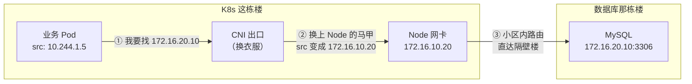
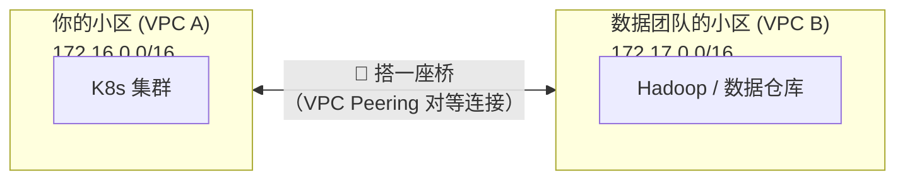
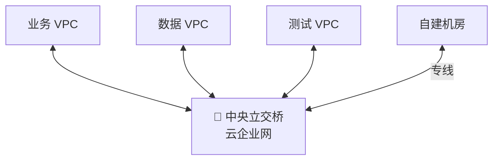

# 🔷 内网与 VPC 网络

## 一个你一定遇到过的问题

你的 Pod 跑起来了，但它需要连 MySQL 数据库。这个 MySQL 不在 K8s 集群里，而是买了一台云 RDS（或者自建的 MySQL 服务器），IP 是 172.16.20.10。

问题来了：**Pod 能直接连上吗？中间经过了什么？**

## 先搞清楚 VPC 是什么

如果你用的是阿里云、腾讯云或 AWS，你的所有云资源都跑在一个叫 **VPC** 的东西里。

**VPC 就是你在云上圈了一块地，盖了一个带围墙的小区。** 小区里面的住户互相串门很方便，但外面的人进不来。



### VPC 里的子网：不同楼层

VPC 里面还会划分成几个**子网**，就像小区里的不同楼：

```text
你的小区（VPC: 172.16.0.0/12）
  │
  ├── 1 号楼：K8s 节点      172.16.10.0/24（能住 254 个节点）
  ├── 2 号楼：数据库         172.16.20.0/24（数据库、Redis）
  ├── 3 号楼：管理区         172.16.30.0/24（堡垒机、CI/CD）
  └── 4 号楼：测试环境        172.17.0.0/24
```

同一个小区里不同楼之间是**默认互通**的（VPC 内的子网之间可以直接路由），但可以通过**安全组**来限制"谁能敲谁的门"。

### 安全组：每户门上的锁

安全组决定了每台服务器"允许谁进来"和"允许往外连什么"：

```text
MySQL 服务器的安全组规则（翻译成人话）：

入站规则（谁能来敲门）：
  ✅ 允许 K8s 节点（172.16.10.0/24）访问 3306 端口     ← K8s Pod 能连数据库
  ✅ 允许堡垒机（172.16.30.10）访问 3306 端口           ← 运维能用堡垒机连
  ❌ 其他所有人的访问全部拒绝

出站规则：
  ✅ 允许所有出站（数据库本身不需要限制出站）
```

## Pod 访问 MySQL：完整链路

现在来看 Pod（10.244.1.5）连接 MySQL（172.16.20.10:3306）到底经历了什么：



**关键步骤解释**：

```text
① Pod 发出请求
   src: 10.244.1.5 (Pod IP)
   dst: 172.16.20.10 (MySQL)

② 问题：10.244.1.5 这个地址出了 K8s 集群，没人认识！
   所以 CNI 做了一个 SNAT（源地址转换）：
   把 src 从 Pod IP 换成 Node IP
   src: 172.16.10.20 (Node IP) ← 换了身份
   dst: 172.16.20.10 (MySQL)

③ 现在数据包用的是 Node IP，这是 VPC 里合法的地址
   VPC 路由表知道 172.16.20.x 在哪，直接送过去

④ MySQL 收到请求，看到来源是 172.16.10.20
   它不知道真正发请求的是 Pod，只知道是某个 Node
```

**一个重要结论**：在默认配置下，MySQL 看到的来源 IP 是 Node IP，不是 Pod IP。这在做审计和日志分析时要注意。

### 动手验证

```bash
# 在 Pod 里测试能不能连上 MySQL
kubectl exec -it <pod-name> -- nc -zv 172.16.20.10 3306
# 如果输出 "succeeded"，说明通了

# 在 MySQL 服务器上看连接来源
# 你会看到来源 IP 是 Node IP，不是 Pod IP
mysql> SHOW PROCESSLIST;
```

## 四种让 Pod 访问内网服务的方式

### 方式一：直接用 IP（能用但不推荐）

```yaml
# 直接写死数据库 IP
env:
- name: DB_HOST
  value: "172.16.20.10"
```

问题：如果数据库 IP 变了，要改代码重新部署。

### 方式二：ExternalName Service（推荐：DNS 别名）

给外部服务取个集群内部的名字：

```yaml
apiVersion: v1
kind: Service
metadata:
  name: mysql
  namespace: production
spec:
  type: ExternalName
  externalName: mysql-master.internal.example.com
```

```bash
# Pod 里面直接用名字
mysql -h mysql -u root -p
# "mysql" 这个名字会被 CoreDNS 解析成 mysql-master.internal.example.com
```

好处：数据库地址变了，只改 Service 定义，不用改应用。

### 方式三：手动 Endpoints（没有域名时用）

如果内网服务只有 IP 没有域名：

```yaml
# 创建一个没有 selector 的 Service
apiVersion: v1
kind: Service
metadata:
  name: mysql
spec:
  ports:
  - port: 3306
---
# 手动告诉它后端在哪
apiVersion: v1
kind: Endpoints
metadata:
  name: mysql
subsets:
- addresses:
  - ip: 172.16.20.10
  - ip: 172.16.20.11  # 主从两个实例
  ports:
  - port: 3306
```

```bash
# Pod 里直接用 Service 名
mysql -h mysql -P 3306 -u root -p
# 还能自动在两个实例之间负载均衡！
```

### 方式四：VPC-CNI 模式（云上最佳方案）

一些云厂商支持给 Pod 直接分配 VPC 的 IP：

```text
默认模式：
  Pod IP: 10.244.1.5（集群内部 IP，出集群要换马甲）

VPC-CNI 模式：
  Pod IP: 172.16.10.50（直接是 VPC 的 IP，不用换马甲）

好处：
  ✅ 数据库能看到真实的来源 IP
  ✅ 没有 SNAT 开销
  ✅ 安全组可以精确控制到 Pod 级别

坏处：
  ⚠️ 占用 VPC IP 地址（大集群要提前规划）
```

## 常见问题排查

### "Pod 连不上数据库"

```bash
# 第一步：能不能解析 DNS？
kubectl exec -it <pod> -- nslookup mysql.internal.example.com
# 如果失败 → 检查 CoreDNS 配置中是否有内网 DNS 转发规则

# 第二步：端口通不通？
kubectl exec -it <pod> -- nc -zv 172.16.20.10 3306
# 如果超时 → 检查安全组

# 第三步：安全组放行了吗？
# 去云控制台检查：
# - Worker 节点安全组的出站规则是否允许 3306
# - MySQL 安全组的入站规则是否允许 Worker 节点网段

# 第四步：路由通不通？
# 在 Node 上直接测试
ssh node-1
nc -zv 172.16.20.10 3306
# 如果 Node 上能通但 Pod 不能 → CNI 或 SNAT 问题
```

### "Pod 能连数据库但很慢"

```text
可能原因：
1. DNS 解析慢 → 检查 CoreDNS，考虑配置 NodeLocal DNS Cache
2. 跨可用区访问 → 数据库和 K8s 节点不在同一个可用区，延迟高
3. 安全组规则多 → 规则太多会影响连接建立速度
```

## 跨 VPC 怎么办？

有时候你的集群和数据库在不同的 VPC 里（比如不同部门各自建了 VPC），那就需要打通两个"小区"：



```text
搭桥的条件：
  ✅ 两个小区的地址段不能重叠（172.16.x 和 172.17.x 没问题）
  ✅ 需要在双方的路由表里加路标
  ⚠️ 桥不能传递：A→B 通，B→C 通，但 A→C 不通（需要单独搭桥）
```

如果要连很多个 VPC，用**云企业网（CEN / Transit Gateway）**——相当于修了一个中央立交桥：



## 下一步

现在你知道了 Pod 怎么连内网数据库。但还有一个方向没讲——**外面的用户怎么访问你的 Pod？** 你的服务总得让用户用得上吧。

→ [公网访问与暴露](./04-public-network-access.md)
