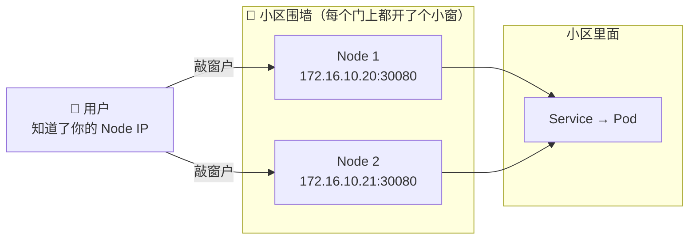
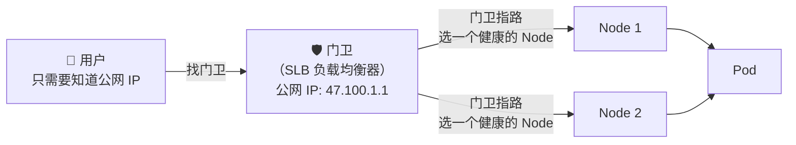
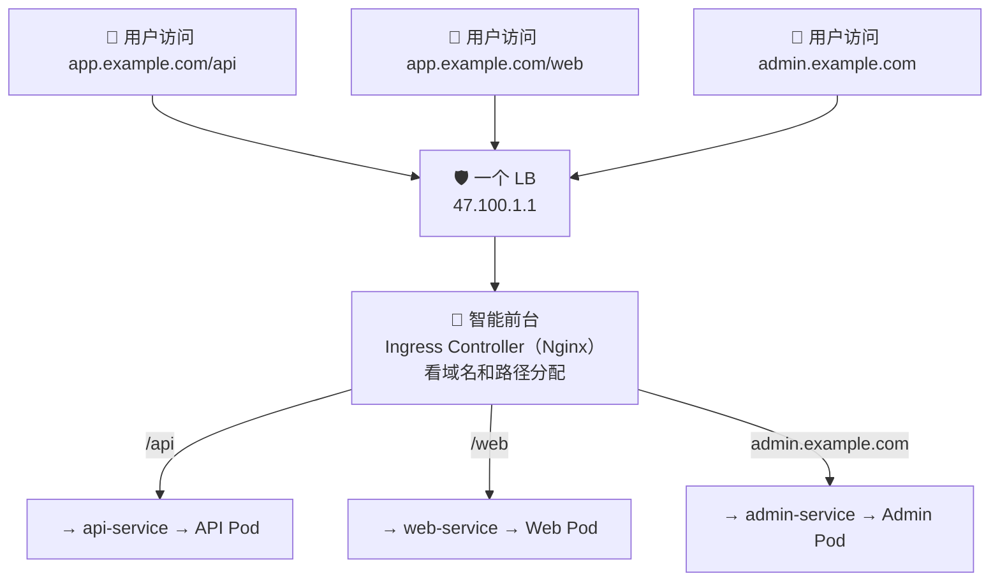
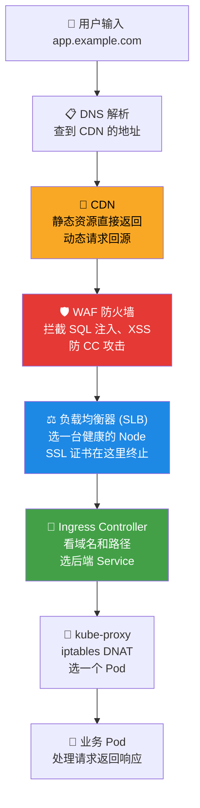
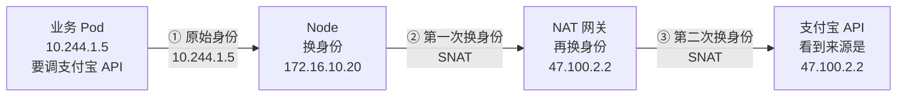

# 🌍 公网访问与暴露

## 你的服务跑在小区里，顾客在大街上

你的 Pod 已经 Running 了，Service 也创建好了，ClusterIP 是 10.96.0.100。

但是——**只有小区里的人才能访问 ClusterIP**。外面大街上的用户，怎么才能访问到你的服务？

这就像你在小区里开了一家店，但顾客在马路上，需要给他们一条路进来。K8s 提供了三种"开门迎客"的方式：

## 方式一：NodePort — 在围墙上开个洞

最简单粗暴的方式：在每个 Node 上开放一个端口，外面的人通过 `NodeIP:端口` 直接访问。



```yaml
apiVersion: v1
kind: Service
metadata:
  name: my-app
spec:
  type: NodePort
  selector:
    app: my-app
  ports:
  - port: 80
    targetPort: 8080
    nodePort: 30080    # 开放这个端口（范围 30000-32767）
```

```bash
# 部署后就能这样访问
curl http://172.16.10.20:30080
curl http://172.16.10.21:30080  # 每个 Node 都能访问
```

**问题**：
- 端口只能用 30000-32767，不好记
- 用户需要知道你的 Node IP，而且 Node 可能会挂
- 安全上把 Node 暴露出去不太好

**结论**：开发测试用用可以，生产环境不推荐直接暴露给用户。

## 方式二：LoadBalancer — 请个门卫站在大门口

在小区门口请一个专业的门卫（云负载均衡器），给他一个公网 IP。用户找门卫，门卫帮你转发到里面。



```yaml
apiVersion: v1
kind: Service
metadata:
  name: my-app
spec:
  type: LoadBalancer      # 告诉云平台：请帮我创建一个 LB
  selector:
    app: my-app
  ports:
  - port: 80
    targetPort: 8080
```

```bash
# 创建后等一会，会自动分配公网 IP
kubectl get svc my-app
# NAME     TYPE           CLUSTER-IP    EXTERNAL-IP    PORT(S)
# my-app   LoadBalancer   10.96.0.100   47.100.1.1     80:31234/TCP

# 用户直接访问公网 IP
curl http://47.100.1.1
```

**好处**：用户不需要知道你的 Node IP，LB 还能自动健康检查、负载均衡。

**问题**：每个 Service 都要创建一个 LB，很贵。如果你有 20 个服务，就要 20 个 LB。

## 方式三：Ingress — 一个门卫管所有服务（推荐）

Ingress 的思路是：只创建一个 LB，但在后面放一个"智能前台"（Ingress Controller），根据**域名和路径**把请求转给不同的服务。



```yaml
apiVersion: networking.k8s.io/v1
kind: Ingress
metadata:
  name: app-ingress
spec:
  ingressClassName: nginx
  rules:
  - host: app.example.com
    http:
      paths:
      - path: /api
        pathType: Prefix
        backend:
          service:
            name: api-service
            port:
              number: 80
      - path: /
        pathType: Prefix
        backend:
          service:
            name: web-service
            port:
              number: 80
  - host: admin.example.com
    http:
      paths:
      - path: /
        pathType: Prefix
        backend:
          service:
            name: admin-service
            port:
              number: 80
```

**好处**：一个 LB 管所有服务，省钱；支持域名路由、HTTPS、限流。

**这是生产环境最常用的方案。**

## 三种方式对比

```text
                NodePort          LoadBalancer        Ingress
               ┌─────────┐      ┌─────────┐      ┌──────────┐
用户看到的    │Node:30080│      │公网 IP:80│      │域名:443  │
               └────┬────┘      └────┬────┘      └────┬─────┘
                    │                │                  │
怎么到集群    直接敲 Node      LB 转发到 Node     LB → Ingress Pod
                    │                │                  │
适用场景      开发测试           TCP/UDP 服务      HTTP/HTTPS 服务
                    │                │                  │
成本          免费              每个 Service 一个 LB   多个 Service 共享一个 LB
                    │                │                  │
生产推荐       ❌               特定场景 ✅           ✅ 首选
```

## 完整的公网访问链路

在真实的生产环境中，一个用户请求不是直接到 LB 就结束了。中间还有好几个"关卡"：



**每一层干了什么**（用人话说）：

| 谁 | 干了什么 | 类比 |
|---|---------|------|
| **DNS** | "app.example.com 应该去找 CDN" | 查号台 |
| **CDN** | "图片我直接给你，API 请求我帮你转给源站" | 离你最近的前台 |
| **WAF** | "这个请求带着 SQL 注入，拦下来！" | 安检 |
| **SLB** | "Node 2 健康检查没过，把请求发给 Node 1" | 调度员 |
| **Ingress** | "域名是 app.example.com，路径是 /api，去找 api-service" | 部门前台 |
| **kube-proxy** | "api-service 有 3 个 Pod，这次轮到第 2 个" | 分配工位 |
| **Pod** | 真正处理请求 | 干活的人 |

## Pod 出公网：反方向怎么走？

你的 Pod 有时也需要访问外部 API——比如调用支付宝、发短信。这时候请求方向反过来了：



```text
Pod 的 IP 是 10.244.1.5 → 出了集群没人认识
经过 Node 的 SNAT 变成 172.16.10.20 → 出了 VPC 没人认识
经过 NAT 网关的 SNAT 变成 47.100.2.2 → 这是公网 IP，支付宝认识了
```

**为什么要关心这个？** 因为很多第三方 API 需要你提供"出口 IP"来加白名单。这个出口 IP 就是 NAT 网关绑定的 EIP。

```bash
# 查看 Pod 的出公网 IP
kubectl exec -it <pod> -- curl -s https://ifconfig.me
# 应该返回 NAT 网关的 EIP
```

## HTTPS 和证书

用户访问 `https://app.example.com`，HTTPS 的证书在哪里处理？

```text
最常见的三种做法：

方案 1（推荐）：证书放在 SLB 上
  用户 --HTTPS-→ SLB（解密）--HTTP-→ Ingress → Pod
  好处：在云控制台管理证书，最简单

方案 2：证书放在 Ingress Controller 上
  用户 --HTTPS-→ SLB（透传）--HTTPS-→ Ingress（解密）→ Pod
  好处：证书用 K8s Secret 管理，cert-manager 自动续期

方案 3：证书放在 Pod 里
  用户 --HTTPS-→ 全程加密 --HTTPS-→ Pod（解密）
  好处：端到端加密，最安全但最麻烦
```

## 动手操作

```bash
# 1. 创建一个 NodePort Service 试试
kubectl create deployment nginx --image=nginx
kubectl expose deployment nginx --type=NodePort --port=80
kubectl get svc nginx  # 看 NodePort 是多少
# 然后在浏览器访问 NodeIP:NodePort

# 2. 如果你的集群在云上，试试 LoadBalancer
kubectl expose deployment nginx --type=LoadBalancer --port=80 --name=nginx-lb
kubectl get svc nginx-lb -w  # 等待 EXTERNAL-IP 出现

# 3. 创建 Ingress
# （前提：集群里已经安装了 Ingress Controller）
kubectl get ingressclass  # 看有没有 Ingress Controller
```

## 下一步

用户能访问你的服务了，但你自己呢？你坐在办公室的电脑前，怎么 kubectl 操作集群？怎么 SSH 到服务器看日志？

→ [办公网络与堡垒机](./05-office-and-bastion-network.md)
