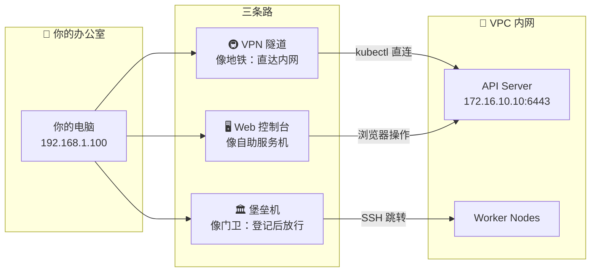
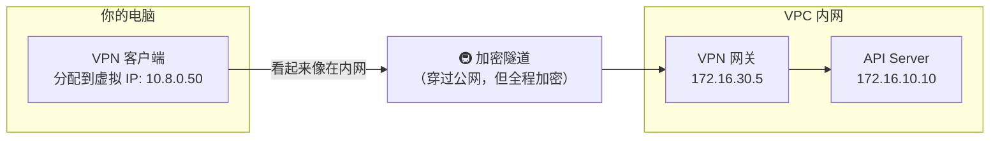
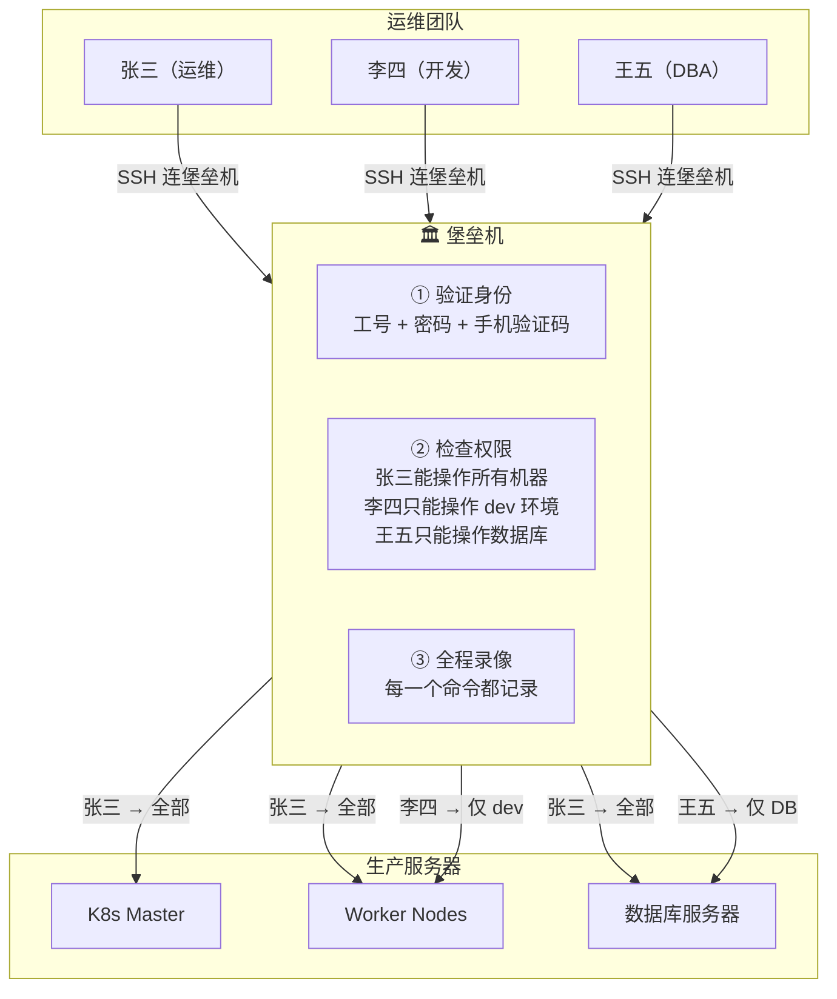

# 🏢 办公网络与堡垒机

## 一个每天都在发生的场景

小明到公司，打开电脑，输入 `kubectl get pods`。

他的请求从办公室的电脑出发，穿过了半个城市（或者几千公里），到达 K8s 集群的 API Server，拿到了 Pod 列表。

但是——**他的电脑和 K8s 集群根本不在同一个网络里！** 办公室用的是 192.168.x.x，集群在云上 172.16.x.x。中间是怎么连通的？

## 三条路，你走哪一条？

从办公室到 K8s 集群，通常有三种"路"可以走：



## 第一条路：VPN — 坐地铁直达内网

VPN 的本质是在你的电脑和公司内网之间挖一条**加密隧道**。连上 VPN 后，你的电脑就像"搬"到了 VPC 内网里，可以直接访问内网地址。



### 连上 VPN 后你能做什么

```bash
# 连上 VPN 之前
ping 172.16.10.10    # ❌ 超时，你不在内网里
kubectl get pods     # ❌ 连不上 API Server

# 连上 VPN 之后
ping 172.16.10.10    # ✅ 通了！你"在"内网里了
kubectl get pods     # ✅ 正常返回
```

### 连上 VPN 后发生了什么？

```text
1. VPN 客户端给你分配了一个虚拟 IP（比如 10.8.0.50）
2. 你电脑的路由表多了几条规则：
   "要去 172.16.0.0/12 → 走 VPN 隧道"
   "要去 10.244.0.0/16 → 走 VPN 隧道"（如果需要直接访问 Pod IP）
3. 你的 kubectl 请求发往 172.16.10.10:6443
4. 系统查路由表："172.16.x → 走 VPN 隧道"
5. 请求通过加密隧道到达 VPN 网关
6. VPN 网关在内网里，直接把请求转给 API Server
```

### kubeconfig 怎么配

```bash
# VPN 连接后，kubeconfig 用内网地址
kubectl config set-cluster my-cluster \
  --server=https://172.16.10.10:6443

# 验证连通性
kubectl cluster-info
```

### 常见 VPN 类型

| 类型 | 特点 | 适用场景 |
|-----|------|---------|
| **IPSec VPN** | 办公室出口路由器直接连云 | 整个办公室都能用，不用每人装客户端 |
| **SSL VPN / OpenVPN** | 每个人装客户端 | 在家办公、出差 |
| **WireGuard** | 最新最快 | 技术团队自建 |

## 第二条路：堡垒机 — 所有人必须经过的"安检口"

堡垒机是干什么的？**就是在服务器前面加了一个"门卫"，所有人想操作服务器，必须先经过门卫。**

为什么需要门卫？因为：
- 需要知道**谁**在**什么时间**做了**什么操作**（审计）
- 需要控制**谁能操作哪些服务器**（权限）
- 需要在出事时能**回放操作录像**（安全）



### SSH 跳板实操

```bash
# 方法一：SSH ProxyJump（推荐，一条命令搞定）
# 先在 ~/.ssh/config 里配好

Host bastion                      # 堡垒机
    HostName bastion.example.com  # 堡垒机地址（公网或办公网可达）
    User zhangsan                 # 你的账号
    Port 2222

Host k8s-master                   # K8s Master
    HostName 172.16.10.10         # 内网地址
    User root
    ProxyJump bastion             # 通过堡垒机跳转

# 然后直接连
ssh k8s-master
# 实际上经过了：你的电脑 → 堡垒机 → K8s Master

# 连上 Master 后就能 kubectl 了
kubectl get pods
```

```bash
# 方法二：SSH 隧道（把 API Server 端口映射到本地）
ssh -L 6443:172.16.10.10:6443 zhangsan@bastion.example.com -p 2222

# 另一个终端窗口里
kubectl --server=https://127.0.0.1:6443 get pods
# 请求走了这条路：你的电脑:6443 → SSH 隧道 → 堡垒机 → API Server:6443
```

### 常见堡垒机产品

| 产品 | 特点 | 适合谁 |
|------|------|--------|
| **JumpServer** | 开源免费，Web 终端，录像回放 | 中小公司 |
| **Teleport** | K8s 原生集成，零信任 | 技术团队 |
| **云堡垒机** | 免运维，和云平台集成 | 用云的公司 |

### Teleport：专为 K8s 设计的堡垒机

Teleport 可以直接代理 kubectl，不需要 SSH 隧道：

```bash
# 登录 Teleport
tsh login --proxy=teleport.example.com

# 选择要操作的集群
tsh kube login my-production-cluster

# 直接用 kubectl，所有操作自动审计
kubectl get pods
kubectl logs my-pod
```

## 第三条路：Web Dashboard

适合不需要命令行的场景，比如查看 Pod 状态、看日志：

```text
浏览器访问：https://dashboard.example.com
  → 输入 Token 或 kubeconfig 登录
  → 可以查看资源、查看日志、甚至简单的操作

本质上就是 Dashboard 应用帮你调 API Server 的接口
```

## 三条路怎么选？

```text
日常开发调试：
  你 → VPN → kubectl → API Server
  最方便，适合频繁操作

生产环境运维：
  你 → 堡垒机 → SSH → K8s 节点
  必须走这条路，因为要审计

紧急看一下状态：
  你 → 浏览器 → Dashboard
  最快，但功能有限
```

## 安全规范（简单版）

```text
✅ 做的事：
  - kubectl 访问走 VPN，不把 API Server 暴露到公网
  - 生产操作走堡垒机，全程录像
  - 每个人用自己的账号，不共用 root
  - kubeconfig 不放在 Git 仓库里
  - 离职员工当天清除权限

❌ 不做的事：
  - 不把 API Server 的 6443 端口开放到公网
  - 不把 admin kubeconfig 发给所有人
  - 不直接 SSH 到生产服务器（必须走堡垒机）
  - 不在 Slack / 飞书里发 Token 和密码
```

## 常见问题

### "VPN 连上了但 kubectl 超时"

```bash
# 排查步骤：
# 1. VPN 连上了吗？
ping 172.16.10.10
# 如果不通 → VPN 可能没真正连上，或者路由没配对

# 2. 路由对不对？
# Windows:
route print | findstr 172.16
# Mac/Linux:
ip route | grep 172.16
# 应该有一条 172.16.0.0 → VPN 隧道的路由

# 3. API Server 端口通不通？
curl -k https://172.16.10.10:6443/version
# 如果不通 → 检查安全组是否允许你的 VPN IP 段访问 6443

# 4. kubeconfig 里的地址对不对？
kubectl config view
# 确认 server 地址是 https://172.16.10.10:6443（内网地址）
```

### "SSH 隧道老是断"

```bash
# 在 ~/.ssh/config 里加保活
Host bastion
    ServerAliveInterval 60     # 每 60 秒发一个心跳
    ServerAliveCountMax 3      # 连续 3 次没回应才断开
    TCPKeepAlive yes
```

## 下一步

现在你知道了怎么从办公室连到集群。但你可能会好奇：VPN 隧道、SSH 隧道、iptables 转发、kubectl port-forward……这些"中转站"到底是怎么工作的？

→ [网络转发与代理](./06-network-forwarding.md)
