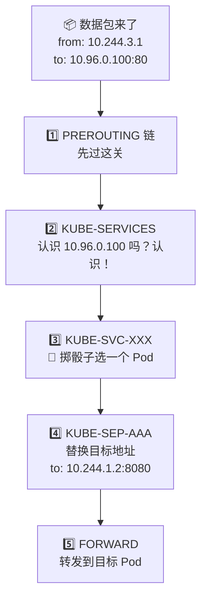
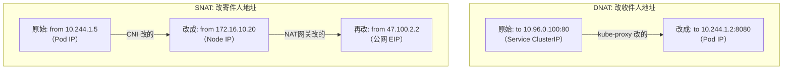
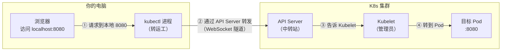
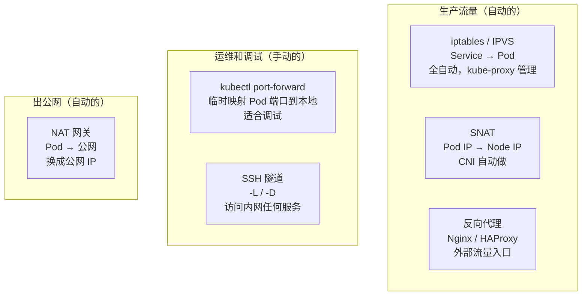

# 🔀 网络转发与代理

## 什么是网络转发？

你在集群里的每一次访问，背后都有"中间人"在帮忙传话。这些中间人就是各种**网络转发**机制。

打个比方：你给朋友打电话，但朋友换了号码。你打到旧号码，运营商说"我帮你转接到新号码"——这就是最简单的转发。

在 K8s 里，最常见的"中间人"有这几个：

```text
你可能遇到的场景                  背后用的转发技术
─────────────────────────────────────────────────
Pod 通过 ClusterIP 访问 Service  → iptables / IPVS（自动的）
你在电脑上 kubectl port-forward  → API Server WebSocket 隧道
你 SSH 跳堡垒机到服务器          → SSH 隧道
外部用户经 Nginx 访问后端        → 反向代理
Pod 出公网，IP 地址被替换        → SNAT（源地址转换）
```

## iptables：K8s 最核心的"传话人"

kube-proxy 用 iptables 实现 Service 的转发。它的工作原理其实很简单——**写一堆规则，告诉 Linux 内核：看到某个目标 IP，就替换成另一个 IP**。

### 用一个故事理解

```text
假设公司有个总机号 400-0000-100（= ClusterIP 10.96.0.100）
背后有三个客服：
  小红的分机 → 8001（= Pod 10.244.1.2:8080）
  小蓝的分机 → 8002（= Pod 10.244.2.3:8080）
  小绿的分机 → 8003（= Pod 10.244.1.5:8080）

电话交换机（= iptables）的规则：
  "接到 400-0000-100 的来电：
    33% 转给小红
    33% 转给小蓝
    34% 转给小绿"

打电话的人只知道总机号，不知道是谁接的。
这就是 ClusterIP 的工作方式。
```

### 实际看看 iptables 规则

```bash
# 看 kube-proxy 写了哪些转发规则
sudo iptables -t nat -L KUBE-SERVICES -n | head -20

# 看某个 Service 具体怎么转发
sudo iptables -t nat -L KUBE-SVC-XXXXX -n
# 输出类似：
# Chain KUBE-SVC-XXXXX
#   statistic mode random probability 0.33  → KUBE-SEP-AAAA
#   statistic mode random probability 0.50  → KUBE-SEP-BBBB
#                                           → KUBE-SEP-CCCC

# 看具体的 DNAT（目标地址替换）
sudo iptables -t nat -L KUBE-SEP-AAAA -n
# DNAT  tcp  --  anywhere  anywhere  to:10.244.1.2:8080
```

### 数据包完整经历



### IPVS：iptables 的升级版

当集群很大（几千个 Service）时，iptables 规则太多，性能会下降。IPVS 是更高效的替代方案：

```text
iptables vs IPVS，用餐厅叫号类比：

iptables：
  "1 号桌？不是。2 号桌？不是。3 号桌？不是。……100 号桌？是的！"
  → 从头到尾一条一条匹配，桌子越多越慢

IPVS：
  "100 号桌！" → 直接查哈希表，一步到位
  → 不管有多少桌，速度都一样快
```

```bash
# 查看 IPVS 规则
sudo ipvsadm -Ln
# TCP  10.96.0.100:80 rr           ← rr 表示轮询
#   -> 10.244.1.2:8080   Masq  1   ← 后端 Pod 1
#   -> 10.244.2.3:8080   Masq  1   ← 后端 Pod 2
```

## SNAT 和 DNAT：改信封上的地址

网络转发的核心操作就两个——改信封上的"寄件人"或"收件人"地址：

```text
DNAT（改收件人）= "你的信本来寄给总机，我帮你改成具体某个人"
  Service ClusterIP → Pod IP
  用户访问 LB 公网 IP → 集群内部 NodePort

SNAT（改寄件人）= "你的名片不好使，我帮你换成大家认识的名字"
  Pod IP → Node IP → 公网 EIP
  集群内部 IP 出公网时必须换
```

用一张图看清楚：



## kubectl port-forward：你的专属小通道

当你想在电脑上直接访问某个 Pod 的端口（比如调试一个 Web 界面），最快的方式是 `kubectl port-forward`。

### 它干了什么？



```bash
# 把 Pod 的 8080 端口映射到你的电脑
kubectl port-forward pod/my-pod 8080:8080
# 然后浏览器打开 http://localhost:8080

# 把 Service 后面的某个 Pod 映射过来
kubectl port-forward svc/my-service 3000:80
# 浏览器打开 http://localhost:3000

# 映射数据库端口
kubectl port-forward svc/mysql 3306:3306
# 然后用本地的 MySQL 客户端连 localhost:3306
```

**注意**：port-forward 只适合临时调试，不稳定，而且流量全走 API Server。

## SSH 隧道：万能的"偷渡通道"

SSH 隧道是运维人员的瑞士军刀。连上堡垒机后，你可以通过 SSH 隧道访问内网任何服务。

### 本地转发（-L）：最常用

**场景**：你想在本地电脑连内网的 Grafana（172.16.30.20:3000），但你的电脑不在内网。

```text
你的电脑 localhost:3000
    │
    │  ← SSH 加密隧道 →
    │
堡垒机（能访问内网）
    │
    ↓
Grafana 172.16.30.20:3000
```

```bash
# 命令
ssh -L 3000:172.16.30.20:3000 zhangsan@bastion -N

# 翻译成人话：
# "把我本地的 3000 端口，通过堡垒机，连到内网 172.16.30.20 的 3000 端口"
# -N 表示不打开 Shell，只建隧道

# 然后浏览器打开 http://localhost:3000 就能看到 Grafana 了
```

**更多例子**：

```bash
# 通过堡垒机访问内网 MySQL
ssh -L 3306:172.16.20.10:3306 zhangsan@bastion -N
mysql -h 127.0.0.1 -P 3306 -u root -p

# 通过堡垒机访问 K8s API Server
ssh -L 6443:172.16.10.10:6443 zhangsan@bastion -N
kubectl --server=https://127.0.0.1:6443 get nodes

# 通过堡垒机访问 Kibana
ssh -L 5601:172.16.30.30:5601 zhangsan@bastion -N
# 浏览器 http://localhost:5601
```

### 动态转发（-D）：一条隧道访问所有内网

如果你需要访问内网很多个服务，不想每个都开一条隧道：

```bash
# 创建 SOCKS 代理
ssh -D 1080 zhangsan@bastion -N

# 配置浏览器使用 SOCKS5 代理 127.0.0.1:1080
# 然后浏览器里直接输入内网地址就能访问：
# http://172.16.30.20:3000   ← Grafana
# http://172.16.30.30:5601   ← Kibana
# http://172.16.10.10:6443   ← API Server
```

### SSH 隧道 vs kubectl port-forward

```text
                    SSH 隧道                    kubectl port-forward
─────────────────────────────────────────────────────────────────────
前提条件        能 SSH 到堡垒机/节点           kubectl 已配好
能访问什么      内网里的任何 IP:Port            只能访问 Pod/Service
稳定性          较好（可配置心跳）              一般（容易断）
适合场景        访问 Grafana、MySQL 等          调试某个 Pod
```

## 反向代理：Nginx 的角色

在 K8s 环境中，Nginx 通常扮演两个角色：

### 角色一：作为 Ingress Controller（集群内）

```text
用户 → SLB → Nginx Ingress Controller (Pod) → Service → Pod
                    ↑
                  看域名和路径决定转发到哪个 Service
```

### 角色二：作为外部网关（集群外）

有些公司在集群外面再放一层 Nginx，做更灵活的路由：

```text
用户 → 外部 Nginx → K8s NodePort → Pod
          ↑
        可以做灰度发布、AB测试、限流等
```

```nginx
# 外部 Nginx 配置示例
upstream k8s-backend {
    server 172.16.10.20:30080;  # Node 1
    server 172.16.10.21:30080;  # Node 2
    server 172.16.10.22:30080;  # Node 3
}

server {
    listen 443 ssl;
    server_name app.example.com;

    ssl_certificate /etc/nginx/ssl/app.crt;
    ssl_certificate_key /etc/nginx/ssl/app.key;

    location / {
        proxy_pass http://k8s-backend;
        proxy_set_header Host $host;
        proxy_set_header X-Real-IP $remote_addr;
    }
}
```

## 所有转发技术一张图



## 下一步

我们已经逐个介绍了各种网络区域和转发技术。现在是时候把所有东西串起来，看看一个请求**从头到尾**经过了什么。

→ [多网络互通全景方案](./07-network-interconnection.md)
