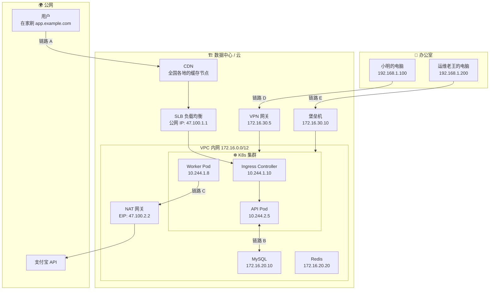
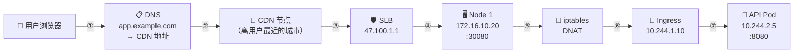
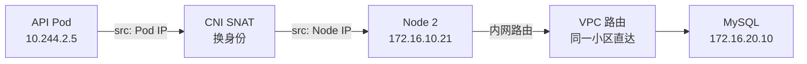
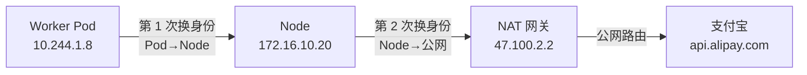

# 🔗 多网络互通全景方案

## 把前面学的全部串起来

前面六章，我们分别讲了集群内网、VPC、公网、办公网、堡垒机和各种转发技术。这一章要做的就是——**把所有网络画在一张图上，然后跟踪几个真实请求，看它们是怎么从起点到达终点的**。

## 全景大图



下面我们跟踪每条链路，看清楚**每一跳**发生了什么。

## 链路 A：用户访问你的 Web 服务

**故事**：用户在家里打开浏览器，访问 `https://app.example.com/api/users`。



**逐跳追踪（带具体 IP 变化）**：

```text
① 用户浏览器问 DNS："app.example.com 是谁？"
   DNS 回答："去找 CDN，地址是 cdn-edge-hangzhou.example.com"

② CDN 节点收到请求
   判断："/api/users 是动态请求，我处理不了，回源"
   转发给源站（SLB 的公网 IP: 47.100.1.1）

③ SLB 收到请求
   健康检查：Node 1 ✅ Node 2 ✅
   决定：这次发给 Node 1
   数据包：src=SLB内部IP  dst=172.16.10.20:30080

④ 到达 Node 1，iptables 拦截
   "目标是 30080 端口？查 KUBE-NODEPORTS..."
   "找到了！Service my-app，要做 DNAT"
   数据包变成：dst=10.244.1.10:80（Ingress Controller Pod）

⑤ 到达 Ingress Controller（Nginx）
   看 HTTP 头：Host: app.example.com，Path: /api/users
   查路由表："/api → api-service"
   转发给 api-service 的 ClusterIP: 10.96.0.200

⑥ 又经过一次 iptables DNAT
   ClusterIP 10.96.0.200 → Pod 10.244.2.5:8080

⑦ 到达 API Pod
   处理请求，查数据库，返回 JSON
   响应原路返回
```

## 链路 B：Pod 访问内网 MySQL

**故事**：API Pod 收到请求后需要查数据库。

```text
请求方向：API Pod (10.244.2.5) → MySQL (172.16.20.10:3306)

IP 地址变化：
  ┌─────────────────────────────────────────────────────┐
  │ 阶段         │ 源 IP          │ 目标 IP            │
  ├─────────────────────────────────────────────────────┤
  │ Pod 发出      │ 10.244.2.5     │ 172.16.20.10:3306  │
  │ 经过 SNAT     │ 172.16.10.21   │ 172.16.20.10:3306  │
  │               │  ↑ Node IP     │                    │
  │ VPC 路由      │（不变）        │（不变）            │
  │ 到达 MySQL    │ 172.16.10.21   │ 172.16.20.10:3306  │
  └─────────────────────────────────────────────────────┘

MySQL 看到的来源是 172.16.10.21（Node IP），不是 Pod IP。
因为 Pod IP（10.244.x.x）出了集群没人认识，必须换成 Node IP。
```



## 链路 C：Pod 调用支付宝 API（出公网）

**故事**：Worker Pod 处理完订单，需要调用支付宝 API 发起支付。

```text
请求方向：Worker Pod (10.244.1.8) → api.alipay.com (某个公网 IP)

IP 地址变化（换了两次身份）：
  ┌───────────────────────────────────────────────────────┐
  │ 阶段          │ 源 IP          │ 目标 IP             │
  ├───────────────────────────────────────────────────────┤
  │ Pod 发出       │ 10.244.1.8     │ api.alipay.com      │
  │ 第 1 次 SNAT   │ 172.16.10.20   │ api.alipay.com      │
  │   ↑ Node IP   │                │                     │
  │ 第 2 次 SNAT   │ 47.100.2.2     │ api.alipay.com      │
  │   ↑ NAT 网关   │                │                     │
  │ 到达支付宝     │ 47.100.2.2     │ api.alipay.com      │
  └───────────────────────────────────────────────────────┘

支付宝看到的来源是 47.100.2.2（NAT 网关的 EIP）。
如果支付宝要求 IP 白名单，你要填这个 EIP。
```



## 链路 D：开发者从办公室 kubectl

**故事**：小明在办公室想看 Pod 状态。

```text
小明的电脑 (192.168.1.100)
  │
  │ ① 连上 VPN，获得虚拟 IP: 10.8.0.50
  │   路由表多了一条：172.16.0.0/12 → VPN 隧道
  │
  │ ② kubectl get pods
  │   请求发往 172.16.10.10:6443（API Server 内网地址）
  │   路由表匹配 → 走 VPN 隧道
  │
  ├── 加密隧道 ──→ VPN 网关 (172.16.30.5)
  │                    │
  │                    ↓ 解密后转发
  │               API Server (172.16.10.10:6443)
  │                    │
  │                    ↓ 查询 etcd，返回 Pod 列表
  │
  └──← 响应原路返回 ──← VPN 隧道
```

```bash
# 小明的操作
# 1. 打开 VPN 客户端，连接公司 VPN
# 2. 验证连通性
ping 172.16.10.10     # API Server，应该通

# 3. 正常使用 kubectl
kubectl get pods
kubectl logs my-pod
kubectl port-forward svc/grafana 3000:80   # 映射 Grafana 到本地
```

## 链路 E：运维老王通过堡垒机管理集群

**故事**：运维老王需要 SSH 到 Node 上查看 iptables 规则。

```text
老王的电脑 (192.168.1.200)
  │
  │ ① SSH 连堡垒机
  │   ssh wangwu@bastion.example.com -p 2222
  │   输入密码 + 手机验证码
  │
  ├──→ 堡垒机 (172.16.30.10)
  │    │ ② 验证身份和权限
  │    │   "老王有权限访问 K8s 节点"
  │    │   开始录像
  │    │
  │    │ ③ 跳转到 K8s Master
  │    ├──→ K8s Master (172.16.10.10)
  │    │         │
  │    │         │ ④ 老王执行命令
  │    │         │   kubectl get pods
  │    │         │   sudo iptables -t nat -L
  │    │         │
  │    │         │ 所有命令被记录和录像
  │    │
  │    └── 老王退出，录像保存
```

## 五条链路放在一起

```text
              公网                办公网              管理区
               │                   │                   │
          ┌────┴────┐         ┌────┴────┐         ┌────┴────┐
          │ CDN/SLB │         │  VPN    │         │ 堡垒机  │
          └────┬────┘         └────┬────┘         └────┬────┘
               │                   │                   │
          ═════╪═══════════════════╪═══════════════════╪══════ VPC 边界
               │                   │                   │
               ▼                   ▼                   ▼
          ┌─────────────────────────────────────────────────┐
          │                 K8s 集群                         │
          │  Ingress → Service → Pod ←→ Pod ←→ Pod          │
          └────────────────────────┬────────────────────────┘
                                   │
                              ┌────┴────┐
                              │ VPC 内网 │
                              │ MySQL    │
                              │ Redis    │
                              └────┬────┘
                                   │
                              ┌────┴────┐
                              │NAT 网关 │
                              └────┬────┘
                                   │
                              外部 API
                            （支付宝等）
```

**数据流方向总结**：

| 链路 | 方向 | 经过的组件 | 用到的转发技术 |
|------|------|-----------|--------------|
| A | 用户 → Pod | DNS → CDN → SLB → Node → iptables → Ingress → Pod | DNAT x2 |
| B | Pod → 数据库 | Pod → SNAT → Node → VPC 路由 → MySQL | SNAT |
| C | Pod → 公网 | Pod → SNAT → Node → NAT 网关 → 公网 | SNAT x2 |
| D | 开发者 → 集群 | VPN 客户端 → VPN 网关 → API Server | VPN 隧道 |
| E | 运维 → 节点 | SSH → 堡垒机 → SSH → Node | SSH 跳转 |

## 实际部署方案选择

### 小公司（10 人团队，1 个集群）

```text
架构：
  SLB → K8s 集群（云托管 ACK/EKS）
  云 RDS + 云 Redis
  SSL VPN 远程接入
  不需要堡垒机（团队小，直接 VPN + kubectl）

费用重点：
  SLB + NAT 网关 + VPN 网关
```

### 中型公司（50 人团队，2-3 个集群）

```text
架构：
  CDN → WAF → SLB → K8s 集群
  云 RDS + 云 Redis + 对象存储
  IPSec VPN（办公室到云）
  堡垒机（生产环境必须）
  Prometheus + Grafana 监控

分环境：
  生产集群 + 测试集群（不同的 VPC 或 Namespace）
```

### 大公司（多地域、混合云）

```text
架构：
  GSLB → 多地域 CDN → 各地 SLB → 各地 K8s 集群
  云企业网连接所有 VPC + IDC 专线
  Teleport 零信任访问
  Service Mesh（Istio）跨集群通信
  完整的监控、日志、告警体系
```

## 下一步

现在你对整个网络架构有了完整的画面。但现实总是会出问题——"突然访问不了了"、"偶尔超时"、"某个 Pod 连不上数据库"。下一章教你像侦探一样排查网络故障。

→ [网络排障实战](./08-network-troubleshooting.md)
