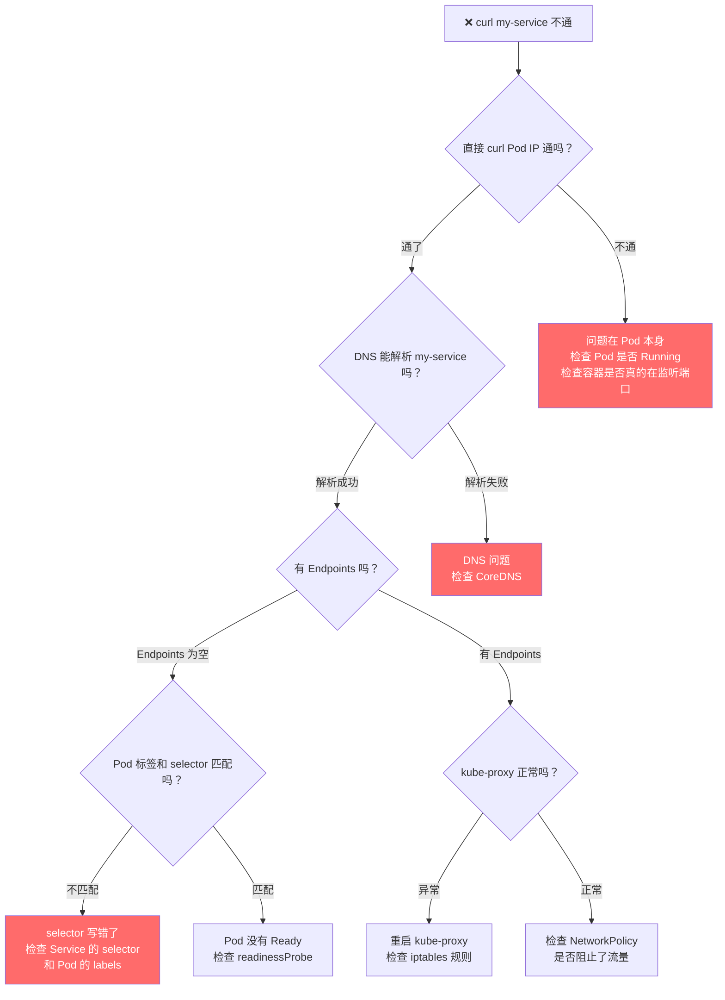
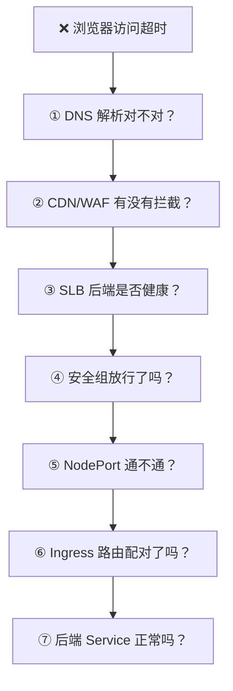

# 🔧 网络排障实战

## 像侦探一样排查网络问题

网络问题是 K8s 最让人头疼的问题类型，因为数据包经过的环节太多了——DNS、iptables、CNI、安全组、路由表……任何一环出问题，表现都是"不通"。

但好消息是，排查网络有一个万能方法：**从两头往中间查，逐层缩小范围**。就像破案一样，先确定"不可能的选项"，最后就能找到"凶手"。

## 排障的核心原则

```text
原则 1：先确认"谁能通，谁不通"
  同 Pod 里 curl 自己能通吗？
  同 Node 上其他 Pod 能通吗？
  别的 Node 上能通吗？
  → 能通的层级越多，问题的范围就越小

原则 2：从最里层开始查
  先查 Pod → 再查 Service → 再查 Node → 最后查外部
  不要反过来，因为外层的问题更难定位

原则 3：每次只验证一个变量
  不要同时改安全组和路由表，一次改一个，验证一下
```

## 你的万能排障工具箱

```bash
# 启动一个带齐工具的排障 Pod
kubectl run debug --image=nicolaka/netshoot -it --rm -- bash

# 进去之后你就有了所有网络工具：
ping 10.244.1.2              # 能不能到？
curl -v http://10.96.0.100   # HTTP 通不通？
nc -zv 172.16.20.10 3306     # 端口开不开？
nslookup my-service          # DNS 能不能解析？
traceroute 172.16.20.10      # 路上经过了谁？
tcpdump -i eth0 port 80      # 抓包看看到底发生了什么
```

## 场景一：访问 Service 不通

**现象**：Pod 里 `curl http://my-service` 超时。

**破案思路**：一步步缩小范围。



**实际操作**：

```bash
# 第 1 步：Service 有没有后端？
kubectl get endpoints my-service
# 如果 ENDPOINTS 是 <none>，说明没有匹配的 Pod

# 如果没有 Endpoints →
kubectl get svc my-service -o yaml | grep -A5 selector
# 看 selector 是什么，比如 app: my-app
kubectl get pods -l app=my-app
# 看有没有匹配的 Pod
# 如果没有 → selector 写错了或者 Pod label 不对

# 第 2 步：直接访问 Pod IP
kubectl get pods -o wide
# 拿到 Pod IP
kubectl exec -it debug -- curl http://10.244.1.2:8080
# 如果直接访问 Pod 也不通 → Pod 本身有问题

# 第 3 步：Pod 真的在监听吗？
kubectl exec -it my-pod -- ss -tlnp
# 或
kubectl exec -it my-pod -- netstat -tlnp
# 确认 8080 端口是否在监听

# 第 4 步：DNS 正常吗？
kubectl exec -it debug -- nslookup my-service
# 如果解析失败 → CoreDNS 有问题

# 第 5 步：kube-proxy 正常吗？
kubectl get pods -n kube-system -l k8s-app=kube-proxy
kubectl logs -n kube-system <kube-proxy-pod> --tail=20
```

## 场景二：Pod 之间 ping 不通

**现象**：Pod A ping Pod B 超时。

```bash
# 第 1 步：搞清楚它们在同一台机器还是不同机器
kubectl get pods -o wide
# NAME    IP           NODE
# pod-a   10.244.1.2   node-1
# pod-b   10.244.2.3   node-2    ← 不同 Node！

# 第 2 步：Node 之间能 ping 通吗？
ssh node-1
ping 172.16.10.21    # ping 另一台 Node
# 如果不通 → 物理网络或安全组问题

# 第 3 步：CNI 正常吗？
kubectl get pods -n kube-system | grep -E 'calico|flannel|cilium'
# 如果有 Error 或 CrashLoopBackOff → CNI 出问题了

# 第 4 步：看 CNI 日志
kubectl logs -n kube-system <calico-node-xxx> --tail=50

# 第 5 步：安全组是否放行了 CNI 需要的端口
# Flannel VXLAN: UDP 8472
# Calico BGP: TCP 179
# Calico IPIP: 协议号 4
```

## 场景三：外部访问不到服务

**现象**：你部署了 Ingress，但用户从浏览器访问 `app.example.com` 返回超时。

**破案思路**：从外到内逐层检查。



```bash
# ① DNS 解析
dig app.example.com
# 看返回的 IP 是不是 SLB 或 CDN 的 IP

# ② 直接用 IP 访问（跳过 DNS 和 CDN）
curl -v -H "Host: app.example.com" http://47.100.1.1
# 如果这样能通，说明 DNS 或 CDN 有问题
# 如果也不通，说明问题在 SLB 或后面

# ③ 看 SLB 健康检查（去云控制台）
# "后端服务器" → 看有没有不健康的实例

# ④ 安全组（去云控制台）
# 确认 Worker 节点安全组允许 SLB 访问 30000-32767 端口

# ⑤ 直接 curl NodePort
curl http://172.16.10.20:30080
# 如果通了 → 问题在 SLB 或安全组
# 如果不通 → 问题在集群内部

# ⑥ 在集群内检查 Ingress
kubectl get ingress
kubectl describe ingress app-ingress
# 看 Rules 和 Events
# 直接 curl Ingress Controller:
kubectl exec -it debug -- curl -H "Host: app.example.com" http://<ingress-pod-ip>

# ⑦ 检查后端 Service
kubectl exec -it debug -- curl http://my-service
```

## 场景四：Pod 连不上数据库

**现象**：Pod 里 `nc -zv 172.16.20.10 3306` 超时。

```bash
# 第 1 步：在 Node 上试试
ssh node-1
nc -zv 172.16.20.10 3306
# 如果 Node 也不通 → 安全组或路由问题
# 如果 Node 通了 → Pod 的 SNAT 或 CNI 问题

# 第 2 步：检查安全组
# MySQL 的安全组是否允许 K8s 节点网段访问 3306？
# 入站规则需要有：172.16.10.0/24 → TCP 3306

# 第 3 步：检查路由
# 在 Node 上看路由表
ip route | grep 172.16.20
# 应该有一条到 172.16.20.0/24 的路由

# 第 4 步：抓包定位
# 在 Node 上抓包，看 Pod 的请求到底有没有发出来
sudo tcpdump -i any host 172.16.20.10 and port 3306 -nn
# 然后在另一个终端从 Pod 里发请求
kubectl exec -it my-pod -- nc -zv 172.16.20.10 3306
# 如果 Node 上能看到包 → 安全组或对端问题
# 如果 Node 上看不到包 → CNI 或路由问题
```

## 场景五：DNS 解析卡 5 秒

**现象**：Pod 里每次 DNS 查询都要等大约 5 秒。

```text
这是一个经典 Bug！

原因：Linux 内核同时发 A（IPv4）和 AAAA（IPv6）两个 DNS 查询，
某些内核版本下两个 UDP 包会用同一个源端口，
导致 conntrack 把其中一个包丢掉。
被丢的那个包等 5 秒超时后才重试。

验证方法：
```

```bash
kubectl exec -it <pod> -- time nslookup kubernetes.default
# 如果恰好是 5 秒左右，基本确定是这个 Bug
```

```text
解决方案（任选一个）：

方案 1：配置 Pod 的 DNS 选项
```

```yaml
spec:
  dnsConfig:
    options:
    - name: single-request-reopen  # 让 A 和 AAAA 用不同的 socket
```

```text
方案 2：部署 NodeLocal DNSCache
  在每个 Node 上跑一个 DNS 缓存，绕过 conntrack
  这是最彻底的解决方案
```

## 场景六：Service 间歇性超时

**现象**：大部分请求正常，但偶尔超时。

```bash
# 最常见的原因：conntrack 表满了
sudo conntrack -S
# 看 insert_failed 这个数字，如果很大就是了

# 检查当前使用量
sudo sysctl net.netfilter.nf_conntrack_count   # 当前连接数
sudo sysctl net.netfilter.nf_conntrack_max     # 最大限制

# 解决：调大 conntrack 表
sudo sysctl -w net.netfilter.nf_conntrack_max=524288
# 永久生效
echo "net.netfilter.nf_conntrack_max=524288" | sudo tee -a /etc/sysctl.conf
```

## 排障速查清单

遇到网络问题时，按这个清单从上到下检查：

```text
□ Pod 状态正常吗？ (kubectl get pods)
    ↓ 正常
□ Pod 内容器在监听端口吗？ (kubectl exec -- ss -tlnp)
    ↓ 在监听
□ 从 Pod 内部 curl 自己通吗？ (curl localhost:8080)
    ↓ 通了
□ 从其他 Pod curl 这个 Pod IP 通吗？
    ↓ 通了
□ Service 有 Endpoints 吗？ (kubectl get endpoints)
    ↓ 有
□ DNS 能解析 Service 名称吗？ (nslookup my-service)
    ↓ 能
□ curl Service ClusterIP 通吗？
    ↓ 通了
□ （如果有 Ingress）Ingress 路由配对了吗？
    ↓ 配对了
□ NodePort 从 Node 上能访问吗？
    ↓ 能
□ 安全组/防火墙放行了吗？
    ↓ 放行了
□ SLB 后端健康检查通过了吗？
    ↓ 通过了
□ DNS 域名解析正确吗？
    ↓ 正确
✅ 全链路应该通了！
```

## 最后的秘密武器：tcpdump 抓包

当所有方法都试过还是找不到原因时，**抓包是终极手段**：

```bash
# 在 Pod 里抓包
kubectl exec -it <pod> -- tcpdump -i eth0 -nn port 80

# 在 Node 上抓特定 Pod 的包（需要先找到 Pod 的 veth）
# 简单方法：直接用 IP 过滤
sudo tcpdump -i any host 10.244.1.2 -nn

# 保存到文件，用 Wireshark 分析
kubectl exec -it <pod> -- tcpdump -i eth0 -w /tmp/capture.pcap -c 100
kubectl cp <pod>:/tmp/capture.pcap ./capture.pcap
# 然后用 Wireshark 打开 capture.pcap
```

```text
抓包看什么：
  ✅ 有 SYN 包出去但没有 SYN-ACK 回来 → 对端不可达（安全组/路由/对端宕机）
  ✅ 有 SYN-ACK 但没有后续数据 → 本端或中间设备丢包
  ✅ 有 RST 包 → 对端主动拒绝连接（端口没开或被防火墙拒绝）
  ✅ DNS 查询发出去但没回复 → CoreDNS 问题
```

## 总结

```text
网络排障核心方法：

1. 从里到外，逐层排查（Pod → Service → Node → 外部）
2. 每次只验证一个变量
3. 善用排障 Pod（nicolaka/netshoot）
4. 搞不定就抓包（tcpdump）
5. 记住最常见的三个坑：
   - 安全组没放行
   - Service selector 不匹配（Endpoints 为空）
   - DNS 5 秒延迟
```
