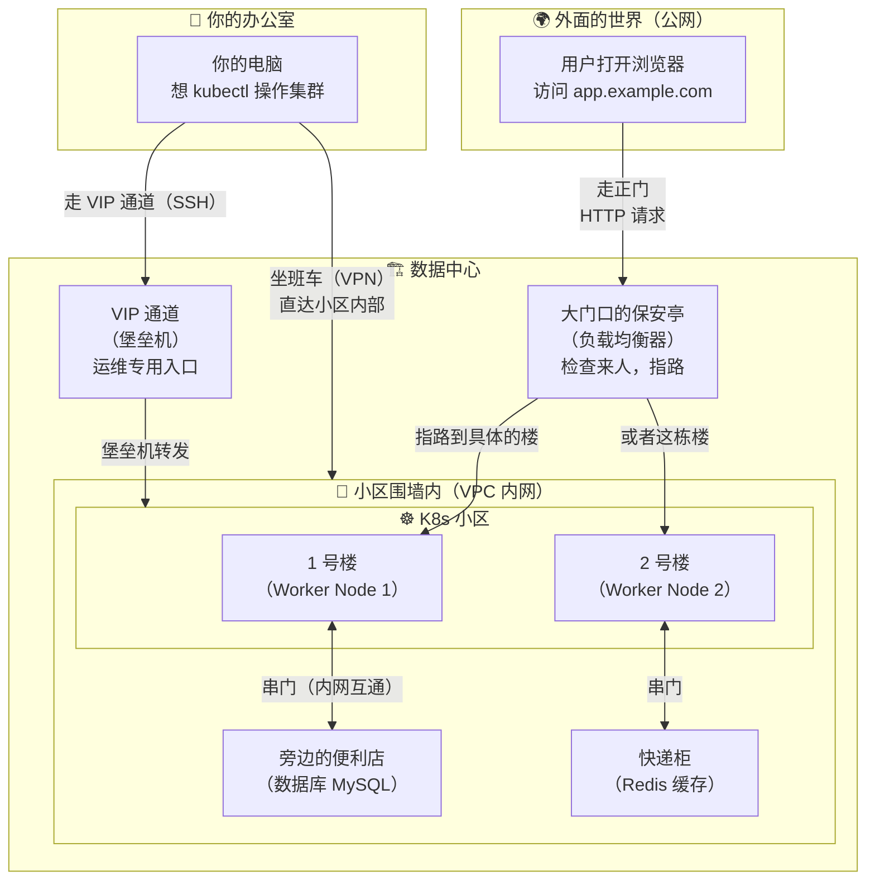

# 🌐 Kubernetes 网络工程专题

## 先讲一个你一定遇到过的场景

小明刚入职一家互联网公司，他的第一个任务是把一个 Web 服务部署到 K8s 集群上。他照着文档 apply 了 YAML，Pod 也 Running 了。然后他开始困惑：

- "Pod 跑起来了，但我在自己电脑上怎么访问它？"
- "同事说要走 VPN 才能连集群，VPN 是怎么把我和集群连起来的？"
- "服务要上线给用户用，用户的请求是怎么从浏览器跑到我的 Pod 里的？"
- "运维说要通过堡垒机才能 SSH 到服务器，堡垒机又是个什么东西？"
- "服务突然不通了，到底是 DNS 的问题、Service 的问题、还是防火墙的问题？"

如果你也有这些疑问，这个专题就是为你写的。

## 用一张图讲清楚

想象一下你家的小区：

- **你的房间** = Pod（你的应用跑在这里）
- **你家的楼** = Node（一台服务器，里面住着很多 Pod）
- **小区** = K8s 集群（一群楼组成的社区）
- **小区围墙** = VPC 内网（围墙里面的人互相串门很方便）
- **小区大门口的保安** = 堡垒机（想进来？先登记身份）
- **小区外面的马路** = 公网（外面的人要通过大门才能进来）
- **你公司的班车** = VPN（专门接你从公司直达小区内部）

放到真实的网络架构中，就是这样：



## 这个专题怎么读

整个专题用**一条故事线**串起来，从近到远，一层一层展开：

```text
你的 Pod                      ← 02 章：集群里面的网络是怎么回事
  ↕ 找隔壁 Pod / Service
小区内部（K8s 集群）
  ↕ 找数据库 / Redis
围墙内的其他楼（VPC 内网）     ← 03 章：集群怎么和内网互通
  ↕ 出围墙
外面的马路（公网）             ← 04 章：怎么让外面的用户访问到你
  ↕ 从办公室进小区
你的办公电脑（办公网）         ← 05 章：你怎么从办公室操作集群
  ↕ 数据怎么一站站传递
管道和中转站（网络转发）       ← 06 章：iptables、SSH 隧道等
  ↕ 把所有的路串起来
完整的旅程                     ← 07 章：一个请求从头到尾经过了什么
  ↕ 路不通了怎么办
排查和修复                     ← 08 章：网络出问题怎么一步步定位
```

| 章节 | 一句话说清楚 |
|------|-------------|
| [01 企业网络架构全景](./01-network-architecture-overview.md) | 一家公司的网络长什么样？你的 K8s 集群在其中是什么位置？ |
| [02 集群内部网络](./02-cluster-internal-network.md) | Pod 之间、Pod 和 Service 之间是怎么通信的？ |
| [03 内网与 VPC](./03-vpc-and-intranet.md) | 你的 Pod 怎么访问同一个内网里的 MySQL 和 Redis？ |
| [04 公网访问与暴露](./04-public-network-access.md) | 外面的用户输入网址后，请求是怎么一步步到达你的 Pod 的？ |
| [05 办公网络与堡垒机](./05-office-and-bastion-network.md) | 你在办公室怎么 kubectl 操作集群？堡垒机是干嘛的？ |
| [06 网络转发与代理](./06-network-forwarding.md) | iptables、SSH 隧道、port-forward 这些"中转站"是怎么工作的？ |
| [07 多网络互通方案](./07-network-interconnection.md) | 把所有网络串起来，跟踪一个请求的完整旅程 |
| [08 网络排障实战](./08-network-troubleshooting.md) | 网络不通了？像侦探一样一层层排查 |

## 和现有文档的关系

如果你已经读过下面这些章节，你对 Pod、Service、Ingress 已经有了基本概念。本专题会**跳出集群**，讲整个企业的网络是怎么连在一起的。

- [Kubernetes 网络模型](../04-advanced/01-networking.md) — 集群内部的网络原理
- [Ingress 与流量管理](../04-advanced/05-ingress.md) — 七层路由
- [Service - 服务发现](../02-resources/03-service.md) — Service 四种类型

没读过也没关系，本专题会在需要时带你回顾关键概念。
