# 后端开发全面大纲

> 一份系统化、可落地的后端工程师知识图谱，覆盖从入门到专家级的所有核心能力。力求每个技术点都有原理剖析和实战细节。

---

## 思维导图总览

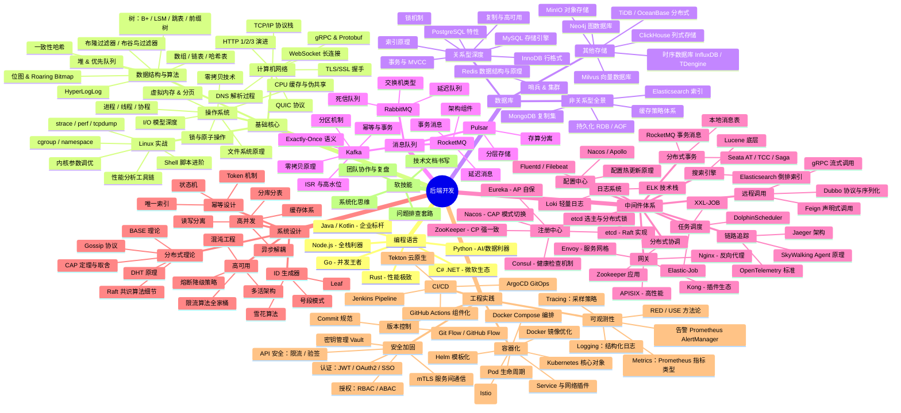

---

---

## 第一章：编程语言深度分析

### 1.1 各语言后端生态

#### Go — 云原生第一语言

| 维度 | 说明 |
|------|------|
| **并发模型** | goroutine（用户态线程，2KB 初始栈）+ channel CSP 模型 |
| **GC** | 三色标记 + 混合写屏障，STW 在 1ms 以内 |
| **优势** | 编译为单二进制文件，交叉编译，内存占用低 |
| **框架** | Gin（高性能 HTTP）、go-zero（微服务）、Kratos（B站）、Hertz（字节） |
| **ORM** | GORM（功能全）、Ent（Facebook 图式 ORM）、sqlx（轻量） |
| **中间件生态** | go-micro、go-kit、Hertz |
| **适用** | 微服务、中间件、网关、云原生基础设施 |

```go
// Go 并发经典模式：fan-in
func fanIn(ch1, ch2 <-chan int) <-chan int {
    out := make(chan int)
    var wg sync.WaitGroup
    wg.Add(2)
    go func() { defer wg.Done(); for v := range ch1 { out <- v } }()
    go func() { defer wg.Done(); for v := range ch2 { out <- v } }()
    go func() { wg.Wait(); close(out) }()
    return out
}
```

#### Java / Kotlin — 企业级霸主

| 维度 | 说明 |
|------|------|
| **版本** | LTS：Java 8 / 11 / 17 / 21（虚拟线程 Virtual Threads） |
| **JVM 调优** | 堆内存分区（新生代 Eden+S0+S1 / 老年代）、GC 算法（G1 / ZGC / Shenandoah） |
| **框架** | Spring Boot + Spring Cloud 全家桶、Quarkus（云原生）、Micronaut |
| **ORM** | MyBatis-Plus（灵活 SQL）、JPA / Hibernate（自动映射） |
| **中间件对接** | Spring Cloud Alibaba（Nacos + Sentinel + Seata）、Dubbo |
| **Kotlin** | 协程（结构化并发）、更简洁语法，Ktor 框架 |

```
JVM 内存模型：
┌─────────────────────────────────────────┐
│                  堆 Heap                  │
│  ┌──────┬───────┬──────────────────────┐ │
│  │ Eden │ S0/S1 │     Old Generation   │ │
│  └──────┴───────┴──────────────────────┘ │
├─────────────────────────────────────────┤
│  栈 Stack（每个线程独立）                  │
├─────────────────────────────────────────┤
│  方法区 / 元空间 Metaspace                │
├─────────────────────────────────────────┤
│  本地方法栈 ｜ 程序计数器                  │
└─────────────────────────────────────────┘
```

#### Python — AI 时代的后端

| 维度 | 说明 |
|------|------|
| **异步** | asyncio、uvloop（基于 libuv，性能接近 Go） |
| **Web 框架** | FastAPI（异步 + 自动 OpenAPI）、Django（全栈）、Flask（微框架） |
| **ORM** | SQLAlchemy（最强大）、Django ORM（便捷）、Tortoise ORM（异步） |
| **GIL** | 全局解释器锁，CPU 密集型使用 multiprocessing 或 C 扩展 |
| **适用** | AI/ML 服务后端、数据工程、快速原型、报表系统 |

#### Node.js — 全栈与 BFF

| 维度 | 说明 |
|------|------|
| **事件循环** | libuv，6 个阶段（timers → pending → idle/prepare → poll → check → close） |
| **框架** | Express（经典）、Koa（洋葱模型）、NestJS（装饰器 + IoC）、Fastify（极速） |
| **ORM** | Prisma（类型安全）、TypeORM（装饰器）、Drizzle（轻量类型安全） |
| **适用** | BFF 层、网关、实时应用（WebSocket）、SSR |

#### Rust — 性能极致

| 维度 | 说明 |
|------|------|
| **核心特性** | 所有权系统、借用检查器、零成本抽象 |
| **Web 框架** | Actix-web（性能最强）、Axum（Tokio 官方）、Rocket（易用） |
| **ORM** | Diesel、SeaORM（异步） |
| **适用** | 高性能网关、数据库、WebAssembly |

#### C# .NET — 微软全栈

| 维度 | 说明 |
|------|------|
| **运行时** | .NET 6/7/8 统一平台，跨平台 |
| **框架** | ASP.NET Core Minimal API、Blazor |
| **ORM** | Entity Framework Core、Dapper（轻量高性能） |
| **适用** | 企业应用、游戏服务端、Windows 生态 |

---


---

## 第二章：计算机网络深度

### 2.1 协议四层模型与对应设备

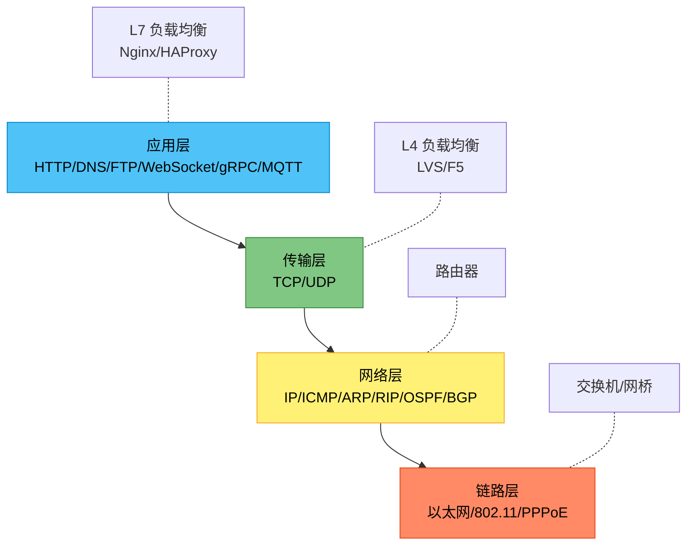

### 2.2 TCP 深度解析

#### 三次握手

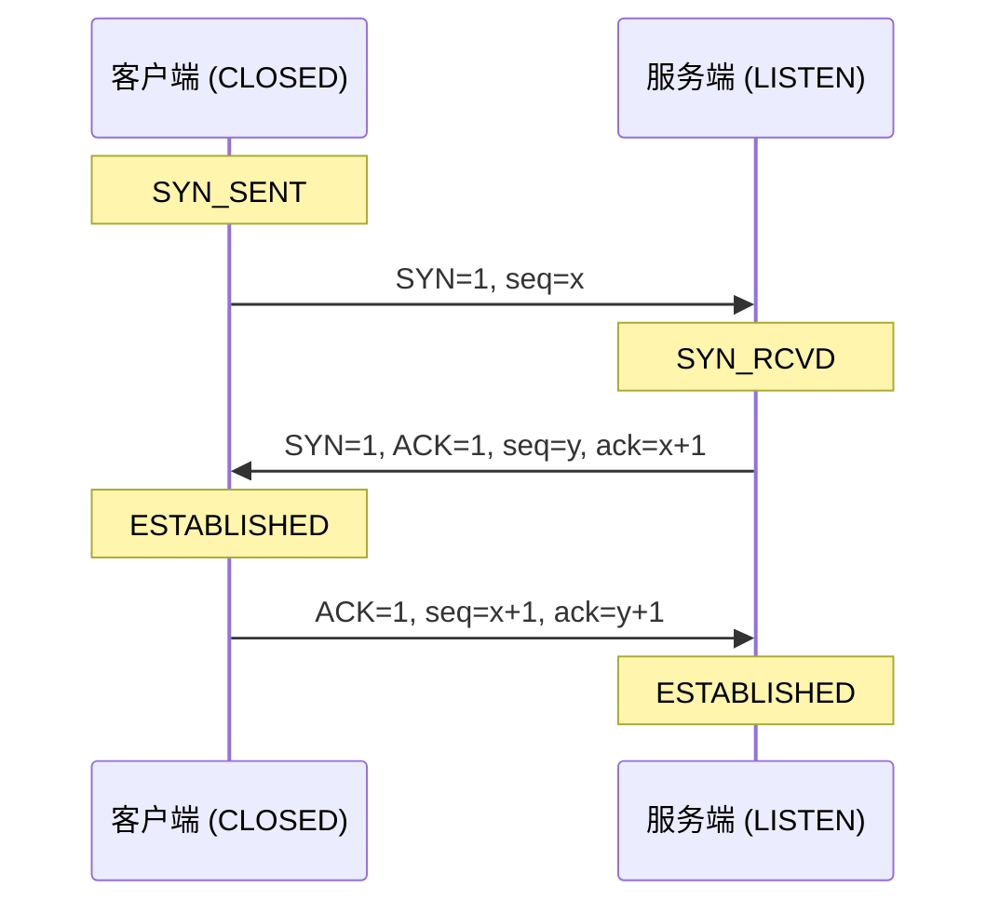

**为什么是三次，不是两次？**
- 防止已失效的连接请求到达服务端造成资源浪费
- 保证双方收发能力均正常

#### 四次挥手

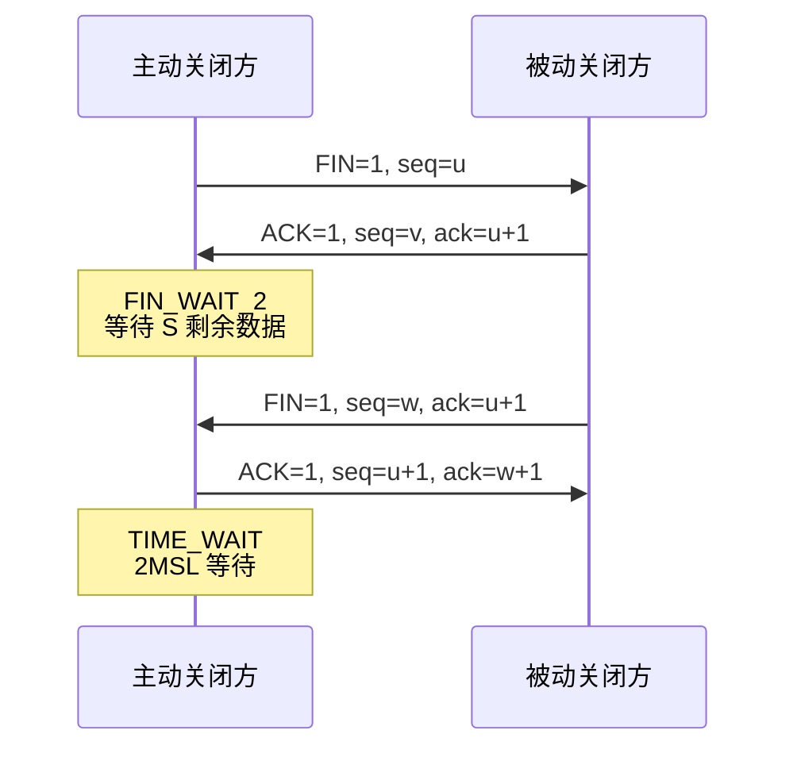

**TIME_WAIT 作用**：确保最后一个 ACK 能被对方收到；让旧连接的所有报文在网络中消失。

#### TCP 拥塞控制算法

| 算法 | 时期 | 原理 |
|------|------|------|
| Tahoe | 1988 | 慢启动 + 拥塞避免 + 快速重传 |
| Reno | 1990 | + 快速恢复 |
| CUBIC | 2008 | 三次函数窗口增长（Linux 默认） |
| BBR | 2016 | 基于带宽和 RTT 建模（Google） |

```
拥塞窗口变化（慢启动 → 拥塞避免）：
cwnd
↑
│        ╱
│      ╱
│  ╱╱         ← ssthresh(慢启动阈值)
│╱
└──────────────────────→ 时间
  慢启动   拥塞避免
  (指数)   (线性)
```

#### TCP 核心机制一览

| 机制 | 说明 |
|------|------|
| 滑动窗口 | 流量控制，接收方通过窗口大小告知发送方能力 |
| 拥塞控制 | 慢启动、拥塞避免、快速重传、快速恢复 |
| 累计确认 | ACK 确认该序号之前的所有数据 |
| 超时重传 | RTO 动态计算 (Jacobson算法) |
| 快速重传 | 收到 3 个重复 ACK 立刻重传 |
| SACK | 选择性确认，告知哪些段已收到 |
| Nagle 算法 | 减少小包发送 |
| Delayed ACK | 延迟确认，减少 ACK 数量 |

### 2.3 HTTP 演进

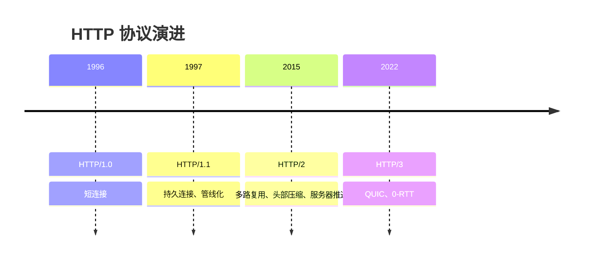

| 特性 | HTTP/1.1 | HTTP/2 | HTTP/3 |
|------|----------|--------|--------|
| 传输层 | TCP | TCP | QUIC (UDP) |
| 连接复用 | Keep-Alive | 多路复用 | 多路复用 |
| 队头阻塞 | 有（连接级） | 有（TCP 级） | 无 |
| 头部压缩 | 无 | HPACK | QPACK |
| 握手 | 1 RTT + TLS 2 RTT | 1 RTT + TLS 2 RTT | 0-RTT（重连） |
| 服务器推送 | 无 | 支持 | 支持 |

### 2.4 HTTPS / TLS 1.3 握手

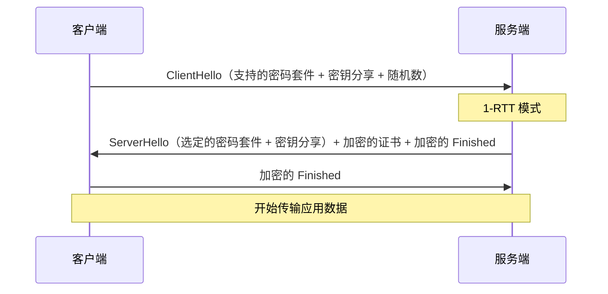

**TLS 1.3 改进**：
- 握手从 2-RTT 降为 1-RTT（0-RTT 会话恢复）
- 移除不安全算法（RSA 密钥交换、SHA-1、3DES等）
- 默认前向安全性

### 2.5 DNS 解析全过程


### 2.6 gRPC vs REST

| 维度 | REST | gRPC |
|------|------|------|
| 协议 | HTTP/1.1 JSON | HTTP/2 Protobuf |
| 序列化 | JSON（文本、冗长） | Protobuf（二进制、压缩） |
| 接口定义 | 无强约束 | .proto 强类型 |
| 流式传输 | 不支持 | 支持（一元/服务端流/客户端流/双向流） |
| 代码生成 | OpenAPI/Swagger | protoc 自动生成 |
| 适用场景 | 对外 API | 内部微服务通信 |

```protobuf
// gRPC 定义示例
service OrderService {
  rpc CreateOrder (CreateOrderReq) returns (CreateOrderResp);
  rpc ListOrders (ListOrdersReq) returns (stream Order); // 服务端流
  rpc BatchUpdate (stream UpdateReq) returns (UpdateResp); // 客户端流
  rpc Chat (stream Msg) returns (stream Msg); // 双向流
}
```

### 2.7 WebSocket 协议

```
握手阶段（基于 HTTP Upgrade）：
GET /chat HTTP/1.1
Upgrade: websocket
Connection: Upgrade
Sec-WebSocket-Key: dGhlIHNhbXBsZSBub25jZQ==
Sec-WebSocket-Version: 13

响应：
HTTP/1.1 101 Switching Protocols
Upgrade: websocket
Connection: Upgrade
Sec-WebSocket-Accept: s3pPLMBiTxaQ9kYGzzhZRbK+xOo=
```

**数据帧格式**：OPCODE（文本/二进制/关闭/Ping/Pong）、MASK（客户端→服务端必须掩码）、Payload

---


---

## 第三章：操作系统核心

### 3.1 进程 & 线程 & 协程

| 维度 | 进程 | 线程 | 协程 |
|------|------|------|------|
| 调度者 | 操作系统 | 操作系统 | 用户态调度 |
| 切换成本 | 高（MMU 切换） | 中 | 极低（函数调用级） |
| 内存隔离 | 独立地址空间 | 共享地址空间 | 共享地址空间 |
| 创建速度 | 慢 | 较快 | 极快 |
| 代表 | fork | pthread | Go goroutine, Python asyncio |

**上下文切换成本分布**：
- 直接成本：保存/恢复寄存器、切换页表、刷新 TLB
- 间接成本：Cache 失效（L1/L2/L3 需重新预热）

### 3.2 I/O 模型演进

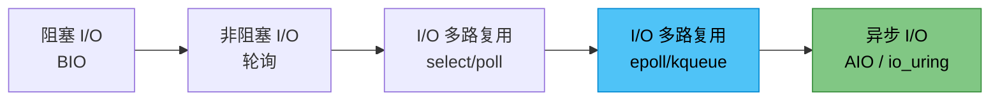

#### epoll 核心原理

```
epoll 三个关键函数：
1. epoll_create() — 创建 epoll 实例，内核创建 eventpoll 结构体 + 红黑树
2. epoll_ctl()   — 向红黑树添加/删除/修改 fd，同时注册回调到设备驱动
3. epoll_wait()  — 检查就绪链表，有数据直接返回；无数据则阻塞进程

数据结构：
┌───────────────┐     ┌──────────────────┐
│  eventpoll    │────→│  红黑树（所有 fd）   │
│               │     └──────────────────┘
│  rdllist ─────│──→ ┌──────────────────┐
│  (就绪链表)    │     │  就绪 fd 1        │
│               │     │  就绪 fd 2        │
│  wq (等待队列) │     │  ...              │
└───────────────┘     └──────────────────┘
```

| 对比维度 | select | poll | epoll |
|----------|--------|------|-------|
| fd 上限 | 1024（可重编译） | 无 | 无 |
| 数据结构 | 数组 | 链表 | 红黑树 + 就绪链表 |
| 遍历方式 | O(n) | O(n) | O(1) 仅活跃 fd |
| 触发模式 | 水平触发 | 水平触发 | 水平 + 边缘 |
| 内存拷贝 | 每次轮询需要 | 每次轮询需要 | 回调减少拷贝 |

**边缘触发(ET) vs 水平触发(LT)**：
- LT：只要 fd 就绪，每次 epoll_wait 都通知（默认，安全）
- ET：只在状态变化时通知一次，必须一次读完（高并发，需非阻塞）

### 3.3 零拷贝技术

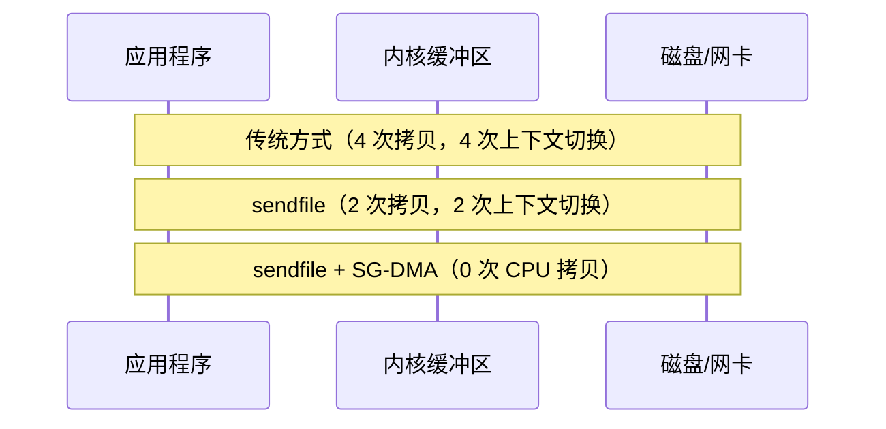

| 技术 | 场景 | 代表 |
|------|------|------|
| mmap | 小文件、随机读写 | RocketMQ 写 CommitLog |
| sendfile | 静态文件传输 | Nginx sendfile on; |
| SG-DMA | 网卡直读内核缓冲区 | Kafka 零拷贝 |
| splice | 管道间传输 | HAProxy |

### 3.4 CPU 缓存与伪共享

```
CPU 缓存层级：
L1 Cache（32KB，~1ns） → L2 Cache（256KB，~3ns） → L3 Cache（共享，~12ns） → 内存（~100ns）

伪共享（False Sharing）：
两个线程修改同一缓存行的不同变量，导致缓存行频繁失效。

解决：
- @Contended 注解（Java）
- 变量填充到缓存行大小（Go: 64 字节对齐）
```

### 3.5 Linux 性能工具链

| 工具 | 用途 |
|------|------|
| top / htop | 进程监控 |
| vmstat | 内存、I/O、CPU |
| iostat | 磁盘 I/O |
| netstat / ss | 网络连接 |
| tcpdump | 抓包 |
| strace | 追踪系统调用 |
| perf | CPU 采样、火焰图 |
| bcc / bpftrace | eBPF 动态追踪 |
| flamegraph | 火焰图可视化 |

---


---

## 第四章：数据结构与算法（后端专题）

### 4.1 数据库核心数据结构

#### B+ 树（MySQL InnoDB 索引）

```
        [30 | 60]                  ← 非叶子节点（只存 key）
       /    |     \
  [5|15]  [35|45]  [70|90]       ← 叶子节点（存 key + 数据/指针）
  /  |  \  /  |  \  /  |  \
[1][10][20][32][40][50][65][80][95] ← 叶子节点之间有双向链表

特点：
- 所有数据都在叶子节点
- 叶子节点形成有序双向链表（范围查询友好）
- 非叶子节点不存数据，可容纳更多 key，树更矮
- 磁盘预读友好（一次 I/O 加载一个节点/页，16KB）
```

#### LSM 树（LevelDB / RocksDB / HBase / Cassandra）

```
写入流程：
MemTable（内存） → Immutable MemTable → SSTable（磁盘 Level 0）
→ Compaction（Level 1 → Level 2 → ...）

写放大 vs 读放大：
- 写入只需写 WAL + MemTable，O(1)
- 读取需查 MemTable + 各层 SSTable（配合布隆过滤器加速）
- Compaction 合并各层文件，消除冗余数据
```

#### 跳表（Redis Sorted Set）

```
Level 3:  HEAD ────────────────────────→ 50 ──────→ NULL
Level 2:  HEAD ────────→ 20 ───────────→ 50 ──────→ NULL
Level 1:  HEAD → 5 → 10 → 20 → 30 → 40 → 50 ───────→ NULL
Level 0:  HEAD → 5 → 10 → 20 → 30 → 40 → 50 → 60 → NULL

查找复杂度 O(logn)，插入 O(logn)，实现比红黑树简单
Redis ZSet 结构：跳表（按分值排序）+ 哈希表（按成员查找）
```

#### 一致性哈希

```mermaid
graph TD
    subgraph 一致性哈希环 [0, 2^32)
        N0["Node 0"]
        N1["Node 1"]
        N2["Node 2"]
        K1["Key A"] --> N0
        K2["Key B"] --> N1
        K3["Key C"] --> N2
    end
```

| 特性 | 说明 |
|------|------|
| 节点变化 | 只影响相邻节点数据迁移，非全量 rehash |
| 虚拟节点 | 每个物理节点映射多个虚拟节点，分布更均匀 |
| 应用 | Redis Cluster、Dubbo 负载均衡、CDN |

### 4.2 概率数据结构

#### 布隆过滤器

```
原理：k 个哈希函数 + 长度为 m 的位数组
- 插入：对元素计算 k 个哈希值，将对应位置 1
- 查询：检查 k 个位是否全为 1，是则"可能存在"，否则"一定不存在"

参数计算（给定元素数 n 和误判率 p）：
m = -(n * ln(p)) / (ln(2)^2)
k = (m/n) * ln(2)

应用：
- 缓存穿透防护（判断 key 是否一定不存在）
- BigTable / HBase 判断某行是否存在于 SSTable
- 爬虫 URL 去重
- Chrome 恶意网站检测
```

#### HyperLogLog

```
原理：基于概率的基数估算，标准误差 0.81%
- 每个元素哈希后取前导零个数最大值
- 分桶取调和平均数提高精度

空间复杂度：12KB 即可统计 2^64 个不同元素
Redis 命令：PFADD / PFCOUNT / PFMERGE

应用：
- 网站 UV 统计
- 大数据的 distinct count
```

### 4.3 经典算法实现

| 算法 | 场景 | 要点 |
|------|------|------|
| LRU | 缓存淘汰 | 哈希表 + 双向链表，O(1) |
| LFU | 缓存淘汰（频率优先） | 哈希表 + 频次桶 |
| 令牌桶 | 限流 | 匀速生成令牌，突发允许 |
| 漏桶 | 限流（平滑） | 固定速率流出，溢出丢弃 |
| 雪花算法 | 分布式 ID | 时间戳 + 机器 ID + 序列号 |

```
雪花算法格式（64 bit）：
┌──────────────────┬─────────────┬──────────────┐
│ 41bit 时间戳(ms)  │ 10bit 机器ID │ 12bit 序列号  │
│  (69 年)          │ (1024 节点)  │ (4096/ms)     │
└──────────────────┴─────────────┴──────────────┘
```

---


---

## 第五章：数据库深度

### 5.1 MySQL 架构

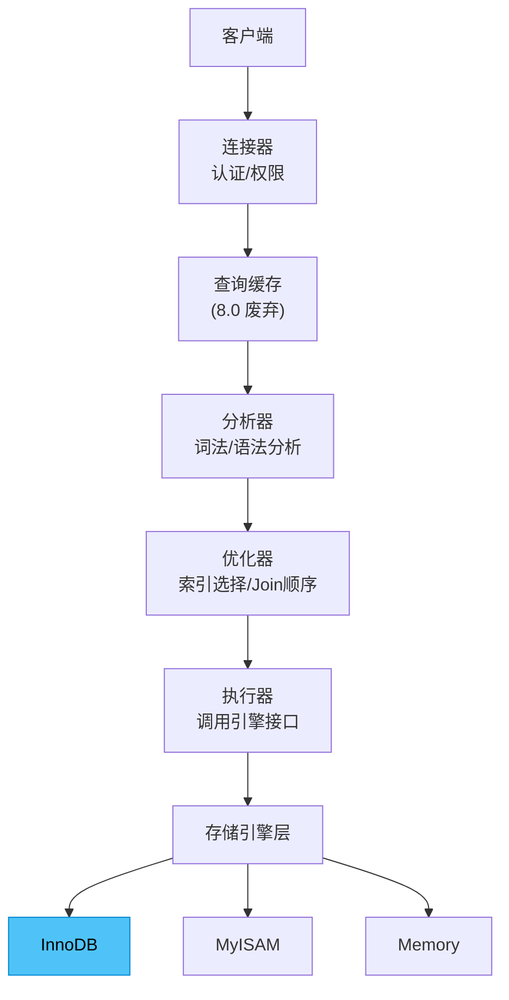

#### SQL 执行流程

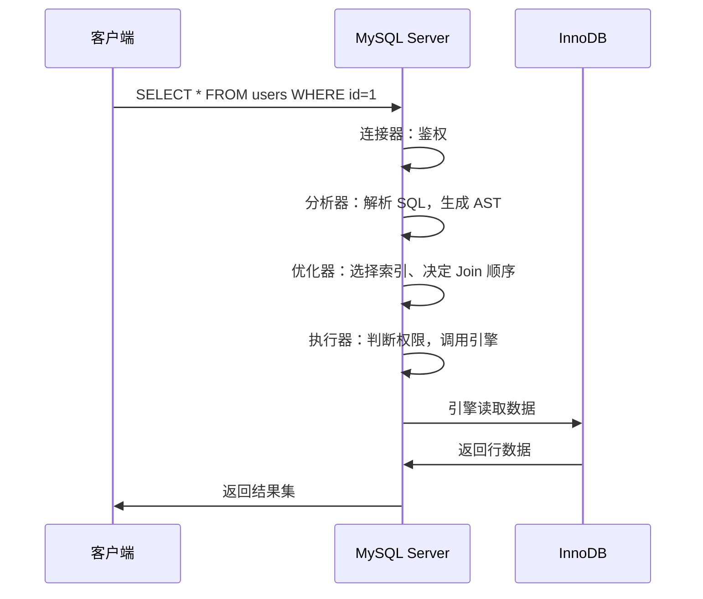

### 5.2 InnoDB 行格式

| 格式 | 特点 | 适用场景 |
|------|------|----------|
| Compact | 变长字段长度列表 + NULL 位图，BLOB 前缀 768 字节 | 默认格式（5.7） |
| Dynamic | BLOB 完全溢出，只存 20 字节指针 | 默认格式（8.0），大字段 |
| Compressed | 支持页级压缩 | 空间敏感场景 |
| Redundant | 旧格式 | 兼容 |

```
Compact 行格式结构：
┌──────────┬────────────┬──────────┬───────┬──────┬──────┐
│ 变长字段   │ NULL 位图   │ 记录头信息  │ 列1 值 │ 列2 值 │ ...  │
│ 长度列表   │            │  (5字节)   │       │       │      │
└──────────┴────────────┴──────────┴───────┴──────┴──────┘
```

**页结构（16KB）**：
```
┌──────────────────────┐
│ File Header (38B)     │
│ Page Header (56B)     │
│ Infimum + Supremum    │ ← 虚拟最小/最大记录
│ User Records          │ ← 实际数据行（通过单向链表组织）
│ Free Space            │
│ Page Directory (槽)   │ ← 每组 4-8 条记录一个槽，二分查找
│ File Trailer (8B)     │
└──────────────────────┘
```

### 5.3 索引原理深度

#### 聚簇索引 vs 二级索引

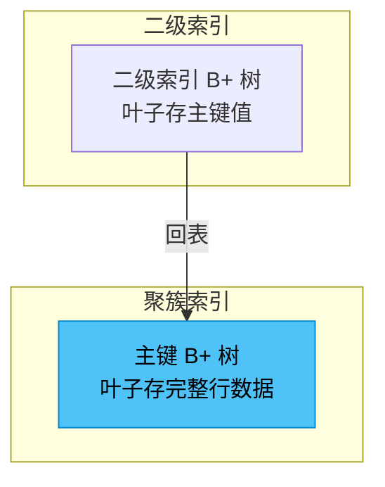

| 索引类型 | 说明 | 示例 |
|----------|------|------|
| 聚簇索引 | 叶子节点存完整行，一表只有一个 | `PRIMARY KEY(id)` |
| 二级索引 | 叶子存主键，需要回表 | `INDEX idx_name(name)` |
| 覆盖索引 | 查询列全在索引中，无需回表 | `SELECT id, name FROM t WHERE name='x'` + idx_name |
| 联合索引 | 多列组合，遵循最左前缀 | `INDEX(a,b,c)` 匹配 a, ab, abc |
| 前缀索引 | 只索引前 N 个字符 | `INDEX(title(10))` |
| 全文索引 | 文本搜索 | MyISAM 原生，InnoDB 5.6+ 支持 |

#### 索引优化口诀解读

```
全值匹配我最爱，最左前缀要遵守；
带头大哥不能死，中间兄弟不能断；
索引列上少计算，范围之后全失效；
LIKE 百分写最右，覆盖索引不写星；
不等空值还有 OR，索引失效要少用。
```

### 5.4 事务与 MVCC

#### 隔离级别与问题

| 隔离级别 | 脏读 | 不可重复读 | 幻读 | 实现方式 |
|----------|------|-----------|------|----------|
| READ UNCOMMITTED | ✅ | ✅ | ✅ | 不加锁 |
| READ COMMITTED | ❌ | ✅ | ✅ | 每次读生成 ReadView |
| REPEATABLE READ（默认） | ❌ | ❌ | ❌（部分） | 事务开始时生成 ReadView |
| SERIALIZABLE | ❌ | ❌ | ❌ | 读加共享锁，写加排他锁 |

#### MVCC 核心机制

```
ReadView 判断可见性：
- trx_id < min_trx_id：已提交，可见
- trx_id > max_trx_id：未开始，不可见
- min_trx_id <= trx_id <= max_trx_id：
  → 在活跃列表中：不可见（当前活跃）
  → 不在活跃列表中：可见（已提交）

Undo Log 版本链：
当前记录 → 回滚指针 → Undo Log v3 → Undo Log v2 → Undo Log v1
（通过 DB_ROLL_PTR 字段串联）
```

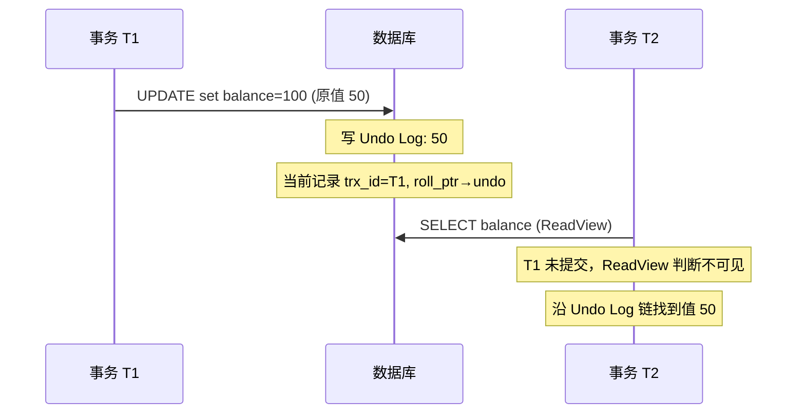

### 5.5 锁机制

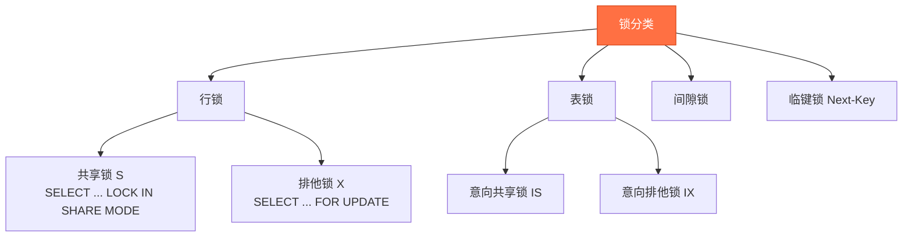

| 锁类型 | 说明 | 示例 |
|--------|------|------|
| 记录锁 | 锁定单行记录 | `id=1` 的行 |
| 间隙锁 | 锁定索引间隙，防插入 | `(3, 5)` 之间的间隙 |
| 临键锁 | 记录锁 + 间隙锁 | `(3, 5]` 左开右闭，RR 级别默认 |
| 插入意向锁 | 插入前相互通知，不互斥 | INSERT 等待时可并发 |

**死锁排查**：
```sql
SHOW ENGINE INNODB STATUS;  -- 查看最近死锁信息
SELECT * FROM information_schema.INNODB_TRX;    -- 当前事务
SELECT * FROM information_schema.INNODB_LOCKS;  -- 当前锁（8.0 后换 performance_schema）
```

### 5.6 MySQL 复制与高可用

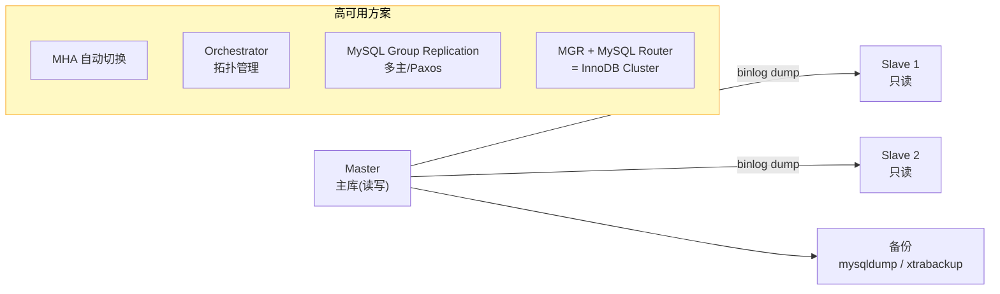

| 复制格式 | 特点 |
|----------|------|
| STATEMENT | 记录 SQL 语句（小、易主从不一致） |
| ROW（推荐） | 记录行变更（大、一致性高） |
| MIXED | 自动选择以上两种 |

#### 主从延迟处理

| 方案 | 说明 |
|------|------|
| 强制走主库 | 写完立刻读的业务（如订单详情） |
| 半同步复制 | 至少一个从库确认收到 binlog 才返回 |
| 并行复制 | 5.6 DATABASE 级 → 5.7 LOGICAL_CLOCK 级 → 8.0 WRITESET 级 |
| 缓存路由 | 写后 N 秒内读主库 |

---


### 5.7 PostgreSQL 核心特性

| 特性 | MySQL | PostgreSQL |
|------|-------|------------|
| MVCC | Undo Log 回滚段 | 多版本元组直接存在表空间 |
| 索引类型 | B+树、全文、空间 | B-Tree、Hash、GiST、GIN、SP-GiST、BRIN |
| JSON | JSON 类型（5.7+） | JSONB（二进制高效） |
| 扩展性 | 存储引擎可插拔 | 扩展丰富（PostGIS、TimescaleDB） |
| 窗口函数 | 8.0 支持 | 原生强大 |
| CTE | 8.0 支持 | 递归 CTE 强大 |
| 并行查询 | 8.0 有限 | 丰富并行 |
| 物理复制 | 主从 | 流复制 + 逻辑复制 |

---

## 第六章：Redis 深度

### 6.1 数据结构内部实现

| Redis 类型 | 底层实现 | 适用场景 |
|-----------|----------|----------|
| String | SDS（简单动态字符串） | 缓存、计数器、分布式锁 |
| List | QuickList（ziplist + linkedlist） | 消息队列、最新列表 |
| Hash | ziplist → hashtable（双实现） | 对象属性存储 |
| Set | intset → hashtable | 标签、去重、共同好友 |
| ZSet | ziplist → skiplist + dict | 排行榜、延迟队列 |
| Bitmap | String 的位操作 | 签到、在线状态 |
| HyperLogLog | 稀疏/密集结构 | UV 统计 |
| GEO | ZSet 包装 | 附近的人、LBS |
| Stream | Rax 树（基数树变种） | 持久化消息队列 |

#### Redis 对象结构

```
typedef struct redisObject {
    unsigned type:4;       // 类型（String/List...）
    unsigned encoding:4;   // 编码方式
    unsigned lru:24;       // LRU 时钟或 LFU 计数
    int refcount;          // 引用计数
    void *ptr;             // 指向底层数据结构
} robj;
```

### 6.2 缓存策略体系

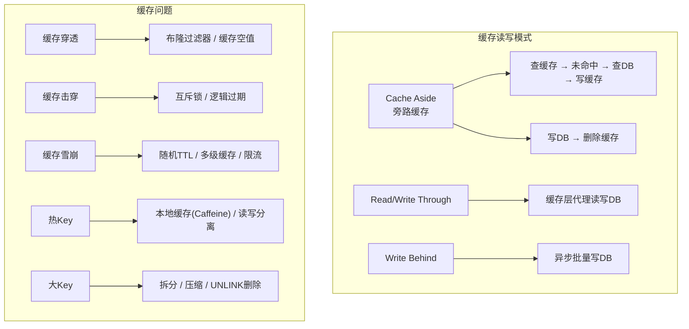

#### 缓存一致性方案

| 方案 | 描述 |
|------|------|
| 先删缓存再更新 DB | 并发读可能在删后读到旧数据写入缓存 |
| 先更新 DB 再删缓存（推荐） | 配合延迟双删或 MQ 重试 |
| 订阅 binlog 更新缓存 | Canal / DTS 监听 binlog 异步更新 |
| 设置较短过期时间 | 最终一致性，允许短暂不一致 |

### 6.3 持久化：RDB vs AOF

| 维度 | RDB | AOF |
|------|-----|-----|
| 原理 | 内存快照 | 记录写命令 |
| 文件大小 | 小（压缩二进制） | 大（文本命令） |
| 恢复速度 | 快 | 慢（重放命令） |
| 数据安全 | 间隔丢失（秒级） | 秒级/每条（fsync 策略） |
| 重写机制 | 无，需手动/定时 | 自动 AOF Rewrite 压缩 |

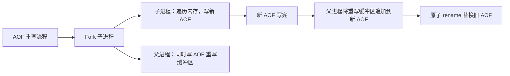

**混合持久化（Redis 4.0+）**：RDB 头部 + AOF 增量，兼具恢复速度和数据安全。

### 6.4 高可用架构

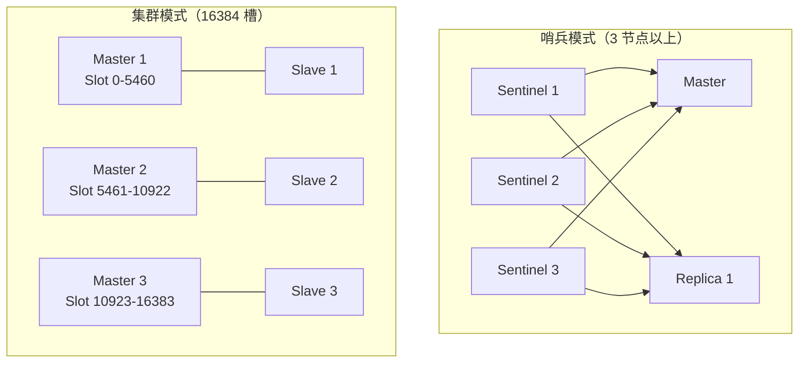

| 模式 | 特点 | 适用 |
|------|------|------|
| 主从 | 读写分离，手动切换 | 小型项目 |
| 哨兵 | 自动故障转移 + 通知 | 中型项目，需高可用 |
| 集群 | 自动分片 + 故障转移，CRC16 哈希槽 | 大型项目，数据量大 |

### 6.5 Redis 线程模型

```
Redis 6.0 前：单线程事件循环（网络 I/O + 命令处理）
Redis 6.0+：多线程网络 I/O（默认关闭），命令处理仍单线程

为什么单线程还这么快？
1. 纯内存操作
2. I/O 多路复用（epoll）
3. 单线程避免上下文切换和锁竞争
4. 高效数据结构设计

Redis 6.0 多线程 I/O 配置：
io-threads 4              # I/O 线程数
io-threads-do-reads yes   # 读也使用多线程
```

---


### 6.6 分布式锁实现

```lua
-- 加锁（SET NX PX 原子操作 + Lua 脚本保证解锁原子性）
-- 加锁
SET lock_key unique_value NX PX 30000

-- 解锁（Lua 脚本保证原子性，防止误删别人锁）
if redis.call("GET", KEYS[1]) == ARGV[1] then
    return redis.call("DEL", KEYS[1])
else
    return 0
end
```

| 方案 | 优点 | 缺点 |
|------|------|------|
| Redis SETNX | 简单高效 | 单点故障（需 RedLock 增强） |
| Redisson（RedLock） | 自动续期、可重入、公平锁 | 复杂度高 |
| Zookeeper 临时顺序节点 | 强一致、自动释放 | 性能不如 Redis |
| etcd | CP 强一致，Raft 保证 | 吞吐较低 |

---

## 第七章：MongoDB 详解

### 7.1 核心概念对照

| MySQL | MongoDB |
|-------|---------|
| Database | Database |
| Table | Collection |
| Row | Document |
| Column | Field |
| Index | Index |
| Join | $lookup / 内嵌文档 |
| Transaction | Multi-Document Transaction (4.0+) |

### 7.2 数据模型设计

```
一对多关系三种模式：
1. 内嵌：适合"包含"关系，数据一起访问
   { name: "张三", orders: [{...}] }
2. 引用：适合独立实体，避免数据膨胀
   { name: "张三", order_ids: [1,2,3] }
3. 子集模式：放置最常访问的部分子集
   { product: "...", recent_reviews: [{...}] }
```

### 7.3 复制集架构

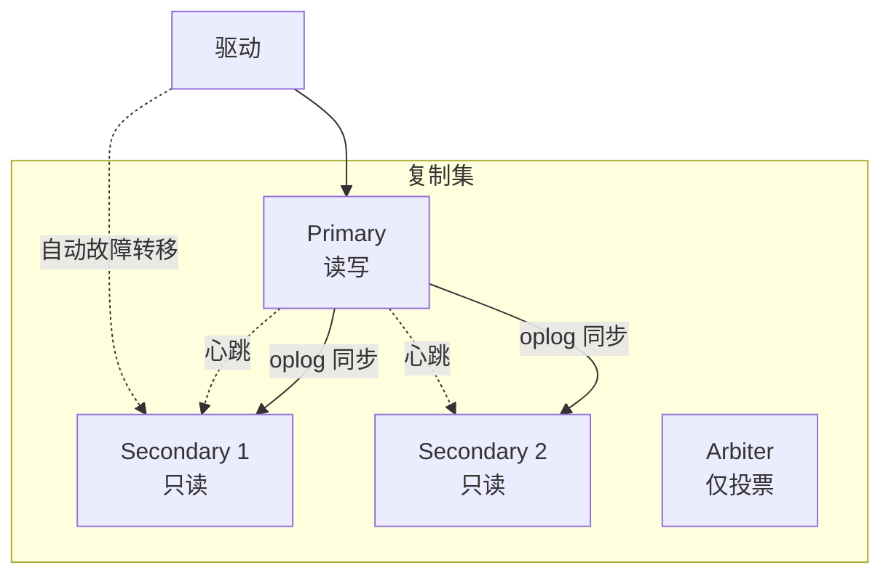

**选举机制（Raft 协议变体）**：优先级 + optime（最新 oplog）+ 心跳。

---

## 第八章：Elasticsearch 详解

### 8.1 倒排索引原理

```
正排索引（文档 → 词）：
Doc1: "今天天气真好"
Doc2: "明天天气可能不好"

倒排索引（词 → 文档）：
"今天" → [Doc1]
"明天" → [Doc2]
"天气" → [Doc1, Doc2]   ← Term Dictionary → Posting List
"真好" → [Doc1]
"可能" → [Doc2]
```

### 8.2 核心概念

| 概念 | 说明 |
|------|------|
| Index | 数据库（逻辑命名空间） |
| Shard | 分片（Lucene 实例），分片数创建后不可改 |
| Replica | 副本，提高可用性和查询吞吐 |
| Node | 物理节点，Master / Data / Coordinating / Ingest |
| Segment | Lucene 不可变最小存储单元 |
| Translog | WAL 预写日志，防止数据丢失 |

### 8.3 写入与查询流程

```mermaid
sequenceDiagram
    participant C as 客户端
    participant N1 as 协调节点
    participant N2 as 主分片 P0
    participant N3 as 副本分片 R0

    C->>N1: 写入请求
    N1->>N1: 路由到主分片（hash(_routing) % shards）
    N1->>N2: 写主分片
    N2->>N3: 同步副本分片
    N3->>N2: 确认
    N2->>N1: 确认
    N1->>C: 成功响应
```

**Refresh 与 Flush**：
- Refresh（1s 默认）：内存 Segment 可搜索，近实时
- Flush（30min 或 Translog 满）：Segment 持久化到磁盘

---


## 第九章：消息队列深度

### 9.1 消息队列全景对比

```mermaid
graph TB
    MQ["消息队列选型"] --> Kafka
    MQ --> RocketMQ
    MQ --> RabbitMQ
    MQ --> Pulsar
    MQ --> NSQ
    MQ --> RedisStream["Redis Stream"]

    Kafka -.->|"海量日志、流计算<br/>百万 TPS"| KafkaUse["大数据/实时计算"]
    RocketMQ -.->|"金融级可靠性<br/>事务消息"| RocketMQUse["电商/金融"]
    RabbitMQ -.->|"灵活路由<br/>低延迟"| RabbitMQUse["企业集成/微服务"]
    Pulsar -.->|"存算分离<br/>多租户"| PulsarUse["云原生消息"]
```

| 维度 | Kafka | RocketMQ | RabbitMQ | Pulsar |
|------|-------|----------|----------|--------|
| 吞吐量 | 极高（百万 TPS） | 高（十万 TPS） | 中等（万 TPS） | 高 |
| 延迟 | 毫秒级 | 毫秒级 | 微秒级 | 毫秒级 |
| 持久化 | 磁盘顺序写 | 磁盘顺序写 + 异步刷盘 | 内存/磁盘 | 分层存储 |
| 消息顺序 | 分区内有序 | 队列内有序 | 队列内有序 | 分区内有序 |
| 事务消息 | 支持（0.11+） | 原生支持 | 不支持 | 支持 |
| 延迟消息 | 不支持原生 | 18 个级别 | 死信+TTL / 插件 | 支持 |
| 协议 | 自定义 | 自定义（Remoting） | AMQP | 自定义 |
| 社区 | Apache 顶级 | Apache 顶级 | 广泛使用 | Apache 顶级 |

### 9.2 Kafka 核心架构

```mermaid
graph TB
    subgraph KafkaCluster["Kafka 集群"]
        B1["Broker 1<br/>TopicA-P0(Leader)<br/>TopicA-P1(Follower)"]
        B2["Broker 2<br/>TopicA-P1(Leader)<br/>TopicA-P0(Follower)"]
        B3["Broker 3<br/>TopicA-P2(Leader)"]
        ZK["ZooKeeper<br/>(Kraft 模式逐渐替代)"]
    end

    P1["Producer"] --> B1
    P1 --> B2
    C1["Consumer Group G1"] --> B1
    C1 --> B2
    C2["Consumer Group G2"] --> B3

    style ZK fill:#ffcc80,stroke:#f57c00,color:#000
```

#### 分区机制

```
Topic: order-topic
├── Partition 0: [msg1, msg2, msg3, ...]  ← 顺序写，每个消息有 offset
├── Partition 1: [msg1, msg2, ...]
└── Partition 2: [msg1, ...]

分区分配策略：
- RangeAssignor：按 topic 范围分配
- RoundRobinAssignor：轮询分配
- StickyAssignor：粘性分配（重平衡尽量不动）
- CooperativeStickyAssignor（2.4+）：渐进式重平衡
```

#### ISR 与高水位

```mermaid
graph LR
    subgraph ISR["ISR: In-Sync Replicas"]
        Leader["Leader<br/>HW=5, LEO=7"]
        F1["Follower 1<br/>HW=5, LEO=7"]
        F2["Follower 2<br/>HW=5, LEO=6"]
    end

    F3["Follower 3<br/>HW=3, LEO=4<br/>（不在 ISR 中，落后太多）"]

    Note["HW(High Watermark)：消费者可见的最高 offset<br/>LEO(Log End Offset)：写入的最新 offset"]
```

**acks 参数**：
| 值 | 说明 | 可靠性 | 性能 |
|----|------|--------|------|
| 0 | 不等待确认 | 最低 | 最高 |
| 1 | Leader 确认即返回 | 中 | 中 |
| -1 (all) | 所有 ISR 确认才返回 | 最高 | 低 |

#### Kafka 幂等与事务

```
幂等（enable.idempotence=true）：
Producer 分配 PID + 消息序号，Broker 按 (PID, Partition, Seq) 去重

事务：
beginTransaction → send → sendOffsets → commitTransaction
实现 Exactly-Once 语义（消费-处理-生产原子化）
```

#### Kafka vs RocketMQ 存储对比

| 维度 | Kafka | RocketMQ |
|------|-------|----------|
| 存储单位 | Partition（目录+分段文件） | CommitLog（全局顺序写）+ ConsumeQueue |
| 分区模型 | 一个 Partition 对应一个目录 | 一个 Topic 多个 ConsumeQueue |
| 写入 | 分区顺序写 | 全局顺序写（CommitLog） |
| 消费 | 同一 Group 内一一分配分区 | 广播 / 集群模式，支持 Tag 过滤 |

### 9.3 RocketMQ 架构

```mermaid
graph TB
    Producer["Producer"] --> NS["NameServer<br/>无状态路由中心"]
    Consumer["Consumer"] --> NS

    NS --> B1["Broker Master"]
    NS --> B2["Broker Slave"]

    Producer --> B1
    Consumer --> B1

    B1 --> B2
```

| 组件 | 说明 |
|------|------|
| NameServer | 无状态路由，Broker 注册，Topic 路由查询 |
| Broker | 消息存储，分为 Master/Slave |
| Producer | 生产者，负载均衡投递到 Broker |
| Consumer | 消费者，Pull 长轮询 |

**延迟消息**：18 个级别（1s 5s 10s 30s 1m 2m 3m 4m 5m 6m 7m 8m 9m 10m 20m 30m 1h 2h）

**事务消息**：
```mermaid
sequenceDiagram
    participant P as Producer
    participant B as Broker
    participant L as Local Transaction

    P->>B: 发送半消息（Half Message）
    B->>P: 确认
    P->>L: 执行本地事务
    L->>P: 返回结果
    P->>B: Commit / Rollback
    Note over B: 未收到结果则回查
    B->>P: 事务回查
    P->>B: 返回最终状态
```

### 9.4 RabbitMQ 核心

```mermaid
graph LR
    P["Producer"] --> Exchange["Exchange<br/>交换机"]
    Exchange -->|"Routing Key"| Q1["Queue 1"]
    Exchange -->|"Routing Key"| Q2["Queue 2"]
    Q1 --> C1["Consumer 1"]
    Q2 --> C2["Consumer 2"]
    Q2 --> C3["Consumer 3"]
```

| 交换机类型 | 路由方式 |
|-----------|----------|
| Direct | Routing Key 完全匹配 |
| Topic | Routing Key 模糊匹配（`*` 匹配一个词，`#` 匹配多词） |
| Fanout | 广播到所有绑定队列 |
| Headers | 基于 Header 匹配（性能较差，不常用） |

**死信队列 (DLX)**：消息被拒绝/过期/队列满时，转入死信交换机处理（如记录异常）。

**延迟队列**：安装 `rabbitmq_delayed_message_exchange` 插件，或借助 TTL + DLX 曲线实现。

---


---

## 第十章：中间件全景体系

### 10.1 注册中心对比

```mermaid
graph TB
    subgraph CP["CP（一致性优先）"]
        ZK["ZooKeeper<br/>ZAB 协议"]
        ETCD["etcd<br/>Raft 协议"]
        Consul["Consul<br/>Raft + Gossip"]
    end

    subgraph AP["AP（可用性优先）"]
        Eureka["Eureka<br/>自我保护机制"]
        NacosAP["Nacos AP<br/>Distro 协议"]
    end

    subgraph 全能["CAP 可切换"]
        Nacos["Nacos<br/>AP + CP 可切换"]
    end

    style Nacos fill:#4fc3f7,stroke:#0288d1,color:#000
```

| 注册中心 | CAP | 一致性协议 | 健康检查 | 特点 |
|----------|-----|-----------|----------|------|
| **Nacos** | AP/CP 切换 | Distro / Raft | TCP + HTTP + MySQL | 阿里，兼配置中心 |
| **Consul** | CP | Raft + Gossip | Agent 本地检查 | 多数据中心、服务网格 |
| **Eureka** | AP | 无（Peer to Peer 复制） | 心跳续约 | Spring Cloud 原生 |
| **ZooKeeper** | CP | ZAB | 临时节点 + Session | 经典，但维护成本高 |
| **etcd** | CP | Raft | Lease 租约 | Kubernetes 基础 |

#### Nacos CP vs AP

```
CP 模式：注册中心集群半数以上存活才能提供注册服务（Raft）
AP 模式：任一节点存活即可注册（Distro 协议，最终一致）

切换：修改 nacos/core/mode 集群元数据
```

### 10.2 网关全面对比

```mermaid
graph TB
    Client["客户端"] --> GW["网关层"]

    GW --> Nginx["Nginx<br/>高性能反向代理"]
    GW --> Kong["Kong<br/>Lua/Go 插件生态"]
    GW --> APISIX["Apache APISIX<br/>云原生高性能"]
    GW --> Envoy["Envoy<br/>Service Mesh 数据面"]
    GW --> Zuul["Zuul / Spring Cloud Gateway"]

    style APISIX fill:#4fc3f7,stroke:#0288d1,color:#000
```

| 网关 | 语言 | 特点 | 适用 |
|------|------|------|------|
| Nginx / OpenResty | C + Lua | 极高性能，配置灵活 | 通用反向代理 |
| Kong | Lua (3.x 用 Go) | 丰富插件生态，API 管理 | API 网关 |
| APISIX | Lua | 云原生、热配置、高性能 | 微服务网关 |
| Envoy | C++ | xDS 动态配置，Service Mesh | 服务网格数据面 |
| Spring Cloud Gateway | Java | WebFlux 异步非阻塞 | Spring 生态 |
| Traefik | Go | 自动服务发现，K8s 原生 | 容器平台 |

#### 网关核心功能

```
✅ 路由转发（Path/Host/Header 匹配）
✅ 负载均衡（轮询、加权、一致性哈希）
✅ 限流（令牌桶、漏桶）
✅ 熔断降级
✅ 认证鉴权（JWT + OAuth2）
✅ 灰度发布（金丝雀发布按权重/Header 分流）
✅ 协议转换（HTTP → gRPC / Dubbo）
✅ 日志/监控/Prometheus 指标
```

### 10.3 配置中心

```mermaid
sequenceDiagram
    participant App as 应用
    participant Config as 配置中心
    participant DB as 配置数据库

    App->>Config: 启动时拉取配置
    Config->>DB: 查询配置
    DB->>Config: 返回
    Config->>App: 返回配置

    loop 长轮询/长连接
        Config->>DB: 检查配置变化
        DB->>Config: 有变化
        Config->>App: 推送变更通知
        App->>Config: 重新拉取
    end
```

| 配置中心 | 存储 | 推送方式 | 特点 |
|----------|------|----------|------|
| Nacos | MySQL（内嵌 Derby） | 长轮询 | 与注册中心一体 |
| Apollo | MySQL | 长轮询 | 携程开源，界面友好，灰度发布 |
| Spring Cloud Config | Git / SVN / 本地 | Bus 总线通知 | Spring 生态 |
| Consul KV | 内置 KV | 长轮询 | 轻量，一致性保证 |

### 10.4 RPC 框架对比

| 框架 | 语言 | 序列化 | 注册中心 | 特点 |
|------|------|--------|----------|------|
| Dubbo | Java | Hessian2 / Protobuf | ZooKeeper / Nacos | 阿里出品，Java 微服务首选 |
| gRPC | 多语言 | Protobuf | 自定义 | Google 出品，HTTP/2，流式 |
| Thrift | 多语言 | TBinary / TCompact | 无内置 | Facebook 出品 |
| Spring Cloud Feign | Java | JSON | Eureka / Nacos | 声明式 HTTP 调用 |

### 10.5 分布式事务

```mermaid
graph TB
    DT["分布式事务方案"] --> Seata["Seata"]
    DT --> MQTX["MQ 事务消息"]
    DT --> LMT["本地消息表"]
    DT --> TCC["TCC 手写"]

    Seata --> AT["AT 模式<br/>自动回滚，有全局锁"]
    Seata --> TCC_Seata["TCC 模式<br/>Try-Confirm-Cancel"]
    Seata --> Saga["Saga 模式<br/>长事务/正向补偿"]

    MQTX --> Rocket["RocketMQ<br/>半消息 + 回查"]
    LMT --> Local["本地消息表<br/>+ 定时任务轮询"]
```

#### Seata AT 模式原理

```mermaid
sequenceDiagram
    participant TM as TM 事务管理器
    participant RM1 as RM1 服务 A
    participant RM2 as RM2 服务 B
    participant TC as TC 事务协调者

    TM->>TC: 开启全局事务 XID
    TM->>RM1: 执行业务（绑定 XID）
    RM1->>TC: 注册分支事务 + 提交
    TM->>RM2: 执行业务（绑定 XID）
    RM2->>TC: 注册分支事务 + 提交
    TM->>TC: 提交全局事务
    TC->>RM1: 异步删除 UndoLog
    TC->>RM2: 异步删除 UndoLog
```

**AT 模式核心**：自动生成反向 SQL（如 INSERT→DELETE，UPDATE→回滚 UPDATE），存入 UndoLog 表。

### 10.6 分布式任务调度

| 框架 | 架构 | 特点 |
|------|------|------|
| XXL-JOB | 中心化调度 | 简单易用，Web 控制台，GLUE 动态脚本 |
| Elastic-Job | 去中心化 | 基于 ZooKeeper 分片，弹性扩容 |
| DolphinScheduler | DAG 可视化 | 工作流编排，Apache 顶级 |
| PowerJob | 无锁化设计 | MapReduce / 工作流，性能优于 XXL-JOB |
| SchedulerX | 阿里云商业 | 高可用，百万级任务 |

---


## 第十一章：分布式理论深度

### 11.1 Raft 共识算法

```mermaid
stateDiagram-v2
    [*] --> Follower
    Follower --> Candidate: 选举超时
    Candidate --> Leader: 获得多数票
    Candidate --> Follower: 发现已有 Leader / 超时
    Leader --> Follower: 发现更高 Term

    state Leader {
        [*] --> LogReplicate
        LogReplicate --> Commit
    }
```

| 角色 | 职责 |
|------|------|
| Leader | 处理所有客户端请求，日志复制 |
| Follower | 被动接收，不发起请求 |
| Candidate | 选举时的临时角色 |

**选举过程**：Term 递增 → 给自己投票 → 请求其他节点投票 → 多数同意则成为 Leader。

```
日志复制流程：
1. Client 发送命令到 Leader
2. Leader 追加到本地日志
3. Leader 发送 AppendEntries RPC 给 Follower
4. 多数 Follower 确认后，Leader 提交
5. Leader 响应 Client，通知 Follower 提交
```

**Raft vs Paxos**：Raft 将问题分解为 Leader 选举 + 日志复制 + 安全性，新手友好。

### 11.2 Gossip 协议

```
工作方式：
1. 每个节点周期性地随机选择其他节点
2. 交换自身状态信息
3. 经过 O(logN) 轮，信息传播到整个集群

应用：
- Consul：成员管理
- Redis Cluster：节点发现
- Cassandra：集群状态同步
- Bitcoin：区块广播
```

### 11.3 分布式 ID 生成

| 方案 | 说明 | 优点 | 缺点 |
|------|------|------|------|
| UUID | 随机生成 | 本地生成、无依赖 | 无序（B+ 树插入性能差）、字符串长 |
| 雪花算法 | 时间戳+机器ID+序列号 | 有序递增、高性能 | 依赖机器时钟 |
| 号段模式 | 从 DB 批量获取 ID 段 | 性能好、可控制 | 需 DB 保证一致性 |
| Leaf（美团） | Segment（号段）+ Snowflake | 生产级 | 复杂 |
| Redis INCR | 原子自增 | 简单 | Redis 宕机可能丢失 |

---

## 第十二章：高并发与高可用

### 12.1 限流算法全家桶

```mermaid
graph LR
    RL["限流算法"] --> Counter["固定窗口计数器<br/>临界问题"]
    RL --> Sliding["滑动窗口<br/>精确但耗内存"]
    RL --> Token["令牌桶<br/>允许突发流量"]
    RL --> Leaky["漏桶<br/>恒定速率平滑"]
    RL --> SlideLog["滑动日志<br/>精确但成本高"]

    style Token fill:#4fc3f7,stroke:#0288d1,color:#000
```

| 算法 | 原理 | 突发 | 实现 |
|------|------|------|------|
| 固定窗口 | 周期内计数 | 临界问题 | 简单 |
| 滑动窗口 | 滚动时间窗口计数 | 部分 | Redis ZSet / 循环数组 |
| 令牌桶 | 匀速生产令牌，请求消费令牌 | ✅ 允许 | RateLimiter (Guava) |
| 漏桶 | 请求入桶，匀速流出 | ❌ 平滑 | 队列实现 |
| 滑动日志 | 记录每次请求时间戳 | 精确 | Redis Sorted Set |

**生产级限流**：Sentinel（阿里）支持 QPS / 线程数 / 关联 / 链路 / 热点 / 系统自适应限流。

### 12.2 熔断降级

```mermaid
stateDiagram-v2
    [*] --> CLOSED: 初始
    CLOSED --> OPEN: 失败率达到阈值
    OPEN --> HALF_OPEN: 超时后试探
    HALF_OPEN --> CLOSED: 试探成功
    HALF_OPEN --> OPEN: 试探失败
```

| 框架 | 特点 |
|------|------|
| Sentinel | 熔断 + 限流 + 降级一体，阿里开源 |
| Hystrix | Netflix 开源，已停维护 |
| Resilience4j | Hystrix 替代，轻量、函数式 |
| Polly | .NET 生态，策略组合 |

### 12.3 多级缓存架构

```mermaid
graph TB
    Request["用户请求"] --> Nginx["Nginx 本地缓存<br/>proxy_cache / lua-resty-lrucache"]
    Nginx --> App["应用层"]
    App --> LocalCache["本地缓存<br/>Caffeine / Guava Cache"]
    LocalCache --> Redis["Redis 集群<br/>分布式缓存"]
    Redis --> DB["数据库<br/>MySQL"]
    DB --> Cold["冷数据 / 归档"]

    style LocalCache fill:#a5d6a7,stroke:#43a047,color:#000
    style Redis fill:#64b5f6,stroke:#1565c0,color:#000
```

### 12.4 分库分表

```mermaid
graph TB
    App["应用"] --> Sharding["Sharding 中间件<br/>ShardingSphere / MyCat"]

    Sharding --> DS1["数据源 1<br/>db_0"]
    Sharding --> DS2["数据源 2<br/>db_1"]

    DS1 --> T0["user_0"]
    DS1 --> T1["user_1"]
    DS2 --> T2["user_2"]
    DS2 --> T3["user_3"]
```

| 策略 | 说明 | 示例 |
|------|------|------|
| 垂直分库 | 按业务拆分数据库 | 用户库、订单库、商品库 |
| 水平分表 | 按规则拆分同表数据 | `user_id % 4` |
| Range | 按范围分片 | 时间范围、地区 |
| Hash | 哈希取模 | `hash(user_id) % 16` |
| 复合 | 多维度组合 | 先按时间 Range，再按 user Hash |

**常见问题**：
- 跨库 Join（应用层聚合或用异构数据）
- 分布式事务（Seata）
- ID 全局唯一（雪花算法、Leaf）
- 扩容数据迁移（一致性哈希、双写过渡）

### 12.5 幂等设计

| 方案 | 场景 | 实现 |
|------|------|------|
| 唯一索引 | 数据库层 | `UNIQUE KEY (order_no)` |
| Token 机制 | 表单重复提交 | 提交前获取 Token，提交时校验并删除 |
| 状态机 | 状态流转 | `UPDATE order SET status='paid' WHERE id=1 AND status='unpaid'` |
| 乐观锁 | 并发更新 | `UPDATE t SET v=v+1, version=version+1 WHERE id=1 AND version=5` |
| 分布式锁 | 资源竞争 | Redis SETNX / ZK 临时节点 |

---


## 第十三章：容器化与 Kubernetes

### 13.1 Docker 镜像分层

```mermaid
graph TB
    subgraph 镜像分层
        L0["Base Image<br/>alpine:3.18"]
        L1["Layer 1<br/>RUN apt install xxx"]
        L2["Layer 2<br/>COPY app.jar"]
        L3["Layer 3<br/>CMD java -jar"]
    end

    L0 --> L1 --> L2 --> L3

    subgraph 容器
        RWL["可读写层<br/>Container Layer"]
    end

    L3 --> RWL
```

**Dockerfile 最佳实践**：
- 多阶段构建：编译阶段 + 运行阶段分离
- 层排序：不常变的层靠前（利用缓存加速构建）
- 镜像精简：使用 `alpine` / `distroless` 基础镜像
- 不装无关工具：减少攻击面
- 精准 COPY：只复制必要文件

```dockerfile
# 多阶段构建示例
# 阶段一：编译
FROM golang:1.21-alpine AS builder
WORKDIR /app
COPY go.mod go.sum ./
RUN go mod download
COPY . .
RUN CGO_ENABLED=0 go build -o server .

# 阶段二：运行（极简镜像）
FROM alpine:3.18
RUN apk --no-cache add ca-certificates
COPY --from=builder /app/server /server
EXPOSE 8080
CMD ["/server"]
```

### 13.2 Kubernetes 核心对象

```mermaid
graph TB
    subgraph 控制面["Control Plane"]
        API["kube-apiserver"]
        Sched["kube-scheduler"]
        CM["kube-controller-manager"]
        Etcd["etcd"]
    end

    subgraph 工作节点["Worker Node"]
        Kubelet["kubelet"]
        Proxy["kube-proxy"]
        Pod1["Pod A"]
        Pod2["Pod B"]
    end

    API --- Etcd
    Sched --- API
    CM --- API

    Kubelet --- API
    Proxy --- API
    Kubelet --- Pod1
    Kubelet --- Pod2
```

| 对象 | 说明 |
|------|------|
| **Pod** | K8s 最小调度单元，共享网络和存储 |
| **Deployment** | 声明式 Pod 管理，滚动更新、回滚 |
| **StatefulSet** | 有状态应用（有序部署、稳定网络标识、持久存储） |
| **DaemonSet** | 每个节点运行一个 Pod（日志采集、监控 agent） |
| **Service** | 稳定的网络入口，负载均衡 |
| **Ingress** | L7 路由，外部访问入口 |
| **ConfigMap / Secret** | 配置管理 |
| **PVC / PV** | 持久化存储 |
| **HPA** | 水平自动伸缩（CPU/Memory/自定义指标） |
| **NetworkPolicy** | 网络隔离策略 |
| **ServiceAccount + RBAC** | 权限控制 |

#### Pod 生命周期

```mermaid
stateDiagram-v2
    [*] --> Pending: 调度中
    Pending --> Running: 容器启动成功
    Pending --> Failed: 启动失败
    Running --> Succeeded: 正常退出
    Running --> Failed: 异常退出
    Running --> Unknown: 节点失联
    Succeeded --> [*]
    Failed --> [*]
    Unknown --> [*]
```

### 13.3 Service 与网络

| Service 类型 | 说明 |
|-------------|------|
| ClusterIP | 集群内部访问（默认） |
| NodePort | 每个 Node 开放端口 |
| LoadBalancer | 云厂商 LB |
| ExternalName | DNS 别名 |
| Headless | 无 ClusterIP，直连 Pod（StatefulSet 用） |

```
kube-proxy 模式：
iptables：规则链匹配，规则增多时性能下降
IPVS：内核负载均衡，性能更好，支持多种调度算法
eBPF (Cilium)：新一代，性能最优
```

### 13.4 Helm 模板化部署

```
项目结构：
mychart/
├── Chart.yaml          # 版本、依赖
├── values.yaml         # 默认配置（可被覆盖）
├── templates/
│   ├── deployment.yaml
│   ├── service.yaml
│   ├── configmap.yaml
│   └── _helpers.tpl    # 模板辅助函数
└── charts/             # 子 chart
```

### 13.5 Service Mesh (Istio)

```mermaid
graph TB
    subgraph Pod["Pod"]
        App["App Container"]
        Sidecar["Envoy Sidecar<br/>(istio-proxy)"]
    end

    App --> Sidecar

    Sidecar --- Control["istiod<br/>(Pilot + Citadel + Galley)"]

    subgraph 数据面
        Sidecar
    end

    subgraph 控制面
        Control
    end
```

**Service Mesh 能力**：流量管理、灰度发布、故障注入、mTLS、可观测性、安全策略。

---


---

## 第十四章：CI/CD 持续交付

### 14.1 流水线全景

```mermaid
graph LR
    Git["代码提交<br/>Git Push"] --> Lint["代码检查<br/>SonarQube/ESLint"]
    Lint --> UT["单元测试<br/>JUnit/pytest"]
    UT --> Build["构建镜像<br/>Docker Build"]
    Build --> Scan["镜像扫描<br/>Trivy/Clair"]
    Scan --> DeployDev["部署开发环境"]
    DeployDev --> IT["集成测试"]
    IT --> DeployStaging["部署预发环境"]
    DeployStaging --> Gate["人工审批"]
    Gate --> DeployProd["部署生产<br/>金丝雀/蓝绿"]
    DeployProd --> Monitor["监控告警"]
```

### 14.2 工具矩阵

| 阶段 | 工具 |
|------|------|
| 代码托管 | GitLab / GitHub / Gitee |
| CI 引擎 | Jenkins / GitHub Actions / GitLab CI / 云效 |
| 代码质量 | SonarQube / ESLint / Checkstyle |
| 镜像构建 | Docker / Kaniko（无需特权模式） |
| 镜像扫描 | Trivy / Clair / Snyk |
| 镜像仓库 | Harbor / Docker Hub / ECR / ACR |
| CD 引擎 | ArgoCD（GitOps）/ FluxCD / Spinnaker |
| 云原生 CI | Tekton（K8s 原生） |
| 部署策略 | 滚动更新 / 蓝绿 / 金丝雀 / A/B 测试 |

#### ArgoCD GitOps 模式

```mermaid
graph LR
    Dev["开发者"] --> Git["Git Repo<br/>应用配置"]
    ArgoCD["ArgoCD<br/>持续监控"] --> Git
    Git --> ArgoCD
    ArgoCD --> K8s["Kubernetes<br/>实际状态"]
    ArgoCD -->|"同步/回滚"| K8s
```

---

## 第十五章：可观测性

### 15.1 三大支柱

```mermaid
graph TB
    subgraph Metrics["Metrics 指标"]
        Prome["Prometheus<br/>时序数据库"] --> Grafana["Grafana<br/>可视化面板"]
        Prome --> AlertManager["AlertManager<br/>告警路由"]
    end

    subgraph Logging["Logging 日志"]
        AppLog["应用日志"] --> Filebeat["Filebeat<br/>采集"]
        Filebeat --> KafkaLog["Kafka<br/>缓冲"]
        KafkaLog --> Logstash["Logstash<br/>清洗"]
        Logstash --> ES["Elasticsearch<br/>存储"]
        ES --> Kibana["Kibana<br/>查询"]
    end

    subgraph Tracing["Tracing 追踪"]
        AppTrace["应用埋点"] --> AgentTrace["Agent<br/>SkyWalking/Jaeger"]
        AgentTrace --> OAP["OAP/Collector"]
        OAP --> TraceDB["ES/H2"]
        OAP --> SkyUI["SkyWalking UI"]
    end

    style Metrics fill:#81c784,stroke:#388e3c,color:#000
    style Logging fill:#64b5f6,stroke:#1565c0,color:#000
    style Tracing fill:#ffcc80,stroke:#f57c00,color:#000
```

### 15.2 Prometheus 核心

| 概念 | 说明 |
|------|------|
| Metric | 指标（Counter / Gauge / Histogram / Summary） |
| TSDB | 自定义时序数据库，每 2 小时压缩合并 |
| PromQL | 查询语言，支持聚合和函数 |
| Service Discovery | 自动发现监控目标 |
| Pull 模型 | Server 主动拉取 Exporter 数据 |
| Recording Rules | 预计算常用查询加速 |
| Alerting Rules | 定义告警条件 |

#### 四种指标类型

| 类型 | 说明 | 示例 |
|------|------|------|
| Counter | 只增不减 | HTTP 请求总数 |
| Gauge | 可增可减 | 内存使用率、CPU 温度 |
| Histogram | 分桶统计 + 总和 | 请求延迟分布 (P50/P90/P99) |
| Summary | 客户端分位数 | 与 Histogram 类似，但不能聚合 |

#### RED 方法论（服务监控）

- **R**ate：每秒请求数
- **E**rrors：错误率
- **D**uration：延迟分布

#### USE 方法论（资源监控）

- **U**tilization：使用率
- **S**aturation：饱和度
- **E**rrors：错误数

### 15.3 日志系统架构

```
轻量方案：App → Loki ← Grafana（无 ES 部署）
重量方案：App → Filebeat → Kafka → Logstash → Elasticsearch ← Kibana
云原生方案：App → Fluentd/Fluent Bit → ClickHouse/Loki
```

### 15.4 链路追踪

| 框架 | 语言 | 架构 | 特点 |
|------|------|------|------|
| SkyWalking | Java Agent 为主 | OAP 后处理 | 非侵入、性能好 |
| Jaeger | Go | Collector + DB | CNCF 项目 |
| Zipkin | Java | Server + DB | 最早的开源追踪 |
| Pinpoint | Java Agent | HBase 存储 | 超详细调用链 |

```
一条 Trace 结构：
Trace (一次完整请求)
├── Span A (服务 A 处理)
│   ├── Span A.1 (调用数据库)
│   └── Span A.2 (调用 Redis)
├── Span B (服务 B 处理)
│   └── Span B.1 (调用消息队列)
└── Span C (服务 C 处理)
```

**采样策略**：
- 固定采样：N 条中取 1 条
- 自适应采样：根据流量动态调整采样率
- 错误采样：强制采样错误/慢请求

---


---

## 第十六章：安全体系

### 16.1 OAuth2.0 授权码模式

```mermaid
sequenceDiagram
    participant User as 用户
    participant Client as 客户端 App
    participant Auth as 授权服务器
    participant Resource as 资源服务器

    User->>Client: 点击登录
    Client->>Auth: 重定向到授权页 + client_id + redirect_uri
    Auth->>User: 展示授权页面
    User->>Auth: 同意授权
    Auth->>Client: 重定向 + Authorization Code
    Client->>Auth: 用 Code 换取 Access Token
    Auth->>Client: Access Token + Refresh Token
    Client->>Resource: 请求资源 + Access Token
    Resource->>Client: 返回资源
```

### 16.2 JWT 结构

```
Header.Payload.Signature

Header:  {"alg": "RS256", "typ": "JWT"}
Payload: {"sub": "123", "name": "张三", "exp": 1700000000}
Signature: HMACSHA256(base64UrlEncode(header) + "." + base64UrlEncode(payload), secret)
```

| 使用要点 | 说明 |
|----------|------|
| 不在 JWT 存敏感信息 | Payload 只 base64 编码，可解码 |
| 设置较短过期时间 | Access Token 15min，Refresh Token 7d |
| 使用非对称加密 | RS256 > HS256（服务端公钥验签更安全） |
| 无状态 vs 有状态 | JWT 天然无状态，吊销需额外处理 |

### 16.3 安全清单详解

| 安全项 | 方案 |
|--------|------|
| SQL 注入 | 参数化查询、ORM 框架 |
| XSS | 输出 HTML 编码、CSP 策略 |
| CSRF | CSRF Token、SameSite Cookie、Referer 校验 |
| 密码存储 | bcrypt / argon2 / scrypt（加盐哈希） |
| 敏感数据 | 传输加密 TLS、存储加密 AES、脱敏日志 |
| 接口安全 | API 限流、参数验签、时间戳防重放 |
| mTLS | 服务间双向 TLS 认证 |
| 密钥管理 | HashiCorp Vault / K8s Secrets + 加密 |
| 依赖安全 | Snyk / Trivy / Dependabot 扫描 |
| 容器安全 | 非 root 运行、只读文件系统、seccomp |

---

## 第十七章：项目架构模式

### 17.1 分层架构（推荐）

```
┌─────────────────────────────────────┐
│   Handler / Controller 层           │  ← 接口适配（参数校验、响应格式化）
├─────────────────────────────────────┤
│   Service / UseCase 层              │  ← 业务逻辑（事务边界、领域规则）
├─────────────────────────────────────┤
│   Repository / DAO 层               │  ← 数据访问（CRUD、缓存）
├─────────────────────────────────────┤
│   Domain / Entity 层                │  ← 领域模型（贫血/充血模型）
└─────────────────────────────────────┘

依赖方向：上层 → 下层，通过接口依赖倒置解耦
```

### 17.2 DDD 四层架构

```mermaid
graph TB
    UI["用户接口层<br/>Controller / DTO"] --> App["应用层<br/>Application Service<br/>事务协调"]
    App --> Domain["领域层<br/>Entity / Value Object<br/>Domain Service / Repository 接口"]
    Domain --> Infra["基础设施层<br/>Repository Impl<br/>消息 / 缓存 / 外部服务"]
```

### 17.3 Go 项目目录规范

```
project/
├── cmd/                     # 程序入口 main
├── internal/                # 私有业务代码
│   ├── handler/             # HTTP 处理
│   ├── service/             # 业务逻辑
│   ├── repository/          # 数据访问
│   ├── model/               # 数据模型
│   └── middleware/          # 中间件
├── pkg/                     # 可复用公共库
├── config/                  # 配置结构体
├── migrations/              # DDL 迁移文件
├── api/                     # Proto / API 定义
├── scripts/                 # 脚本
├── deploy/                  # K8s 部署清单
├── Dockerfile
├── Makefile
└── README.md
```

### 17.4 Java 项目分层（Spring Boot）

```
src/main/java/com/example/
├── controller/              # REST API
├── service/
│   └── impl/
├── repository/              # DAO / Mapper
├── entity/                  # JPA Entity / POJO
├── dto/                     # 数据传输对象
├── vo/                      # 视图对象
├── config/                  # Spring 配置
├── constant/                # 常量 / 枚举
├── exception/               # 全局异常处理
└── util/                    # 工具类
```

---


---

## 第十八章：推荐学习路线

```mermaid
graph TB
    subgraph P1["🌱 第一阶段：基础入门 （1-3 个月）"]
        A1["选一门语言（Go / Java）"]
        A2["数据结构与算法刷题"]
        A3["Linux 基础 + Shell"]
        A4["Git 协作"]
        A5["MySQL 增删改查"]
    end

    subgraph P2["🌿 第二阶段：独立开发 （3-6 个月）"]
        B1["HTTP / RESTful / gRPC"]
        B2["数据库：索引优化 + 事务"]
        B3["Redis 缓存 + 分布式锁"]
        B4["消息队列：Kafka / RocketMQ"]
        B5["Docker 容器化"]
        B6["写一个完整 CRUD 项目"]
    end

    subgraph P3["🌳 第三阶段：分布式入门 （6-12 个月）"]
        C1["微服务拆分与治理"]
        C2["注册中心 Nacos / Consul"]
        C3["网关 Nginx / APISIX"]
        C4["分布式事务 + 幂等"]
        C5["分库分表 + 读写分离"]
        C6["CI/CD 流水线"]
    end

    subgraph P4["🎯 第四阶段：架构进阶 （12+ 个月）"]
        D1["Kubernetes 深入"]
        D2["可观测性体系"]
        D3["高并发系统设计"]
        D4["领域驱动设计 DDD"]
        D5["Service Mesh"]
        D6["性能调优 / 源码阅读"]
    end

    P1 --> P2 --> P3 --> P4

    style P1 fill:#a5d6a7,stroke:#43a047,color:#000
    style P2 fill:#64b5f6,stroke:#1565c0,color:#000
    style P3 fill:#ffcc80,stroke:#ef6c00,color:#000
    style P4 fill:#ce93d8,stroke:#8e24aa,color:#fff
```

---

## 第十九章：其他重要中间件与存储

### 19.1 ClickHouse 列式存储

| 概念 | 说明 |
|------|------|
| MergeTree 引擎 | 默认引擎，分区 + 排序键 + 主键 |
| 列式存储 | 同列数据连续存储，压缩比高，分析查询快 |
| 向量化执行 | 批量处理数据而非逐行，SIMD 加速 |
| 物化视图 | 预聚合加速查询 |
| 分布式表 | 分片 + 副本，无中心节点 |

**适用场景**：OLAP 分析、用户行为日志、实时报表、BI 看板。

### 19.2 TiDB 分布式数据库

```mermaid
graph TB
    SQL["SQL 层<br/>TiDB Server<br/>无状态"] --> TIKV["存储层<br/>TiKV<br/>RocksDB<br/>Raft 一致"]
    TIKV --> PD["调度层<br/>PD<br/>时间戳 + 调度"]

    TIFLASH["TiFlash<br/>列存副本<br/>OLAP 加速"] --> PD
```

| 特性 | 说明 |
|------|------|
| 分布式 | 水平扩展，自动分片（Region） |
| HTAP | TiKV（行存 OLTP）+ TiFlash（列存 OLAP） |
| 兼容 | MySQL 5.7 协议兼容 |
| 一致性 | Raft 多副本强一致 |
| 适用 | 大数据量 + 高并发 + 分析需求 |

### 19.3 MinIO 对象存储

| 特性 | 说明 |
|------|------|
| 协议 | S3 兼容 |
| 纠删码 | 数据冗余，可用性高 |
| 部署 | 单机 / 分布式，K8s Operator |
| 适用 | 图片/视频/文件存储、备份归档 |

### 19.4 Milvus 向量数据库

```
RAG 场景流水：
文档 → 切分 → Embedding 模型 → 向量 → Milvus 存储
查询 → Embedding → 向量相似度检索 → 返回 TopK → LLM 生成答案
```

---


---

## 第二十章：经典面试高频问答

### 网络
- **TCP 三次握手四次挥手过程？为什么三次？TIME_WAIT 作用？**
- **HTTP 1.1 / 2 / 3 区别？多路复用怎么实现的？**
- **HTTPS 握手流程？TLS 1.3 做了什么优化？**
- **从输入 URL 到页面渲染经历了什么？**

### 数据库
- **MySQL InnoDB 索引数据结构？为什么用 B+ 树不用 B 树/哈希/跳表？**
- **覆盖索引、最左前缀、索引下推、回表分别是什么？**
- **MVCC 如何实现？RR 级别怎么解决幻读？**
- **慢 SQL 如何排查？Explain 各字段含义？**
- **分库分表后怎么处理跨库查询、分布式事务、全局 ID？**

### Redis
- **常用数据结构及底层实现？跳表 vs 红黑树？**
- **缓存穿透、击穿、雪崩的区别与解决方案？**
- **Redis 为什么快？6.0 多线程是做什么的？**
- **RDB 和 AOF 区别？混合持久化流程？**
- **集群模式如何分片？槽的迁移过程？**

### 消息队列
- **Kafka 如何保证高吞吐？零拷贝怎么实现的？**
- **Kafka ISR 机制？acks 参数含义？**
- **如何保证消息不丢（生产、Broker、消费三阶段）？**
- **消息重复消费怎么处理？（幂等设计）**
- **消息积压怎么排查和解决？**

### 分布式
- **CAP 理论，在注册中心上如何取舍？**
- **Raft 选举过程？日志复制怎么保证一致性？**
- **分布式锁实现方案及各自优缺点？**
- **分布式事务方案（2PC / TCC / Saga / 消息事务）？**

### 系统设计
- **秒杀系统如何设计？（前端+网关+后端+数据库全链路）**
- **短链系统设计？**
- **IM 系统如何设计？**
- **设计一个限流框架？**
- **10 亿用户排行榜怎么设计？**

---

## 附录：技术栈选型速查表

| 场景 | 推荐方案 |
|------|----------|
| 微服务框架 | Java → Spring Cloud Alibaba / Go → go-zero |
| RPC | gRPC（跨语言）/ Dubbo（Java） |
| 注册中心 | Nacos（全能）/ Consul（多 DC） |
| 配置中心 | Nacos（一体）/ Apollo（纯配置） |
| 网关 | APISIX（云原生）/ Kong（API 管理） |
| 消息队列 | Kafka（大数据）/ RocketMQ（金融级） |
| 关系数据库 | MySQL（通用）/ PostgreSQL（高级特性） |
| NoSQL | Redis + MongoDB + ES |
| 分布式缓存 | Redis Cluster / Codis |
| 对象存储 | MinIO / 阿里云 OSS / AWS S3 |
| 搜索引擎 | Elasticsearch |
| 分布式事务 | Seata / RocketMQ 事务消息 |
| 任务调度 | XXL-JOB（轻量）/ DolphinScheduler（DAG） |
| 容器编排 | Kubernetes |
| 服务网格 | Istio |
| CI/CD | Jenkins + ArgoCD / GitLab CI |
| 监控 | Prometheus + Grafana |
| 日志 | ELK / Loki |
| 链路追踪 | SkyWalking / Jaeger |
| 密钥管理 | HashiCorp Vault |

---

## 推荐书籍与资源

| 分类 | 推荐 |
|------|------|
| 网络 | 《TCP/IP 详解 卷一》《图解 HTTP》 |
| 数据库 | 《高性能 MySQL》《MySQL 技术内幕：InnoDB 存储引擎》 |
| Redis | 《Redis 设计与实现》《Redis 开发与运维》 |
| 分布式 | 《数据密集型应用系统设计（DDIA）》《从 Paxos 到 Zookeeper》 |
| 架构 | 《凤凰架构》《微服务架构设计模式》 |
| Go | 《Go 程序设计语言》《Go 语言高性能编程》 |
| Java | 《深入理解 Java 虚拟机》《Java 并发编程实战》 |
| 容器 | 《Kubernetes in Action》《深入剖析 Kubernetes》 |
| 算法 | 《剑指 Offer》《Labuladong 算法小抄》 |

---

> 📌 **持续更新**：本文档会持续补充新的中间件和最佳实践，欢迎贡献和讨论。

---

*最后更新：2026-06-28*
