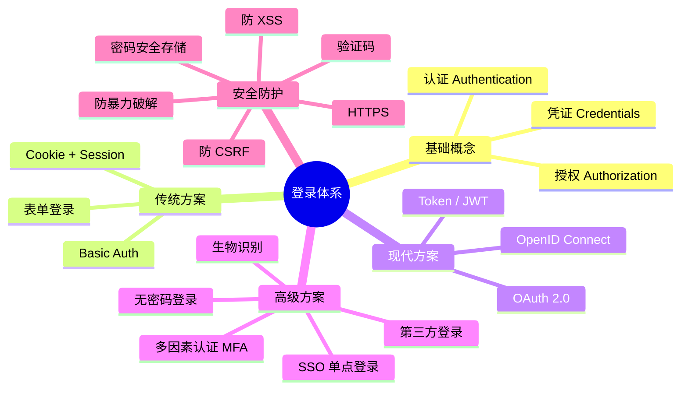
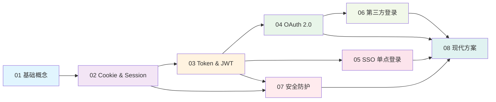

# 🔐 登录系统完全学习指南 - 总目录

> 本系列文档从零开始，系统性地介绍互联网登录体系的方方面面。  
> 适合零基础小白，也适合有经验的开发者查漏补缺。

---

## 📚 文档索引

| 序号 | 文档 | 核心内容 | 难度 |
|------|------|----------|------|
| 01 | [登录基础概念与认证授权](./01-登录基础概念与认证授权.md) | 什么是登录、认证 vs 授权、身份验证的演进 | ⭐ |
| 02 | [Cookie 与 Session 机制详解](./02-Cookie与Session机制详解.md) | Cookie 原理、Session 工作流程、优缺点 | ⭐⭐ |
| 03 | [Token 与 JWT 详解](./03-Token与JWT详解.md) | Token 认证、JWT 结构与原理、刷新机制 | ⭐⭐ |
| 04 | [OAuth2.0 协议详解](./04-OAuth2.0协议详解.md) | 四种授权模式、完整流程、应用场景 | ⭐⭐⭐ |
| 05 | [SSO 单点登录详解](./05-SSO单点登录详解.md) | SSO 原理、CAS 协议、跨域登录 | ⭐⭐⭐ |
| 06 | [第三方登录实现](./06-第三方登录实现.md) | 微信/GitHub/Google 登录流程 | ⭐⭐⭐ |
| 07 | [登录安全防护](./07-登录安全防护.md) | CSRF、XSS、暴力破解、密码存储 | ⭐⭐⭐ |
| 08 | [现代登录方案与最佳实践](./08-现代登录方案与最佳实践.md) | 无密码登录、生物识别、MFA、最佳实践 | ⭐⭐⭐ |

---

## 🗺️ 登录体系全景图

---

## 🛤️ 建议学习路线

> 💡 建议按照 01 → 02 → 03 → 04 → 05 → 06 → 07 → 08 的顺序依次学习，每篇文档都有前置知识依赖。
