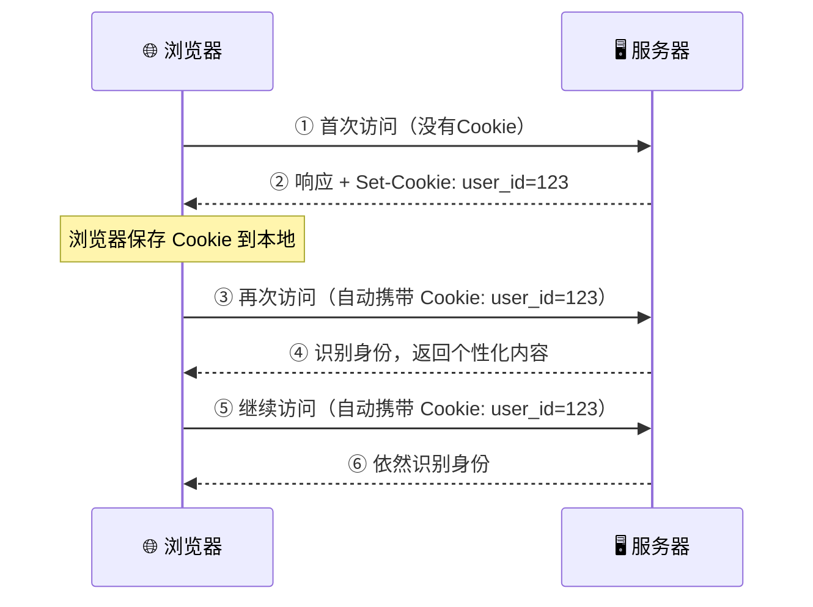
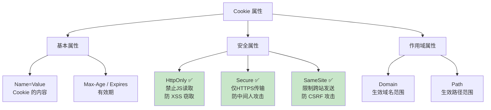
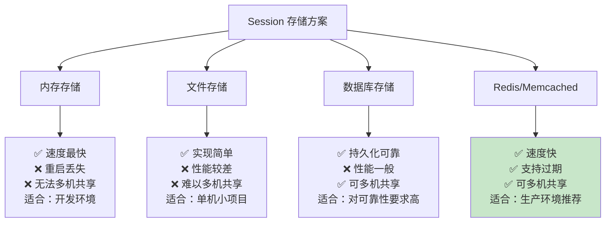
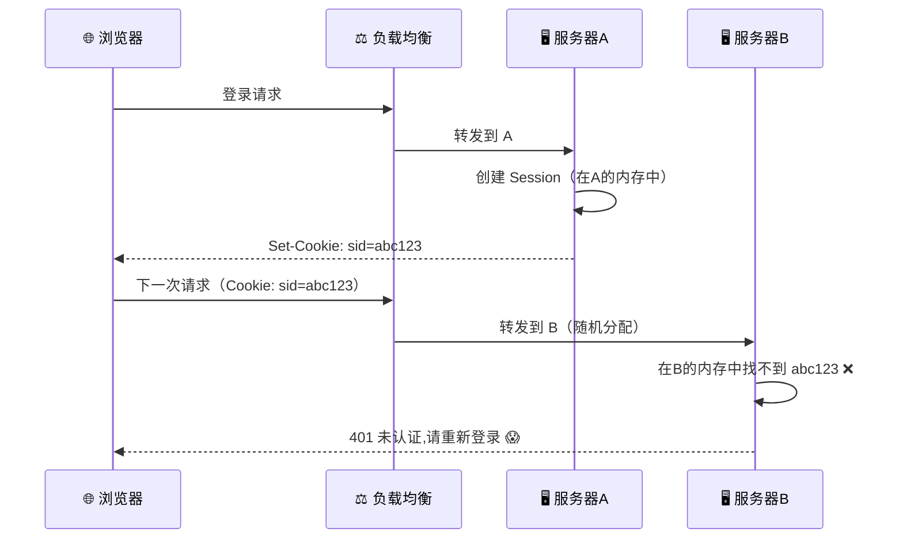
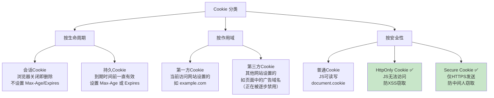
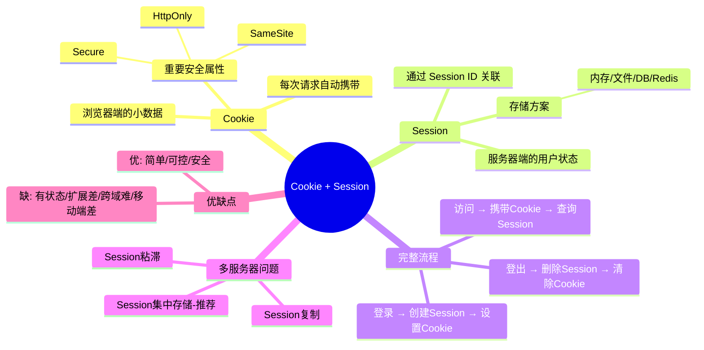

# 🍪 02 - Cookie 与 Session 机制详解

> Cookie + Session 是最经典的登录方案，虽然近年来 Token 方案逐渐成为主流，但 Cookie 和 Session 仍然在大量系统中广泛使用，理解它们是学习后续方案的基础。

---

## 一、Cookie 是什么？

### 1.1 通俗理解

Cookie 就像超市给你的**会员卡**。你第一次去超市（网站），超市给你办了一张会员卡（Cookie）。以后每次去超市，你都带着这张卡，超市一刷卡就知道你是谁了。

### 1.2 技术定义

**Cookie** 是服务器发送到浏览器并保存在浏览器本地的一小段数据（通常不超过 4KB）。浏览器在后续每次请求同一服务器时，都会自动携带这段数据。

### 1.3 Cookie 的工作流程



### 1.4 Cookie 的 HTTP 头部

**服务器设置 Cookie**（响应头）：
```http
HTTP/1.1 200 OK
Set-Cookie: session_id=abc123; Path=/; HttpOnly; Secure; SameSite=Lax; Max-Age=3600
```

**浏览器发送 Cookie**（请求头）：
```http
GET /profile HTTP/1.1
Host: www.example.com
Cookie: session_id=abc123
```

### 1.5 Cookie 的重要属性

| 属性 | 说明 | 示例 | 安全建议 |
|------|------|------|----------|
| `Name=Value` | Cookie 的名称和值 | `session_id=abc123` | 不要存敏感信息 |
| `Domain` | Cookie 生效的域名 | `Domain=.example.com` | 尽量限制范围 |
| `Path` | Cookie 生效的路径 | `Path=/api` | 按需设置 |
| `Max-Age` | 有效期（秒） | `Max-Age=3600`（1小时） | 不宜过长 |
| `Expires` | 过期时间（日期） | `Expires=Thu, 01 Jan 2026` | 建议用 Max-Age |
| `HttpOnly` | 禁止 JS 访问 | `HttpOnly` | ✅ **必须开启** |
| `Secure` | 仅 HTTPS 传输 | `Secure` | ✅ **必须开启** |
| `SameSite` | 跨站请求限制 | `SameSite=Lax` | ✅ **建议 Lax/Strict** |



---

## 二、Session 是什么？

### 2.1 通俗理解

如果说 Cookie 是你手里的会员卡，那 Session 就是超市**后台的会员档案**。

- 会员卡（Cookie）上只有一个编号（Session ID）
- 真正的信息（你的名字、余额、购买记录）存在超市的电脑里（服务器的 Session）

### 2.2 技术定义

**Session**（会话）是服务器端存储的用户状态信息。服务器为每个登录用户创建一个唯一的 Session 对象，并通过 Session ID 来关联浏览器和服务器端的数据。

### 2.3 Session 的数据结构

```
Session Store（服务器内存/Redis/数据库）
├── Session ID: "abc123"
│   ├── user_id: 1001
│   ├── username: "张三"
│   ├── role: "admin"
│   ├── login_time: "2026-02-22 10:00:00"
│   └── expire_time: "2026-02-22 11:00:00"
│
├── Session ID: "def456"
│   ├── user_id: 1002
│   ├── username: "李四"
│   ├── role: "user"
│   └── ...
│
└── Session ID: "ghi789"
    └── ...
```

---

## 三、Cookie + Session 登录完整流程

### 3.1 流程图

```mermaid
sequenceDiagram
    participant 浏览器 as 🌐 浏览器
    participant 服务器 as 🖥️ 服务器
    participant SessionStore as 💾 Session存储

    rect rgb(232, 245, 233)
        Note over 浏览器,SessionStore: 🔐 登录阶段
        浏览器->>服务器: ① POST /login {username, password}
        服务器->>服务器: ② 验证用户名密码
        服务器->>SessionStore: ③ 创建 Session（存储用户信息）
        SessionStore-->>服务器: ④ 返回 Session ID = "abc123"
        服务器-->>浏览器: ⑤ Set-Cookie: session_id=abc123
    end

    rect rgb(227, 242, 253)
        Note over 浏览器,SessionStore: 📋 访问阶段
        浏览器->>服务器: ⑥ GET /profile（Cookie: session_id=abc123）
        服务器->>SessionStore: ⑦ 根据 session_id 查找 Session
        SessionStore-->>服务器: ⑧ 返回用户信息{user_id:1001, username:"张三"}
        服务器-->>浏览器: ⑨ 返回个人信息页面
    end

    rect rgb(255, 235, 238)
        Note over 浏览器,SessionStore: 🚪 登出阶段
        浏览器->>服务器: ⑩ POST /logout（Cookie: session_id=abc123）
        服务器->>SessionStore: ⑪ 删除 Session "abc123"
        服务器-->>浏览器: ⑫ Set-Cookie: session_id=; Max-Age=0
    end
```

### 3.2 分步详解

| 步骤 | 动作 | 说明 |
|------|------|------|
| ① | 用户提交登录表单 | 浏览器把用户名和密码发送到服务器 |
| ② | 服务器验证凭证 | 比对数据库中的用户名和密码哈希 |
| ③ | 创建 Session | 在 Session 存储中创建一条记录 |
| ④ | 生成 Session ID | 一个随机的、不可预测的唯一字符串 |
| ⑤ | 设置 Cookie | 通过 `Set-Cookie` 响应头把 Session ID 发给浏览器 |
| ⑥ | 浏览器自动携带 | 后续请求自动在 `Cookie` 头中带上 Session ID |
| ⑦⑧ | 服务器查询 Session | 根据 Session ID 找到对应的用户信息 |
| ⑨ | 返回数据 | 根据用户身份返回相应内容 |
| ⑩⑪⑫ | 登出 | 删除服务端 Session + 清除客户端 Cookie |

---

## 四、Session 的存储方案

Session 数据需要持久化存储，不同方案各有优劣：



### 4.1 多服务器下的 Session 问题

当你的网站部署在多台服务器上时（负载均衡），Session 会遇到一个经典问题：



**解决方案：**

| 方案 | 说明 | 优缺点 |
|------|------|--------|
| **Session 粘滞** | 负载均衡把同一用户总是转发到同一台服务器 | 简单但不均衡，服务器挂了就丢失 |
| **Session 复制** | 多台服务器之间同步 Session 数据 | 网络开销大，延迟高 |
| **Session 集中存储** ✅ | 所有服务器共享一个 Redis 存储 Session | 推荐方案，性能好且可靠 |

```mermaid
graph TD
    subgraph 推荐方案：Session 集中存储
        浏览器[🌐 浏览器] --> 负载均衡[⚖️ 负载均衡]
        负载均衡 --> 服务器A[🖥️ 服务器A]
        负载均衡 --> 服务器B[🖥️ 服务器B]
        负载均衡 --> 服务器C[🖥️ 服务器C]
        服务器A --> Redis[(🔴 Redis<br/>Session集中存储)]
        服务器B --> Redis
        服务器C --> Redis
    end

    style Redis fill:#ffcdd2
```

---

## 五、Cookie + Session 的优缺点

### 5.1 优点

| 优点 | 说明 |
|------|------|
| ✅ 实现简单 | 各语言框架都有成熟的 Session 库 |
| ✅ 服务端可控 | 可以随时从服务端废除某个 Session（强制登出） |
| ✅ 安全性较好 | 敏感数据存在服务端，Cookie 只有 ID |
| ✅ 浏览器自动管理 | 不需要前端写额外代码来携带凭证 |

### 5.2 缺点

| 缺点 | 说明 |
|------|------|
| ❌ 服务端有状态 | 需要存储所有用户的 Session，内存消耗大 |
| ❌ 扩展性差 | 多服务器时需要共享 Session |
| ❌ 跨域困难 | Cookie 有同源限制，跨域需要额外配置 |
| ❌ 移动端不友好 | 原生 App 对 Cookie 支持不好 |
| ❌ CSRF 风险 | Cookie 自动发送的特性容易被利用 |

---

## 六、Cookie 的分类



---

## 七、代码示例

### 7.1 Node.js (Express) 示例

```javascript
const express = require('express');
const session = require('express-session');
const RedisStore = require('connect-redis').default;
const redis = require('redis');

const app = express();

// 创建 Redis 客户端
const redisClient = redis.createClient({ url: 'redis://localhost:6379' });
redisClient.connect();

// 配置 Session 中间件
app.use(session({
  store: new RedisStore({ client: redisClient }),  // Session 存储在 Redis
  secret: 'my-secret-key',           // 用于签名 Session ID
  resave: false,
  saveUninitialized: false,
  cookie: {
    httpOnly: true,     // ✅ 防 XSS
    secure: true,       // ✅ 仅 HTTPS
    sameSite: 'lax',    // ✅ 防 CSRF
    maxAge: 3600000     // 1小时过期
  }
}));

// 登录接口
app.post('/login', (req, res) => {
  const { username, password } = req.body;
  
  // 验证用户名密码（实际应查询数据库并比对哈希）
  if (username === 'admin' && password === '123456') {
    req.session.userId = 1001;
    req.session.username = 'admin';
    req.session.role = 'admin';
    res.json({ code: 0, message: '登录成功' });
  } else {
    res.status(401).json({ code: 1, message: '用户名或密码错误' });
  }
});

// 需要登录的接口
app.get('/profile', (req, res) => {
  if (!req.session.userId) {
    return res.status(401).json({ code: 1, message: '请先登录' });
  }
  res.json({
    userId: req.session.userId,
    username: req.session.username,
    role: req.session.role
  });
});

// 登出接口
app.post('/logout', (req, res) => {
  req.session.destroy((err) => {
    res.clearCookie('connect.sid');  // 清除 Cookie
    res.json({ code: 0, message: '登出成功' });
  });
});
```

### 7.2 Python (Flask) 示例

```python
from flask import Flask, session, request, jsonify
from flask_session import Session
import redis

app = Flask(__name__)

# 配置 Session
app.config['SECRET_KEY'] = 'my-secret-key'
app.config['SESSION_TYPE'] = 'redis'
app.config['SESSION_REDIS'] = redis.Redis(host='localhost', port=6379)
app.config['SESSION_COOKIE_HTTPONLY'] = True   # ✅ 防 XSS
app.config['SESSION_COOKIE_SECURE'] = True     # ✅ 仅 HTTPS
app.config['SESSION_COOKIE_SAMESITE'] = 'Lax'  # ✅ 防 CSRF
Session(app)

@app.route('/login', methods=['POST'])
def login():
    data = request.get_json()
    # 验证用户名密码（实际应查询数据库）
    if data['username'] == 'admin' and data['password'] == '123456':
        session['user_id'] = 1001
        session['username'] = 'admin'
        return jsonify(code=0, message='登录成功')
    return jsonify(code=1, message='用户名或密码错误'), 401

@app.route('/profile')
def profile():
    if 'user_id' not in session:
        return jsonify(code=1, message='请先登录'), 401
    return jsonify(user_id=session['user_id'], username=session['username'])

@app.route('/logout', methods=['POST'])
def logout():
    session.clear()
    return jsonify(code=0, message='登出成功')
```

---

## 八、本章小结



---

> 📖 **上一篇**：[01-登录基础概念与认证授权](./01-登录基础概念与认证授权.md)  
> 📖 **下一篇**：[03-Token与JWT详解](./03-Token与JWT详解.md) —— 了解无状态的现代认证方案
