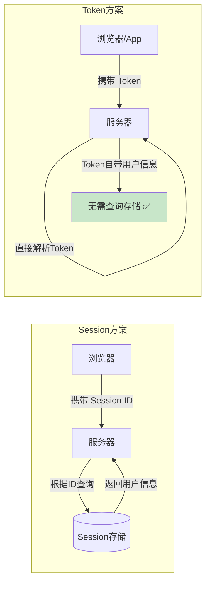
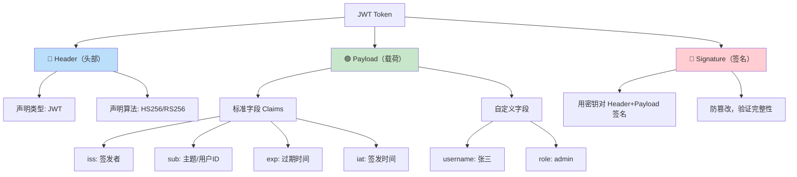
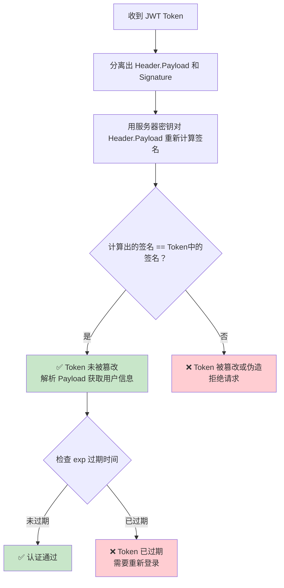
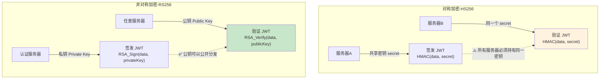
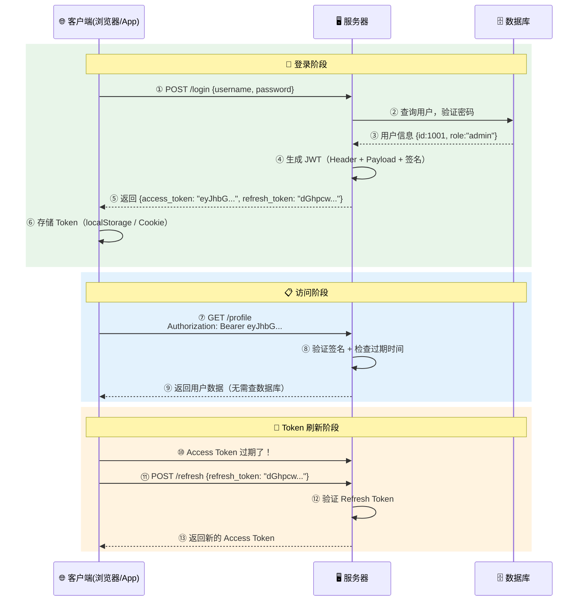
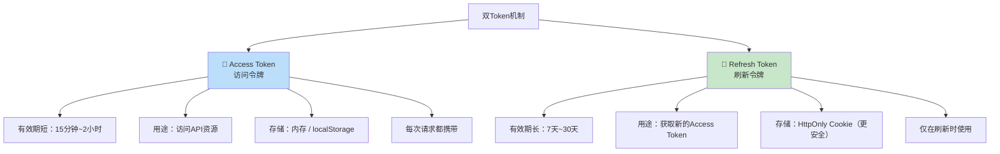
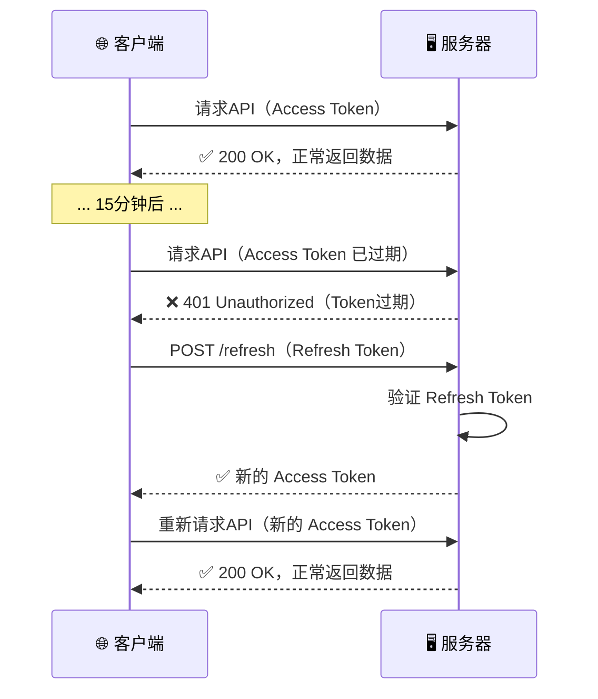
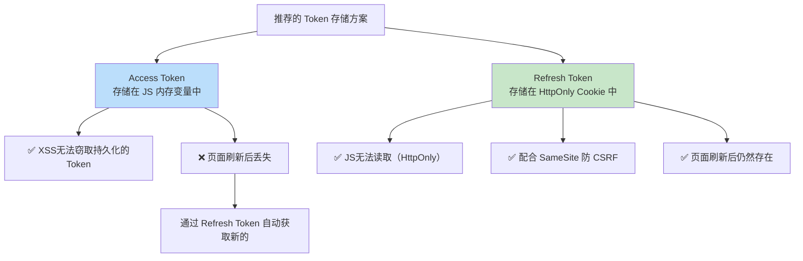
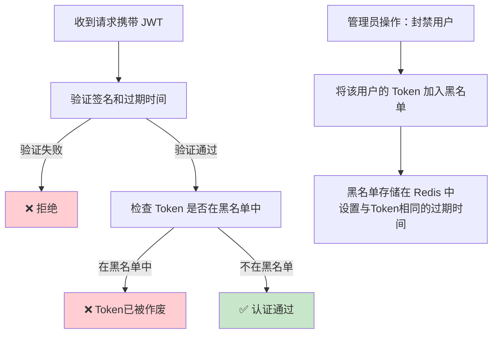
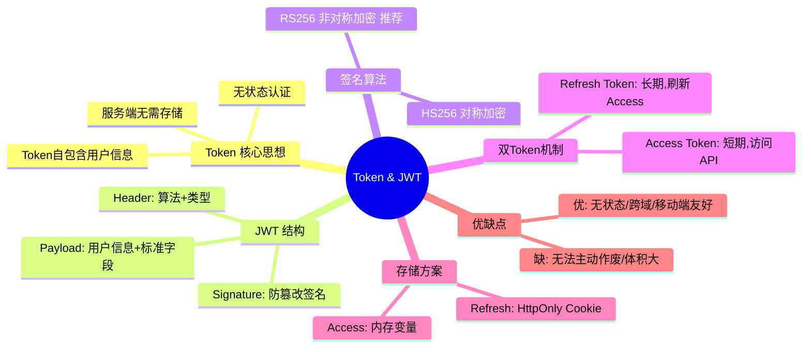

# 🎫 03 - Token 与 JWT 详解

> 随着前后端分离架构和移动端的兴起，传统的 Cookie + Session 方案暴露出扩展性差、跨域困难等问题。Token 认证应运而生，而 JWT 是其中最流行的实现方案。

---

## 一、什么是 Token？

### 1.1 通俗理解

Token 就像是一张**电影票**：

- 你买票时（登录），售票员验证你的身份（验证密码），给你一张票（Token）
- 票上印着你的座位信息（用户信息），还有防伪标识（签名）
- 你进影厅时只需要出示票（携带 Token），检票员看一眼票就知道你是谁、坐哪里
- 检票员**不需要去后台查系统**（不需要查询 Session 存储），票本身就包含了所有信息

### 1.2 Token vs Session 的核心区别



| 对比项 | Session | Token |
|--------|---------|-------|
| **信息存储** | 服务器端 | Token 自身（客户端） |
| **状态性** | 有状态（Stateful） | 无状态（Stateless） |
| **扩展性** | 多服务器需共享 Session | 任意服务器都能验证 ✅ |
| **跨域** | Cookie 有同源限制 | 放在 Header 中，无限制 ✅ |
| **移动端** | 原生 App 不友好 | 完美支持 ✅ |
| **服务端控制** | 可随时废除 ✅ | 签发后无法主动作废 |
| **存储开销** | 服务端有开销 | 服务端零开销 ✅ |

---

## 二、JWT（JSON Web Token）详解

### 2.1 什么是 JWT？

JWT（JSON Web Token）是一个开放标准（RFC 7519），它定义了一种紧凑的、自包含的方式，用于在各方之间以 JSON 对象安全地传输信息。

> 💡 **自包含（Self-contained）**：Token 本身就包含了所有需要的信息，服务端不需要额外查询。

### 2.2 JWT 的结构

JWT 由三部分组成，用 `.` 分隔：

```
xxxxx.yyyyy.zzzzz
  ↓      ↓      ↓
Header.Payload.Signature
 头部   载荷     签名
```

一个真实的 JWT 长这样：
```
eyJhbGciOiJIUzI1NiIsInR5cCI6IkpXVCJ9.
eyJzdWIiOiIxMjM0NTY3ODkwIiwibmFtZSI6IuW8oOS4iSIsInJvbGUiOiJhZG1pbiIsImlhdCI6MTUxNjIzOTAyMn0.
SflKxwRJSMeKKF2QT4fwpMeJf36POk6yJV_adQssw5c
```

### 2.3 三部分详解



#### 🔵 Header（头部）

```json
{
  "alg": "HS256",    // 签名算法
  "typ": "JWT"       // Token 类型
}
```

经过 Base64Url 编码后变成：`eyJhbGciOiJIUzI1NiIsInR5cCI6IkpXVCJ9`

#### 🟢 Payload（载荷）

```json
{
  "sub": "1234567890",    // 用户ID（标准字段）
  "name": "张三",         // 自定义字段
  "role": "admin",        // 自定义字段
  "iat": 1516239022,      // 签发时间（标准字段）
  "exp": 1516242622       // 过期时间（标准字段）
}
```

**标准字段（Registered Claims）：**

| 字段 | 全称 | 含义 |
|------|------|------|
| `iss` | Issuer | 签发者 |
| `sub` | Subject | 主题（通常是用户ID） |
| `aud` | Audience | 接收者 |
| `exp` | Expiration | 过期时间 |
| `iat` | Issued At | 签发时间 |
| `nbf` | Not Before | 生效时间 |
| `jti` | JWT ID | 唯一标识 |

> ⚠️ **重要提醒**：Payload 只是 Base64Url 编码，**不是加密**！任何人都可以解码看到内容。所以**绝对不要**在 Payload 中放密码等敏感信息！

#### 🔴 Signature（签名）

```
HMACSHA256(
  base64UrlEncode(header) + "." + base64UrlEncode(payload),
  secret_key    // 只有服务器知道的密钥
)
```

签名的作用：**防篡改**。如果有人修改了 Payload（比如把 role 从 "user" 改成 "admin"），签名就会对不上，服务器会拒绝这个 Token。

### 2.4 JWT 签名验证原理



---

## 三、JWT 签名算法

### 3.1 对称加密 vs 非对称加密



| 算法 | 类型 | 密钥 | 适用场景 |
|------|------|------|----------|
| HS256 | 对称加密 | 签发和验证用同一个密钥 | 单体应用、微服务内部 |
| RS256 | 非对称加密 | 私钥签发、公钥验证 | 分布式系统、微服务 ✅ |
| ES256 | 椭圆曲线 | 私钥签发、公钥验证 | 性能要求高的场景 |

---

## 四、JWT 登录完整流程



---

## 五、双 Token 机制（Access Token + Refresh Token）

### 5.1 为什么需要两个 Token？

**矛盾**：
- Token 有效期**太短** → 用户频繁被要求重新登录，体验差
- Token 有效期**太长** → Token 泄露后危害时间长，安全性差

**解决方案**：使用两个 Token 各司其职



### 5.2 刷新流程



### 5.3 前端自动刷新 Token 的实现思路

```javascript
// Axios 拦截器 —— 自动刷新 Token
axios.interceptors.response.use(
  response => response,
  async error => {
    const originalRequest = error.config;
    
    // 如果返回 401 且还没有尝试过刷新
    if (error.response.status === 401 && !originalRequest._retry) {
      originalRequest._retry = true;
      
      try {
        // 使用 Refresh Token 获取新的 Access Token
        const { data } = await axios.post('/api/refresh', {
          refresh_token: getRefreshToken()
        });
        
        // 存储新 Token
        setAccessToken(data.access_token);
        
        // 用新 Token 重新发起原请求
        originalRequest.headers['Authorization'] = `Bearer ${data.access_token}`;
        return axios(originalRequest);
      } catch (refreshError) {
        // Refresh Token 也过期了，跳转登录页
        redirectToLogin();
        return Promise.reject(refreshError);
      }
    }
    
    return Promise.reject(error);
  }
);
```

---

## 六、JWT 的存储方案对比

Token 在客户端存在哪里？这是一个重要的安全决策：

| 存储位置 | XSS 防护 | CSRF 防护 | 推荐度 |
|----------|----------|----------|--------|
| **localStorage** | ❌ JS可读取 | ✅ 不自动发送 | ⚠️ 简单但有XSS风险 |
| **sessionStorage** | ❌ JS可读取 | ✅ 不自动发送 | ⚠️ 关闭标签页就丢失 |
| **HttpOnly Cookie** | ✅ JS无法读取 | ❌ 自动发送 | ✅ 推荐（配合SameSite） |
| **内存变量** | ✅ 刷新即丢失 | ✅ 不自动发送 | ✅ 最安全但需配合Refresh Token |

### 推荐方案



---

## 七、JWT 的优缺点

### 7.1 优点

| 优点 | 说明 |
|------|------|
| ✅ 无状态 | 服务端不需要存储 Session，天然支持分布式 |
| ✅ 跨域友好 | 放在 Authorization Header 中，不受同源限制 |
| ✅ 移动端友好 | 原生 App 完美支持 |
| ✅ 性能好 | 验证只需要计算签名，不需要查询存储 |
| ✅ 自包含 | Token 自带用户信息，减少数据库查询 |

### 7.2 缺点

| 缺点 | 说明 | 解决方案 |
|------|------|----------|
| ❌ 无法主动作废 | Token 签发后，在过期前无法让它失效 | 黑名单机制 / 短有效期 |
| ❌ 体积较大 | 比 Session ID 大得多（几百字节~几KB） | 只放必要信息 |
| ❌ Payload 非加密 | 任何人都能解码查看 | 不放敏感信息 / 使用 JWE |
| ❌ 续期复杂 | 需要双 Token 机制 | Access Token + Refresh Token |

### 7.3 Token 黑名单机制

当需要强制作废某个 Token 时（比如用户修改密码、管理员封禁用户）：



---

## 八、代码示例

### 8.1 Node.js (Express + jsonwebtoken) 示例

```javascript
const express = require('express');
const jwt = require('jsonwebtoken');

const app = express();
app.use(express.json());

const ACCESS_SECRET = 'your-access-secret-key';
const REFRESH_SECRET = 'your-refresh-secret-key';

// 登录接口
app.post('/login', (req, res) => {
  const { username, password } = req.body;
  
  // 验证用户（实际应查数据库）
  if (username === 'admin' && password === '123456') {
    // 生成 Access Token（15分钟）
    const accessToken = jwt.sign(
      { userId: 1001, username: 'admin', role: 'admin' },
      ACCESS_SECRET,
      { expiresIn: '15m' }
    );
    
    // 生成 Refresh Token（7天）
    const refreshToken = jwt.sign(
      { userId: 1001 },
      REFRESH_SECRET,
      { expiresIn: '7d' }
    );
    
    res.json({ access_token: accessToken, refresh_token: refreshToken });
  } else {
    res.status(401).json({ message: '用户名或密码错误' });
  }
});

// 认证中间件
function authenticate(req, res, next) {
  const authHeader = req.headers['authorization'];
  const token = authHeader && authHeader.split(' ')[1]; // Bearer TOKEN
  
  if (!token) return res.status(401).json({ message: '未提供Token' });
  
  try {
    const decoded = jwt.verify(token, ACCESS_SECRET);
    req.user = decoded; // 将解析出的用户信息挂到 req 上
    next();
  } catch (err) {
    if (err.name === 'TokenExpiredError') {
      return res.status(401).json({ message: 'Token已过期', code: 'TOKEN_EXPIRED' });
    }
    return res.status(403).json({ message: 'Token无效' });
  }
}

// 受保护的接口
app.get('/profile', authenticate, (req, res) => {
  res.json({
    userId: req.user.userId,
    username: req.user.username,
    role: req.user.role
  });
});

// 刷新 Token
app.post('/refresh', (req, res) => {
  const { refresh_token } = req.body;
  
  try {
    const decoded = jwt.verify(refresh_token, REFRESH_SECRET);
    const newAccessToken = jwt.sign(
      { userId: decoded.userId, username: 'admin', role: 'admin' },
      ACCESS_SECRET,
      { expiresIn: '15m' }
    );
    res.json({ access_token: newAccessToken });
  } catch (err) {
    res.status(401).json({ message: 'Refresh Token无效或已过期' });
  }
});
```

### 8.2 Python (Flask + PyJWT) 示例

```python
import jwt
import datetime
from flask import Flask, request, jsonify
from functools import wraps

app = Flask(__name__)
ACCESS_SECRET = 'your-access-secret-key'
REFRESH_SECRET = 'your-refresh-secret-key'

def token_required(f):
    """认证装饰器"""
    @wraps(f)
    def decorated(*args, **kwargs):
        token = request.headers.get('Authorization', '').replace('Bearer ', '')
        if not token:
            return jsonify(message='未提供Token'), 401
        try:
            data = jwt.decode(token, ACCESS_SECRET, algorithms=['HS256'])
            request.user = data
        except jwt.ExpiredSignatureError:
            return jsonify(message='Token已过期'), 401
        except jwt.InvalidTokenError:
            return jsonify(message='Token无效'), 403
        return f(*args, **kwargs)
    return decorated

@app.route('/login', methods=['POST'])
def login():
    data = request.get_json()
    if data['username'] == 'admin' and data['password'] == '123456':
        access_token = jwt.encode({
            'user_id': 1001,
            'username': 'admin',
            'role': 'admin',
            'exp': datetime.datetime.utcnow() + datetime.timedelta(minutes=15)
        }, ACCESS_SECRET, algorithm='HS256')
        
        refresh_token = jwt.encode({
            'user_id': 1001,
            'exp': datetime.datetime.utcnow() + datetime.timedelta(days=7)
        }, REFRESH_SECRET, algorithm='HS256')
        
        return jsonify(access_token=access_token, refresh_token=refresh_token)
    return jsonify(message='用户名或密码错误'), 401

@app.route('/profile')
@token_required
def profile():
    return jsonify(user_id=request.user['user_id'], username=request.user['username'])
```

---

## 九、本章小结



---

> 📖 **上一篇**：[02-Cookie与Session机制详解](./02-Cookie与Session机制详解.md)  
> 📖 **下一篇**：[04-OAuth2.0协议详解](./04-OAuth2.0协议详解.md) —— 了解第三方授权的标准协议
