# 🔓 04 - OAuth 2.0 协议详解

> 当你在某个网站看到"使用微信登录"、"使用 GitHub 登录"时，背后使用的就是 OAuth 2.0 协议。本章将完整介绍这个互联网最重要的授权协议。

---

## 一、为什么需要 OAuth？

### 1.1 一个场景引出问题

假设你在使用一个"在线简历网站"，它想读取你 GitHub 上的项目信息来自动填充简历。

**没有 OAuth 的做法（危险！❌）：**
- 简历网站问你要 GitHub 的用户名和密码
- 简历网站用你的密码去 GitHub 拿数据
- **问题**：你把密码给了第三方，它可以做任何事情（删除仓库、修改代码...）

**有了 OAuth 的做法（安全！✅）：**
- 简历网站把你引导到 GitHub 的授权页面
- 你在 GitHub 上确认"只允许读取项目列表"
- GitHub 给简历网站一个"限时、限权"的访问令牌
- 简历网站用这个令牌获取数据，**永远拿不到你的密码**

```mermaid
graph LR
    subgraph 危险做法 ❌
        A[用户] -->|给出GitHub密码| B[简历网站]
        B -->|用密码登录| C[GitHub]
        B -->|可以删库!| C
    end
    
    subgraph OAuth做法 ✅
        D[用户] -->|在GitHub授权| E[GitHub]
        E -->|发放限权Token| F[简历网站]
        F -->|只能读取项目| E
    end

    style B fill:#ffcdd2
    style F fill:#c8e6c9
```

### 1.2 OAuth 2.0 的定义

**OAuth 2.0** 是一个**授权框架**（Authorization Framework），它允许第三方应用在用户授权的情况下，**安全地、有限地**访问用户在另一个服务上的资源，而不需要获取用户的密码。

> 🔑 **关键词**：授权（Authorization），不是认证（Authentication）  
> OAuth 解决的是"允许别人访问我的资源"，而不是"证明我是谁"

---

## 二、OAuth 2.0 的四个角色

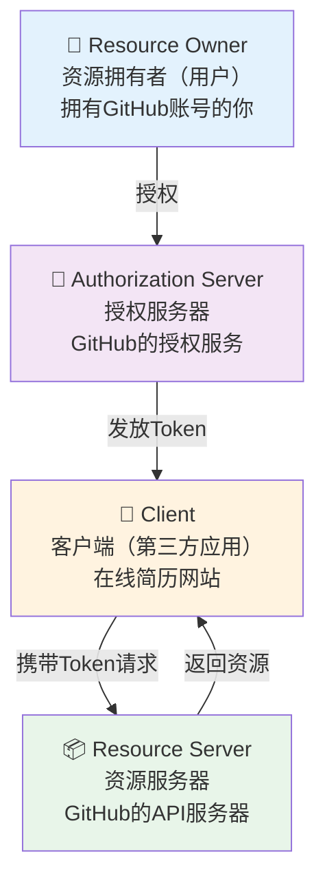

| 角色 | 英文 | 说明 | 举例 |
|------|------|------|------|
| **资源拥有者** | Resource Owner | 拥有数据的用户 | 你（GitHub 用户） |
| **客户端** | Client | 想要访问用户数据的第三方应用 | 在线简历网站 |
| **授权服务器** | Authorization Server | 负责认证用户身份、颁发令牌 | GitHub OAuth 服务 |
| **资源服务器** | Resource Server | 存储用户数据的服务 | GitHub API |

> 💡 在实际中，授权服务器和资源服务器往往是同一家公司（如 GitHub），但逻辑上是两个不同的角色。

---

## 三、OAuth 2.0 的四种授权模式

OAuth 2.0 定义了四种获取令牌的方式（Grant Types），适用于不同的应用场景：

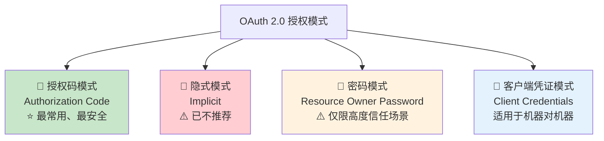

---

## 四、授权码模式（Authorization Code）—— 最重要！

这是**最安全、最常用**的模式，适用于有后端服务器的 Web 应用。微信登录、GitHub 登录、Google 登录都用的是这种模式。

### 4.1 完整流程

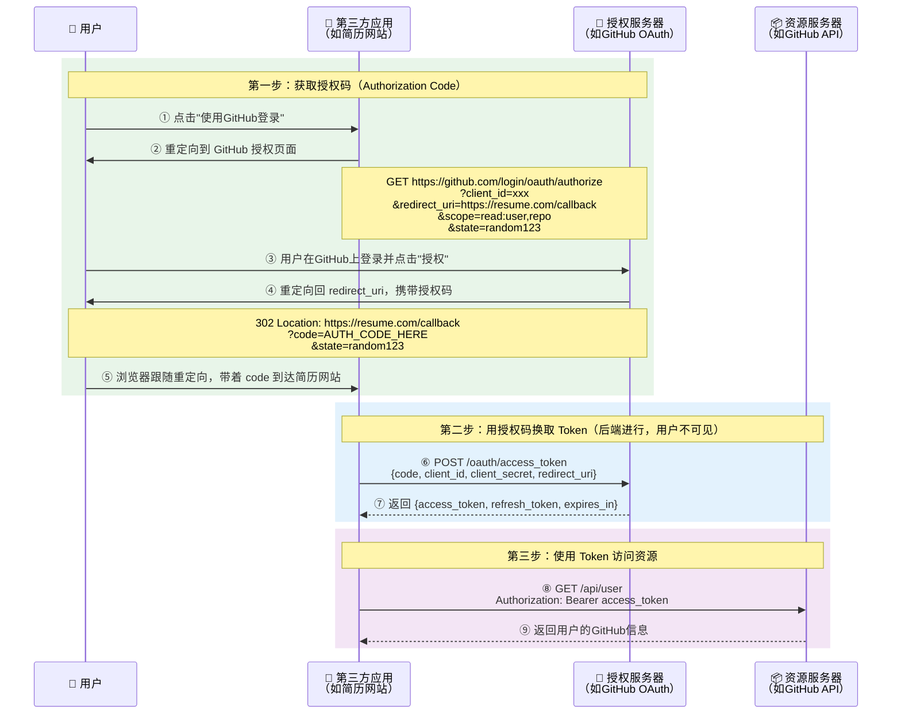

### 4.2 关键参数解释

**第一步 - 请求授权码的参数：**

| 参数 | 说明 | 示例 |
|------|------|------|
| `client_id` | 第三方应用在 OAuth 平台注册时获得的ID | `abc123` |
| `redirect_uri` | 授权后的回调地址 | `https://resume.com/callback` |
| `scope` | 请求的权限范围 | `read:user repo` |
| `state` | 随机字符串，防 CSRF 攻击 | `xyzrandom` |
| `response_type` | 授权类型，固定为 `code` | `code` |

**第二步 - 用授权码换 Token 的参数：**

| 参数 | 说明 |
|------|------|
| `code` | 第一步获得的授权码（**一次性、有时效**） |
| `client_id` | 应用ID |
| `client_secret` | 应用密钥（**只在后端使用，绝不能暴露到前端！**） |
| `redirect_uri` | 必须与第一步一致 |
| `grant_type` | 固定为 `authorization_code` |

### 4.3 为什么要分两步？为什么不直接返回 Token？

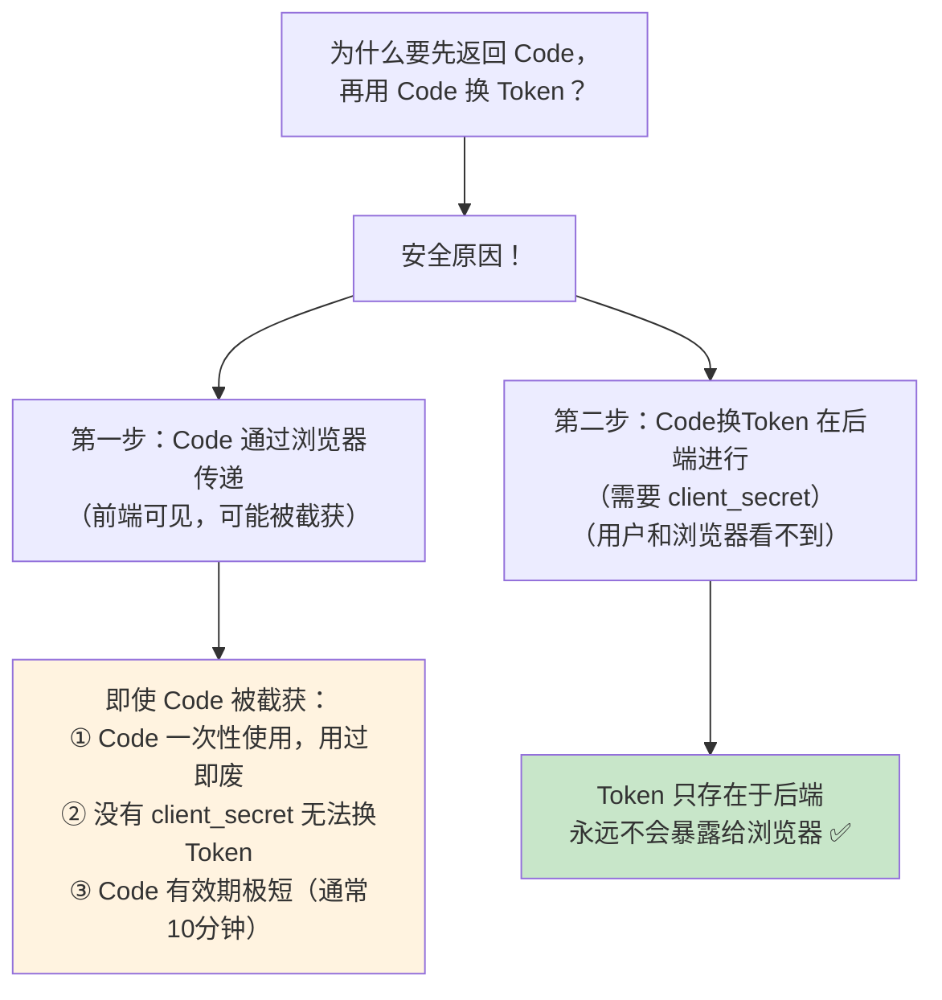

---

## 五、其他授权模式简介

### 5.1 隐式模式（Implicit）—— ⚠️ 已不推荐

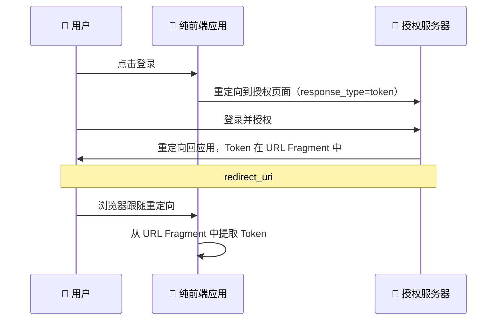

**特点**：
- 跳过了"授权码"步骤，直接返回 Token
- Token 暴露在 URL 中，安全性差
- **已被 OAuth 2.1 废弃**，建议使用授权码模式 + PKCE 替代

### 5.2 密码模式（Resource Owner Password）—— ⚠️ 仅限特殊场景

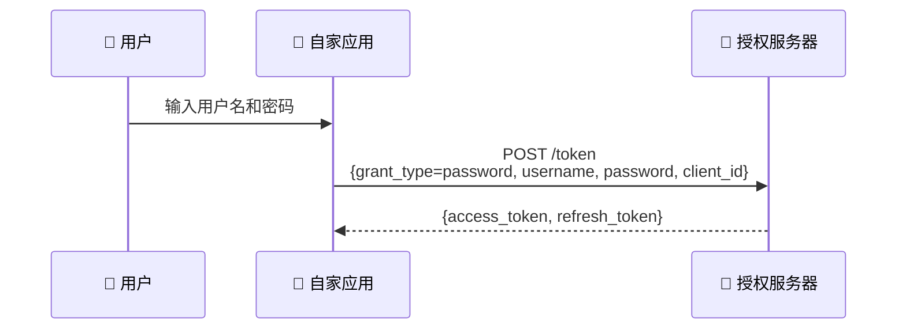

**特点**：
- 用户直接把密码给客户端
- **只适用于用户高度信任的自家应用**（如公司内部系统）
- **不适用于第三方应用**

### 5.3 客户端凭证模式（Client Credentials）—— 机器对机器

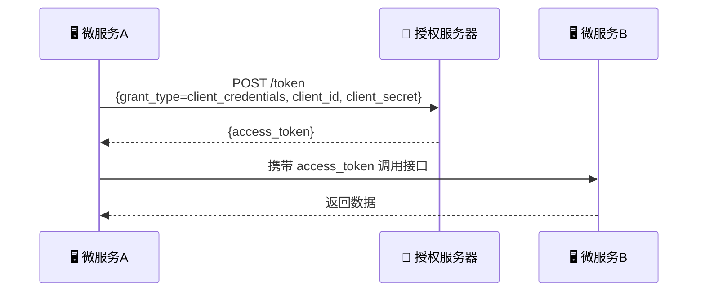

**特点**：
- 没有用户参与
- 适用于服务器之间的 API 调用
- 如：微服务 A 访问微服务 B 的数据

---

## 六、PKCE 扩展 —— 移动端/SPA 的安全增强

**PKCE**（Proof Key for Code Exchange，读作"pixie"）是授权码模式的安全增强，专为**无法安全存储 client_secret 的客户端**（如移动 App、SPA）设计。

### 6.1 PKCE 流程

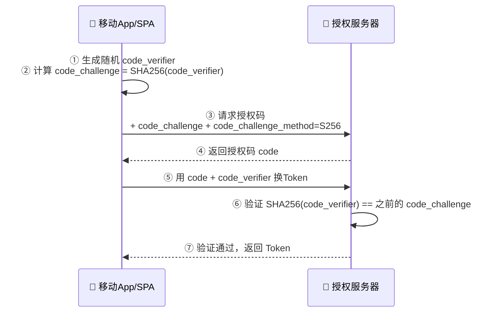

**核心思想**：即使授权码被拦截，攻击者没有 `code_verifier` 也无法换取 Token。

---

## 七、OAuth 2.0 中的 Scope（权限范围）

Scope 用来限制第三方应用能访问的资源范围：

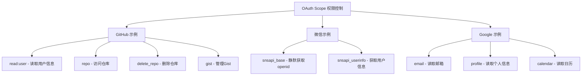

> 💡 **最小权限原则**：只申请应用真正需要的 Scope，不要过度申请权限。

---

## 八、OAuth 2.0 vs OpenID Connect

| 对比 | OAuth 2.0 | OpenID Connect (OIDC) |
|------|-----------|----------------------|
| **目的** | 授权（Authorization） | 认证 + 授权（Authentication + Authorization） |
| **回答** | "允许访问哪些资源" | "用户是谁" + "允许访问哪些资源" |
| **Token** | Access Token | Access Token + **ID Token** |
| **ID Token** | 无 | JWT 格式，包含用户身份信息 |
| **用户信息** | 需要额外调 API | ID Token 自带 |

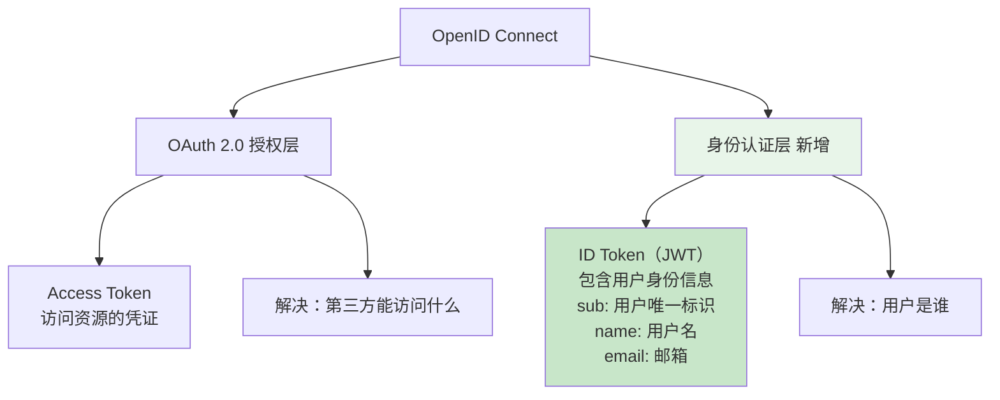

> 💡 简单理解：**OIDC = OAuth 2.0 + 用户身份信息**

---

## 九、本章小结

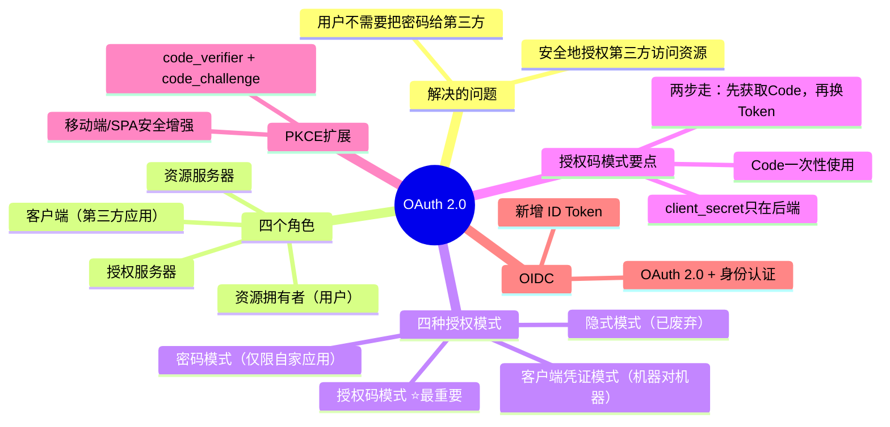

---

> 📖 **上一篇**：[03-Token与JWT详解](./03-Token与JWT详解.md)  
> 📖 **下一篇**：[05-SSO单点登录详解](./05-SSO单点登录详解.md) —— 了解企业级的统一登录方案
