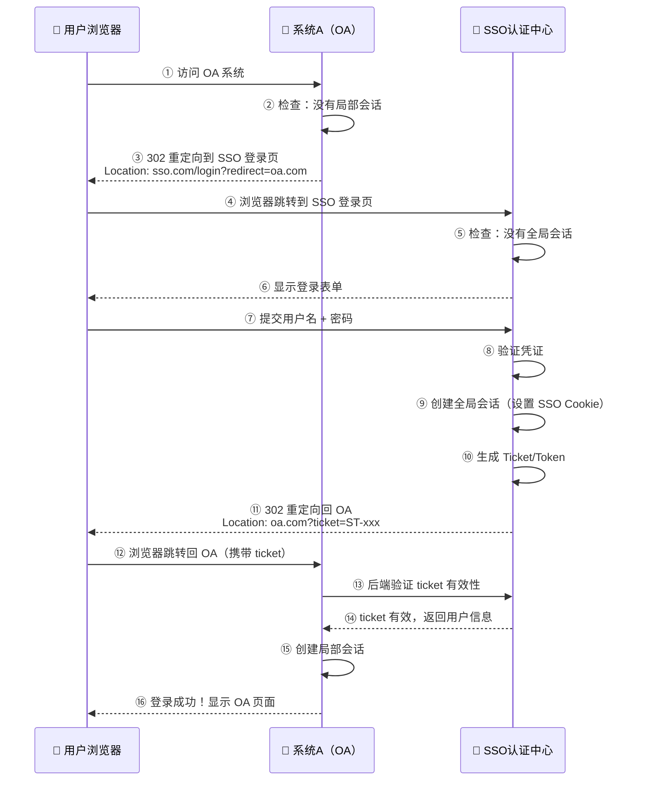
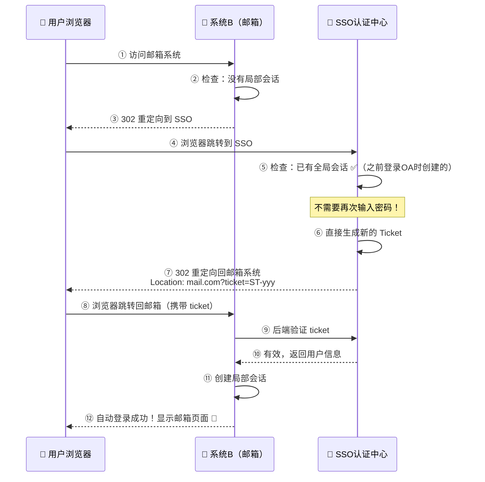
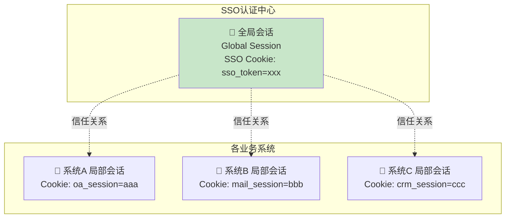
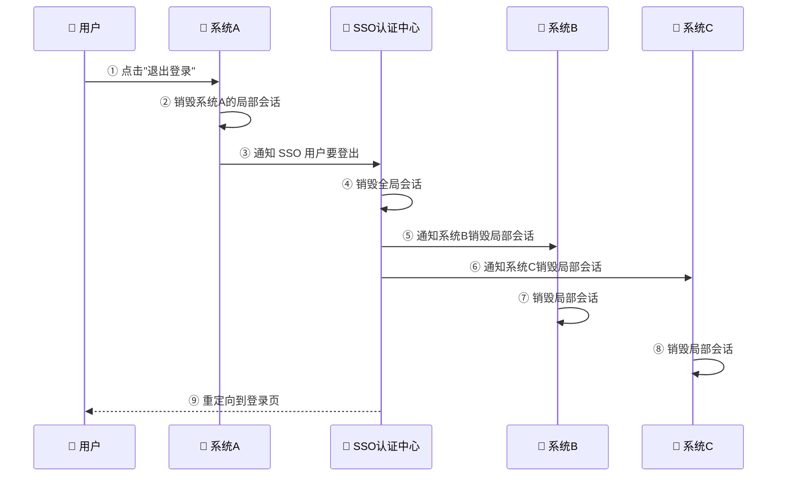
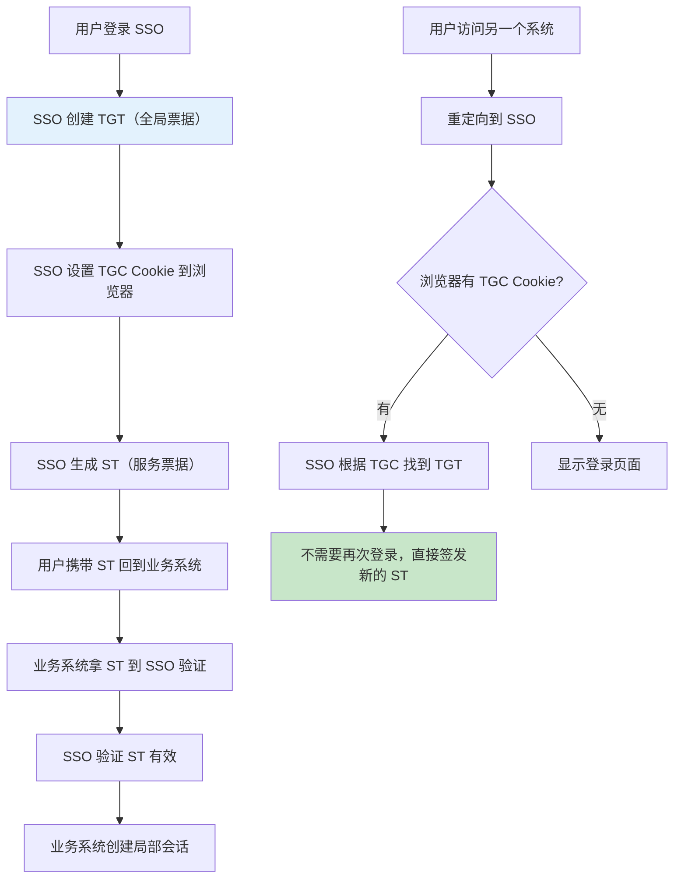
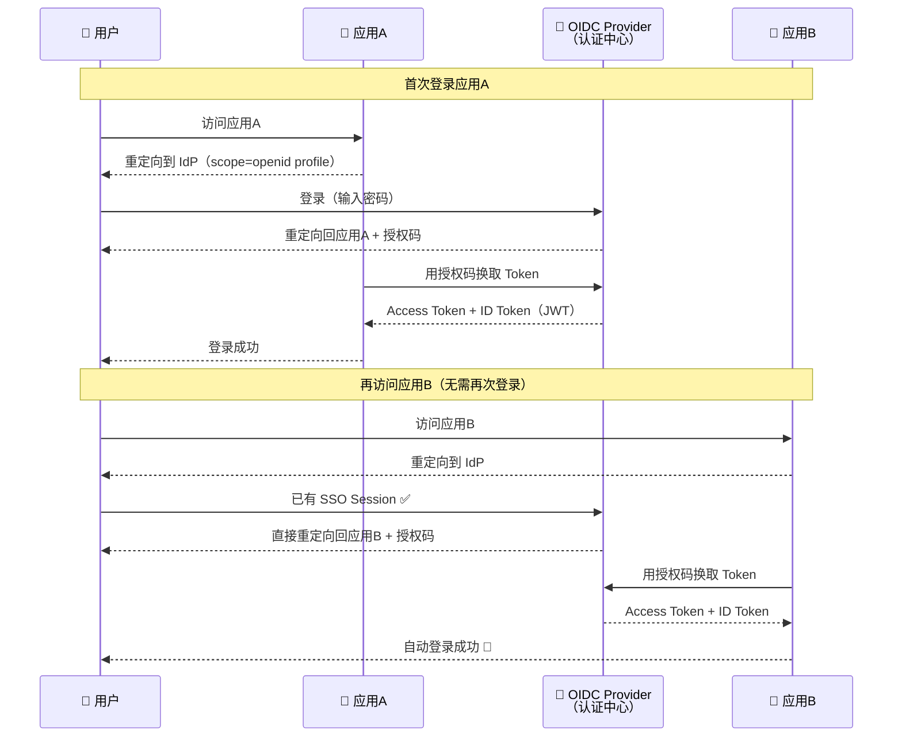
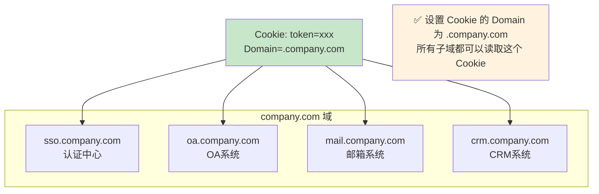
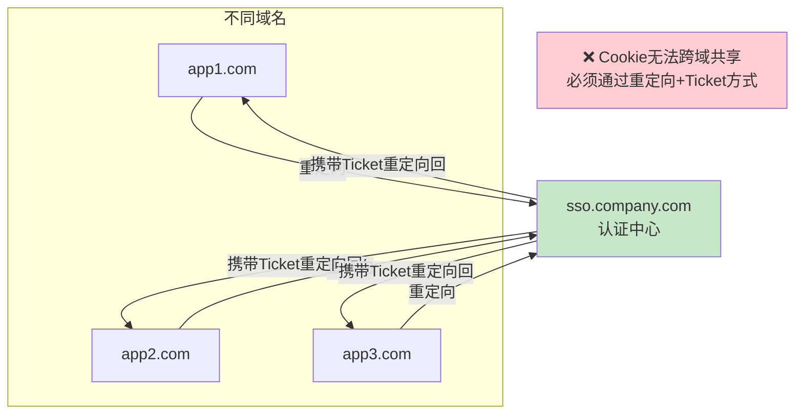
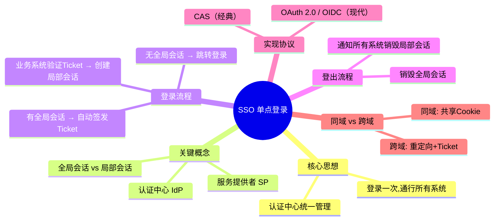

# 🔗 05 - SSO 单点登录详解

> 在企业中，员工往往要使用很多内部系统（OA、邮箱、CRM、项目管理...）。如果每个系统都要单独登录一次，那会疯掉的。SSO（单点登录）解决的就是"登录一次，访问所有"的问题。

---

## 一、什么是 SSO？

### 1.1 生活类比

想象你去一个大型游乐园：

- **没有 SSO**：每个游乐项目都要单独买票、排队验票 → 每个系统都要登录
- **有 SSO**：在门口买一张通票（手环），进任何项目只需要扫一下手环 → 登录一次，通行所有系统

### 1.2 技术定义

**SSO（Single Sign-On，单点登录）** 是指用户只需要在一个地方（认证中心）登录一次，就可以访问所有相互信任的系统，无需重复登录。

```mermaid
graph TD
    subgraph 没有SSO
        U1[用户] -->|登录| A1[OA系统]
        U1 -->|再次登录| B1[邮箱系统]
        U1 -->|又登录| C1[CRM系统]
        U1 -->|还要登录| D1[项目管理]
    end

    subgraph 有SSO ✅
        U2[用户] -->|只登录一次| SSO[🔐 SSO认证中心]
        SSO -->|自动通行| A2[OA系统]
        SSO -->|自动通行| B2[邮箱系统]
        SSO -->|自动通行| C2[CRM系统]
        SSO -->|自动通行| D2[项目管理]
    end

    style SSO fill:#c8e6c9
```

---

## 二、SSO 的核心概念

| 概念 | 说明 |
|------|------|
| **认证中心（IdP）** | Identity Provider，统一的登录服务，负责验证用户身份 |
| **服务提供者（SP）** | Service Provider，各个业务系统，依赖认证中心判断用户是否登录 |
| **全局会话** | 用户在认证中心的登录状态 |
| **局部会话** | 用户在各个业务系统的登录状态 |
| **令牌（Ticket/Token）** | 认证中心签发的凭证，业务系统用它来验证用户身份 |

---

## 三、SSO 登录流程

### 3.1 首次登录（系统A）



### 3.2 再访问另一个系统（系统B）—— 无需再次登录！



> 🎉 用户的体验是：访问邮箱系统时，页面闪了一下（重定向），然后就直接进去了，完全不需要输入密码！

### 3.3 全局会话与局部会话的关系



**关键理解**：
- **全局会话**存在于 SSO 认证中心（`sso.company.com` 域的 Cookie）
- **局部会话**存在于各业务系统（各自域的 Cookie/Session）
- 全局会话是"母会话"，局部会话是"子会话"
- 全局会话存在 → 可以自动创建局部会话（无需输入密码）

---

## 四、SSO 登出流程

登出需要"单点登出"（Single Logout），即在一个系统登出后，所有系统都要登出。



---

## 五、CAS 协议 —— 经典的 SSO 实现

**CAS（Central Authentication Service）** 是耶鲁大学开发的一套开源 SSO 协议，是最经典的 SSO 实现方案。

### 5.1 CAS 核心概念

| 术语 | 说明 |
|------|------|
| **TGT** (Ticket Granting Ticket) | 全局票据，存储在 SSO 服务端，代表全局会话 |
| **TGC** (Ticket Granting Cookie) | 全局 Cookie，存储在浏览器中，关联到 TGT |
| **ST** (Service Ticket) | 服务票据，一次性的，用于业务系统验证用户身份 |

### 5.2 CAS 票据流程



---

## 六、基于 OAuth 2.0 的 SSO

现代系统更倾向于使用 OAuth 2.0 / OIDC 来实现 SSO。

### 6.1 与 CAS 的对比

| 对比项 | CAS | OAuth 2.0 / OIDC |
|--------|-----|-------------------|
| 定位 | 专用于 SSO | 通用的授权/认证框架 |
| 协议复杂度 | 相对简单 | 更灵活但更复杂 |
| Token 格式 | Service Ticket（不透明字符串） | JWT（自包含信息） |
| 跨组织 | 主要用于组织内部 | 支持跨组织（如第三方登录） |
| 移动端支持 | 较弱 | 完善 |
| 生态 | 较老 | 丰富，各大厂都支持 |

### 6.2 基于 OIDC 的 SSO 流程



---

## 七、同域 SSO vs 跨域 SSO

### 7.1 同域 SSO（简单场景）

当所有子系统在同一个主域下时（如 `*.company.com`），可以通过共享 Cookie 实现简单的 SSO。



### 7.2 跨域 SSO（复杂场景）

当子系统在不同域名下时（如 `app1.com`、`app2.com`），Cookie 无法共享，必须通过重定向方式（CAS / OAuth）实现。



---

## 八、常见的 SSO 解决方案

| 方案 | 类型 | 特点 | 适用场景 |
|------|------|------|----------|
| **CAS** | 开源协议 | 经典、简单、成熟 | 高校、传统企业 |
| **Keycloak** | 开源平台 | 功能全面、支持 OIDC/SAML | 中大型企业 ✅ |
| **Auth0** | 商业服务 | 开箱即用、集成丰富 | 快速开发 |
| **Azure AD** | 微软云 | 与微软生态深度集成 | 微软技术栈 |
| **Okta** | 商业服务 | 企业级 IAM 平台 | 大型企业 |
| **自建** | 自研 | 完全可控 | 有技术能力的团队 |

---

## 九、本章小结



---

> 📖 **上一篇**：[04-OAuth2.0协议详解](./04-OAuth2.0协议详解.md)  
> 📖 **下一篇**：[06-第三方登录实现](./06-第三方登录实现.md) —— 了解微信/GitHub 等第三方登录的实现细节
