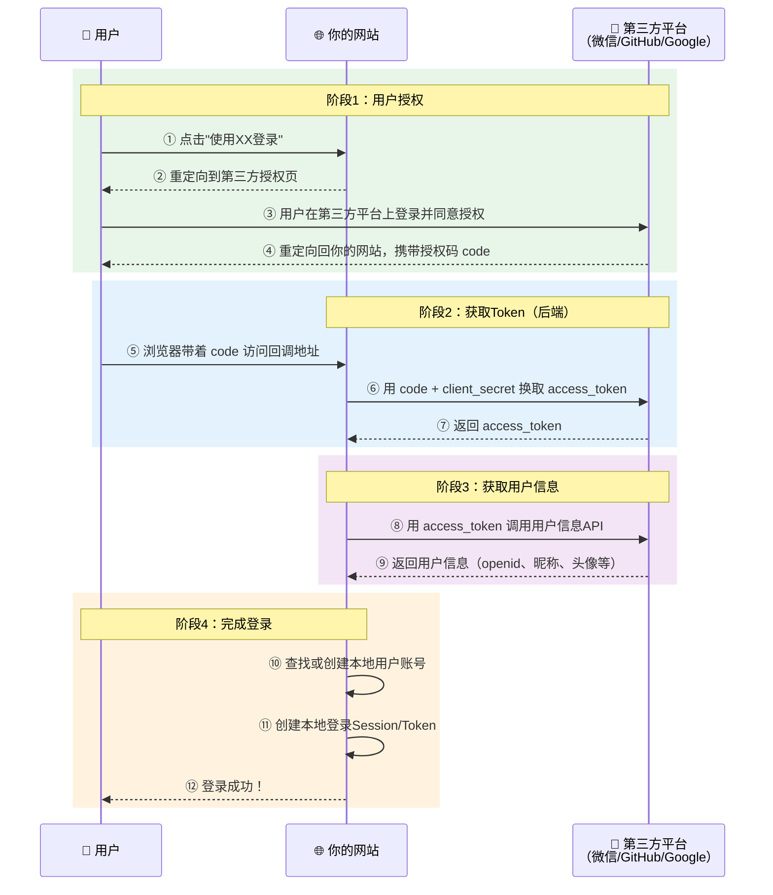
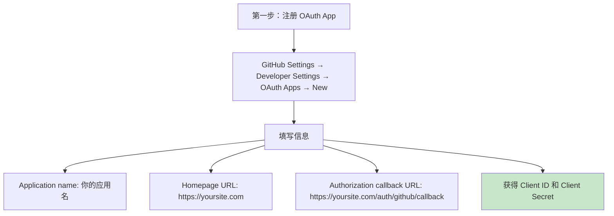
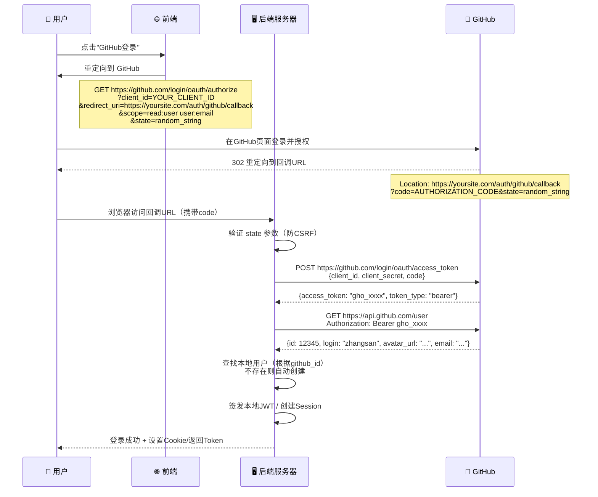
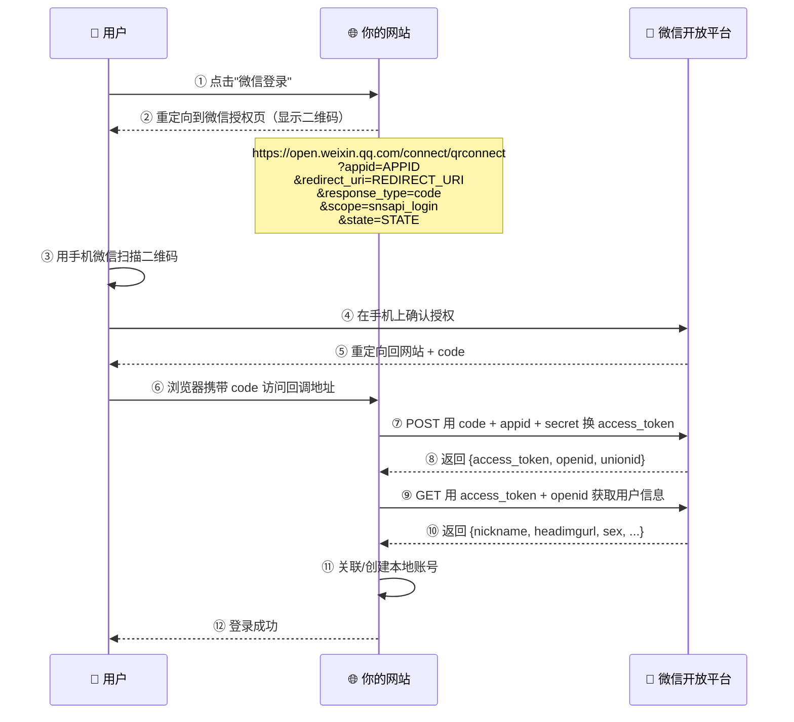
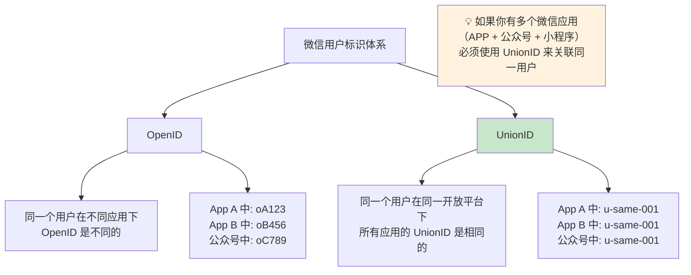
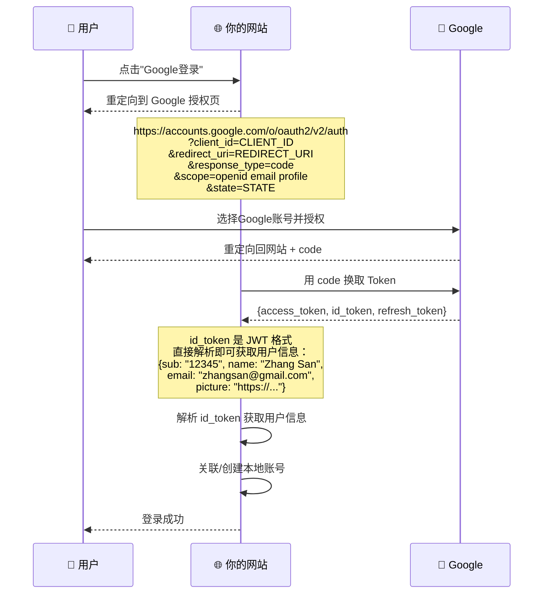
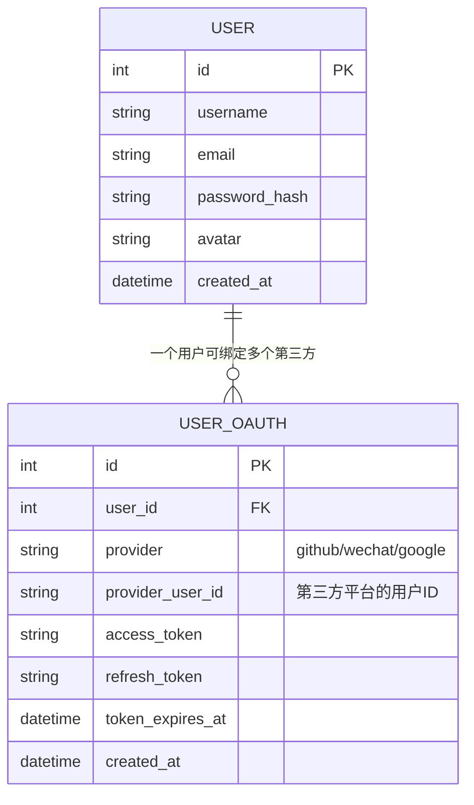
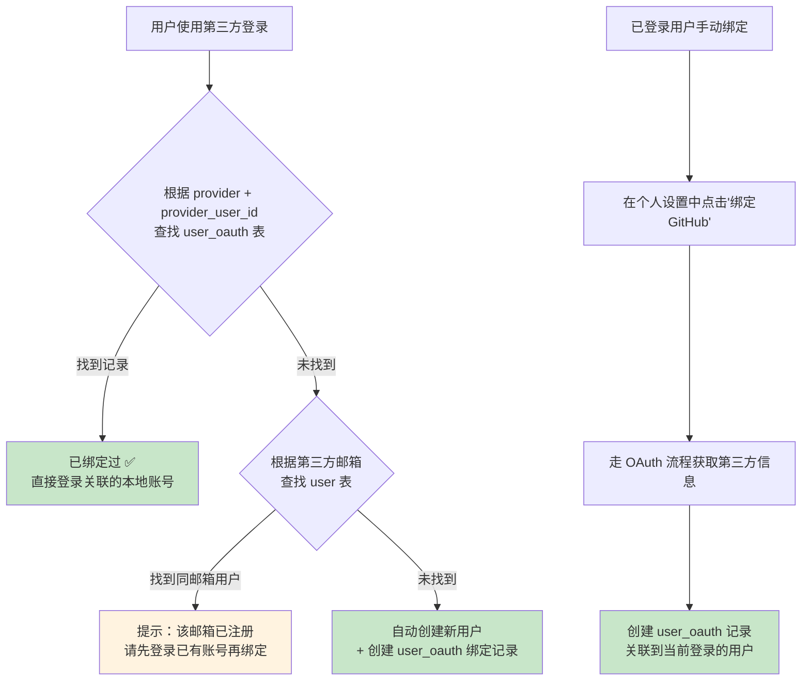
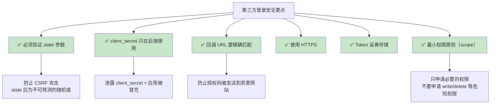
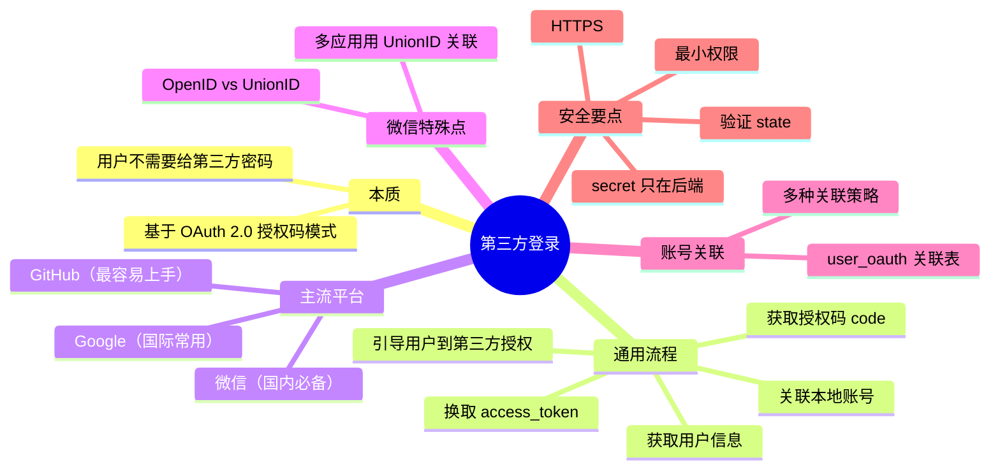

# 🌐 06 - 第三方登录实现

> "使用微信登录"、"使用 GitHub 登录"、"使用 Google 登录"—— 这些我们每天都在使用的功能，底层是如何工作的？本章将详细介绍第三方登录的实现原理和流程。

---

## 一、什么是第三方登录？

### 1.1 通俗理解

第三方登录就像是用**身份证**在酒店办理入住：

- 你不需要在酒店重新办一个"酒店身份证"（注册新账号）
- 你出示公安局颁发的身份证（已有的微信/GitHub 账号）
- 酒店确认身份证是真的（通过 OAuth 验证）
- 你就可以入住了（登录成功）

### 1.2 第三方登录的优势

| 对于用户 | 对于开发者 |
|----------|------------|
| ✅ 无需注册新账号 | ✅ 降低注册门槛，提高转化率 |
| ✅ 无需记住新密码 | ✅ 不用自己管理密码（减少安全负担） |
| ✅ 一键登录，体验好 | ✅ 可获取用户社交信息（头像、昵称） |
| ✅ 信任大平台的安全性 | ✅ 利用大平台的安全能力 |

---

## 二、第三方登录的通用架构

所有第三方登录都基于 **OAuth 2.0 授权码模式**，流程基本一致：



---

## 三、GitHub 登录实现

GitHub 是最容易上手的第三方登录平台之一。

### 3.1 准备工作



### 3.2 完整流程



### 3.3 代码示例（Node.js）

```javascript
const express = require('express');
const axios = require('axios');
const jwt = require('jsonwebtoken');

const app = express();

const GITHUB_CLIENT_ID = 'your_client_id';
const GITHUB_CLIENT_SECRET = 'your_client_secret';
const REDIRECT_URI = 'https://yoursite.com/auth/github/callback';

// 步骤1：引导用户到 GitHub 授权页面
app.get('/auth/github', (req, res) => {
  const state = generateRandomString(32); // 生成随机state防CSRF
  // 存储 state 到 session 以便后续验证
  req.session.oauthState = state;
  
  const githubAuthUrl = `https://github.com/login/oauth/authorize` +
    `?client_id=${GITHUB_CLIENT_ID}` +
    `&redirect_uri=${encodeURIComponent(REDIRECT_URI)}` +
    `&scope=read:user user:email` +
    `&state=${state}`;
  
  res.redirect(githubAuthUrl);
});

// 步骤2：处理 GitHub 回调
app.get('/auth/github/callback', async (req, res) => {
  const { code, state } = req.query;
  
  // 验证 state 防 CSRF
  if (state !== req.session.oauthState) {
    return res.status(403).json({ error: 'State不匹配，可能遭受CSRF攻击' });
  }
  
  try {
    // 步骤3：用 code 换取 access_token
    const tokenResponse = await axios.post(
      'https://github.com/login/oauth/access_token',
      {
        client_id: GITHUB_CLIENT_ID,
        client_secret: GITHUB_CLIENT_SECRET,
        code: code,
        redirect_uri: REDIRECT_URI
      },
      { headers: { Accept: 'application/json' } }
    );
    
    const accessToken = tokenResponse.data.access_token;
    
    // 步骤4：用 access_token 获取用户信息
    const userResponse = await axios.get('https://api.github.com/user', {
      headers: { Authorization: `Bearer ${accessToken}` }
    });
    
    const githubUser = userResponse.data;
    // githubUser = { id: 12345, login: 'zhangsan', avatar_url: '...', email: '...' }
    
    // 步骤5：查找或创建本地用户
    let localUser = await db.findUserByGithubId(githubUser.id);
    if (!localUser) {
      localUser = await db.createUser({
        github_id: githubUser.id,
        username: githubUser.login,
        avatar: githubUser.avatar_url,
        email: githubUser.email
      });
    }
    
    // 步骤6：签发本地 JWT
    const token = jwt.sign(
      { userId: localUser.id, username: localUser.username },
      'your-secret-key',
      { expiresIn: '7d' }
    );
    
    // 重定向到前端，并携带 token
    res.redirect(`https://yoursite.com/login/success?token=${token}`);
    
  } catch (error) {
    res.status(500).json({ error: '登录失败' });
  }
});
```

---

## 四、微信登录实现

微信登录是国内最常用的第三方登录方式，分为"网站应用微信登录"和"公众号/小程序登录"两种。

### 4.1 微信网站应用登录流程



### 4.2 微信特殊概念



| 标识 | 说明 | 唯一范围 | 使用场景 |
|------|------|----------|----------|
| **OpenID** | 用户在某个应用下的唯一标识 | 单个应用 | 只有一个微信应用时 |
| **UnionID** | 用户在开放平台下的唯一标识 | 同一开放平台账号下的所有应用 | 多个微信应用时（推荐） |

---

## 五、Google 登录实现

Google 登录使用 **OpenID Connect（OIDC）** 协议，在 OAuth 2.0 基础上增加了 ID Token。

### 5.1 Google 登录流程



> 💡 **Google 的优势**：返回的 `id_token` 是 JWT 格式，直接解码就能拿到用户信息，不需要再额外调 API。

---

## 六、账号关联策略

当用户使用第三方登录时，需要将第三方账号与本地账号关联。这里有几种常见策略：

### 6.1 数据库设计



### 6.2 账号关联的场景



### 6.3 关联策略总结

| 场景 | 处理方式 |
|------|----------|
| 第三方 ID 已绑定 | 直接登录关联的本地账号 |
| 第三方 ID 未绑定，邮箱匹配到已有用户 | 提示用户先登录再绑定（或自动关联） |
| 第三方 ID 未绑定，邮箱也没匹配到 | 自动创建新用户 + 绑定 |
| 已登录用户手动绑定 | 创建 user_oauth 记录 |
| 用户解绑第三方账号 | 删除 user_oauth 记录（确保至少保留一种登录方式） |

---

## 七、安全注意事项



---

## 八、本章小结



---

> 📖 **上一篇**：[05-SSO单点登录详解](./05-SSO单点登录详解.md)  
> 📖 **下一篇**：[07-登录安全防护](./07-登录安全防护.md) —— 了解登录系统面临的安全威胁及防护方案
