# 🛡️ 07 - 登录安全防护

> 登录是系统的"大门"，也是攻击者最爱攻击的目标。本章将系统介绍登录面临的各种安全威胁，以及对应的防护方案。

---

## 一、登录安全威胁全景图

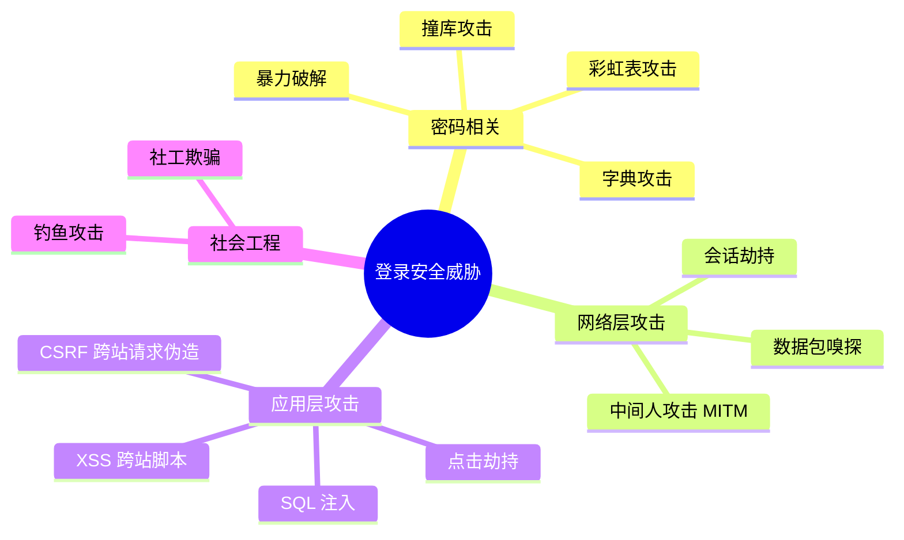

---

## 二、密码安全存储

### 2.1 错误的做法 ❌

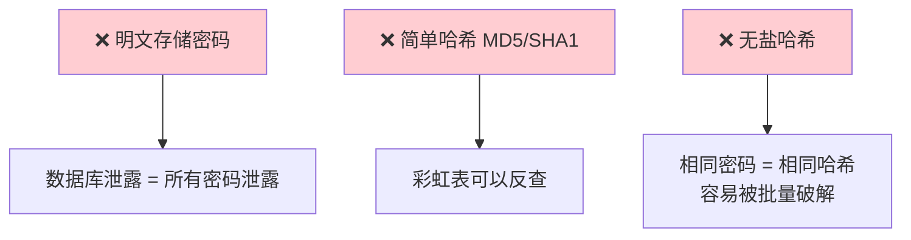

### 2.2 正确的做法 ✅

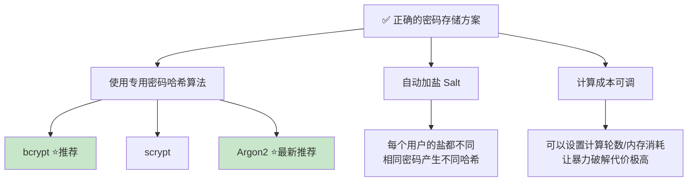

### 2.3 bcrypt 工作原理

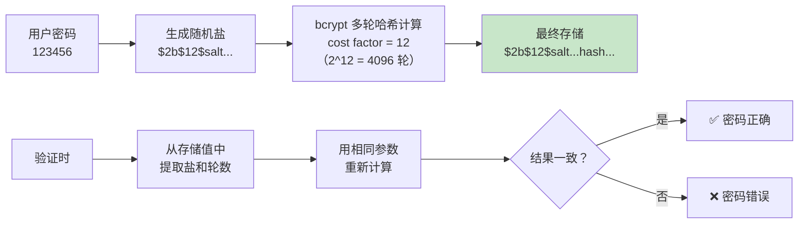

### 2.4 代码示例

```javascript
const bcrypt = require('bcrypt');

// 注册时：加密密码
async function hashPassword(plainPassword) {
  const saltRounds = 12;  // 成本因子，越高越安全但越慢
  const hashedPassword = await bcrypt.hash(plainPassword, saltRounds);
  // 结果示例: "$2b$12$LJ3m4ys3Lg7EPnBqFWHNWOqxF1oVpWJGrWOqH9JFTkBanQf7z/XGi"
  return hashedPassword;
}

// 登录时：验证密码
async function verifyPassword(plainPassword, hashedPassword) {
  const isMatch = await bcrypt.compare(plainPassword, hashedPassword);
  return isMatch;  // true 或 false
}
```

```python
# Python 使用 bcrypt
import bcrypt

# 注册时
def hash_password(plain_password: str) -> str:
    salt = bcrypt.gensalt(rounds=12)
    hashed = bcrypt.hashpw(plain_password.encode('utf-8'), salt)
    return hashed.decode('utf-8')

# 登录时
def verify_password(plain_password: str, hashed_password: str) -> bool:
    return bcrypt.checkpw(
        plain_password.encode('utf-8'),
        hashed_password.encode('utf-8')
    )
```

---

## 三、暴力破解防护

### 3.1 攻击方式

| 攻击类型 | 说明 | 速度 |
|----------|------|------|
| **暴力破解** | 尝试所有可能的密码组合（aaa, aab, aac...） | 慢 |
| **字典攻击** | 使用常见密码列表（123456, password, admin...） | 中 |
| **撞库攻击** | 用其他网站泄露的"用户名+密码"尝试登录 | 快且有效 |

### 3.2 防护措施

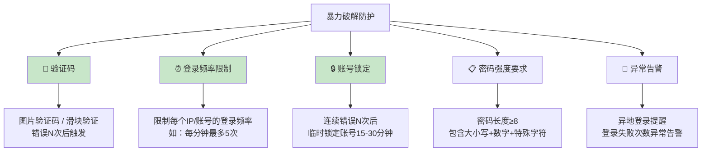

### 3.3 限流策略实现

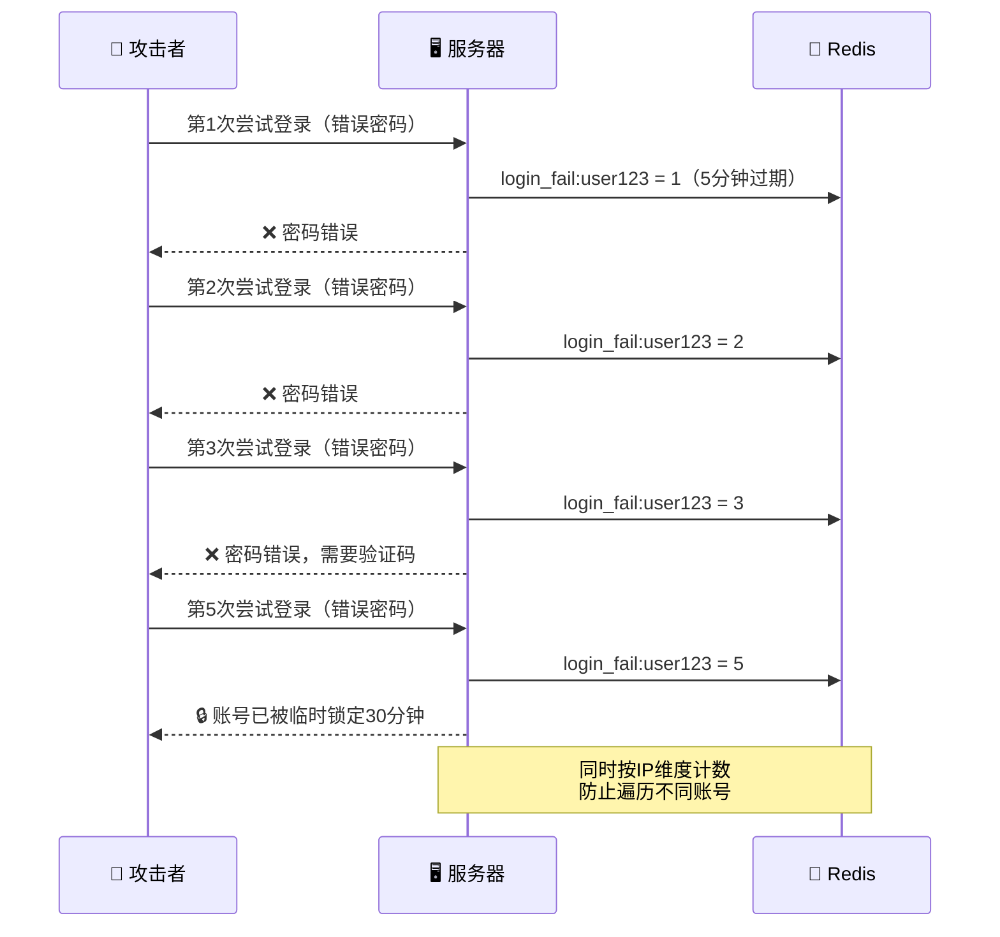

### 3.4 代码示例

```javascript
const Redis = require('ioredis');
const redis = new Redis();

async function checkLoginRateLimit(username, ip) {
  const userKey = `login_fail:user:${username}`;
  const ipKey = `login_fail:ip:${ip}`;
  
  const [userFails, ipFails] = await Promise.all([
    redis.get(userKey),
    redis.get(ipKey)
  ]);
  
  // 账号维度：5次失败 → 锁定30分钟
  if (parseInt(userFails) >= 5) {
    return { blocked: true, reason: '账号已被临时锁定，请30分钟后重试' };
  }
  
  // IP维度：20次失败 → 封禁IP 1小时
  if (parseInt(ipFails) >= 20) {
    return { blocked: true, reason: 'IP已被临时封禁，请稍后重试' };
  }
  
  // 3次失败后要求验证码
  if (parseInt(userFails) >= 3) {
    return { blocked: false, requireCaptcha: true };
  }
  
  return { blocked: false, requireCaptcha: false };
}

async function recordLoginFailure(username, ip) {
  const userKey = `login_fail:user:${username}`;
  const ipKey = `login_fail:ip:${ip}`;
  
  await Promise.all([
    redis.multi()
      .incr(userKey)
      .expire(userKey, 1800)  // 30分钟过期
      .exec(),
    redis.multi()
      .incr(ipKey)
      .expire(ipKey, 3600)    // 1小时过期
      .exec()
  ]);
}

async function clearLoginFailure(username) {
  await redis.del(`login_fail:user:${username}`);
}
```

---

## 四、XSS（跨站脚本攻击）防护

### 4.1 XSS 攻击原理

**XSS（Cross-Site Scripting）** 是攻击者在网页中注入恶意脚本，当其他用户浏览该页面时，恶意脚本会在用户浏览器中执行。

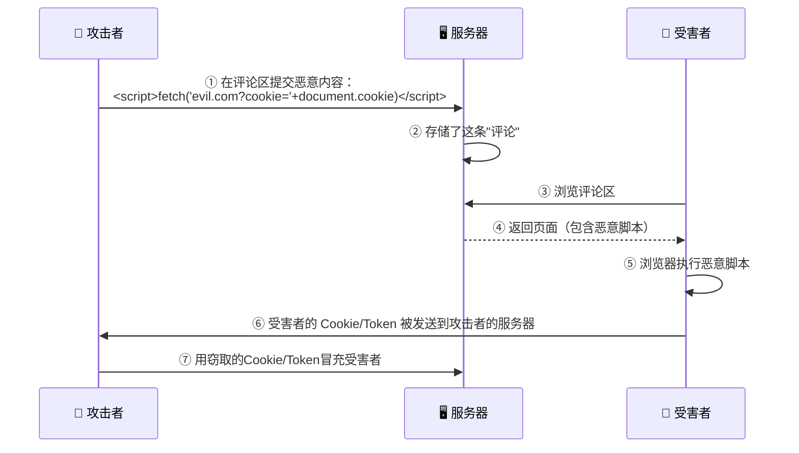

### 4.2 XSS 防护措施

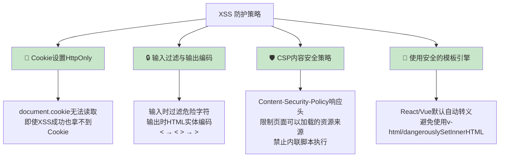

---

## 五、CSRF（跨站请求伪造）防护

### 5.1 CSRF 攻击原理

**CSRF（Cross-Site Request Forgery）** 是攻击者诱导已登录用户的浏览器向目标站点发送恶意请求。利用的是浏览器自动携带 Cookie 的特性。

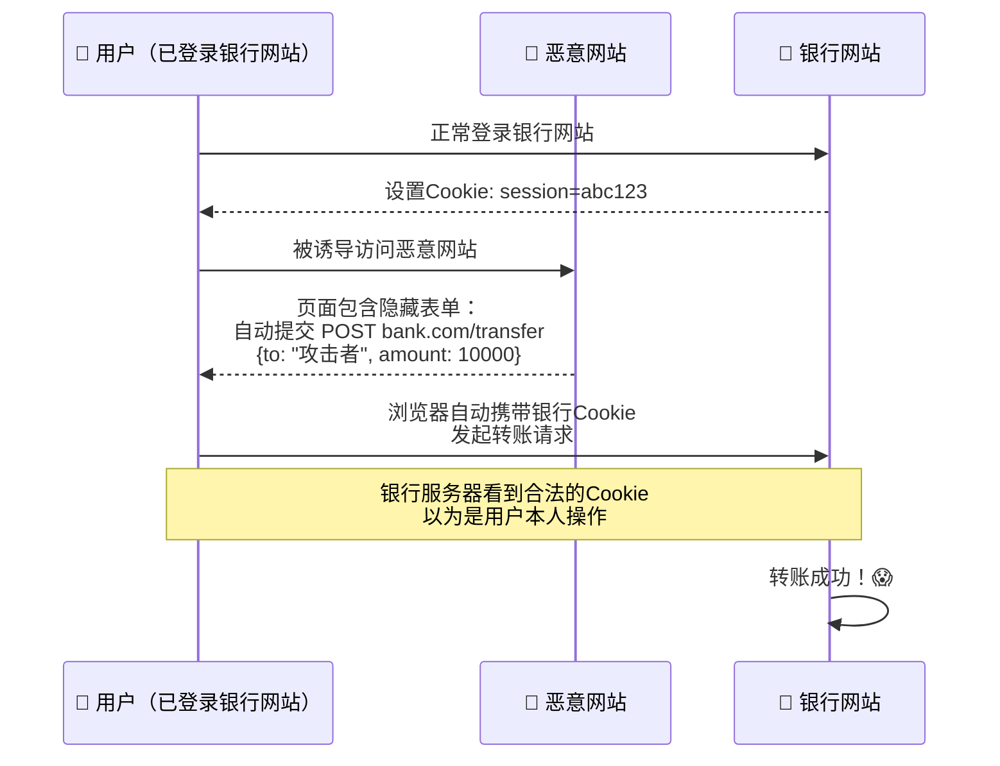

### 5.2 CSRF 防护措施

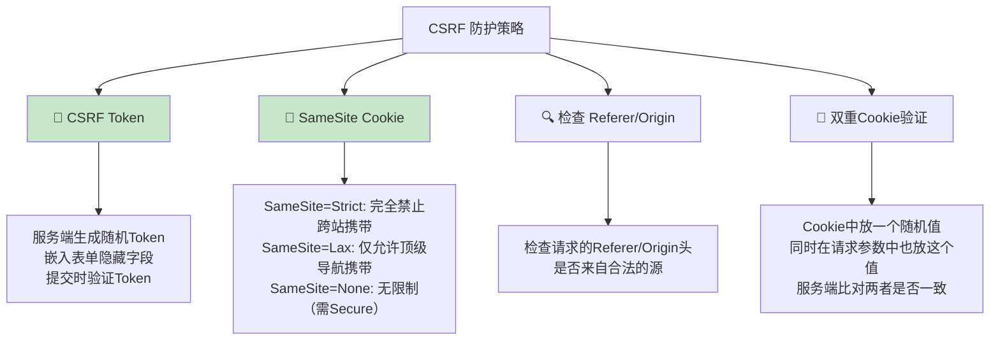

### 5.3 CSRF Token 工作流程

```mermaid
sequenceDiagram
    participant 浏览器 as 🌐 浏览器
    participant 服务器 as 🖥️ 服务器

    浏览器->>服务器: GET /transfer 页面
    服务器->>服务器: 生成随机 CSRF Token
    服务器-->>浏览器: 返回页面 + 隐藏的 CSRF Token
    Note over 浏览器: <form><br/>  <input type="hidden"<br/>    name="_csrf"<br/>    value="random_token_123"><br/>  ...<br/></form>

    浏览器->>服务器: POST /transfer<br/>{_csrf: "random_token_123", to: "张三", amount: 100}
    服务器->>服务器: 验证 CSRF Token 是否匹配
    服务器-->>浏览器: ✅ 操作成功

    Note over 浏览器,服务器: 攻击者的恶意网站无法获取到 CSRF Token<br/>所以伪造的请求没有合法的Token → 被拒绝 ✅
```

---

## 六、中间人攻击（MITM）防护

### 6.1 攻击原理

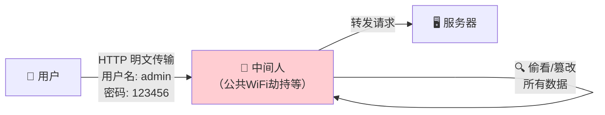

### 6.2 防护方案：HTTPS

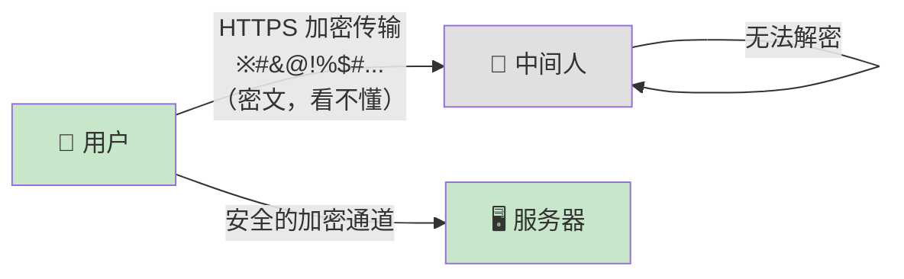

**HTTPS 最佳实践：**

| 措施 | 说明 |
|------|------|
| ✅ 全站 HTTPS | 不仅是登录页，所有页面都要 HTTPS |
| ✅ HSTS | HTTP Strict Transport Security，强制浏览器使用 HTTPS |
| ✅ 证书验证 | 使用可信 CA 签发的证书（Let's Encrypt 免费） |
| ✅ Cookie Secure 属性 | Cookie 只在 HTTPS 下传输 |
| ✅ HTTP 重定向 HTTPS | 所有 HTTP 请求自动重定向到 HTTPS |

---

## 七、SQL 注入防护

### 7.1 攻击原理

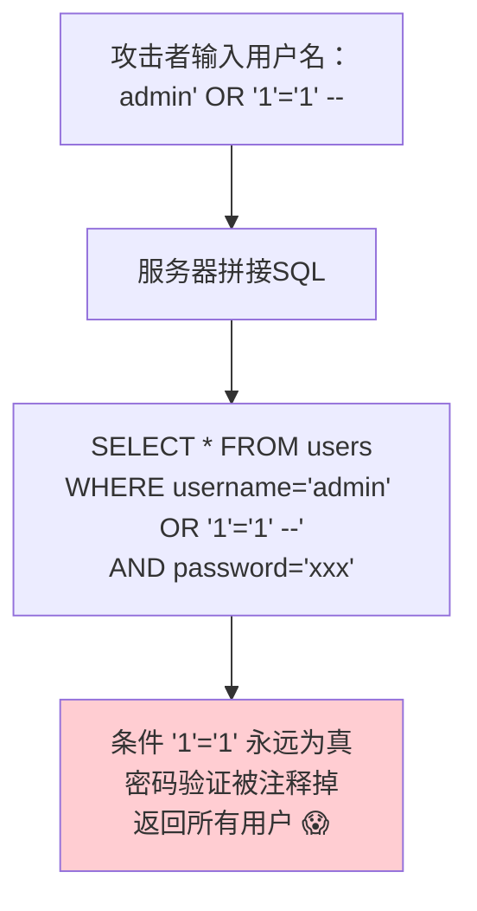

### 7.2 防护方案

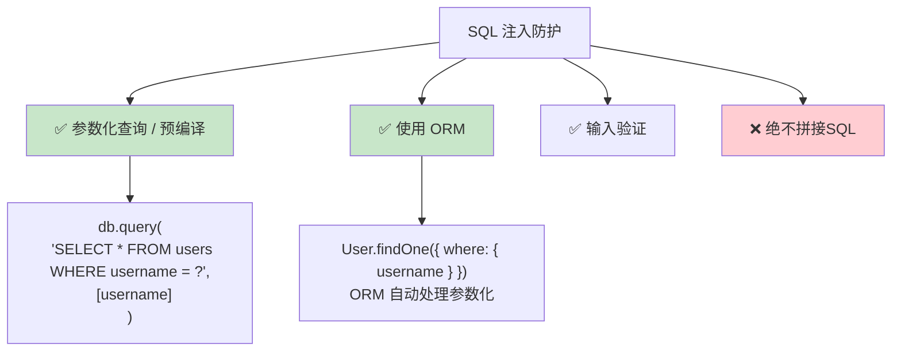

```javascript
// ❌ 错误做法：字符串拼接
const sql = `SELECT * FROM users WHERE username = '${username}' AND password = '${password}'`;

// ✅ 正确做法：参数化查询
const sql = 'SELECT * FROM users WHERE username = ? AND password_hash = ?';
db.query(sql, [username, passwordHash]);

// ✅ 正确做法：使用 ORM
const user = await User.findOne({ where: { username } });
```

---

## 八、会话安全

### 8.1 Session 固定攻击

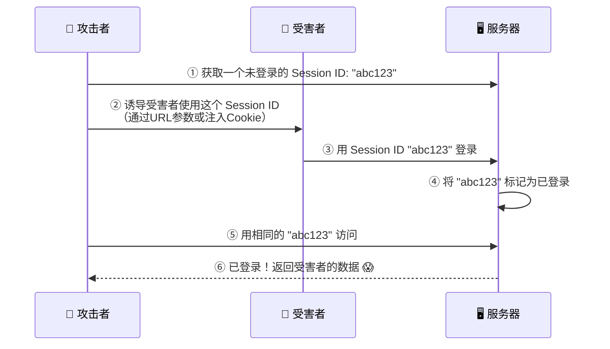

**防护**：登录成功后**必须重新生成 Session ID**！

```javascript
// 登录成功后
app.post('/login', (req, res) => {
  // 验证密码...
  
  // ✅ 重新生成 Session ID，防止 Session 固定攻击
  req.session.regenerate((err) => {
    req.session.userId = user.id;
    res.json({ success: true });
  });
});
```

### 8.2 登录安全检查清单

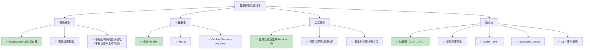

---

## 九、安全响应头配置

```javascript
// Express 安全头配置（使用 helmet 中间件）
const helmet = require('helmet');
app.use(helmet());

// 或手动设置
app.use((req, res, next) => {
  // 防止页面被嵌入iframe（防点击劫持）
  res.setHeader('X-Frame-Options', 'DENY');
  
  // XSS 过滤器
  res.setHeader('X-XSS-Protection', '1; mode=block');
  
  // 防止 MIME 类型嗅探
  res.setHeader('X-Content-Type-Options', 'nosniff');
  
  // 内容安全策略（CSP）
  res.setHeader('Content-Security-Policy', 
    "default-src 'self'; script-src 'self'; style-src 'self' 'unsafe-inline'");
  
  // 强制 HTTPS
  res.setHeader('Strict-Transport-Security', 
    'max-age=31536000; includeSubDomains');
  
  // 控制 Referer 信息
  res.setHeader('Referrer-Policy', 'strict-origin-when-cross-origin');
  
  next();
});
```

---

## 十、安全事件处理

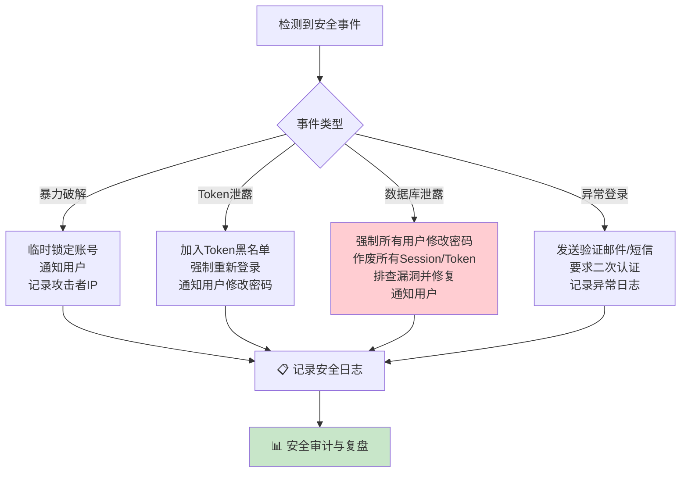

---

## 十一、本章小结

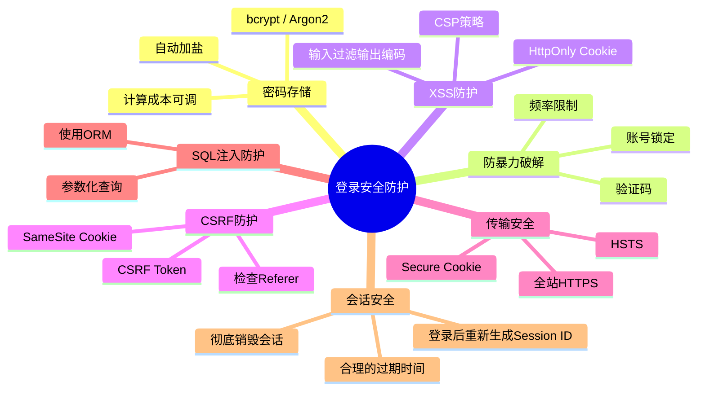

---

> 📖 **上一篇**：[06-第三方登录实现](./06-第三方登录实现.md)  
> 📖 **下一篇**：[08-现代登录方案与最佳实践](./08-现代登录方案与最佳实践.md) —— 了解无密码登录、生物识别、MFA 等前沿方案
