# 🚀 08 - 现代登录方案与最佳实践

> 密码是互联网安全的最大软肋——用户记不住、容易泄露、可以被暴力破解。现代登录技术正在朝着"无密码"的方向发展。本章介绍最前沿的登录方案以及工程实践中的最佳实践。

---

## 一、多因素认证（MFA）

### 1.1 什么是 MFA？

**MFA（Multi-Factor Authentication，多因素认证）** 要求用户提供两种或以上的验证因素，即使密码泄露，攻击者也无法登录。

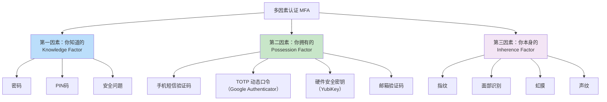

### 1.2 2FA（双因素认证）是最常见的 MFA

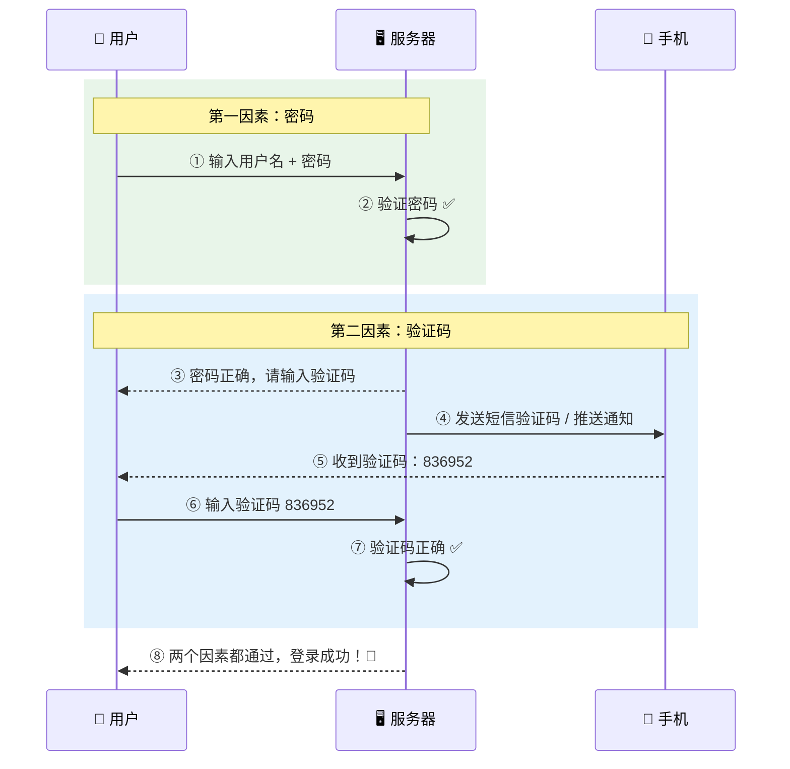

### 1.3 TOTP（基于时间的一次性密码）

TOTP 是比短信验证码更安全的方案（短信可能被拦截/SIM卡劫持）。

```mermaid
graph TD
    subgraph 绑定阶段（一次性）
        A["服务器生成密钥 Secret"] --> B["展示为二维码"]
        B --> C["用户用 Google Authenticator 扫码"]
        C --> D["App 保存密钥"]
    end
    
    subgraph 验证阶段（每次登录）
        E["App 根据：密钥 + 当前时间"] --> F["算出6位数字<br/>每30秒变一次"]
        G["服务器根据：密钥 + 当前时间"] --> H["算出同样的6位数字"]
        F --> I{"两者一致？"}
        H --> I
        I -->|是| J["✅ 验证通过"]
        I -->|否| K["❌ 验证失败"]
    end

    style J fill:#c8e6c9
```

> 💡 **TOTP 的妙处**：App 和服务器各自独立计算，不需要网络通信，即使手机没信号也能用。

---

## 二、无密码登录（Passwordless）

### 2.1 为什么要消灭密码？

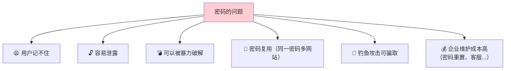

### 2.2 无密码登录的方式

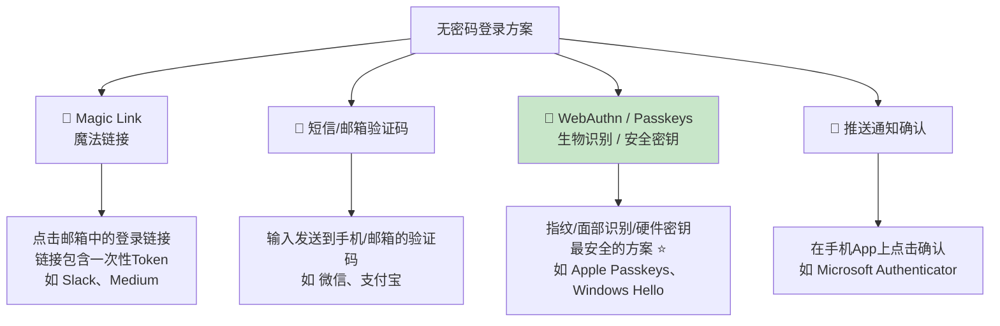

### 2.3 Magic Link 登录流程

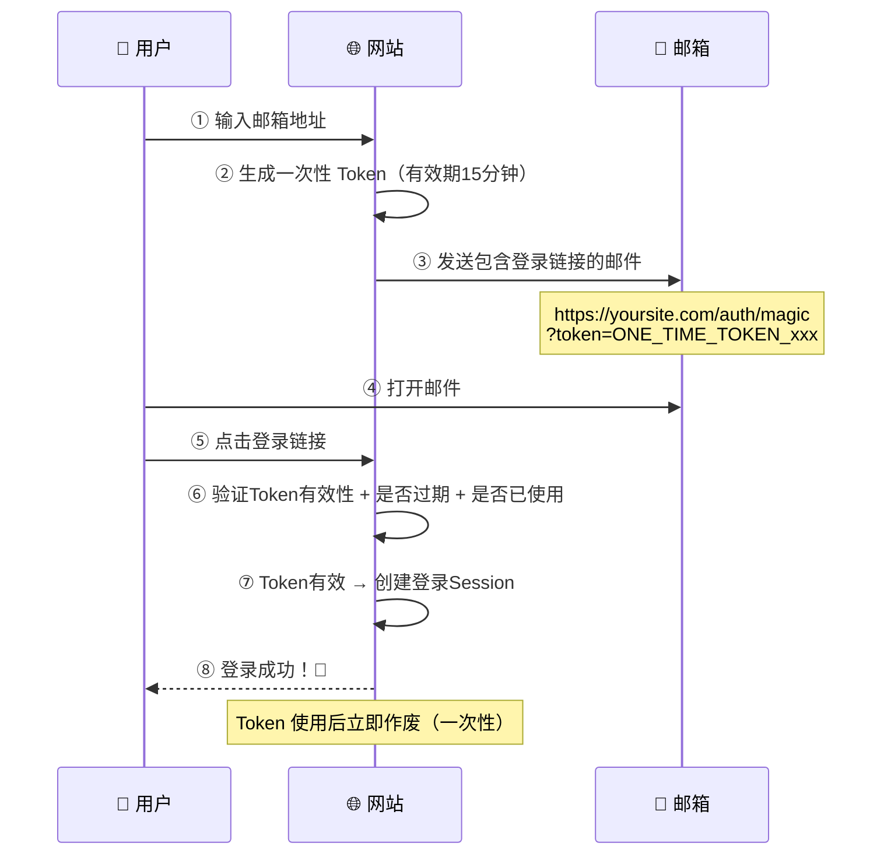

---

## 三、WebAuthn 与 Passkeys

### 3.1 什么是 WebAuthn？

**WebAuthn（Web Authentication）** 是 W3C 标准，让用户可以使用**生物识别**（指纹、面部）或**硬件安全密钥**（YubiKey）来登录网站，完全不需要密码。

### 3.2 WebAuthn 的核心原理

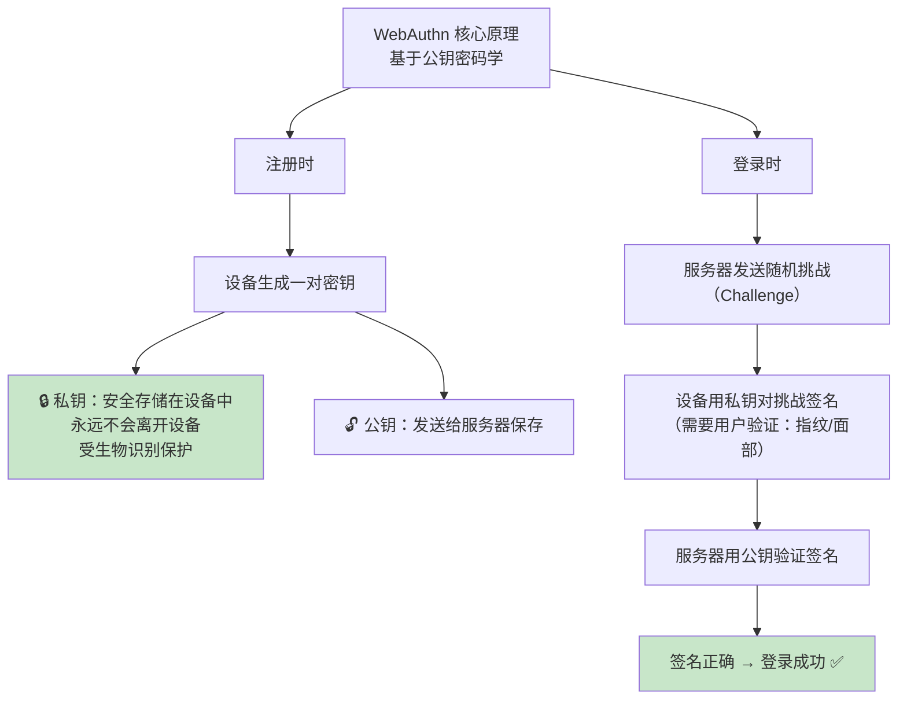

### 3.3 Passkeys 注册流程

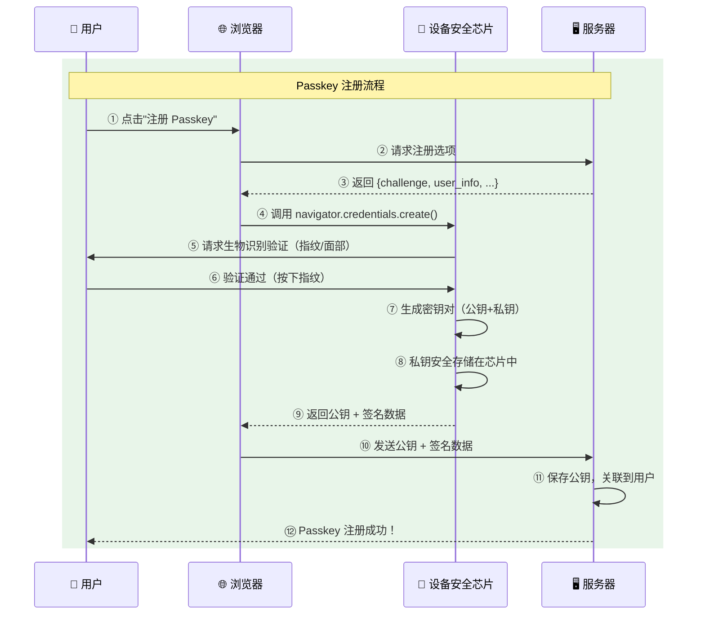

### 3.4 Passkeys 登录流程

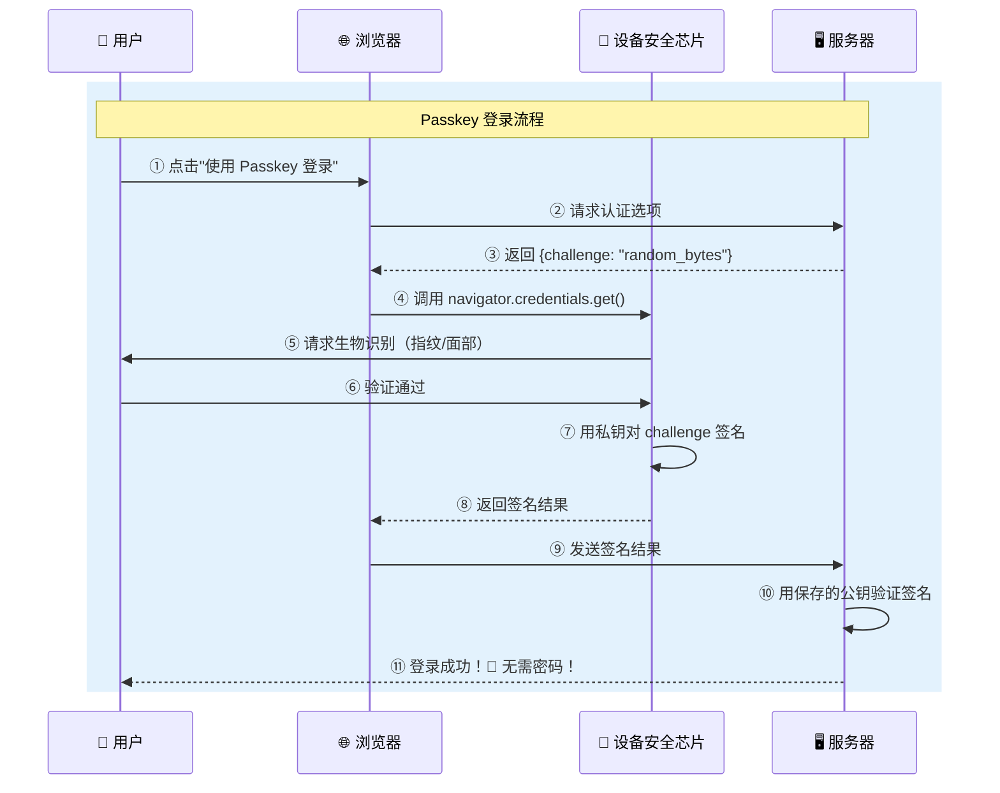

### 3.5 Passkeys 为什么安全？

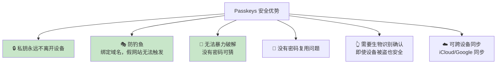

---

## 四、各登录方案对比总结

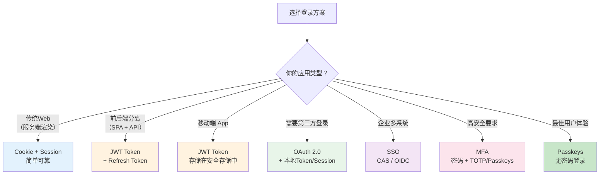

### 详细对比表

| 方案 | 安全性 | 用户体验 | 扩展性 | 实现难度 | 适用场景 |
|------|--------|----------|--------|----------|----------|
| Cookie + Session | ⭐⭐⭐ | ⭐⭐⭐⭐ | ⭐⭐ | ⭐ 简单 | 传统Web |
| JWT Token | ⭐⭐⭐ | ⭐⭐⭐ | ⭐⭐⭐⭐⭐ | ⭐⭐ 中等 | 前后端分离/移动端 |
| OAuth 2.0 | ⭐⭐⭐⭐ | ⭐⭐⭐⭐ | ⭐⭐⭐⭐ | ⭐⭐⭐ 较高 | 第三方登录 |
| SSO | ⭐⭐⭐⭐ | ⭐⭐⭐⭐⭐ | ⭐⭐⭐⭐ | ⭐⭐⭐ 较高 | 企业多系统 |
| MFA | ⭐⭐⭐⭐⭐ | ⭐⭐⭐ | ⭐⭐⭐ | ⭐⭐⭐ 较高 | 高安全要求 |
| Passkeys | ⭐⭐⭐⭐⭐ | ⭐⭐⭐⭐⭐ | ⭐⭐⭐⭐ | ⭐⭐⭐⭐ 高 | 未来主流 |

---

## 五、登录系统最佳实践

### 5.1 架构设计最佳实践

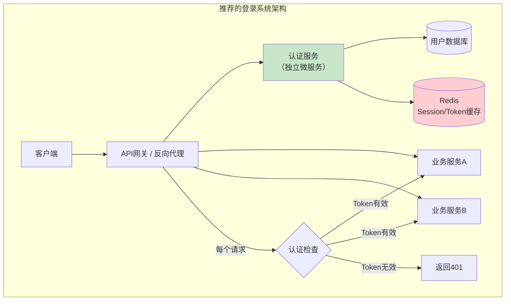

### 5.2 安全最佳实践清单

```mermaid
graph TD
    A["🛡️ 登录安全最佳实践"] --> B["密码策略"]
    A --> C["传输安全"]
    A --> D["Token管理"]
    A --> E["防攻击"]
    A --> F["监控告警"]
    
    B --> B1["✅ bcrypt/Argon2 哈希（cost ≥ 12）"]
    B --> B2["✅ 密码长度 ≥ 8，复杂度要求"]
    B --> B3["✅ 禁止常见弱密码"]
    B --> B4["✅ 不返回具体错误（用户名不存在/密码错误）"]
    
    C --> C1["✅ 全站 HTTPS + HSTS"]
    C --> C2["✅ Cookie: HttpOnly + Secure + SameSite"]
    C --> C3["✅ 安全响应头（helmet）"]
    
    D --> D1["✅ Access Token 短有效期（15min）"]
    D --> D2["✅ Refresh Token 长有效期（7-30天）"]
    D --> D3["✅ Token 黑名单（强制登出用）"]
    D --> D4["✅ 登录后重新生成 Session ID"]
    
    E --> E1["✅ 验证码（错误N次后触发）"]
    E --> E2["✅ 登录频率限制（IP+账号维度）"]
    E --> E3["✅ CSRF Token"]
    E --> E4["✅ 参数化SQL查询"]
    
    F --> F1["✅ 记录登录日志（IP、设备、时间）"]
    F --> F2["✅ 异常登录检测（异地/新设备）"]
    F --> F3["✅ 失败次数告警"]
```

### 5.3 用户体验最佳实践

| 实践 | 说明 |
|------|------|
| ✅ 记住我 | 提供"记住登录"选项，延长有效期 |
| ✅ 自动填充 | 配合浏览器密码管理器（正确的 autocomplete 属性） |
| ✅ 社交登录 | 提供多种第三方登录选项，降低注册门槛 |
| ✅ 渐进式安全 | 普通操作不需要二次验证，敏感操作（修改密码、转账）要求验证 |
| ✅ 友好的错误提示 | "用户名或密码错误"而不是"密码错误"（防止枚举） |
| ✅ 密码强度指示 | 实时显示密码强度条 |
| ✅ 支持 Passkeys | 面向未来，提供无密码登录选项 |

---

## 六、一个完整的登录系统设计

### 6.1 系统架构图

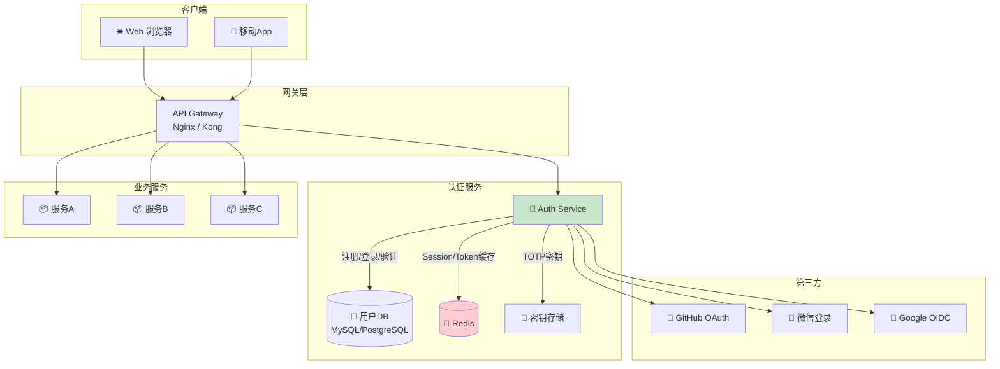

### 6.2 登录接口设计

```
POST /api/auth/register        # 注册
POST /api/auth/login            # 密码登录
POST /api/auth/logout           # 登出
POST /api/auth/refresh          # 刷新Token
POST /api/auth/forgot-password  # 忘记密码
POST /api/auth/reset-password   # 重置密码
POST /api/auth/verify-email     # 邮箱验证
POST /api/auth/verify-2fa       # 二次验证

GET  /api/auth/github           # GitHub 登录
GET  /api/auth/github/callback  # GitHub 回调
GET  /api/auth/wechat           # 微信登录
GET  /api/auth/wechat/callback  # 微信回调

POST /api/auth/passkey/register # 注册 Passkey
POST /api/auth/passkey/login    # Passkey 登录

GET  /api/auth/me               # 获取当前用户信息
PUT  /api/auth/password         # 修改密码
GET  /api/auth/sessions         # 查看登录设备列表
DELETE /api/auth/sessions/:id   # 踢出某个设备
```

### 6.3 数据库设计

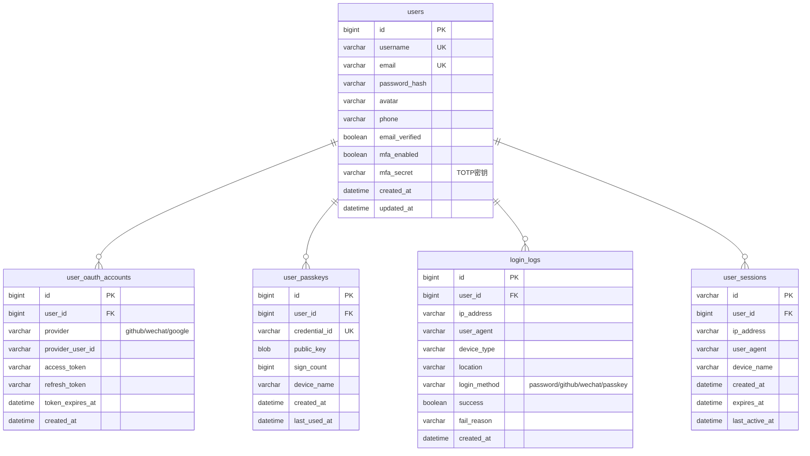

---

## 七、登录技术发展趋势

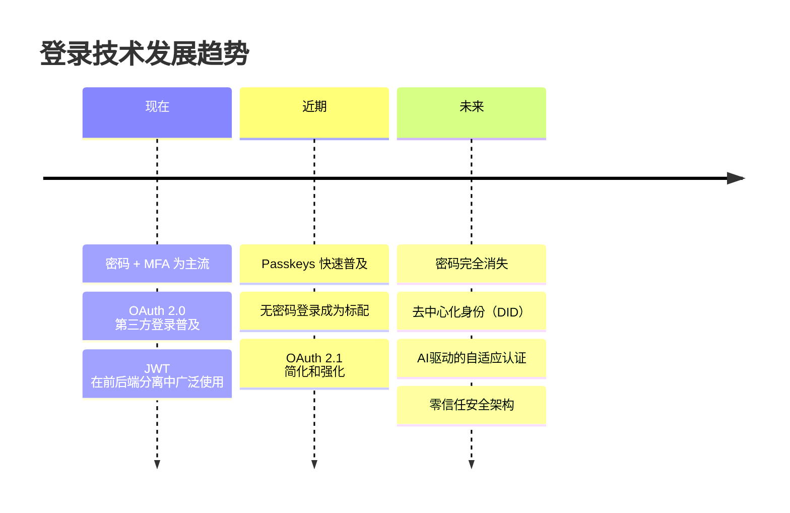

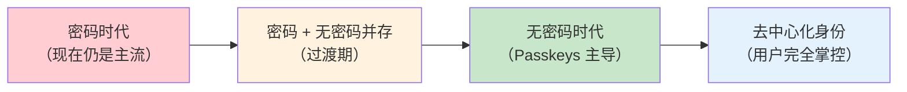

---

## 八、全系列知识图谱

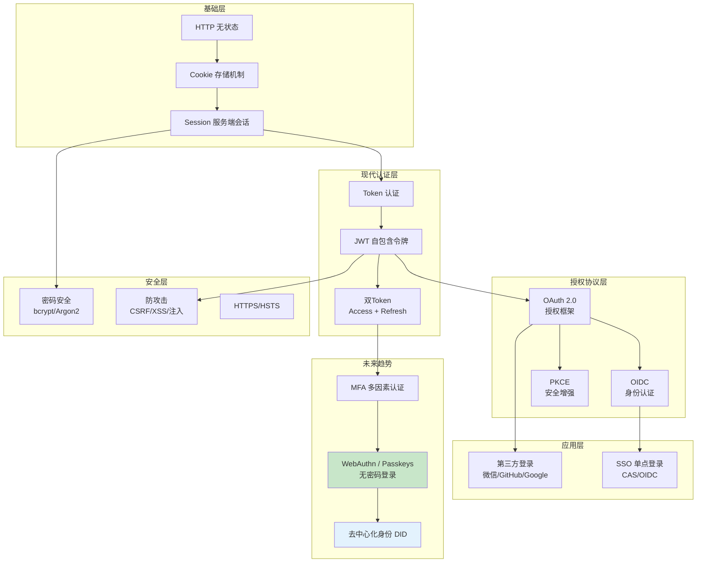

---

## 九、本章小结

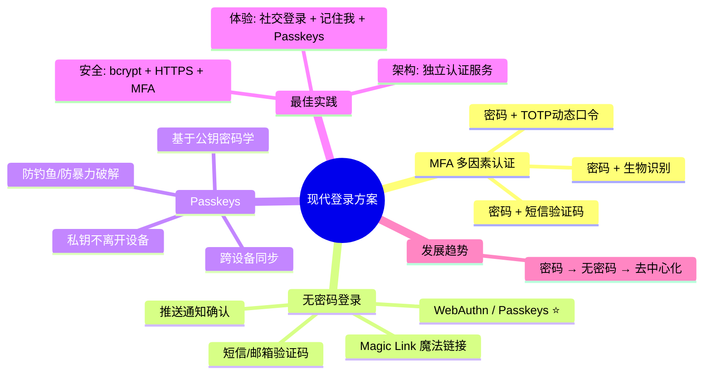

---

## 🎓 全系列总结

恭喜你完成了登录系统的完整学习！让我们回顾一下整个系列的核心要点：

| 章节 | 核心知识点 |
|------|------------|
| 01 基础概念 | 认证 vs 授权、HTTP 无状态、登录生命周期 |
| 02 Cookie & Session | Cookie 属性、Session 工作原理、多服务器 Session 共享 |
| 03 Token & JWT | JWT 三段结构、签名验证、双 Token 机制 |
| 04 OAuth 2.0 | 四种授权模式、授权码流程、PKCE、OIDC |
| 05 SSO | 全局会话 vs 局部会话、CAS 协议、同域 vs 跨域 |
| 06 第三方登录 | GitHub/微信/Google 登录流程、账号关联策略 |
| 07 安全防护 | 密码哈希、防暴力破解、XSS/CSRF 防护、HTTPS |
| 08 现代方案 | MFA、TOTP、Passkeys、最佳实践、系统设计 |

> 🚀 **记住**：没有完美的登录方案，只有最适合你场景的方案。安全是一个持续的过程，而不是一个一次性的任务。

---

> 📖 **上一篇**：[07-登录安全防护](./07-登录安全防护.md)  
> 📖 **返回目录**：[00-登录系统学习指南-目录](./00-登录系统学习指南-目录.md)
